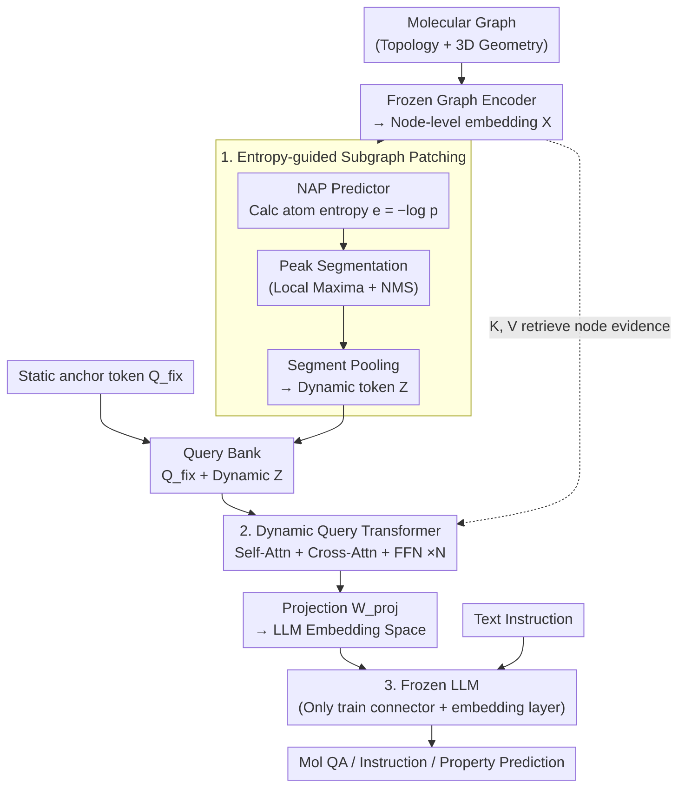

# Entropy-Guided Dynamic Tokens for Graph-LLM Alignment in Molecular Understanding

**Conference**: ICLR 2026  
**arXiv**: [2602.02742](https://arxiv.org/abs/2602.02742)  
**Code**: None  
**Area**: Graph Learning / Molecular Understanding  
**Keywords**: Graph-LLM Alignment, Dynamic Tokens, Molecular Graphs, Q-Former, Entropy-guided

## TL;DR
The authors propose EDT-Former (Entropy-guided Dynamic Token Transformer), which establishes efficient alignment between a frozen graph encoder and an LLM through an entropy-guided dynamic token generation mechanism. It achieves SOTA performance on benchmarks including molecular QA, molecular instructions, and property prediction without fine-tuning the LLM backbone.

## Background & Motivation
Molecular understanding is a core component of scientific discovery (drug design, material discovery, etc.). However, Large Language Models (LLMs) face inherent difficulties in processing molecular graph structures: while LLMs excel at sequential text, molecules are graph-structured data containing atomic connectivity, stereochemistry, and substructure context.

Existing graph-LLM bridging solutions mainly borrow the Q-Former architecture from vision-language fields, utilizing fixed-length static query tokens to compress graph information. This approach presents three core problems:

**Information loss of static tokens**: Fixed-length token sequences cannot adapt to molecular complexity; simple molecules may be over-represented, while complex molecules suffer from information insufficiency. Since Q-Former was originally designed for vision tasks, it fails to effectively capture the topological information and stereochemical properties of graph data.

**Ignoring stereochemistry and substructures**: The 3D configuration and functional groups of a molecule are critical for understanding chemical properties, yet existing fixed-token methods struggle to preserve these local and global features.

**Expensive LLM fine-tuning**: Most methods require fine-tuning the LLM backbone, which is computationally expensive and limits generalization.

The **Core Idea** is to use information entropy to adaptively determine the number of tokens required for each molecule and identify which parts of the molecule these tokens should focus on, achieving dynamic, content-aware graph-to-text representation conversion.

## Method

### Overall Architecture
EDT-Former aims to feed molecular graphs into a **completely frozen** LLM without losing stereochemical and substructural information. It inserts a trainable connector bridge between a frozen graph encoder and a frozen LLM, following a three-step process. First, the graph encoder encodes the molecular graph into node-level embeddings $X$. Second, the **entropy-guided subgraph patching** module uses a lightweight "Next-Atom Predictor" (NAP) on SMILES sequences to calculate the information entropy of each atom; it segments the molecule into several information-dense substructure patches based on local entropy peaks, where each patch is pooled into a **dynamic query token**. More complex molecules with more dispersed information yield more patches and tokens. Third, the **Dynamic Query Transformer** concatenates these dynamic tokens with a set of fixed static anchor tokens to form a query bank. It uses self-attention for context passing between tokens and cross-attention to retrieve structural evidence from node embeddings, then projects them into the LLM embedding space. Finally, these aligned tokens, along with text instructions, are fed into the frozen LLM to generate responses. Only the connector and the LLM embedding layer are updated during training.

### Key Designs

**1. Entropy-guided Subgraph Patching: Adaptive token counts and segmentation**

Q-Former variants use a fixed number (e.g., 8) of static queries to compress all molecules. While sufficient for small molecules, this compresses away stereochemistry and functional groups for large molecules (e.g., 50+ atoms), leading to fragile predictions. EDT-Former drives segmentation via information entropy: a lightweight Next-Atom Predictor (NAP) is pre-trained on a large-scale SMILES corpus to model $p(a_{t+1}\mid a_{1:t})$. During inference, the negative log-likelihood of the actual next atom gives the per-atom information $e_t = -\log p_t$. Positions with high entropy indicate hard-to-predict chemical environments with high information density. 

Instead of a simple threshold, segmentation occurs at **local maxima** of the entropy signal $\{e_t\}$. Non-maximum suppression (minimum interval $\Delta$) and peak prominence $\gamma$ are used to remove noise, resulting in dynamic segments $S_1,\dots,S_M$. Each segment's node embeddings are pooled into a dynamic token. Consequently, complex molecules yield more segments/tokens, while simple molecules yield fewer, avoiding redundancy while ensuring substructures are not truncated.

**2. Dynamic Query Transformer: Balancing global stability with local fidelity**

Dynamic tokens alone are insufficient as their numbers vary and they lack mutual context. EDT-Former concatenates $M$ dynamic tokens $Z$ and $k$ learnable static anchor tokens $Q_{fix}$ into a query bank $[Q_{fix}; Z]$. Within $L$ Transformer layers, self-attention allows anchors to provide stable "modality anchors" while dynamic tokens provide specific local details. Cross-attention then uses the query bank to retrieve structural evidence from the frozen encoder's node embeddings $X$. A projection matrix $W_{proj}$ maps the results into the LLM's embedding space, ensuring both global consistency and local fidelity.

**3. Frozen Backbone, Trainable Connector: Alignment without heavy tuning**

Most existing methods fine-tune the LLM backbone, which increases trainable parameters by ~96x and risks overfitting. EDT-Former **freezes the graph encoder and the LLM backbone entirely**, training only the connector and the LLM's embedding layer. The embedding layer acts as a small but crucial "adapter" to map aligned tokens into the LLM's input space. Ablations show that while freezing the entire LLM degrades performance, only unfreezing the embedding layer recovers the gap while keeping computational costs low.

### Loss & Training
Training is conducted with frozen backbones. First, a graph-text alignment phase maps the connector's output tokens into the LLM's text embedding space. Second, the model is fine-tuned on downstream tasks using generative loss (cross-entropy for QA). In both stages, only the connector and the embedding layer are updated.

## Key Experimental Results

### Main Results
EDT-Former was evaluated on four types of molecular understanding benchmarks, reaching or exceeding SOTA on all:

| Dataset | Task Type | EDT-Former | Prev. SOTA | Key Finding |
|-----------|---------|-----------|---------|---------|
| MoleculeQA | Molecular QA | SOTA | Q-Former variants | Dynamic tokens significantly outperform static tokens |
| Mol-Instructions | Molecular Instructions | SOTA | Methods requiring LLM tuning | Surpasses tuning-based methods without tuning the LLM |
| TDC | Property Prediction | SOTA | Graph models + LLM tuning | Consistent lead across multiple sub-tasks |
| MoleculeNet | Property Prediction | SOTA | Traditional GNNs | Significant advantage in low-data scenarios |

### Ablation Study

| Configuration | Key Metric Change | Explanation |
|------|------------|------|
| Fixed vs. Dynamic Tokens | Dynamic is significantly better | Validates the need for adaptive token generation |
| With vs. Without Entropy Guidance | With guidance is better | Entropy effectively guides token allocation |
| Frozen vs. Fine-tuned LLM | Frozen is comparable | Demonstrates high alignment quality of EDT-Former |
| Different Graph Encoders | Effective across various encoders | Framework exhibits high generality |

### Key Findings
- Entropy-guided dynamic tokens consistently outperform fixed-length tokens, proving the importance of adaptive representation length.
- EDT-Former surpasses methods requiring full LLM fine-tuning without fine-tuning the backbone itself, demonstrating the feasibility of efficient graph-language alignment.
- The model performs exceptionally well on property prediction tasks requiring precise numerical understanding, indicating that dynamic tokens effectively preserve quantitative chemical information.
- Fine-tuning only the embedding layer is a critical design choice; it bridges the performance gap of a fully frozen LLM with minimal parameters.

## Highlights & Insights
- **Adaptation from Vision to Molecules**: Successfully migrates the Q-Former paradigm to the molecular domain while addressing its shortcomings (static tokens, ignored topology).
- **Entropy as an Information Allocation Signal**: Using entropy to determine token density is an elegant design—high-entropy regions indeed require more granular representations.
- **Frozen Backbone + Lightweight Connector**: Validates that the "frozen LLM + small connector" paradigm is highly effective for scientific domains.
- **Generality of Dynamic Length Representations**: The concept of dynamic tokens can likely be extended to other graph-language tasks such as protein understanding or materials design.

## Limitations & Future Work
- Currently only validated for 2D molecular graphs; capability for 3D molecular conformations (e.g., protein folding) is unexplored.
- The balance between efficiency and effectiveness regarding the upper and lower bounds of dynamic token counts requires further sensitivity analysis.
- While the embedding layer has few parameters, it still requires sufficient alignment data, which might be limited in low-resource chemical domains.
- Comparison with end-to-end molecular LLMs (e.g., Galactica, Mol-GPT) could be more extensive.
- Evaluation of inference efficiency is needed, as entropy-guided generation introduces extra computational steps during large-scale molecular screening.

## Related Work & Insights
- **BLIP-2 / Q-Former**: Directly inspired the architecture, but EDT-Former solves graph-specific challenges via dynamicity.
- **MolCA, MoMu**: These established the foundation for molecular-language alignment; EDT-Former improves alignment granularity.
- **GNN + LLM Frameworks**: Belongs to the "Encoder + Connector + LLM" paradigm, with the core contribution residing in the connector design.
- The method suggests that in multimodal alignment, connector design (dynamic vs. static, content-aware vs. fixed) may be more impactful than simply scaling the model.

## Rating
- Novelty: ⭐⭐⭐⭐ (Dynamic tokens via entropy is a strong innovation within the Q-Former variant family)
- Experimental Thoroughness: ⭐⭐⭐⭐⭐ (Comprehensive evaluation across four benchmark types)
- Writing Quality: ⭐⭐⭐⭐ (Clear motivation and logical experimental design)
- Value: ⭐⭐⭐⭐ (Provides a new efficient paradigm for multimodal molecular understanding)

<!-- RELATED:START -->

## Related Papers

- [\[ICLR 2026\] Geometric Graph Neural Diffusion for Stable Molecular Dynamics Simulations](geometric_graph_neural_diffusion_for_stable_molecular_dynamics_simulations.md)
- [\[ICLR 2026\] DAMR: Efficient and Adaptive Context-Aware Knowledge Graph Question Answering with LLM-Guided MCTS](damr_efficient_and_adaptive_context-aware_knowledge_graph_question_answering_wit.md)
- [\[ICLR 2026\] Dual-Branch Representations with Dynamic Gated Fusion and Triple-Granularity Alignment for Deep Multi-View Clustering](dual-branch_representations_with_dynamic_gated_fusion_and_triple-granularity_ali.md)
- [\[NeurIPS 2025\] ReMindRAG: Low-Cost LLM-Guided Knowledge Graph Traversal for Efficient RAG](../../NeurIPS2025/graph_learning/remindrag_low-cost_llm-guided_knowledge_graph_traversal_for_efficient_rag.md)
- [\[ICLR 2026\] GDGB: A Benchmark for Generative Dynamic Text-Attributed Graph Learning](gdgb_a_benchmark_for_generative_dynamic_text-attributed_graph_learning.md)

<!-- RELATED:END -->
