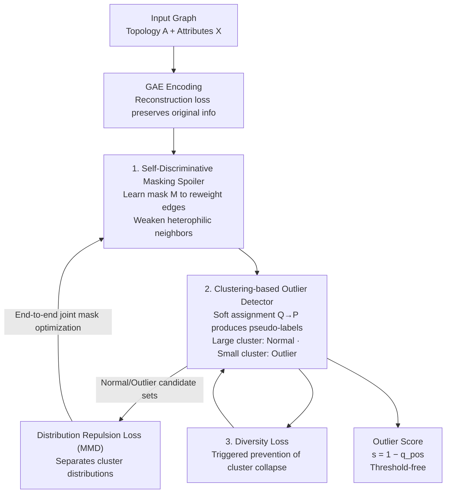

# Escaping the Homophily Trap: A Threshold-free Graph Outlier Detection Framework via Clustering-guided Edge Reweighting

**Conference**: ICLR 2026  
**OpenReview**: [https://openreview.net/forum?id=Z8f0whjttd](https://openreview.net/forum?id=Z8f0whjttd)  
**Code**: Not yet open-sourced  
**Area**: Graph Learning / Graph Outlier Detection  
**Keywords**: Graph Outlier Detection, Homophily Trap, Edge Reweighting, Clustering Pseudo-labels, Threshold-free Detection

## TL;DR
Addressing the "homophily trap" where graph convolution pollutes normal node representations with outliers through neighbor aggregation, this paper proposes CER-GOD. It employs a learnable mask to adaptively weaken edge weights between heterophilic neighbors and utilizes an unsupervised binary clustering detector to generate pseudo-labels. These labels guide the mask optimization and provide threshold-free outlier scores. Combined with a diversity loss to prevent cluster collapse, it achieves a new SOTA across 8 benchmarks (e.g., 96.98% AUC on the Email dataset, over 12% higher than the runner-up).

## Background & Motivation
**Background**: Graph Outlier Detection (GOD) aims to identify rare nodes that deviate from mainstream patterns in graph-structured data (e.g., financial fraud, traffic monitoring, biological analysis). Prevailing SOTA methods typically use Graph Convolution (GC) as a backbone to learn node representations, followed by scoring via reconstruction error, contrastive learning, or statistical features.

**Limitations of Prior Work**: The effectiveness of graph convolution is rooted in the "homophily assumption"—that adjacent nodes are similar. In outlier detection, however, this assumption becomes problematic: when normal and outlier nodes are neighbors, aggregation "injects" outlier features into normal node representations, making them indistinguishable. The authors term this the "Homophily Trap." Empirical evidence from the Email dataset (Figure 2) shows that after a single layer of graph convolution, the embedding distributions of "normal nodes one hop from an outlier" and "outlier nodes" almost overlap, whereas normal nodes multiple hops away remain clearly separable. This confirms that outlier neighbors weaken the discriminative power of immediate normal neighbors, with the pollution decaying as the path length increases.

**Key Challenge**: The inductive bias of graph convolution ("more aggregation is better") fundamentally conflicts with the goal of outlier detection ("separating proximal normal/outlier nodes"). The authors provide a theoretical proof (Proposition 1): the upper bound of the influence of node $i$'s attributes on the representation of a node $r$ hops away is $(\alpha\beta)^{r+1}(A^{r+1})_{ji}$, meaning influence decays exponentially with shortest path distance. This implies pollution primarily stems from short-range, immediate outliers.

**Limitations of Prior Work**: Previous mitigation strategies often follow "graph rewriting" routes, either completely reconstructing the graph structure (destroying intrinsic topology) or relying on heuristic rules and manually set thresholds (questionable reliability). Even ADA-GAD, which introduced the "homophily trap" concept, depends on a pre-computed spectral attribute index, making its performance sensitive to index quality.

**Core Idea**: Instead of rewriting the graph, the method **adaptively reweights edges**. A learnable mask "surgically" weakens heterophilic information flow causing the trap while preserving original topology. Simultaneously, the task of identifying which edges to weaken is delegated to an **unsupervised binary clustering detector**. This detector generates pseudo-labels to guide the process end-to-end, completely eliminating the need for predefined thresholds.

## Method

### Overall Architecture
CER-GOD (Clustering-guided Edge Reweighting for Graph Outlier Detection) is an end-to-end joint optimization framework integrating two synergistic components: the **Self-Discriminative Masking Spoiler** (SD-MS), which decides which edges to weaken, and the **Clustering-based Outlier Detector**, which identifies normal versus outlier nodes. The pipeline is as follows: the input graph (topology $A$ + attributes $X$) first undergoes reconstruction via a Graph Autoencoder (GAE) to preserve original information. The masking spoiler learns a mask $M$, reweighting the topology as $\tilde{A}=\tilde{M}\odot A$ to weaken heterophilic neighbor weights before graph convolution. The resulting latent representations $Z$ are fed into a clustering layer, where soft assignments $Q$ are calculated via Student's t-distribution. A target distribution $P$ is constructed to sharpen clusters, predicting samples into normal/outlier clusters (the larger cluster is deemed normal). These pseudo-labels define normal candidate sets $D_{pos}$ and outlier candidate sets $D_{neg}$. A **distribution repulsion loss** (based on MMD) pulls the two clusters apart, guiding the mask optimization. To prevent cluster collapse, a diversity loss is added. During inference, outlier scores $s_i=1-q_{i,pos}$ are derived directly from clustering logits without a threshold.

### Key Designs

**1. Self-Discriminative Masking Spoiler: Reweighting edges to cut pollution paths**

This component addresses the pollution of normal representations by outlier neighbors. Unlike graph rewriting, it applies a learnable mask over the original graph. A learnable variable $M$ is constrained to $[0,1]$ via $\tilde{M}_{ij}=\mathrm{sigmoid}(M_{ij})$, and the adjacency matrix is reweighted as $\tilde{A}=\tilde{M}\odot A$. This adaptively increases the aggregation strength of homophilic neighbors and decreases that of heterophilic neighbors without altering message passing paths or destroying structural integrity. (Ego-information is preserved via $\tilde{A}+I_N$ during normalization).

The mask optimization objective is to maximize the separability between the predicted normal and outlier distributions. Using Maximum Mean Discrepancy (MMD) with the clusters $D_{pos}$ and $D_{neg}$, the distribution repulsion loss is defined as $\ell_{dr}=-\mathrm{MMD}^2(D_{pos}, D_{neg})$. Notably, the MMD kernel is a Gaussian kernel based on Chebyshev distance $\kappa(x,y)=\exp(-(\max_i|x_i-y_i|)^2/2\sigma^2)$ rather than the standard RBF kernel. This choice accounts for the fact that outliers in high-dimensional space often deviate in a few specific dimensions rather than uniformly across all. Chebyshev distance focuses on the maximum single-dimension difference, being more robust to noise and sensitive to outliers.

**2. Clustering-based Outlier Detector: Unsupervised pseudo-labels replacing thresholds**

The masking spoiler requires labels to calculate the distribution repulsion loss, which are unavailable in unsupervised settings. This detector fills that gap and eliminates predefined thresholds. It embeds learnable cluster centers $\mu$ and uses Student's t-distribution to measure the similarity between latent representation $z_i$ and the centers, yielding soft assignment probabilities $q_{ij}$ for $c=2$ clusters. To sharpen assignments, a self-strengthening target distribution $P$ ($p_{ij}\propto q_{ij}^2/\sum_i q_{ij}$) is used with KL divergence $\ell_c=\mathrm{KL}(P\|Q)$. Pseudo-labels are generated as $\hat{y}_i=\arg\max_j q_{ij}$, with the majority cluster designated as normal. The outlier score is simply $s_i=1-q_{i,pos}$, providing a continuous measure of outlierness directly from clustering confidence.

**3. Diversity Loss: Triggered prevention of cluster collapse**

This loss stabilizes joint optimization by preventing "class collapse"—a failure mode where all nodes are assigned to one cluster to satisfy the MMD objective easily. The regularization term $\ell_{diversity}=\sum_{k=1}^{c}\max(0,\,\epsilon-\hat{u}_k)$ ensures each cluster maintains a minimum proportion $\epsilon$ of samples. It is "triggered": if a cluster's proportion $\hat{u}_k$ falls below $\epsilon$, the penalty encourages it to pull samples back, ensuring the outlier candidate cluster remains populated.

The overall objective function is $L=\ell_r+\alpha\cdot\ell_c+\beta\cdot\ell_{dr}+\gamma\cdot\ell_{diversity}$, combining reconstruction, clustering, distribution repulsion, and diversity losses.

## Key Experimental Results

### Main Results
Performance was evaluated on 8 datasets (Cora, CiteSeer, Flickr, Reddit, Email, Enron, Disney, Amazon) against 13 baselines (10 node-level + 3 subgraph-level SOTA) using AUC.

| Dataset | Ours (CER-GOD) | Best Baseline | Gain |
|--------|------|----------|------|
| Email | **96.98** | 94.00 (DOMINANT) / 84.68 (AS-GAE) | > +12% (vs AS-GAE) |
| Disney | **72.13** | 69.35 (GADAM) | +2.78 |
| Flickr | **67.08** | 65.19 (TAM) | +1.89 |
| Enron | **72.63** | 68.97 (BOURNE) | +3.66 |
| Amazon | **86.24** | 79.87 (TAM) | +6.37 |
| Reddit | **59.71** | 58.60 (TAM) | +1.11 |
| Cora | 92.09 (Runner-up) | **92.62** (GADAM) | −0.53 |
| CiteSeer | 74.01 | **93.91** (GADAM) | Lagging |

CER-GOD achieved superior or competitive results across most datasets with no catastrophic failures, demonstrating high robustness.

### Ablation Study
The contribution of each component was verified on Email, Cora, and Flickr (AUC %):

| Configuration | Email | Cora | Flickr |
|------|------|------|--------|
| w/o Reconstruction | 50.80 | 52.20 | 49.24 |
| Reconstruction OD | 84.12 | 79.51 | 56.70 |
| w/o SD-MS | 87.05 | 78.84 | 58.40 |
| **Ours (Full)** | **96.98** | **92.09** | **67.08** |

### Key Findings
- **Reconstruction is the Foundation**: Performance drops to ~50% (random) without reconstruction, showing GAE is essential for maintaining semantic integrity.
- **Clustering > Reconstruction Scoring**: Replacing the clustering detector with reconstruction error (Reconstruction OD) leads to a significant drop, proving clustering confidence is a superior scoring mechanism.
- **SD-MS Contribution**: Removing the masking spoiler causes a ~10% drop on Email. t-SNE visualization confirms that SD-MS significantly improves outlier cluster separability.
- **Early Layer Masking is Optimal**: Applying the distribution repulsion loss to the first layer yields the best results, aligning with the theory that pollution is most severe at short ranges.

## Highlights & Insights
- **"Reweighting" over "Rewriting"**: Using a Hadamard mask to suppress heterophilic flow while preserving topology is a more elegant solution than structural reconstruction. This "mask-without-changing-topology" approach is transferable to any scenario where GCN assumptions conflict with task goals (e.g., heterophilic graph classification).
- **Converting Thresholds to Clustering**: By using clustering confidence $1-q_{pos}$, the framework avoids the fragility of manual thresholds, replacing them with an end-to-end continuous outlier measure.
- **Chebyshev Kernel Intuition**: The insight that outliers manifest as extreme deviations in select dimensions rather than uniform drift makes the MMD more sensitive to outliers.
- **Triggered Diversity Loss**: Only penalizing cluster sparsity when it becomes critical preserves model flexibility while preventing collapse.

## Limitations & Future Work
- **Binary Clustering Assumption**: The $c=2$ setup assumes "majority is normal," which may fail in graphs with high outlier ratios or multiple distinct outlier types.
- **Generalization Gaps**: The significant lag behind GADAM on CiteSeer suggests certain graph characteristics are not yet optimally handled.
- **Complexity and Scalability**: MMD involves pairwise kernel computations, and the clustering layer maintains soft assignments for the whole graph. Scalability on extremely large graphs remains an area for further analysis.

## Related Work & Insights
- **vs ADA-GAD**: While ADA-GAD relies on pre-computed spectral indices, CER-GOD is fully adaptive and end-to-end.
- **vs Graph Rewriting**: Unlike DropEdge or structural reconstruction, CER-GOD preserves structural integrity while adaptively reweighting edges.
- **vs GAT**: GAT uses local similarity for representation learning; CER-GOD's mask is explicitly guided by a global, task-specific objective (maximizing normal/outlier separability).

## Rating
- Novelty: ⭐⭐⭐⭐⭐ The combination of reweighting, clustering-guidance, and threshold-free scoring is clean and scientifically grounded.
- Experimental Thoroughness: ⭐⭐⭐⭐ Solid results across 8 datasets with extensive ablation, though CiteSeer performance requires more investigation.
- Writing Quality: ⭐⭐⭐⭐ Clear progression from motivation to theoretical support and methodology.
- Value: ⭐⭐⭐⭐ A practical and transferable improvement for graph anomaly detection with high potential for industrial application.

<!-- RELATED:START -->

## Related Papers

- [\[ICLR 2026\] Compactness and Consistency: A Conjoint Framework for Deep Graph Clustering](compactness_and_consistency_a_conjoint_framework_for_deep_graph_clustering.md)
- [\[ICLR 2026\] Multi-Scale Diffusion-Guided Graph Learning with Power-Smoothing Random Walk Contrast for Multi-View Clustering](multi-scale_diffusion-guided_graph_learning_with_power-smoothing_random_walk_con.md)
- [\[ICLR 2026\] Training-Free Counterfactual Explanation for Temporal Graph Model Inference](training-free_counterfactual_explanation_for_temporal_graph_model_inference.md)
- [\[ICLR 2026\] Neural Graduated Assignment for Maximum Common Edge Subgraphs](neural_graduated_assignment_for_maximum_common_edge_subgraphs.md)
- [\[ACL 2026\] ComplianceNLP: Knowledge-Graph-Augmented RAG for Multi-Framework Regulatory Gap Detection](../../ACL2026/graph_learning/compliancenlp_knowledge-graph-augmented_rag_for_multi-framework_regulatory_gap_d.md)

<!-- RELATED:END -->
