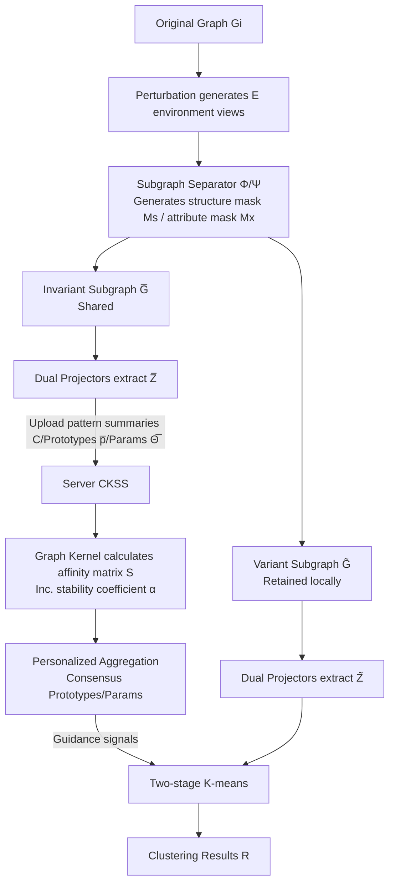

# Federated Graph-Level Clustering Network with Dual Knowledge Separation

**Conference**: ICLR 2026  
**OpenReview**: [https://openreview.net/forum?id=FwKFjBX0PK](https://openreview.net/forum?id=FwKFjBX0PK)  
**Code**: To be confirmed  
**Area**: Federated Graph Learning / Graph Clustering  
**Keywords**: Federated Graph Clustering, Invariant Graph Learning, Subgraph Decoupling, Personalized Aggregation, Graph Kernels  

## TL;DR
FGCN-DKS decomposes each graph into a "cluster-oriented shared invariant subgraph" and a "client-private personalized subgraph." Only the pattern summaries of the invariant subgraphs are uploaded to the server, and personalized aggregation is performed by calculating inter-cluster affinity using graph kernels. This addresses the challenge of "consensus failure" in federated graph-level clustering caused by attempts to share all information.

## Background & Motivation
**Background**: Federated Graph Learning (FGL) enables multiple clients to collaborate on modeling without exposing raw graph data. As a core unsupervised task, clustering in federated scenarios is divided into two granularities: in node-level clustering, each client holds subgraphs of the same global graph with relatively homogeneous distributions, making it easy for the server to reach a consensus; however, Federated Graph-Level Clustering (FGC) requires clients to cluster entirely different non-IID complete graphs.

**Limitations of Prior Work**: Graph-level scenarios suffer from two types of heterogeneity: intra-client (inconsistent patterns among different graphs within the same client) and inter-client (domain shift across clients). The authors utilized graph kernels to measure heterogeneity and found that the degree of heterogeneity in graph-level tasks is significantly higher than in node-level tasks (e.g., the inter-client heterogeneity hrO for SM-BIO is as high as 69.1). Nevertheless, recent methods like FedGCN and FedPKA follow the paradigm of "maximizing global knowledge sharing," ignoring multi-graph heterogeneity. This results in forcing highly disparate knowledge into the server, leading to **consensus failure**.

**Key Challenge**: While sharing more is intended to strengthen the global model, blind sharing in highly heterogeneous graph-level clustering mixes conflicting patterns, destroying server-side consensus. Conversely, not sharing at all loses the benefits of collaboration. The key lies in **precisely distinguishing between what should and should not be shared**.

**Goal**: To achieve high-quality local personalized clustering while enabling the server to reach a meaningful consensus under both intra- and inter-client heterogeneity.

**Core Idea (Dual Knowledge Separation)**: Inspired by FedPer's layer-wise parameter separation and Invariant Graph Learning (IGL) which decomposes graphs into invariant/variant subgraphs, the authors propose **sharing only the knowledge beneficial to global consensus**. On the client side, each graph is decoupled into a "cluster-oriented common subgraph" and a "client-specific personalized subgraph." The former is extracted into pattern summaries for upload, while the latter remains local to refine clustering. The server then performs **cluster-oriented personalized aggregation** using graph kernels to calculate inter-cluster affinity instead of simple averaging.

## Method

### Overall Architecture
FGCN-DKS is structured as a pipeline with three modules: the client-side **Local Pattern Separation Mechanism** decouples each graph into an invariant subgraph (shared) and a variant subgraph (locally retained) and optimizes them separately; the **Common Knowledge Sharing Strategy (CKSS)** on the server calculates inter-cluster affinity using graph kernels to perform personalized aggregation of prototypes and parameters, sending back guidance signals; finally, the client executes a **Two-stage K-means** that first uses invariant representations for coarse clustering and then uses variant representations for refinement. These three components mutually reinforce each other to produce clearer cluster boundaries.

### Key Designs

**1. Local Pattern Separation Mechanism: Splitting the graph into "sharable" and "private" halves.** This is the foundation of the framework, decomposing each graph into a common subgraph and a personalized subgraph at each client. The authors first define a set of "environments" based on clusters—for each graph $G_i$, $E=N_\phi$ views $\{G_i^{(e)}\}$ are generated via random structural and attribute perturbations to simulate distribution shifts. Then, a node attribute separator $\Phi$ and a structure separator $\Psi$ are introduced to generate a structure mask $M_s$ and an attribute mask $M_x$, performing complementary slicing on the adjacency matrix and features: $\bar{A}=M_s\odot A, \tilde{A}=(1-M_s)\odot A$ and $\bar{X}=M_x\odot X, \tilde{X}=(1-M_x)\odot X$. This yields the invariant subgraph $\bar{G}$ and variant subgraph $\tilde{G}$. Graph-level representations $\bar{Z}$ and $\tilde{Z}$ are obtained via GNN dual projectors and READOUT. The essence of this design is that "separation is constrained by three losses": $L_{inv}$ forces invariant subgraphs of samples in the same cluster to be close (minimizing intra-cluster pairwise variance $\sum_{i,j\in P_k}\|\bar{z}_i-\bar{z}_j\|^2$), $L_{div}$ uses an inverse distance function to push invariant subgraphs of different clusters apart to prevent collapse, and $L_{env}$ constrains the invariant representation of the same graph to remain stable across environments $\frac{1}{EN_\phi}\sum\|z_i^{(e)}-\bar{z}_i\|^2$ while pulling invariant and variant components apart. The total objective is $L=L_{inv}+\beta L_{div}+\gamma L_{env}+L_{mse}$. Ultimately, only the **irreversible pattern summaries** $C$ of the invariant subgraphs are uploaded to the server (reflecting inter-cluster affinity while protecting privacy), while the invariant/variant subgraphs themselves remain on the client.

**2. Common Knowledge Sharing Strategy (CKSS): Using graph kernels for affinity to perform personalized aggregation.** Upon receiving common prototypes, parameters, and pattern summaries, the server addresses the failure of simple weighted averaging caused by client heterogeneity. It uses graph kernels (such as RW, WL, SP, LT, etc.) to calculate inter-cluster similarity $S_{ij}=k(C_i,C_j)$ to capture stable structural semantics across clients. To handle instability in single-round affinity, the authors introduce a stability coefficient using historical information: $\alpha_{ij}=\frac{|k(C_i^{(t)},C_j^{(t)})-k(C_i^{(t-1)},C_j^{(t-1)})|}{\max(k(C_i^{(t)},C_j^{(t)}),\epsilon)}$ (where smaller $\alpha$ indicates a more stable relationship). The affinity is updated smoothly as $S^{(t)}=(1-\lambda)S^{(t-1)}+\lambda\sum_{i,j}\alpha_{ij}k(C_i^{(t)},C_j^{(t)})$ to avoid over-reliance on a single round and ensure convergence. Personalized aggregation follows to obtain consensus prototypes $\bar{p}_{glo|l}=\sum_i s_{li}\tilde{p}_i$ and consensus parameters $\bar{\Theta}_{glo|m}=\sum_{j\in S_m}\sum_u s_{uj}\bar{\Theta}_u$. The ingenuity lies in not requiring identical cluster counts across clients, allowing each client to benefit only from "similar partners in the same latent space," thus avoiding negative transfer from unrelated distributions.

**3. Two-stage K-means: From stable to detailed, handing over from invariant to variant representations.** After receiving the personalized consensus knowledge, the client performs coarse-to-fine two-stage clustering. The first stage runs standard K-means on the invariant representations $\bar{Z}$—since these are robust to environmental perturbations, the initial clustering $C^{(0)}$ provides reliable global semantic grouping. The second stage performs secondary clustering or similarity-based refinement within each initial cluster $C_k^{(0)}$ using the variant representations $\tilde{Z}$ to capture environment-sensitive, instance-level differences. This "common $\rightarrow$ personalized" relay ensures that the invariant components provide cross-environment consistency while the variant components supplement local discrimination, resulting in high-quality and interpretable cluster partitions even under distribution shifts.

## Key Experimental Results

### Main Results
On multiple graph benchmarks (number of graphs/clusters in parentheses), measured by ACC/NMI/ARI/F1, FGCN-DKS (OURS) outperforms SOTA comprehensively:

| Dataset | Method | ACC | NMI | ARI | F1 |
|---|---|---|---|---|---|
| SM2(7) | FedPKA | 77.0 | 26.8 | 31.2 | 67.3 |
| SM2(7) | **OURS** | **79.2** | **28.3** | **34.6** | **72.3** |
| SN3(2) | FedPKA | 67.5 | 25.7 | 32.6 | 55.5 |
| SN3(2) | **OURS** | **70.2** | **34.2** | **36.8** | **60.4** |
| SM-BIO2(9) | FedPKA | 70.8 | 15.4 | 19.6 | 60.6 |
| SM-BIO2(9) | **OURS** | **73.8** | **17.7** | **21.3** | **61.3** |

Compared to the previous generation of federated graph clustering frameworks like FedGCN/FedPKA, ACC generally increases by 2-3 points, and F1 on SM increases by up to 5 points. Pre-existing non-federated or general FGL methods (FedSage, GCFL, FedStar, and various deep graph clustering methods like DGLC/DCGLC) generally only achieve ARI in the single digits to teens on these non-IID graph-level tasks, showing a significant gap.

### Ablation Study
The paper validates the effectiveness of each module by removing components (numerical values in the appendix):

| Variant | Function | Impact when removed |
|---|---|---|
| w/o Pattern Separation | No decoupling of invariant/variant subgraphs | Consensus failure, significant clustering degradation |
| w/o CKSS (Averaging) | No affinity-based aggregation | Negative transfer, worse cross-client consensus |
| w/o Two-stage Refinement| Clustering using only invariant reps | Fails to capture intra-cluster diversity, coarse granularity |

### Key Findings
- Graph kernel measurements confirm that intra/inter-client heterogeneity in graph-level tasks is much higher than in node-level tasks, explaining why the "maximum sharing paradigm" fails in FGC.
- The stability coefficient $\alpha$ combined with historical smoothing allows the affinity matrix to evolve steadily across communication rounds, which is key to stable convergence.
- In terms of efficiency, it only adds $O(N_\psi^2\kappa)$ cluster-level affinity calculations ($N_\psi\ll d$) compared to FedAvg, keeping overhead acceptable.

## Highlights & Insights
- **Paradigm Inversion**: "Less is More"—The study systematically demonstrates for the first time that in highly heterogeneous graph-level clustering, sharing only the invariant knowledge beneficial to consensus is superior to sharing as much as possible.
- **Privacy Friendly**: Uploading irreversible "pattern summaries" instead of raw subgraphs or features aligns naturally with federated privacy constraints.
- **Invariant Graph Learning in Federated Settings**: Successfully migrates IGL concepts—which typically rely on centralized labeled data—to an unlabeled, non-raw-data-sharing federated scenario, while solving the challenges of granularity control and heterogeneous aggregation.
- **No Requirement for Cluster Alignment**: Personalized aggregation based on graph kernel affinity frees the approach from the traditional constraint that clients must have the same number of clusters for proportional partitioning.

## Limitations & Future Work
- The introduction of multiple hyperparameters like $\beta, \gamma, \lambda$ and the choice of graph kernels necessitates further analysis regarding sensitivity.
- Generating $E=N_\phi$ perturbed environmental views per graph and running dual projectors increases computation and memory costs on the client side as the number of clusters and graph scale grow.
- Experiments focus on small-to-medium scale graph benchmarks; scalability in real-world federated scenarios with massive graphs, many clients, or dynamic participation remains to be verified.
- The number of clusters $N_\psi$ still needs to be predefined. Automatic estimation of cluster counts and robustness to noise or adversarial perturbations are natural directions for extension.

## Related Work & Insights
- **Invariant Graph Learning (IGL)**: GIL, CIGA, CIT, InfoIGL, MPHIL, etc., use information bottlenecks or contrastive/multi-prototype methods to separate invariant substructures for OOD generalization. This work adopts these ideas but breaks the "centralized and labeled" prerequisite.
- **Federated Graph Learning (FGL)**: Progressed from FedAvg $\rightarrow$ FedPer (personalized layers) $\rightarrow$ FedProx (non-IID convergence) $\rightarrow$ FedSage/FedGAT/FedStar, to the first FGC framework FedGCN and FedPKA (confidence-guided aggregation). This work provides a dual knowledge separation solution for the consensus failure common in these methods.
- **Inspiration**: In any highly heterogeneous federated or multi-source scenario, "decoupling sharable and private knowledge first, then performing selective aggregation based on structural similarity" is a more robust universal strategy than indiscriminate sharing.

## Rating
- Novelty: ⭐⭐⭐⭐ First to systematically characterize dual heterogeneity in FGC and propose dual knowledge separation + graph kernel affinity aggregation, providing a clear paradigm shift from "maximum sharing."
- Experimental Thoroughness: ⭐⭐⭐⭐ Compared against SOTA on multiple benchmarks/metrics with ablation and efficiency analysis, though lacks deep exploration into larger scales and hyperparameter sensitivity.
- Writing Quality: ⭐⭐⭐⭐ Logical flow from motivation to challenge to method; the use of graph kernels to measure heterogeneity is a convincing starting point. Minor typos in mathematical symbols.
- Value: ⭐⭐⭐⭐ Provides a deployable framework for privacy-sensitive distributed graph clustering; the "selective sharing" approach offers general insights for federated multi-source learning.

<!-- RELATED:START -->

## Related Papers

- [\[ICLR 2026\] Learning with Dual-level Noisy Correspondence for Multi-modal Entity Alignment](learning_with_dual-level_noisy_correspondence_for_multi-modal_entity_alignment.md)
- [\[ICML 2026\] Anchor-guided Hypergraph Condensation with Dual-level Discrimination](../../ICML2026/graph_learning/anchor-guided_hypergraph_condensation_with_dual-level_discrimination.md)
- [\[ICLR 2026\] Latent Geometry-Driven Network Automata for Complex Network Dismantling](latent_geometry-driven_network_automata_for_complex_network_dismantling.md)
- [\[ICLR 2026\] Dual-Branch Representations with Dynamic Gated Fusion and Triple-Granularity Alignment for Deep Multi-View Clustering](dual-branch_representations_with_dynamic_gated_fusion_and_triple-granularity_ali.md)
- [\[ICLR 2026\] A Graph Meta-Network for Learning on Kolmogorov–Arnold Networks](a_graph_meta-network_for_learning_on_kolmogorovarnold_networks.md)

<!-- RELATED:END -->
