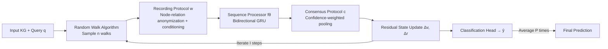

# FLOCK: A Knowledge Graph Foundation Model via Learning on Random Walks

**Conference**: ICLR 2026  
**OpenReview**: [https://openreview.net/forum?id=1cGOCIOKQd](https://openreview.net/forum?id=1cGOCIOKQd)  
**Code**: [https://github.com/jw9730/flock](https://github.com/jw9730/flock)  
**Area**: Graph Learning / Knowledge Graph Foundation Models  
**Keywords**: Knowledge Graph Foundation Models, Zero-shot Link Prediction, Random Walks, Probabilistic Equivariance, Sequence Models  

## TL;DR
FLOCK replaces the conventional message passing and deterministic equivariance constraints of Knowledge Graph Foundation Models (KGFMs) with a paradigm of "sampling random walks → anonymizing into sequences → encoding with sequence models → consensus pooling." By leveraging **probabilistic node-relation equivariance**, it maintains cross-graph generalization while breaking symmetry to distinguish "structurally isomorphic but semantically opposite" relations. As a universal approximator for link-invariant functions, it achieves SOTA performance across 54 KGs.

## Background & Motivation
**Background**: Knowledge Graph Foundation Models (KGFMs, such as ULTRA, TRIX, MOTIF) aim to solve zero-shot link prediction—inferring missing edges on new entities and relation types entirely unseen during training. Their core inductive bias is **double equivariance**: the model is equivariant to both entity and relation permutations, allowing it to learn "structural invariants" (structural properties of nodes and relations) that transfer across graphs even when relation vocabularies differ.

**Limitations of Prior Work**: This "deterministic equivariance" implies a widely accepted but problematic assumption: **structural isomorphism ⟹ semantic equivalence**. The paper uses a Star Wars example to illustrate this: `like` and `dislike` are structurally isomorphic in a graph but semantically opposite. Any KGFM computing relational invariants is forced to assign identical representations to these two relations, losing the ability to distinguish "who likes whom" from "who dislikes whom." Worse, this is an **architectural expressivity flaw that cannot be fixed by fine-tuning**, directly limiting the downstream utility of KGFMs.

**Key Challenge**: Equivariance is the foundation of a KGFM's ability to generalize to new graphs, yet it acts as a shackle preventing the model from distinguishing semantically distinct isomorphic relations. How can a model possess both "strong expressivity" and "correct inductive biases for generalization"?

**Goal**: Design a KGFM that is both highly expressive and maintains the inductive biases required for cross-graph generalization.

**Core Idea**: **Replace deterministic equivariance with probabilistic equivariance**. Instead of strictly requiring "structurally isomorphic relations to have identical representations," the model only requires them to be **equivalent in distribution** (invariant in probability) under the model's stochastic prediction process. This preserves the inductive bias for generalization, while the randomness in each forward pass breaks symmetry during inference, assigning different representations to structurally identical but semantically distinct relations. The implementation uses **random walks + sequence models**: walks naturally introduce the randomness for "distributional equivariance," anonymization preserves only structural information, and sequence models provide universal approximation.

## Method

### Overall Architecture
FLOCK is a randomized function $X_\theta(G, q)$ that takes a knowledge graph $G=(V,E,R)$ and a query $q$ (entity prediction $(h,r,?)$ or relation prediction $(h,?,t)$) to output a random variable $\hat y$. It maintains two latent lookup tables $v: V\to\mathbb{R}^d$ and $r: R\to\mathbb{R}^d$, which are **iteratively updated residually** for $I$ steps starting from trained initial values, followed by a binary classification head. At test time, an ensemble of $P$ independent random predictions is averaged to reduce variance and improve performance. Each update step is completed by a stochastic function $\text{update}_\theta$ composed of four components—**the entire pipeline avoids message passing**, with random walks being the sole source of stochasticity.

### Key Designs

**1. Probabilistic Equivariance as Inductive Bias: Loosening the "Isomorphism implies Identical Representation" constraint.** This is the theoretical cornerstone. Traditional KGFMs require representations to be strictly equal when $G\simeq G'$. FLOCK only requires the stochastic model $\phi$ to satisfy $G\simeq G' \Rightarrow \phi(G)\overset{d}{=}\phi(G')$, meaning the output **distributions** induced by the two graphs are identical (which implies $\mathbb{E}[\phi(G)]=\mathbb{E}[\phi(G')]$). Distributional equality preserves the generalization bias that isomorphic graphs should behave consistently, while the stochasticity of a single forward pass allows it to sample different walks for two isomorphic relations within the same petal, providing different instantaneous representations and breaking symmetry while remaining unchanged in expectation. The paper proves that if the walk sampling, recording protocol, and consensus protocol are each (probabilistically) invariant, their composition makes FLOCK invariant in probability (Prop. 4.2/4.3), regardless of the specific sequence processor $f_\theta$.

**2. Probabilistically Invariant Random Walks + Diverse Origins + Adaptive Test-time Walks.** Walks act as the carrier to "rewrite" connectivity into sequences and are the source of probabilistic equivariance. FLOCK uses uniform **non-backtracking** walks (adapted for directed multigraphs in KGs) and proves this sampling is invariant in probability. To capture local context and global coverage, it uses **diverse starting points**: for an entity query $(h,r,?)$, it samples $3n$ walks—$n$ starting from the head $h$ for local context, $n$ from random edges $(v,s,u)$ for global relation coverage, and $n$ from random nodes for global area coverage. Relation prediction adds another $n$ walks from the tail $t$ ($4n$ total). The walk count $n$ is fixed to $n_{\text{train}}$ during training but **scaled adaptively** during testing based on graph size:

$$n = n_{\text{train}} \times \text{harmonic\_mean}\!\left(\frac{|V|}{|V|_{\text{train}}},\ \frac{|E|}{|E|_{\text{train}}}\right)$$

More walks for large graphs ensure coverage, while fewer walks for small graphs reduce redundancy, keeping the test-time "visit/coverage rate" close to the pre-training distribution. Ablations show improvements across all three splits.

**3. Recording Protocol with Node-Relation Anonymization: Preserving structure with states and query conditions.** Raw walks expose specific IDs, hindering transfer to new graphs. The recording protocol $w:\eta_j\mapsto z_j$ transforms each walk into a graph-agnostic sequence by using **separate namespaces** for nodes and relations, assigning unique names based on discovery order (nodes use $1,2,3,\dots$, relations use $\alpha,\beta,\dots$, with $(\cdot)^{-1}$ for direction). For example, $v_0\xrightarrow{r_1}v_1\xrightarrow{r_2}v_2\xrightarrow{r_1^{-1}}v_0$ is recorded as $1\xrightarrow{\alpha}2\xrightarrow{\beta}3\xrightarrow{\alpha^{-1}}1$. It also concatenates current latent states $v(\cdot), r(\cdot)$ and query indicators $\mathbb{1}_h, \mathbb{1}_r$ (marking the positions of the query head/relation, similar to the labeling trick). This hides identity to maintain invariance while retaining structural roles and query conditions.

**4. Sequence Processor + Confidence-Weighted Consensus Protocol.** Anonymized sequences $z$ contain only structural information and can be safely processed by any network—FLOCK chooses a **bidirectional GRU** (with RMSNorm and SwiGLU FFN). It outputs an update proposal $\Delta v_s, \Delta r_s$ and a corresponding **confidence** $a_s, b_s$ at each walk position, decoupling the "proposal" from "how trustworthy the proposal is" (e.g., high confidence in cycle regions, low confidence in dangling regions). The consensus protocol $c$ aggregates proposals from all walks for the same node/relation using a **multi-head softmax-normalized weighted average**:

$$\Delta v(v) = \Big[\sum \exp(a_s)\odot\Delta v_s\Big]\oslash \sum\exp(a_s),\quad \Delta r(r) = \Big[\sum \exp(b_s)\odot\Delta r_s\Big]\oslash \sum\exp(b_s)$$

Competition between confidence scores naturally suppresses non-informative proposals from dangling areas (similar to Slot Attention by Locatello et al. 2020). Theoretically, with "sufficiently long walks to cover the graph with high probability, anonymized sequences reconstructable to the graph (up to isomorphism), and a strong enough sequence processor," FLOCK is a **universal approximator** for link-invariant functions (Prop. 4.1).

## Key Experimental Results

### Main Results Table
Diagnostic dataset PETALS (220 instances, each with a center node + stem + multiple semantically opposite petals, requiring distinction of isomorphic but non-identical links):

| Model | PETALS Accuracy |
|---|---|
| ULTRA | 50% (Random guess) |
| MOTIF(F3_Path) | 50% |
| TRIX | 50% |
| **FLOCK** | **100%** |

Entity prediction on 54 KGs (Average MRR / Hits@10):

| Model | Total Avg MRR | Total Avg H@10 |
|---|---|---|
| ULTRA (zero-shot) | 0.366 | 0.518 |
| TRIX (zero-shot) | 0.390 | 0.548 |
| **FLOCK (zero-shot)** | **0.391** | **0.560** |
| ULTRA (finetuned) | 0.408 | 0.562 |
| TRIX (finetuned) | 0.418 | 0.569 |
| **FLOCK (finetuned)** | **0.427** | **0.582** |

Relation prediction on 54 KGs (Average MRR / Hits@1), where FLOCK shows a massive advantage:

| Model | Total Avg MRR | Total Avg H@1 |
|---|---|---|
| ULTRA (zero-shot) | 0.724 | 0.613 |
| TRIX (zero-shot) | 0.792 | 0.687 |
| **FLOCK (zero-shot)** | **0.881** | **0.817** |
| TRIX (finetuned) | 0.804 | 0.706 |
| **FLOCK (finetuned)** | **0.907** | **0.851** |

Zero-shot relation prediction improves by **11.2% MRR** over the strongest baseline TRIX, increasing to 12.8% after fine-tuning; this is attributed to the sequence encoder's **joint update** of nodes and relations (whereas ULTRA/TRIX use separate networks).

### Ablation Study
Adaptive test-time walk counts (zero-shot entity prediction):

| Split | FLOCK (Adaptive n) MRR | w/o Adaptive (n=128) MRR |
|---|---|---|
| Inductive e, r | **0.369** (n≈28) | 0.357 |
| Inductive e | **0.456** (n≈18) | 0.441 |
| Transductive | **0.340** (n≈214) | 0.334 |

Component ablations (Average MRR over 46 graphs): Removing diverse starts 0.385, replacing GRU with Transformer 0.359, default $\ell=128$ 0.395; non-backtracking is primarily useful for transductive settings (0.360 vs 0.334).

### Key Findings
- **FLOCK is the only model to achieve 100% on PETALS**, while all deterministic KGFMs remain at 50%, empirically verifying the expressivity gap.
- On Metafam (a dataset of semantic conflicts/compositional relations), FLOCK's zero-shot MRR is nearly double ULTRA's and ~40% higher than TRIX's.
- **Clear scaling behavior**: Generalization improves monotonically with the number of pre-training KGs; test-time ensemble gains are significant from 1→8 and saturate after 12.
- FLOCK prefers **sparse graphs** (where walks cover areas faster); on larger transductive graphs, it occasionally underperforms message passing during fine-tuning (as walks may not fully cover target nodes).

## Highlights & Insights
- **Targets the "deterministic equivariance" dogma of KGFMs**, pointing out that "structural isomorphism ⟹ semantic equivalence" is an expressivity ceiling. It provides an elegant "probabilistic equivariance" solution that preserves generalization while increasing expressivity—a clean theoretical motivation.
- **Completely abandons message passing and the "encode relations then nodes" two-stage paradigm**, switching to a single sequence encoder that processes both nodes and relations simultaneously. This bypasses the 1-WL expressivity limits of MPNNs on KGs and naturally leads to a universal approximation proof.
- Randomness is not a trick but a **provable design**: The walk, recording, and consensus components are individually invariant, and their composition is invariant in probability regardless of the sequence processor, neatly decoupling theory from engineering.
- **Adaptive test-time walk counts** and ensemble averaging are low-cost, plug-and-play inference gains, reflecting the "distribution estimation for stochastic models" perspective.

## Limitations & Future Work
- **Coverage depends on sampling**: On large, dense transductive graphs, random walks might fail to cover the neighborhood of target nodes, occasionally underperforming message passing which guarantees full neighborhood coverage. FLOCK is better suited for sparse graphs.
- **Computational/Memory cost**: Each query requires $3n\sim4n$ walks, $P$ ensemble passes, and $I$ iterations. Since $n$ is adaptively increased for large graphs (avg n≈214 for transductive), it requires clamping and OOM prevention, making inference expensive.
- **Universal approximation is asymptotic**, depending on "long enough walks + strong enough sequence processor." In practice, $\ell$ is limited ($\ell=256$ actually dropped performance), leaving a gap between theoretical upper bounds and empirical testing.
- The current sequence processor is a GRU; ablations suggest Transformer performs worse. The potential for stronger sequence models or optimized walk strategies remains to be explored.

## Related Work & Insights
- **KGFM Lineage**: From InGram and ULTRA to the more expressive TRIX, fully inductive KG-ICL, node-relation equivariant ISDEA/MTDEA, and the expressivity analysis of MOTIF—FLOCK is the first randomized KGFM to achieve universal approximation via random walks + sequence models without message passing.
- **Graph Random Walk Tradition**: DeepWalk/node2vec treat walks as sentences, CRaWL processes walk sets via convolutions, RWNN/RUM use anonymized walks + sequence networks, and NeuralWalker embeds walks into message passing. FLOCK migrates and extends the success of "anonymized walks + sequence networks" from general graphs to KGs (using node-relation dual-namespace anonymization).
- **Probabilistic Invariance**: Noise injection (Abboud et al.), node dropping, subgraph sampling, and dynamic rewiring utilize randomness to break 1-WL limits while maintaining probabilistic invariance. This paper systematically introduces this to KGs with a full proof of distributional invariance.
- **Insight**: When "equivariance/symmetry" constraints become shackles to expressivity, "equivariance in distribution + breaking symmetry during inference" is a universal design pattern valuable for other structured prediction tasks requiring distinction between "isomorphic but semantically distinct" entities.

## Rating
- **Novelty**: ⭐⭐⭐⭐⭐ Identifies the core flaw in KGFM's "deterministic equivariance" and reconstructs the paradigm via probabilistic equivariance and random walks.
- **Experimental Thoroughness**: ⭐⭐⭐⭐ 54 KGs + PETALS diagnostic dataset + multi-dimensional ablations (scaling/ensemble/components); honestly reports weaknesses in transductive large graphs.
- **Writing Quality**: ⭐⭐⭐⭐⭐ Uses the Star Wars `like`/`dislike` example to pin down the core conflict. Clear description of the four components and well-integrated theoretical proofs.
- **Value**: ⭐⭐⭐⭐ Significantly pushes SOTA in zero-shot relation prediction. Provides a new theoretical perspective and reproducible code for KGFM research; inference cost and dense graph coverage are practical trade-offs.

<!-- RELATED:START -->

## Related Papers

- [\[ICLR 2026\] HYPER: A Foundation Model for Inductive Link Prediction with Knowledge Hypergraphs](hyper_a_foundation_model_for_inductive_link_prediction_with_knowledge_hypergraph.md)
- [\[ICLR 2026\] HGNet: Scalable Foundation Model for Automated Knowledge Graph Generation from Scientific Literature](hgnet_scalable_foundation_model_for_automated_knowledge_graph_generation_from_sc.md)
- [\[ICLR 2026\] Towards a Foundation Model for Crowdsourced Label Aggregation](towards_a_foundation_model_for_crowdsourced_label_aggregation.md)
- [\[ICLR 2026\] Knowledge Reasoning Language Model: Unifying Knowledge and Language for Inductive Knowledge Graph Reasoning](knowledge_reasoning_language_model_unifying_knowledge_and_language_for_inductive.md)
- [\[ACL 2026\] Evaluating LLMs on Large-Scale Graph Property Estimation via Random Walks](../../ACL2026/graph_learning/evaluating_llms_on_large-scale_graph_property_estimation_via_random_walks.md)

<!-- RELATED:END -->
