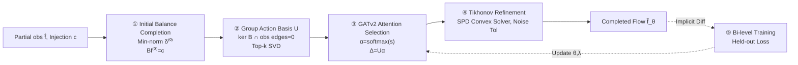

# FlowSymm: Physics–Aware, Symmetry–Preserving Graph Attention for Network Flow Completion

**Conference**: ICLR 2026  
**OpenReview**: [https://openreview.net/forum?id=vu1IEpdUQh](https://openreview.net/forum?id=vu1IEpdUQh)  
**Code**: To be confirmed  
**Area**: Graph Learning / Physics-Informed Machine Learning  
**Keywords**: Network flow completion, conservation constraints, group action, graph attention (GATv2), implicit bi-level optimization, Tikhonov regularization  

## TL;DR
This work decomposes the "missing flow completion" inverse problem into two phases: first, spanning a feasible solution subspace using a set of algebraic group actions that **preserve node conservation and freeze observed edges**; second, using graph attention to select correction directions within this physically valid basis. Finally, a differentiable Tikhonov convex solver is employed to absorb noise, thereby strictly maintaining physical conservation laws while completing missing flows.

## Background & Motivation
**Background**: In network systems such as traffic, power grids, and bike-sharing, only a small fraction of edges are equipped with sensors (e.g., only 38% of edges in traffic networks have readings), necessitating models to complete flows on the remaining edges. Such problems are algebraically characterized by node conservation equations $Bf = c$ (where $B$ is the incidence matrix, $f$ is the edge flow vector, and $c$ is the node net injection).

**Limitations of Prior Work**: Pure data-driven completion methods (MLP/GCN) produce physically impossible predictions—violating conservation at intersections or Kirchhoff’s laws in power grids. Existing physics-informed methods either use soft penalties as regularization (cannot strictly guarantee conservation), enforce $Bf=0$ as hard constraints (overly restrictive and noise-intolerant), or learn a **diagonal** regularization weight as in the previous SOTA Silva et al. (2021)—which treats each edge independently and fails to model the topological coupling between missing edges.

**Key Challenge**: The requirement to **strictly avoid modifying observed sensor readings** (a hard operational constraint) while flexibly exploring the remaining degrees of freedom; respecting conservation laws while tolerating noise from real sensors (as real systems are approximately conserved rather than perfectly balanced).

**Goal**: Construct a mapping $(G,\hat f,c)\mapsto \tilde f_\theta$ that simultaneously fits noisy observations, maintains low node balance residuals, ensures corrections occur only in the "zero-divergence and invariant-to-observed-edges" valid subspace, and couples missing edges through features rather than diagonal penalties.

**Key Insight**: **Reinterpret feasible divergence corrections as an Abelian group action**—all flow adjustments that "preserve conservation + freeze observed edges" form an additive commutative group. By constructing an orthogonal basis for this group and using attention to select directions, an **algebraic symmetry** determined by the incidence matrix and sensor mask is established, distinct from the geometric symmetries (rotation/permutation) typically handled by equivariant GNNs.

## Method

### Overall Architecture
FlowSymm is a five-step pipeline: anchor partial observations to the nearest conserved flow (initial completion), construct a divergence-free group-action basis, encode the graph with stacked GATv2 and assign attention scores to each basis vector for weighted combination (attention selection), refine with a feature-conditioned Tikhonov convex solver to absorb noise (refinement), and train all parameters end-to-end via implicit bi-level optimization. The key invariant is that the first three steps ensure $Bf=c$ and leave observed edges untouched, while the fourth step allows a small, learnable conservation violation for noise tolerance.

### Key Designs

**1. Minimum-norm balance anchor: Confining subsequent corrections within the physical manifold.** The first step solves for a temporary complete flow $f^{(0)} = \hat f + S_{\text{miss}}^\top \delta^{(0)}$, where the missing part is obtained via the Moore–Penrose pseudoinverse as the minimum-norm solution $\delta^{(0)} = B_{\text{miss}}^\top (B_{\text{miss}}B_{\text{miss}}^\top)^\dagger (c - B_{\text{obs}}\hat f_{\text{obs}})$. This anchor strictly satisfies $Bf^{(0)}=c$ and fixes observed edges, implemented via stable least squares (QR/SVD). This provides a clean starting point on the balance manifold $\mathcal F_{\text{bal}}(c)=\{f: Bf=c\}$.

**2. Abelian group action basis: Spanning the valid correction space using algebraic symmetry.** Adjustments that are "divergence-free and zero on observed edges" form a set $\mathcal A = \{u\in\mathbb R^m : Bu=0,\ u_e=0\ \forall e\in E_{\text{obs}}\}$, which is an Abelian group under vector addition acting on balanced flows as $g_\alpha: f\mapsto f + U\alpha$. $U$ is an orthonormal basis for $\mathcal A$, where the identity corresponds to $\alpha=0$ and inverses are $g_\alpha^{-1}=g_{-\alpha}$. It is constructed by projecting onto $\ker B$ via $P_{\text{bal}} = I_m - B^\dagger B$, subtracting components violating sensor invariance to obtain $P_{\mathcal A}$, and taking the top $k$ singular vectors from SVD. The subspace dimension is $r = m_{\text{miss}} - \text{rank}(B_{\text{miss}})$.

**3. Attention-guided group action selection: Letting local features determine global corrections.** Two layers of GATv2 encode edge features $X$ into embeddings $H\in\mathbb R^{m\times d'}$. For each missing edge $e$ and basis vector $i$, a compatibility score $q_{e,i} = (w_i^\top H_e)\,|u_e^{(i)}|$ is calculated, where $|u_e^{(i)}|$ modulates the influence of the basis on edge $e$. Scores are averaged over missing edges to get $s_i = \frac{1}{m_{\text{miss}}}\sum_{e\in E_{\text{miss}}} q_{e,i}$ and then $\alpha_\theta = \text{softmax}(s)$. The final correction is $\Delta = U\alpha_\theta$, yielding a candidate flow $f^{\text{cand}}_\theta = f^{(0)} + \Delta$ that still satisfies $Bf=c$ and fixes observed edges. This couples missing edges through weighted actions on interpretable physical bases.

**4. Feature-conditioned Tikhonov refinement + Implicit bi-level training: Noise tolerance + End-to-end learning.** To handle sensor noise, a controlled deviation on missing edges is allowed. The refinement step solves the strongly convex objective $\delta^{\text{tik}}_\theta = \arg\min_\delta \|B_{\text{miss}}\delta + B_{\text{obs}}f^{\text{cand,obs}}_\theta - \hat c\|_2^2 + \lambda\|\delta - \delta^{\text{attn}}_\theta\|_2^2$. The closed-form solution via SPD normal equations is solved using Cholesky or CG. Parameters $\theta=(\text{GATv2 weights},\lambda)$ are trained end-to-end via 10-fold held-out validation loss using **implicit differentiation**, providing exact hypergradients with minimal memory overhead.

## Key Experimental Results

### Main Results (10-fold edge hold-out, RMSE/MAE/CORR on held-out edges)

Evaluated on three real flow networks: Traffic (LA road network, $n{=}5749$, $m{=}7498$), Power (PyPSA-Eur grid, $n{=}2048$, $m{=}2729$), and Bike (Citi Bike graph, $n{=}1966$, $m{=}2647$).

| Method | Traffic RMSE | Traffic MAE | Power RMSE | Power MAE | Bike RMSE | Bike MAE |
|---|---|---|---|---|---|---|
| Div | 0.071 | 0.041 | 0.036 | 0.018 | 0.039 | 0.018 |
| GCN | 0.066 | 0.040 | 0.067 | 0.045 | 0.057 | 0.039 |
| EGNN | 0.065 | 0.036 | 0.065 | 0.043 | 0.063 | 0.038 |
| Bil-MLP | 0.069 | 0.038 | 0.029 | 0.011 | 0.033 | 0.016 |
| **Bil-GCN**(Prev. SOTA) | 0.062 | 0.034 | 0.029 | 0.011 | 0.032 | 0.016 |
| **Ours (FlowSymm)** | **0.057** | **0.028** | **0.026** | **0.010** | **0.029** | **0.014** |

Compared to Prev. SOTA Bil-GCN: RMSE decreased by ~8% (Traffic)/10% (Power)/9% (Bike), and MAE decreased by up to 16%.

### Ablation Study (held-out RMSE)

| Variant | Traffic | Power | Bike |
|---|---|---|---|
| FlowSymm (k=64) | 0.060 | 0.029 | 0.031 |
| FlowSymm (k=128) | 0.058 | 0.028 | 0.030 |
| **FlowSymm (k=256)** | **0.057** | **0.026** | **0.029** |
| Bil-GAT (No group action) | 0.062 | 0.029 | 0.032 |
| No-attention (k=256) | 0.060 | 0.029 | 0.031 |
| GAT (No bi-level/implicit) | 0.067 | 0.065 | 0.062 |

### Key Findings
- **Basis size $k$ saturates at 256**: Performance gain diminishes beyond 256, suggesting that a few hundred group actions cover major divergence degrees of freedom.
- **Group action module is critical**: Removing it (Bil-GAT) consistently degrades RMSE across datasets, proving that physical symmetry constraints yield accuracy gains.
- **Value of attention**: Replacing learned attention with uniform weights increases RMSE by up to 11.5%.
- **Bi-level/Implicit differentiation is vital**: Excluding it (GAT) leads to a doubling of RMSE on Power and Bike datasets.

## Highlights & Insights
- **Reframing completion as "meta-search in a physically valid subspace"**: By enumerating a truncated basis under conservation laws and using attention to navigate it, corrections are naturally constrained to $\ker B$.
- **Distinction between Algebraic and Geometric Symmetry**: While equivariant GNNs handle rotation/translation, flow completion requires algebraic symmetry defined by constraints and masks—a distinction supported by the lack of advantage for EGNN in experiments.
- **Strict Adherence to Hard Operational Constraints**: Observed edges are never modified, a rigid requirement in real-world deployment guaranteed by the design of the method.
- **Differentiable Convex Solver + Implicit Differentiation**: Ensures gradient stability and low memory footprint while unifying hyperparameter learning and attention mechanisms into end-to-end training.

## Limitations & Future Work
- **Static Graphs**: Currently does not model temporal dynamics; extension to time-series would require recurrent encoders or temporal group actions.
- **Scalability of Basis Size**: While $k=256$ is sufficient for these graphs, larger or more cyclic networks may require more basis vectors, increasing memory overhead.
- **Mask Bias Sensitivity**: Tested with random edge hold-out; systematic bias in sensor placement (e.g., concentrated in city centers) might affect performance.
- **Future Work**: Jointly inferring net injection $c$ and introducing temporal modeling.

## Related Work & Insights
- **Physics-informed ML**: Builds on Silva et al. (2021) which used diagonal weights; FlowSymm replaces diagonal regularization with group-action bases to capture edge coupling.
- **Equivariant GNNs**: Complements work on geometric symmetry (rotation/translation) by focusing on **algebraic** symmetry.
- **Implicit Differentiation**: Utilizes classical techniques to bypass unrolling iterations, applied here specifically to Tikhonov SPD solvers.
- **Mechanism Insight**: When a task has hard structures characterized by linear constraints, spanning the feasible subspace with an orthogonal basis and learning weights for those basis coefficients is a general and interpretable paradigm.

## Rating
- **Novelty**: ⭐⭐⭐⭐ — Elegant reframing of completion as meta-search on group actions.
- **Experimental Thoroughness**: ⭐⭐⭐⭐ — Strong results across three domains and thorough ablations.
- **Writing Quality**: ⭐⭐⭐⭐ — Rigorous mathematical derivation and clear pipeline description.
- **Value**: ⭐⭐⭐⭐ — Consistently outperforms SOTA while strictly preserving physical constraints, offering a transferable methodology for industrial inverse problems.

<!-- RELATED:START -->

## Related Papers

- [\[ICLR 2026\] Topological Flow Matching](topological_flow_matching.md)
- [\[ICLR 2026\] Confident Block Diagonal Structure-Aware Invariable Graph Completion for Incomplete Multi-view Clustering](confident_block_diagonal_structure-aware_invariable_graph_completion_for_incompl.md)
- [\[ICLR 2026\] Latent Geometry-Driven Network Automata for Complex Network Dismantling](latent_geometry-driven_network_automata_for_complex_network_dismantling.md)
- [\[ICLR 2026\] Bures-Wasserstein Flow Matching for Graph Generation](bures-wasserstein_flow_matching_for_graph_generation.md)
- [\[ICLR 2026\] LRIM: a Physics-Based Benchmark for Provably Evaluating Long-Range Capabilities in Graph Learning](lrim_a_physics-based_benchmark_for_provably_evaluating_long-range_capabilities_i.md)

<!-- RELATED:END -->
