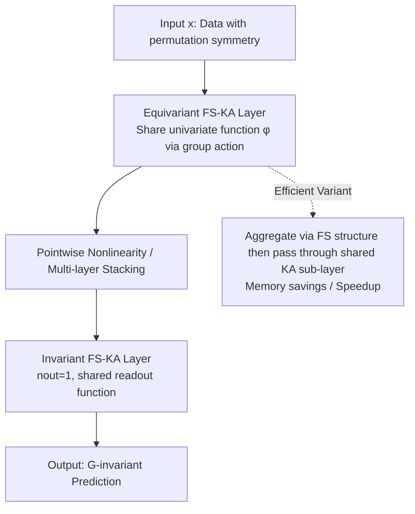

# FS-KAN: Permutation Equivariant Kolmogorov-Arnold Networks via Function Sharing

**Conference**: ICLR 2026  
**OpenReview**: [https://openreview.net/forum?id=l4m4HK6gJN](https://openreview.net/forum?id=l4m4HK6gJN)  
**Code**: To be confirmed  
**Area**: Geometric Deep Learning / Equivariant Networks / Kolmogorov-Arnold Networks  
**Keywords**: Permutation Equivariance, Kolmogorov-Arnold Networks, Parameter Sharing, Function Sharing, DeepSets, Data-efficient  

## TL;DR
This paper generalizes the classic "parameter sharing" scheme in equivariant networks to KANs, proposing FS-KAN which **shares learnable univariate functions** (rather than scalar weights) based on group actions. It unifies various existing equivariant KANs and proves that its expressive power is equivalent to parameter-sharing MLPs, thereby achieving significantly higher sample efficiency in low-data scenarios.

## Background & Motivation

**Background**: Equivariant networks are mainstream for tasks where data exhibits symmetries (sets, graphs, images, point clouds, user-item matrices, etc.). The most general and scalable approach for constructing equivariance is the **parameter-sharing scheme** proposed by Wood & Shawe-Taylor—binding the weights of linear layers according to group actions (e.g., circulant matrices for the cyclic group $C_n$ in convolutions, DeepSets for $S_n$). Meanwhile, Kolmogorov-Arnold Networks (KAN) replace the scalar weights in MLPs with learnable univariate functions $\phi$, offering better interpretability, parameter efficiency, and expressive power.

**Limitations of Prior Work**: Existing works have only developed equivariant KANs for a **few specific data types** (Graph-KAN for graphs, PointNet-KAN for sets, Convolutional-KAN for images), remaining isolated and fragmented. Recently, Hu et al. (2025) addressed continuous groups but required numerical solutions for equivariant layers and could not handle variable-length inputs (sets/graphs). In short: **there is a lack of a unified principles-based framework for constructing equivariant KAN layers for any permutation symmetry group.** Many important data types, such as multiset interactions, sets with symmetric elements, weight spaces, hierarchical structures, and higher-order relational data, still lack corresponding equivariant KANs.

**Key Challenge**: The "shared object" in the parameter-sharing scheme is scalar weights, whereas the fundamental unit of KAN is functions. How to naturally generalize "shared weights" to "shared functions" while ensuring no loss of expressive power is the key gap in bringing mature equivariant theory to KANs.

**Goal**: Provide a construction method for equivariant/invariant KA layers applicable to **any permutation subgroup $G \le S_n$**, unifying and significantly extending existing equivariant KANs, and theoretically transferring the expressive power conclusions of parameter-sharing networks.

**Core Idea**: **Function Sharing (FS)** — Directly upgrading "weight binding by group action" to "**univariate function binding by group action**," i.e., constraining $\phi_{q,p}=\phi_{\sigma(q),\sigma(p)}$.

## Method

### Overall Architecture
A KA layer can be represented as a function matrix acting on an input vector: $\Phi(x)_q=\sum_{p}\phi_{q,p}(x_p)$. The core of FS-KAN is to impose the exact same "binding by group" constraint as parameter sharing on this function matrix, but binding entire univariate functions rather than single scalars. Building on this, the paper provides specific constructions for invariant layers, multi-channel settings, and efficiency optimizations, instantiating them for three typical categories of symmetry: sets ($S_n$), direct product groups ($G\times H$, e.g., images, user-item matrices), and higher-order tensors (graphs/hypergraphs).

### Key Designs

**1. Function Sharing Constraint: Upgrading "Parameter Binding" to "Function Binding."** For an equivariant linear layer with parameter sharing, the weights must satisfy $W_{i,j}=W_{\sigma(i),\sigma(j)}$. FS-KAN translates this to the function level: an $n\times n$ KA layer is a $G$-equivariant FS-KA layer if and only if $\phi_{q,p}=\phi_{\sigma(q),\sigma(p)},\ \forall \sigma\in G$ (Prop. 1). Intuitively, an FS-KA layer under a cyclic group is a "functional circulant matrix," corresponding one-to-one with the circulant structure of 1D convolutions. For invariant layers ($n_{out}=1$), this simplifies to $\phi_p=\phi_{\sigma(p)}$ (Prop. 3). A subtle point worth emphasizing is that equivariant KA layers **are not necessarily** naturally FS-structured—the paper provides a counterexample of an $S_2$-equivariant layer where two different formulations yield the same function but only one is an FS layer; however, Prop. 2/4 prove that **any** equivariant (invariant) KA layer has an equivalent FS layer representation. This "lossless reduction" is the theoretical foundation, allowing researchers to **only consider FS layers without loss of generality** when designing equivariant KANs.

**2. Multi-channel "Two-level Internal and External Sharing."** Real-world data often possess multi-dimensional features per element (e.g., color channels in images). In this case, each $\Phi_{q,p}:\mathbb{R}^{d_{in}}\to\mathbb{R}^{d_{out}}$ is itself a small KAN sub-layer, and the entire layer becomes an $n\times n$ matrix of KA sub-layers (Prop. 5). Sharing occurs at two levels: **external sharing** where sub-layers are bound by group action ($\hat\Phi_{q,p}=\hat\Phi_{\sigma(q),\sigma(p)}$), and **internal sharing** where functions within the sub-layers are shared based on corresponding positions. This aligns perfectly with sharing schemes in multi-channel equivariant linear layers—for example, in the $S_n$ case, the layer structure is written specifically as $\Phi(x)_q=\Phi_1(x_q)+\sum_{p\ne q}\Phi_2(x_p)$, which is the KAN version of a DeepSets layer and a generalization of PointNet-KAN. The $G\times H$ direct product group (images, user-item matrices) manifests as a nested structure of "external sub-layer sharing by $G$ and internal function sharing by $H$." Higher-order tensors (second-order adjacency in graphs, hypergraphs) are generalized by imposing the same binding on tensor indices $\sigma(i)=(\sigma(i_1),\dots,\sigma(i_k))$, enabling the construction of expressive power comparable to $k$-IGN.

**3. Efficient FS-KA Layer: Swapping Aggregation and Nonlinearity.** Standard KA layers apply functions independently to all input-output pairs, leading to high computational and memory costs. Borrowing from the trick in linear layers where "sum pooling can commute with matrix multiplication," the paper proposes **aggregating according to the FS structure first, then passing through a shared KA sub-layer.** For an $S_n$ equivariant layer, the efficient variant computes $\tilde\Phi(x)_q=\tilde\Phi_1(x_q)+\tilde\Phi_2\big(\sum_{p=1}^n x_p\big)$—where the second term only needs to be computed once for the entire set and then broadcast. The trade-off is that it is no longer strictly equivalent to the original layer (it is a relaxation), but the **parameter count remains unchanged, equivariance is preserved**, and the training computation graph is smaller with lower memory consumption. For any group $G$, efficient layers are derived following the principle of "swapping the order of element aggregation (sum/mean pooling) and shared function application," with efficiency determined by the group structure.

**4. Representational Equivalence Theorem: Building a Bridge Between KAN and Parameter Sharing Networks.** The paper proves that in the sense of uniform approximation, FS-KAN and parameter-sharing MLPs are **representationally equivalent** for a given permutation group $G$: on one hand, any parameter-sharing MLP ($l$ layers, ReLU) can be **exactly realized** by a spline FS-KAN with at most $2l$ layers (Prop. 6, utilizing the fact that "an MLP layer can be realized by two KA layers—affine + pointwise ReLU"); on the other hand, any FS-KAN can be **approximated with arbitrary precision** by a parameter-sharing MLP (Prop. 7). The power of this equivalence lies in the **direct transfer of existing conclusions** (Cor. 4.1): FS-KAN thus inherits the translation-equivariant universal approximation of CNNs, the universality of DeepSets for set-permutation invariant functions, the universality of higher-order FS-KAN for functions invariant to any $G\le S_n$, and the conclusion that $k$-order FS-KAN on graphs is equivalent to $k$-IGN with $k$-WL discriminative power.

## Key Experimental Results

### Main Results
Contrasting FS-KAN / Efficient FS-KAN with parameter-sharing MLP baselines (aligning parameter counts) across three types of symmetry tasks:

| Task | Symmetry Group | Dataset | Baseline | Key Findings |
|------|--------|--------|------|----------|
| Multi-measurement Signal Classification | $S_n\times C_T$ | Synthetic Periodic Signals (n=25, T=100) | DSS / scaled DSS | Significantly outperforms in the low-data regime (60–1200 samples); FS-KAN uses only 3e4 parameters vs 3e6 for DSS |
| Point Cloud Classification | $S_n$ | ModelNet40 (No Augmentation) | DeepSets / Point Transformer / Non-equivariant KAN | Comprehensive lead when both sample size and point count are limited; non-equivariant KAN performs poorly |
| Semi-supervised Rating Prediction | $S_n\times S_m$ | MovieLens-100K / Flixster / Douban / Yahoo | SSEM / scaled SSEM | Better RMSE in low-data regimes; gap narrows as data increases |

### Continual Learning Results (Point Cloud, ModelNet40 → Rotated/Translated Versions)

| Train Size | Model | Forgetting ↓ | Avg Acc ↑ |
|-----------|-------|--------------|-----------|
| 200 | **FS-KAN** | **0.034** | **0.420** |
| 200 | Efficient FS-KAN | 0.040 | 0.395 |
| 200 | DeepSets | 0.059 | 0.380 |
| 600 | **FS-KAN** | 0.045 | **0.501** |
| 600 | DeepSets | 0.055 | 0.475 |
| 800 | **FS-KAN** | 0.038 | **0.535** |
| 800 | DeepSets | 0.036 | 0.516 |
| 1000 | FS-KAN | 0.040 | 0.553 |
| 1000 | DeepSets | 0.027 | **0.555** |

FS-KAN exhibits less forgetting and higher average accuracy in low-data regimes; it ties with DeepSets when data is sufficient (1000).

### Key Findings
- **Data efficiency is the core selling point**: FS-KAN substantially leads parameter-sharing MLPs in low-data regimes across all tasks, often with parameter counts one to two orders of magnitude lower (e.g., 3e4 vs 3e6 in signal tasks).
- **Equivariance is indispensable**: Non-equivariant KAN performs "disastrously" on point clouds, reinforcing the necessity of explicitly encoding symmetry into the architecture.
- **Enhanced Interpretability**: FS-KAN shares the same spline function across symmetric edges, making the equivariant structure "visible by inspection," which is cleaner and more respectful of data symmetry than standard KAN learning independent splines for every edge.
- **Efficiency remains a bottleneck**: The efficient variant is approximately 1.4–1.5× faster than the full FS-KAN, but still slower than DSS/DeepSets (e.g., about 4x slower in the signal task).

## Highlights & Insights
- **"Parameter Sharing → Function Sharing" is a clean and generalizable conceptual upgrade**: Simply replacing the bound object from scalars to functions allows for the seamless transfer of the entire equivariant deep learning methodology to KANs.
- **Emphasis on both theory and unification**: Beyond providing a framework, it uses the representational equivalence theorem to "for free" transfer a large set of classic conclusions (CNN/DeepSets/$k$-IGN/$k$-WL) to FS-KAN, while proving that existing equivariant KANs (PointNet-KAN, Conv-KAN) are special cases.
- **The "lossless reduction" of Prop. 2 is critical**: Equivariant KA layers are not naturally FS, but they can always be equivalently rewritten as an FS layer, providing theoretical justification for focusing solely on FS layer design.
- **Clear Positioning**: Clearly recommends FS-KAN as a preferred choice for **low-data + symmetry** scenarios, rather than as a universal replacement for MLPs.

## Limitations & Future Work
- **High Computational Cost**: Even with the efficient variant, it remains slower than linear parameter-sharing layers, especially in high-data regimes; the authors list "faster implementations" as important future work.
- **Expressivity-only Theory**: Generalization ability, optimization properties, and scalability have yet to be theoretically analyzed.
- **Efficiency Variant is Non-equivalent**: Efficient FS-KA is a relaxation rather than an equivalent layer; although it often performs better in experiments, there is no theoretical guarantee regarding its approximation error.
- **Advantage Vanishes in High-Data Regimes**: When data is abundant, linear models are often preferable due to faster training, limiting the value of FS-KAN to its "low-data" premise.

## Related Work & Insights
- **Parameter-sharing Equivariant Networks** (Wood & Shawe-Taylor 1996, Ravanbakhsh 2017, Maron 2019b): The direct parent of FS-KAN; function sharing is its KAN-based generalization.
- **KAN** (Liu et al. 2024): The origin of replacing scalar weights with univariate functions; FS-KAN inherits its interpretability/parameter efficiency and adds symmetry.
- **Existing Equivariant KANs** (PointNet-KAN, Graph-KAN, Convolutional-KAN, Hu et al. 2025): Unified or extended by this framework; FS-KAN uniquely handles variable-length inputs (sets/graphs) where others may fail.
- **Expressivity Theory** (DeepSets universality, $k$-IGN and $k$-WL): Transferred as a whole via equivalence theorems, serving as a paradigm for "transferring mature theory to new architectures."
- **Insight**: When a new architecture (KAN) emerges, rather than re-doing equivariant designs for every data type, it is more effective to identify the "sharing primitive" in the old paradigm and prove equivalence, thereby inheriting the entire theoretical and design ecosystem at once.

## Rating
- **Novelty**: ⭐⭐⭐⭐ —— The conceptual upgrade from "parameter sharing to function sharing" is elegant, and it provides the first unified framework for equivariant KANs under arbitrary permutation groups, consolidating prior isolated works.
- **Experimental Thoroughness**: ⭐⭐⭐⭐ —— Covers three types of symmetry (sets, product, high-order), four datasets, including continual learning and interpretability visualization with error bars; however, tasks are relatively small-scale and lack large-scale/real-world graph tasks.
- **Writing Quality**: ⭐⭐⭐⭐ —— The proposition-proof-example flow is clear, diagrams (circulant matrices/internal-external sharing) are intuitive, and the theoretical/experimental positioning is well-defined.
- **Value**: ⭐⭐⭐⭐ —— Provides a principled and interpretable new option for "symmetric data + low data" scenarios with a strong theoretical blueprint; primarily limited by computational efficiency and narrowing advantages in high-data regimes.

<!-- RELATED:START -->

## Related Papers

- [\[ICLR 2026\] A Graph Meta-Network for Learning on Kolmogorov–Arnold Networks](a_graph_meta-network_for_learning_on_kolmogorovarnold_networks.md)
- [\[ICML 2025\] GrokFormer: Graph Fourier Kolmogorov-Arnold Transformers](../../ICML2025/graph_learning/grokformer_graph_fourier_kolmogorov-arnold_transformers.md)
- [\[AAAI 2026\] Magnitude-Modulated Equivariant Adapter for Parameter-Efficient Fine-Tuning of Equivariant Graph Neural Networks](../../AAAI2026/graph_learning/magnitude-modulated_equivariant_adapter_for_parameter-efficient_fine-tuning_of_e.md)
- [\[ICLR 2026\] AdS-GNN - a Conformally Equivariant Graph Neural Network](ads-gnn_-_a_conformally_equivariant_graph_neural_network.md)
- [\[AAAI 2026\] BugSweeper: Function-Level Detection of Smart Contract Vulnerabilities Using Graph Neural Networks](../../AAAI2026/graph_learning/bugsweeper_function-level_detection_of_smart_contract_vulnerabilities_using_grap.md)

<!-- RELATED:END -->
