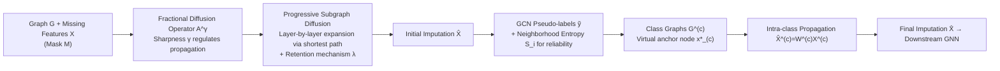

# FSD-CAP: Fractional Subgraph Diffusion with Class-Aware Propagation for Graph Feature Imputation

**Conference**: ICLR 2026  
**OpenReview**: [https://openreview.net/forum?id=LAr64ymrMJ](https://openreview.net/forum?id=LAr64ymrMJ)  
**Code**: [https://github.com/ssjcode/FSD-CAP](https://github.com/ssjcode/FSD-CAP)  
**Area**: Graph Learning / Graph Feature Imputation  
**Keywords**: Missing Feature Imputation, Diffusion Propagation, Fractional Diffusion, Subgraph Expansion, Class-Aware Propagation, GNN  

## TL;DR
To address graph node feature imputation under extreme sparsity (up to 99.5% missing rate), FSD-CAP utilizes a fractional diffusion operator with adjustable "sharpness" for locally adaptive propagation, suppresses error accumulation via progressive subgraph diffusion expanding outward from observed nodes, and injects semantic structure through class-aware propagation driven by pseudo-labels and neighborhood entropy. The imputed features allow GCNs to approach or even exceed the performance of models trained on complete features in node classification and link prediction tasks.

## Background & Motivation
**Background**: GNNs assume node features are fully observed to effectively aggregate information from neighbors. However, in real-world scenarios, node attributes are often missing on a large scale due to privacy constraints, sensor failures, or incomplete collection. High missing rates directly disrupt message passing and significantly degrade model performance.

**Limitations of Prior Work**: Existing mainstream methods for imputing missing features generally fall into two categories, both of which fail under extreme sparsity:

- **Latent Space / Generative Methods** (e.g., ITR, ASD-VAE, SAT): These rely on modeling the distribution of correlation between features and structure. While effective at moderate missing rates, they collapse as sparsity increases, sometimes performing worse than naive baselines like "zero-filling" or "mean-filling," and are prone to Out-of-Memory (OOM) issues on large graphs.
- **Diffusion-based Methods** (e.g., FP, PCFI): These are lightweight, parameter-free, and more robust to high missing rates. However, they **apply uniform propagation across all nodes** without distinguishing local structures or propagation order. Reliable signals from nearby nodes are underutilized, while unreliable signals from afar are mixed in indiscriminately, leading to over-smoothing and reduced discriminative power.

**Key Challenge**: The robustness of diffusion methods stems from "indiscriminate global smoothing," but this uniform, global, and unordered propagation wastes reliable local signals, spreads errors across the graph, and erases class boundaries.

**Goal**: Design a two-stage imputation framework that remains robust under extreme sparsity (mr=0.995, only 0.5% features remaining) by enabling adaptive propagation to local structures, controlling propagation order, and preserving class discriminability.

**Core Idea**:
- **Fractional Diffusion with Adjustable Sharpness**: Introduces an exponent $\gamma$ to the standard normalized adjacency matrix, allowing continuous interpolation between "uniform averaging" and "selecting the strongest neighbor" to adjust the sharpness of propagation based on local structure.
- **Progressive Subgraph Diffusion from Observed Points**: Propagates first on observed nodes and then incorporates missing nodes layer-by-layer based on shortest-path distance, ensuring "easy-to-fill" nodes are handled first to limit early error diffusion.
- **Class-Aware Refinement**: Constructs a virtual anchor node for each class using pseudo-labels and neighborhood entropy, propagating within class-specific subgraphs to enhance intra-class consistency and inter-class separation.

## Method

### Overall Architecture
FSD-CAP is a two-stage pipeline consisting of imputation followed by training. Given a graph $G$ and a partially observed feature matrix $X$: the first stage, **FSD**, starts from observed nodes and expands the subgraph radius progressively, using fractional diffusion operators $A^{\gamma,0}, A^{\gamma,1}, A^{\gamma,2}$ for incremental propagation to obtain the initial imputation $\hat{X}$. The second stage, **CAP**, uses a classifier to assign pseudo-labels to the initially imputed features and constructs class-specific graphs (each class corresponding to an anchor feature $x^*_{(c)}$ and a weight matrix $W_{(c)}$). Final imputed features $\hat{X}$ are output after propagation within the class graphs and fed to downstream GNNs.

### Key Designs

**1. Fractional Diffusion Operator: Mapping "Smoothing ↔ Sharpening" to a single knob.** Traditional diffusion imputation uses lazy random walks defined by the symmetric normalized adjacency matrix $\bar{A}=D^{-1/2}AD^{-1/2}$. This assumes uniform mixing of neighbors, failing to reflect node distribution differences and leading to over-smoothing. FSD-CAP introduces a sharpness parameter $\gamma>0$ to perform element-wise exponentiation of the adjacency matrix followed by row normalization: $A^{\gamma}_{ij}:=(\bar{A}_{ij})^{\gamma}/\sum_{k}(\bar{A}_{ik})^{\gamma}$. This transformation maintains row stochasticity while reweighting neighbor contributions—when $\gamma<1$, weak edges are amplified for smoother, more uniform propagation; when $\gamma>1$, strong edges are emphasized for sharper, more local propagation; $\gamma=1$ recovers standard normalized diffusion. Theorem 1 shows that as $\gamma\to0^+$, it degrades to a simple average of neighbors $\frac{1}{|N(i)|}\sum_{j\in N(i)}X_{[j,:]}$, and as $\gamma\to\infty$, it becomes deterministic routing $X_{[j^\star,:]}$ (transferring all mass to the strongest neighbor $j^\star$). $\gamma$ acts as a "locality" knob, allowing diffusion to adapt to local connectivity.

**2. Progressive Subgraph Diffusion: Filling easy nodes first and expanding layer-by-layer to block error accumulation.** Based on the prior that "nodes closer on the graph are more similar," the method avoids one-time global diffusion. Instead, it advances from observed regions to missing regions layer-by-layer for each feature channel. For each feature $\ell$, an initial subgraph $G^{(0)}$ is formed by observed nodes $V^\ell_+$. Missing nodes are then merged layer-by-layer according to their shortest-path distance to $V^\ell_+$. The $m$-th layer subgraph $G^{(m)}$ contains all nodes and edges within radius $m$. Fractional diffusion updates are applied independently within each connected component: $x^{(m)}_i(t)=\sum_{v_j\in N^{(m)}(i)}A^{\gamma,m}_{ij}\cdot x^{(m)}_j(t-1)$. To prevent distant noise from contaminating features already imputed in previous layers, a **retention mechanism + boundary condition** is used: $x^{(m)}_i(t)=x^{(m)}_i(0)\odot M_i+\big(x^{(m)}_i(t)+\lambda x^{(m-1)}_i(K)\big)\odot(1-M_i)$. Observed features ($M_i=1$) remain fixed, while missing values blend the current estimate with the previous layer's converged result (weighted by $\lambda$). Theorems 2/3 prove that each layer converges to a unique fixed point, and as the subgraph expands to the full graph, the result converges to the global steady-state solution.

**3. Class-Aware Feature Refinement: Using pseudo-labels and neighborhood entropy to inject semantics.** Diffusion inherently blurs discriminative patterns. CAP first uses a semi-supervised GCN to generate pseudo-labels $\tilde{y}$ for unlabeled nodes and then constructs class graphs. Crucially, **neighborhood label entropy** scales the reliability of pseudo-labels: $S_i=-\big(1/\log|\hat{N}_i|\big)\sum_{c}P_i(c)\log P_i(c)$, where $P_i(c)$ is the proportion of class $c$ in node $i$'s expanded neighborhood. A lower $S_i$ implies higher representative reliability. Class anchor features $x^*_{(c)}$ are calculated using weighted averages based on reliability $(1-S_i)$. Virtual anchor nodes $v_{(c)}$ are then linked to all missing nodes pseudo-labeled as $c$. Propagation weights use temperature-scaled softmax class probabilities $\hat{y}_i$, where self-loop weights are set to $\hat{y}_i$ and anchor-edge weights to $1-\hat{y}_i$ (uncertain nodes absorb more class-level information). A single-step propagation $\hat{X}^{(c)}=W^{(c)}X^{(c)}$ completes the refinement, preserving class boundaries while improving intra-class consistency.

## Key Experimental Results

### Main Results
Node classification accuracy (%) on five benchmarks with fixed mr=0.995 (extreme missingness):

| Setting | Method | Cora | CiteSeer | PubMed | Photo | Computers | Average |
|------|------|------|----------|--------|-------|-----------|------|
| Structural Missing | Full Features (Upper Bound) | 82.72 | 70.00 | 77.46 | 91.63 | 84.72 | 81.31 |
| Structural Missing | Zero (Baseline) | 43.50 | 31.29 | 46.14 | 79.04 | 71.71 | 54.34 |
| Structural Missing | FP | 72.71 | 57.98 | 74.18 | 86.34 | 77.19 | 73.68 |
| Structural Missing | PCFI (Strong Baseline) | 75.36 | 66.06 | 74.44 | 87.38 | 78.71 | 76.39 |
| Structural Missing | **FSD-CAP** | **80.56** | **71.94** | **76.98** | **89.18** | **81.64** | **80.06** |
| Uniform Missing | PCFI | 78.55 | 69.11 | 76.01 | 88.55 | 81.64 | 78.77 |
| Uniform Missing | **FSD-CAP** | **81.49** | **73.15** | **77.46** | **89.40** | **83.57** | **81.01** |

Link Prediction (mr=0.995, Average AUC/AP %): FSD-CAP achieved 91.65 (Structural) and 92.41 (Uniform) AUC, outperforming FP (86.76/87.92) and PCFI across all datasets, while the full feature upper bound is 95.06.

### Ablation Study
Ablation of components under structural missing (mr=0.995, accuracy %):

| Variant | Cora | CiteSeer | PubMed | Photo | Computers | Average |
|------|------|----------|--------|-------|-----------|------|
| **FSD-CAP (Full)** | 80.56 | 71.94 | 76.98 | 89.18 | 81.64 | **80.06** |
| w/o Fractional Operator | 79.95 | 71.82 | 75.54 | 86.27 | 76.60 | 78.04 (-2.02) |
| w/o Progressive Diffusion | 79.34 | 70.84 | 75.97 | 88.07 | 79.14 | 78.67 (-1.39) |
| w/o Class-Aware Refinement | 76.43 | 68.65 | 75.52 | 88.10 | 78.06 | 77.35 (-2.71) |

### Key Findings
- **Approaching/Exceeding Full Feature Bounds**: With only 0.5% features in uniform missingness, FSD-CAP's average accuracy (81.01) is close to the full-feature GCN (81.31). On CiteSeer, it even **outperformed** the full-feature GCN (73.15 vs. 70.00).
- **Consistent Lead over Strong Baselines**: Under structural missingness, FSD-CAP improved over PCFI by 6.90%/8.90%/3.41%/2.06%/3.72% across the five datasets.
- **Complementary Components**: Class-aware refinement had the greatest impact on node classification (average -2.71), especially on sparse multi-class graphs like Cora and CiteSeer. The fractional operator had the greatest impact on link prediction (average AUC -5.60) and dense graphs like Photo and Computers.
- **Scalability**: Unlike ASD-VAE and ITR which suffered from OOM on larger graphs, FSD-CAP remained competitive and efficient on large-scale and heterophilic graphs.

## Highlights & Insights
- **Unified Smoothing/Sharpening**: The fractional exponent $\gamma$ elegantly unifies "uniform averaging" and "strongest neighbor routing" into a continuous spectrum with clean limit theorems and minimal parameters.
- **Curriculum-style Progressive Diffusion**: Filling nodes based on distance (proximity-to-certainty) acts as a curriculum for imputation. The retention mechanism and theoretical convergence guarantee provide both stability and interpretability.
- **Entropy-weighted Pseudo-labels**: Explicitly modeling label uncertainty in CAP prevents noisy pseudo-labels from corrupting class anchor features, identifying which nodes are truly representative of their class.
- **Flexibility**: The imputation-then-training paradigm is lightweight and agnostic to the downstream GNN architecture.

## Limitations & Future Work
- **Dependence on Homophily**: The progressive approach assumes nearby nodes are similar. While the paper claims performance on heterophilic graphs, the robustness of this mechanism in extreme heterophily requires more systematic verification.
- **Pseudo-label Sensitivity**: CAP is vulnerable to pseudo-label quality; if labels are extremely noisy or imbalanced, anchor features may become biased.
- **Hyperparameter Overhead**: Parameters like $\gamma$, $\lambda$, temperature $T$, and expansion layers require grid searching, increasing the cost of deployment.
- **Computational Cost**: Propagating per-channel and per-class may pose computational and memory overhead challenges for ultra-large graphs or extremely high-dimensional features.

## Related Work & Insights
- **Diffusion-based Imputation**: FSD-CAP builds upon and improves methods like FP and PCFI by adding "adjustable sharpness + progressive order + class semantics."
- **Generative Imputation**: Methods like SAT and ASD-VAE fail under extreme sparsity due to reliance on distribution modeling, highlighting the robustness of the parameter-free diffusion approach.
- **Insights**: The adjustable sharpness operator can be generalized to standard GNN aggregations to mitigate over-smoothing. The progressive subgraph diffusion strategy is also applicable to other graph tasks requiring expansion from reliable to uncertain regions (e.g., label propagation).

## Rating
- **Novelty**: ⭐⭐⭐⭐ — The combination of fractional operators, progressive diffusion, and entropy-weighted refinement is novel in the context of imputation, supported by solid convergence theories.
- **Experimental Thoroughness**: ⭐⭐⭐⭐ — Comprehensive coverage across datasets, missing modes, and tasks, though analysis of hyperparameter sensitivity could be more extensive.
- **Writing Quality**: ⭐⭐⭐⭐ — Clear structure with intuitive explanations for dense mathematical propositions.
- **Value**: ⭐⭐⭐⭐ — High practical value for real-world scenarios with extreme data missingness, offering a lightweight yet effective solution.

<!-- RELATED:START -->

## Related Papers

- [\[ICLR 2026\] Global and Local Topology-Aware Graph Generation via Dual Conditioning Diffusion](global_and_local_topology-aware_graph_generation_via_dual_conditioning_diffusion.md)
- [\[ICLR 2026\] Bridging Input Feature Spaces Towards Graph Foundation Models](bridging_input_feature_spaces_towards_graph_foundation_models.md)
- [\[ICLR 2026\] Geometric Graph Neural Diffusion for Stable Molecular Dynamics Simulations](geometric_graph_neural_diffusion_for_stable_molecular_dynamics_simulations.md)
- [\[ICLR 2026\] WATS: Wavelet-Aware Temperature Scaling for Reliable Graph Neural Networks](wats_wavelet-aware_temperature_scaling_for_reliable_graph_neural_networks.md)
- [\[ICLR 2026\] Low-Rank Few-Shot Node Classification by Node-Level Graph Diffusion](low-rank_few-shot_node_classification_by_node-level_graph_diffusion.md)

<!-- RELATED:END -->
