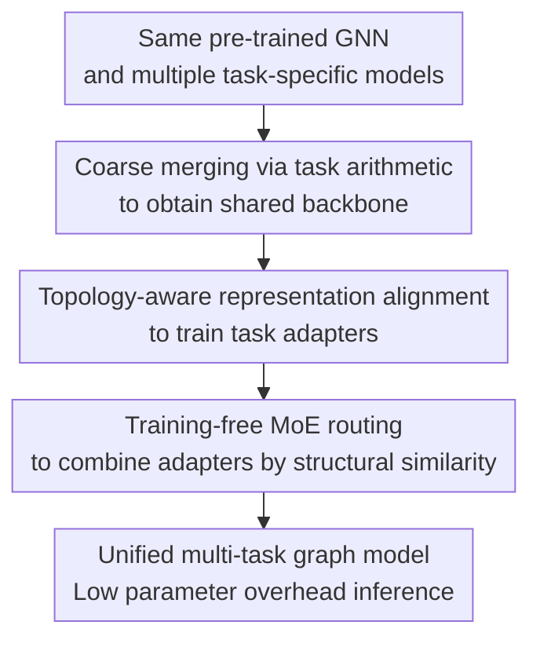

# G-Merging: Graph Models Merging for Parameter-Efficient Multi-Task Knowledge Consolidation

**Conference**: ICLR2026  
**OpenReview**: [https://openreview.net/forum?id=FoTtvLkkfU](https://openreview.net/forum?id=FoTtvLkkfU)  
**Code**: https://github.com/cjcj46262/G-Merging  
**Area**: Graph Learning / Model Merging / Parameter-Efficient Learning  
**Keywords**: Graph model merging, GNN, Task arithmetic, Topology-aware Wasserstein distance, MoE routing  

## TL;DR
G-Merging targets multi-task graph learning scenarios by synthesizing multiple task models, fine-tuned from the same pre-trained GNN, into a shared backbone via task arithmetic. It then employs topology-aware alignment to train lightweight task adapters and utilizes a training-free MoE routing during inference to dynamically combine adapters, preserving multi-task knowledge with parameter overhead close to a single model.

## Background & Motivation
**Background**: In graph learning, the "pre-train GNN + downstream fine-tuning" paradigm is well-established, particularly for tasks with expensive labels such as molecular property prediction, biological networks, and social networks. Learning general representations on large-scale graphs followed by per-task fine-tuning is typically more stable than training from scratch. Concurrently, model merging, emerging from vision and language models, aims to synthesize multiple task-specific fine-tuned models into a single multi-task model to avoid deploying a full set of parameters for every task.

**Limitations of Prior Work**: Directly applying model merging to graph models encounters two specific issues. First, structural distributions across different graph tasks vary significantly; for instance, molecular datasets like Tox21, SIDER, ClinTox, HIV, and MUV form distinctly different clusters in the final embedding space. Second, task-specialized models exhibit poor cross-domain generalization: replacing a GNN backbone fine-tuned on one task with that of another often leads to a significant performance drop. This indicates that knowledge in graph tasks is not merely "semantic capability" averageable in parameter space, but also includes domain-specific representations strongly correlated with graph topology and node neighborhood patterns.

**Key Challenge**: Model merging pursues a unified model with low storage overhead, yet graph tasks are highly dependent on task-specific structural patterns. Naive weight averaging or task arithmetic can compress parameters but tends to cancel out the graph structural knowledge of different tasks. Conversely, retaining every complete fine-tuned model defeats the purpose of merging.

**Goal**: The objective is to solve the graph model merging problem: given $K$ task-specific models initialized from the same pre-trained GNN, construct a unified multi-task graph model that requires no joint training from scratch, avoids deploying $K$ full backbones, and maintains or even exceeds the performance of individual fine-tuned models.

**Key Insight**: Knowledge is decomposed into two layers: cross-task shared knowledge is consolidated into a unified backbone via parameter merging, while task-specific knowledge is supplemented via lightweight adapters. A critical observation is that representation shifts on graphs cannot be aligned solely by node embedding distances but must respect the adjacency structure. Therefore, the authors adapt the Wasserstein distance into a topology-aware version constrained by the graph adjacency matrix to train adapters and drive inference-time routing.

**Core Idea**: Replace single parameter averaging with "task arithmetic shared backbone + topology-aware adapter alignment + training-free MoE routing." This allows graph model merging to achieve parameter compression while retaining specialized structural knowledge of different tasks.

## Method

### Overall Architecture
The input to G-Merging is a set of $K$ fine-tuned models $\{f_{\theta_1},\ldots,f_{\theta_K}\}$ derived from the same pre-trained GNN $f_{\theta_{pre}}$. The output is not a simple averaged backbone, but a unified GNN backbone $f_{\theta_{uni}}$ coupled with a set of lightweight task adapters. During inference, the shared backbone extracts general graph representations, and MoE adapters dynamically compensate for task-specific knowledge based on the structural similarity of the current task and graph instance.

The methodology comprises three stages: first, synthesize a unified model using task arithmetic to obtain a shared knowledge backbone; second, freeze the unified model and all task-specific models to train individual NodeAdapters and GraphAdapters, aligning the unified model's node-level and graph-level representations with those of the corresponding fine-tuned models; finally, organize these adapters into an MoE during inference, using Topology-aware Wasserstein Distance (TWD) or $L_1$ distance to calculate parameter-free routing weights.

### Key Designs
**1. Task Arithmetic Coarse Merging: Consolidating shared graph knowledge into a unified backbone**

If adapters were to repair all task knowledge independently from the start, the unified model would revert to the vicinity of the pre-trained model, lacking the common patterns already learned by downstream tasks. G-Merging thus adopts task arithmetic: for the $k$-th task, the task vector is defined as $\tau_k=\theta_k-\theta_{pre}$, representing the parameter shift from the pre-trained model to the task-specific model. The unified model parameters are $\theta_{uni}=\theta_{pre}+\lambda\sum_{k=1}^{K}\tau_k$. For $\lambda=1/K$, this reduces to approximate weight averaging, while adjusting $\lambda$ controls the ratio of pre-trained to task-specific knowledge.

This stage addresses where to store shared knowledge. Despite structural differences, many underlying GNN representation capabilities, molecular substructure patterns, and discriminative features for graph classification remain sharable. Establishing a unified backbone via task arithmetic provides a starting point closer to the multi-task distribution than the original pre-trained model. Ablation studies confirm this: skipping parameter merging and using $\theta_{pre}$ as the unified model reduces average ROC-AUC from 74.2 to 72.2.

**2. Topology-aware Representation Alignment: Using TWD to train adapters for structural bias correction**

The coarse-merged unified model still exhibits representation shifts relative to individual task models, particularly in node embedding distributions across different topologies. G-Merging trains lightweight adapters for each task: NodeAdapters inserted after GNN convolutional layers and GraphAdapters placed after pooling. Adapters use a bottleneck structure $f_{adap}(H)=\mathrm{ReLU}(H W_{down})W_{up}$, where only $W_{down}$ and $W_{up}$ are trained, ensuring significantly fewer parameters than a full GNN.

The core innovation is the Topology-aware Wasserstein Distance (TWD). Given the $l$-th layer node embeddings $H^{(l)}_{\theta_{uni},\theta_k^*}$ from the unified model with adapters and $H^{(l)}_{\theta_{k}}$ from the $k$-th fine-tuned model, TWD solves for an optimal transport plan $T$ restricted to positions allowed by the adjacency matrix: $T\odot(\mathbf{1}-A)=0$. The loss is defined as $L_{TWD}=\min_{T\in\Pi(A)}\sum_{i,j}T_{ij}c(h_i^{(l)},h_j^{'(l)})$, where $c$ is the cosine distance and $A$ is the 1-hop adjacency matrix with self-loops. This ensures a node's representation is primarily aligned with itself and its neighbors in the original task model.

This constraint aligns with GNN smoothness assumptions: adjacent nodes should naturally be more similar, and topological constraints prevent the optimal transport from moving mass to structurally unrelated nodes. Graph-level representations are aligned using Manhattan Distance $L_{MD}=\|h_{\theta_{uni},\theta_k^*}-h_{\theta_k}\|_1$. Each task adapter optimizes $\alpha L_{MD}+\sum_l L_{TWD}$. Since backbones are frozen, training costs are substantially lower than full fine-tuning.

**3. Training-free MoE Routing: Borrowing adapters across similar tasks during inference**

Using only a per-task adapter limits cross-task knowledge sharing. G-Merging organizes all task adapters into an MoEAdapter during inference, where each adapter acts as an expert. The output is $\sum_{i=1}^{K}w_i f_{adap,\theta_i^*}(H)$. Unlike standard MoEs requiring a trained gating network, this router is parameter-free: for task $k$, it compares the structural similarity between each expert's output and the target task adapter's output.

Node-level routing weights are derived via $\mathrm{softmax}(-TWD(f_{adap,\theta_i^*}(H),f_{adap,\theta_k^*}(H)))$, and graph-level weights via $\mathrm{softmax}(-\|f_{adap,\theta_i^*}(h)-f_{adap,\theta_k^*}(h)\|_1)$. Consequently, adapters more similar to the target task receive higher weights. Heatmaps indicate that samples typically favor their own task's expert while assigning higher weights to semantically related tasks (e.g., ClinTox and SIDER), demonstrating that the routing captures transferable task relationships.

This design mitigates task conflict in model merging: instead of forcing all knowledge into one set of parameters, it maintains small experts and combines them dynamically. Compared to training a multi-task MoE, G-Merging eliminates the need to collect all task data to retrain gating or maintain the entire set of full task models.

### Loss & Training
Training consists of merging, adapter training, and inference. The merging stage is computation-free, using task vectors $\tau_k$ and scaling $\lambda$. Adapter training is performed per task; the unified model, corresponding fine-tuned model, and classification heads are frozen, with only NodeAdapters and GraphAdapters updated. The node-level loss is the TWD per layer, and the graph-level loss is the $L_1$ distance. The total objective is $\frac{1}{|D_k|}\sum_{G\in D_k}(\alpha L_{MD}+\sum_{l=1}^{L}L_{TWD})$.

In experiments, adapters are trained for 30 epochs using the Adam optimizer with a fixed learning rate of 0.01. Hyperparameters include $\alpha=1$, and Sinkhorn parameters for TWD are $\epsilon=0.1$, threshold $\tau=0.1$, and 100 max iterations. The adapter rank $r$ controls parameter scale, with $r=30$ typically used as a trade-off between performance and storage.

## Key Experimental Results

### Main Results
Evaluation was primarily conducted on 8 MoleculeNet binary classification tasks: Tox21, ToxCast, SIDER, ClinTox, BBBP, BACE, HIV, and MUV. Pre-trained models followed the settings by Hu et al., covering GIN/GCN backbones and contextpred/edgepred strategies, with ROC-AUC as the metric.

| Setting | Full Fine-Tuned | Multi-Task Learning | Weight Average | Task Arithmetic | EMR-Merging | G-Merging-s | G-Merging |
|------|-----------------|---------------------|----------------|-----------------|-------------|-------------|-----------|
| GIN + contextpred Avg ROC-AUC | 74.9 | 71.2 | 69.6 | 69.7 | 71.5 | 74.2 | 74.0 |
| GIN + edgepred Avg ROC-AUC | 73.9 | 71.2 | 68.3 | 69.0 | 70.4 | 73.1 | 73.1 |
| GCN + contextpred Avg ROC-AUC | 71.5 | 69.0 | 63.8 | 63.9 | 66.4 | 68.8 | 68.9 |

On GIN + contextpred, G-Merging achieved 74.0 average ROC-AUC, significantly outperforming Weight Average (69.6), Task Arithmetic (69.7), and EMR-Merging (71.5), approaching full fine-tuning (74.9). Notably, G-Merging exceeded full fine-tuning on ToxCast, SIDER, and ClinTox (e.g., ToxCast 65.8 vs. 64.8, SIDER 64.8 vs. 62.5), suggesting that consolidated cross-task knowledge can provide complementary benefits.

| Task (GIN contextpred) | Full Fine-Tuned | Weight Average | EMR-Merging | G-Merging |
|-------------------------|-----------------|----------------|-------------|-----------|
| Tox21 | 78.0 | 74.7 | 77.6 | 77.4±0.5 |
| ToxCast | 64.8 | 64.5 | 63.5 | 65.8±0.1 |
| SIDER | 62.5 | 60.4 | 62.2 | 64.8±0.6 |
| ClinTox | 74.0 | 70.7 | 72.8 | 74.2±0.6 |
| BACE | 86.8 | 78.8 | 80.9 | 86.8±0.2 |
| MUV | 83.9 | 77.5 | 71.3 | 81.9±0.5 |

### Ablation Study
Ablations using GIN + contextpred analyzed the removal of parameter merging, node-level/graph-level MoE adapters, TWD, and $L_1$ alignment. Shared backbones, adapters, and topology-aware loss all contribute, with TWD being particularly significant.

| Configuration | 8-Task Avg ROC-AUC | Description |
|------|------------------|------|
| Pretrained | 64.7 | Lower bound using only pre-trained representations |
| w/o parameter merging | 72.2 | Lack of shared downstream knowledge in backbone |
| w/o node level MoE adapters | 72.4 | Insufficient local structural correction |
| w/o graph level MoE adapters | 70.2 | Significant degradation in graph representation alignment |
| w/o TWD | 73.2 | Inadequate utilization of graph structural information |
| w/o $L_1$ distance | 73.5 | Slight performance drop after removing graph alignment |
| G-Merging | 74.2 | Full method |
| Full Fine-Tuned | 74.9 | Upper bound for individual fine-tuning |

### Key Findings
- TWD is more critical than standard $L_1$ alignment. Removing TWD results in 73.2 ROC-AUC, lower than the 73.5 when $L_1$ is removed, highlighting TWD as the differentiator from general model merging.
- MoE routing utilizes task similarity. Heatmaps show ClinTox and SIDER (both related to drug toxicity/side effects) mutually assign higher weights.
- Adapter rank $r=30$ is sufficient; increasing to 40 or 50 yields diminishing returns.
- Efficiency: Full fine-tuning for 8 tasks takes ~400+ minutes, while G-Merging takes ~58 minutes on an RTX 4090. A rank-30 MoE adapter uses 144,000 parameters, only 7.75% of a full GIN model (1,857,900 parameters).
- Generalization: Experiments on non-molecular graphs (Traffic, Academic, Social, etc.) show G-Merging consistently outperforms Task Arithmetic, e.g., Improving h-index from 69.10 to 72.87.

## Highlights & Insights
- Decomposing model merging into "Shared/Exclusive" knowledge translates naturally to graphs: shared knowledge via task arithmetic and exclusive knowledge via adapters.
- TWD is the most distinctive design, explicitly constraining optimal transport plans to respect the adjacency matrix.
- The training-free MoE router is highly practical, avoiding the need for multi-task data aggregation or retraining gating networks.
- The framework is extensible to other structured data merging scenarios (e.g., protein structures, heterogeneous graphs) where structural distribution variance is high.

## Limitations & Future Work
- Assumes all models originate from the same pre-trained GNN checkpoint. Incompatibility occurs if backbones or hidden dimensions differ.
- Adapter count grows linearly with tasks. Managing hundreds of experts might pose storage and routing challenges.
- TWD computation relies on Sinkhorn approximations; scalability to massive dense graphs requires further approximation strategies.
- Future directions include cross-architecture adapter alignment, dynamic adapter composition for incremental tasks, and consolidation for graph continual learning.

## Related Work & Insights
- **vs Weight Averaging / Task Arithmetic**: These operate purely in parameter space. G-Merging uses task arithmetic for the backbone but employs TWD-trained adapters to recover structural knowledge.
- **vs Vision/Language Merging (Ties, AdaMerging, etc.)**: G-Merging incorporates "graph topology" into the alignment and routing unlike methods that only handle parameter or output distributions.
- **vs Multi-Task Learning**: MTL requires joint training on all task data. G-Merging is a consolidation approach for pre-existing task-specific models.
- **vs Graph PEFT (Adapters/Prompting)**: While PEFT focuses on parameter efficiency for a single task, G-Merging treats adapters as modular carriers of multi-task knowledge combined via MoE routing.

## Rating
- Novelty: ⭐⭐⭐⭐☆ Systematically brings model merging to graphs with TWD and training-free MoE.
- Experimental Thoroughness: ⭐⭐⭐⭐☆ Covers multiple backbones, pre-training strategies, and task types (molecular and non-molecular).
- Writing Quality: ⭐⭐⭐⭐☆ Clear flow and methodology; some notations are dense.
- Value: ⭐⭐⭐⭐☆ Highly relevant for compressing deployments of multiple graph models.

<!-- RELATED:START -->

## Related Papers

- [\[ICLR 2026\] Out-of-Distribution Graph Models Merging](out-of-distribution_graph_models_merging.md)
- [\[ICLR 2026\] DAMR: Efficient and Adaptive Context-Aware Knowledge Graph Question Answering with LLM-Guided MCTS](damr_efficient_and_adaptive_context-aware_knowledge_graph_question_answering_wit.md)
- [\[ICLR 2026\] CheckMate! Watermarking Graph Diffusion Models in Polynomial Time](checkmate_watermarking_graph_diffusion_models_in_polynomial_time.md)
- [\[ICLR 2026\] AdS-GNN - a Conformally Equivariant Graph Neural Network](ads-gnn_-_a_conformally_equivariant_graph_neural_network.md)
- [\[ICLR 2026\] Multi-Domain Riemannian Graph Gluing for Building Graph Foundation Models](multi-domain_riemannian_graph_gluing_for_building_graph_foundation_models.md)

<!-- RELATED:END -->
