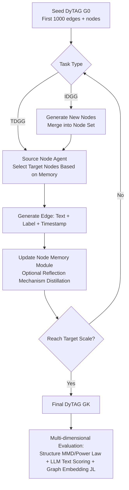

# GDGB: A Benchmark for Generative Dynamic Text-Attributed Graph Learning

**Conference**: ICLR 2026  
**OpenReview**: [https://openreview.net/forum?id=5UFUHUC5qP](https://openreview.net/forum?id=5UFUHUC5qP)  
**Code**: [https://github.com/Lucas-PJ/GDGB-ALGO](https://github.com/Lucas-PJ/GDGB-ALGO)  
**Area**: Graph Learning / Dynamic Text-Attributed Graph / Generative Benchmark  
**Keywords**: Dynamic Text-Attributed Graph, Graph Generation, LLM Multi-agent, Benchmark, Dynamic Graph  

## TL;DR
To address the gap in "Generative Dynamic Text-Attributed Graph (DyTAG) Learning," the authors construct the GDGB benchmark with 8 high-quality text datasets, define two new generative tasks (TDGG and IDGG) with multi-dimensional evaluation protocols, and propose GAG-General, an LLM multi-agent framework, as a reproducible unified baseline.

## Background & Motivation
**Background**: Dynamic Text-Attributed Graphs (DyTAG) couple structural, temporal, and textual attributes, serving as natural carriers for modeling evolving real-world systems such as social networks, recommendation systems, and citation networks. Existing works (e.g., DTGB) have demonstrated that feeding textual features into Dynamic Graph Neural Networks (DGNN) significantly improves performance in **discriminative** tasks like link prediction, node retrieval, and edge classification.

**Limitations of Prior Work**: However, applying DyTAG to **generative** tasks encounters a void due to two primary bottlenecks. First, **poor text quality in datasets**: Traditional dynamic graph datasets often lack node/edge features entirely, providing only topology and timestamps. Even DTGB, the first to introduce text, often uses identifiers like usernames or emails for (source) node text, resulting in extreme semantic poverty that cannot support generative models requiring rich semantic input. Second, **lack of standard task definitions and evaluation protocols**: Existing dynamic graph generation models rely mostly on structure and time, often generating the target graph in a single step. This contradicts the "incremental and expansionary" evolution of real-world graphs and lacks holistic evaluation metrics considering structure, time, and text simultaneously.

**Key Challenge**: Generative models require semantically rich textual input, yet existing DyTAG datasets provide neither high-quality text nor corresponding tasks and metrics—the trio of data, task, and framework is entirely missing.

**Goal**: Establish the first generative DyTAG benchmark, GDGB, across three levels: "dataset construction + task and metric definition + generative framework design," ensuring that DyTAG generation research is grounded, reproducible, and fairly comparable.

**Core Idea**: **High-quality text is a prerequisite for DyTAG generation**—first, construct 8 datasets where both nodes and edges have rich semantic text. **Generation should simulate real evolution**—design tasks as iterative expansions from a seed graph (TDGG transductive, IDGG inductive for new nodes). **Text is naturally suited for LLMs**—use a multi-agent LLM framework (GAG-General) as a unified reproducible baseline, where each node is an agent with memory that iteratively selects neighbors and generates edges.

## Method

### Overall Architecture
GDGB consists of three components: **Datasets** (8 high-quality text DyTAGs covering e-commerce, social, biography, citation, and movie collaboration domains, including 4 bipartite and 4 non-bipartite graphs), **Tasks and Metrics** (TDGG/IDGG generative tasks + structure/text/graph embedding metrics), and a **Framework** (GAG-General, an LLM multi-agent iterative generator). The generation process abstracts a DyTAG $G=(N, E, T)$ as: starting from a seed graph $G_0$ composed of the first 1000 edges, the source node agent selects target nodes and generates edges based on memory in each round (IDGG additionally generates new nodes first), iteratively expanding until the final graph $G_K$ is produced.

### Key Designs

**1. High-Quality Text DyTAG Datasets: Solving the input bottleneck via semantic enrichment.** The authors treat dataset quality as the first principle of DyTAG generation. They selected and re-processed 8 datasets (Sephora, Dianping, WikiRevision, WikiLife, IMDB, WeiboTech, WeiboDaily, Cora), with the core requirement that **all source/target nodes and interaction edges possess rich semantic textual attributes.** For example, in Sephora, user node text records physical traits and history, product node text describes brands and ingredients, and edge text contains detailed user reviews. The authors quantified text quality using length, perplexity (PPL), and LLM scoring; GDGB significantly outperformed DTGB in 5 out of 6 dimensions. To verify that text quality affects generation, the authors compared VRDAG (node features) and DG-Gen (edge features): adding text in GDGB significantly reduced Degree/Spectra MMD, whereas in DTGB, text often degraded performance, confirming that "poor text is worse than no text."

**2. TDGG and IDGG: Designing generation tasks as two difficulty gradients of real graph evolution.** Unlike previous "one-shot" target graph generation, the authors define generation as iterative expansion from a seed graph. **TDGG (Transductive)** maintains the transductive assumption—all nodes are known a priori, and the goal is "target node selection + edge generation," integrating traditional discriminative tasks like node retrieval into the generative paradigm. The generated $G_K$ must approximate the ground truth in structure, time, and text. **IDGG (Inductive)** is more challenging, introducing **new node generation** on top of TDGG. The node set expands dynamically, and new nodes/edges must have high-quality, semantically coherent text, truly modeling the process of "growing new nodes" in real graphs. An interesting finding is that IDGG generates hub nodes that are **topologically isomorphic but semantically divergent** from the ground truth—hubs in real graphs are existing hits, while hubs in generated graphs are "potential hits," making generation a forward-looking decision tool for marketing.

**3. Multi-dimensional Evaluation Protocol: A three-pronged approach for structure, text, and graph embeddings.** To evaluate generation quality holistically, the authors designed three types of complementary metrics. **Structural Metrics**: Use Maximum Mean Discrepancy (MMD) with RBF kernels to measure distribution distances in degree and spectral properties; perform power-law analysis using Kolmogorov-Smirnov distance $D_k$ and power-law exponent $\alpha$ to determine validity (requiring $D_k < 0.15$ and $\alpha \in [2,3]$). **Text Quality Metrics**: Leverage an LLM-as-Evaluator framework to score context fidelity, persona depth, dynamic adaptability, immersion quality, and richness on a 1–5 scale. This avoids semantic loss from embedding compression compared to BERTScore used in DTGB. **Graph Embedding Metrics**: Extend the JL-Metric to DyTAG, fusing node/edge text features to map the entire graph into a unified embedding space, characterizing global fidelity across topology, time, and text dimensions.

**4. GAG-General: Universal and reproducible iterative generation via memory-based LLM agents.** Since TDGG/IDGG are new tasks and existing methods (VRDAG/DG-Gen generate only features; GAG only handles bipartite social graphs) are not directly applicable, the authors proposed GAG-General with three enhancements: **Universality** (supports both bipartite and non-bipartite graphs), **Multi-domain compatibility** (a unified pipeline without domain-specific customization), and **Standardization** (built-in unified task definitions and evaluation). The framework assigns an LLM agent to each node, maintaining a **memory module** of historical interactions to capture structural and temporal dynamics. It includes an optional **memory reflection mechanism** to distill memory into summaries, analogous to message aggregation in GNNs.

## Key Experimental Results

### Main Results (TDGG Structural Metrics, GPT as LLM backbone)

| Dataset | Degree MMD↓ | Spectra MMD↓ | $D_k$ | $\alpha$ | Power-law Valid |
| :--- | :--- | :--- | :--- | :--- | :--- |
| Sephora | 0.023 | 0.011 | 0.143 | 2.993 | ✓ |
| Dianping | 0.055 | 0.328 | 0.041 | 2.234 | ✓ |
| WikiRevision | 0.108 | 0.156 | 0.056 | 2.041 | ✓ |
| WikiLife | 0.181 | 0.223 | 0.099 | 2.204 | ✓ |
| IMDB | 0.278 | 0.316 | 0.135 | 1.720 | ✗ |
| WeiboTech | 0.243 | 0.297 | 0.030 | 2.011 | ✓ |
| WeiboDaily | 0.247 | 0.493 | 0.048 | 1.845 | ✗ |
| Cora | 0.128 | 0.156 | 0.049 | 2.378 | ✓ |

Most Degree/Spectra MMD values are below 0.3, and 6 out of 8 datasets satisfy power-law validity, indicating that TDGG can generate graphs with high structural fidelity.

### Ablation Study (TDGG Text Quality Score, w/o M.=No Memory, w/ M.R.=Memory + Reflection)

| Dataset | DeepSeek w/o M. | DeepSeek w/ M.R. | GPT w/o M. | GPT w/ M.R. |
| :--- | :--- | :--- | :--- | :--- |
| Sephora | 4.09 | 4.37 | 4.69 | 4.77 |
| Dianping | 4.29 | 4.41 | 4.32 | 4.71 |
| IMDB | 3.65 | 3.99 | 3.91 | 4.44 |
| WeiboTech | 3.88 | 4.49 | 4.84 | 4.97 |

The memory module and reflection mechanism consistently improve text quality and graph embedding metrics across almost all LLM backbones by effectively integrating and aggregating historical interaction information.

### Key Findings
- **Both structural and textual features are vital for DyTAG generation**: On GDGB with high-quality text, adding text reduces structural MMD, whereas on DTGB with low-quality text, adding text harms generation, proving that text quality is a critical variable for generative success.
- **GAG-General outperforms traditional DGNNs in few-shot settings**: When trained with only 1000 edges, the performance of DGNNs (JODIE, TGN, CAWN, etc.) drops sharply, while GAG-General surpasses them in edge classification on most datasets, demonstrating the strong capability of LLM agents to utilize structural/temporal/textual information and generalize with few samples.
- **IDGG is more difficult than TDGG but preserves structure**: Due to new node generation, IDGG's MMD is generally above 0.2, yet 5 out of 8 graphs still satisfy power-law validity. Existing dynamic graph generation models (DG-Gen, VRDAG, TIGGER-I) show significantly worse structural fidelity and attribute richness.

## Highlights & Insights
- **Holistic benchmark strategy**: Instead of just releasing data, the paper provides a "dataset + task definition + evaluation protocol + unified baseline" quartet, establishing a standard for a nearly blank field.
- **Unifying discriminative tasks into the generative paradigm**: TDGG naturally frames node retrieval and edge classification as "target node selection + edge generation," bridging discriminative and generative evaluation perspectives.
- **LLM-as-Evaluator replacing BERTScore**: Using multi-dimensional LLM scoring avoids the semantic loss of embedding compression and is more suitable for text-rich scenarios.
- **Insights on hub node divergence**: The difference between IDGG's "potential hub" and the "existing hub" in ground truth converts graph generation into a predictive tool for domains like e-commerce.

## Limitations & Future Work
- **The generation pipeline needs refinement**, especially for IDGG's new node generation, which still lags in structural fidelity and attribute richness.
- **Heavy reliance on LLM inference costs**: GAG-General uses one agent per node with iterative generation; computational overhead and scalability at larger scales are real constraints.
- **Evaluation partially depends on LLMs**: LLM-as-Evaluator, while multi-dimensional, carries concerns regarding evaluator bias and reproducibility.
- Experiments focused on a seed scale of 1000 edges; generation quality under larger scales and longer intervals remains to be verified.

## Related Work & Insights
- **Discriminative Dynamic Graph Learning**: DyGLib, TGB, and TGB-Seq standardized discriminative evaluation. DTGB introduced text for discriminative tasks using BERT, but information bottlenecks and sparse text limited its extension to generation—GDGB fills this gap.
- **Generative Dynamic Graph Learning**: Early focus was on Discrete-Time Dynamic Graphs (DTDG); recent work shifted to Continuous-Time Dynamic Graphs (CTDG). VRDAG and DG-Gen generate features but lack text, while GAG is limited to bipartite social graphs. GDGB addresses these limitations with the universal GAG-General.
- **Insight**: In a new direction, establishing the "data/task/metric/baseline" infrastructure simultaneously is more foundational than single-point improvements. Furthermore, data quality is part of the method—poor text quality can degrade performance when used as a feature, emphasizing the need for authentic semantic input.

## Rating
- **Novelty**: ⭐⭐⭐⭐⭐ First generative DyTAG benchmark; the TDGG/IDGG tasks, metrics, and GAG-General framework are pioneering.
- **Experimental Thoroughness**: ⭐⭐⭐⭐ Covers 8 datasets, 4 LLM backbones, multiple metric types, and dual tasks. Deductions for small seed scale and reliance on LLM evaluation.
- **Writing Quality**: ⭐⭐⭐⭐ Logic is clear from motivation to experiments; charts are rich, though the appendix is heavy.
- **Value**: ⭐⭐⭐⭐⭐ Provides complete infrastructure for DyTAG generation, enabling reproducible and comparable research with practical potential in recommendation and social systems.

<!-- RELATED:START -->

## Related Papers

- [\[ICLR 2026\] Global-Recent Semantic Reasoning on Dynamic Text-Attributed Graphs with Large Language Models](global-recent_semantic_reasoning_on_dynamic_text-attributed_graphs_with_large_la.md)
- [\[ICLR 2026\] Robustness in Text-Attributed Graph Learning: Insights, Trade-offs, and New Defenses](robustness_in_text-attributed_graph_learning_insights_trade-offs_and_new_defense.md)
- [\[ICLR 2026\] DHG-Bench: A Comprehensive Benchmark for Deep Hypergraph Learning](dhg-bench_a_comprehensive_benchmark_for_deep_hypergraph_learning.md)
- [\[ICLR 2026\] LRIM: a Physics-Based Benchmark for Provably Evaluating Long-Range Capabilities in Graph Learning](lrim_a_physics-based_benchmark_for_provably_evaluating_long-range_capabilities_i.md)
- [\[AAAI 2026\] GCL-OT: Graph Contrastive Learning with Optimal Transport for Heterophilic Text-Attributed Graphs](../../AAAI2026/graph_learning/gcl-ot_graph_contrastive_learning_with_optimal_transport_for_heterophilic_text-a.md)

<!-- RELATED:END -->
