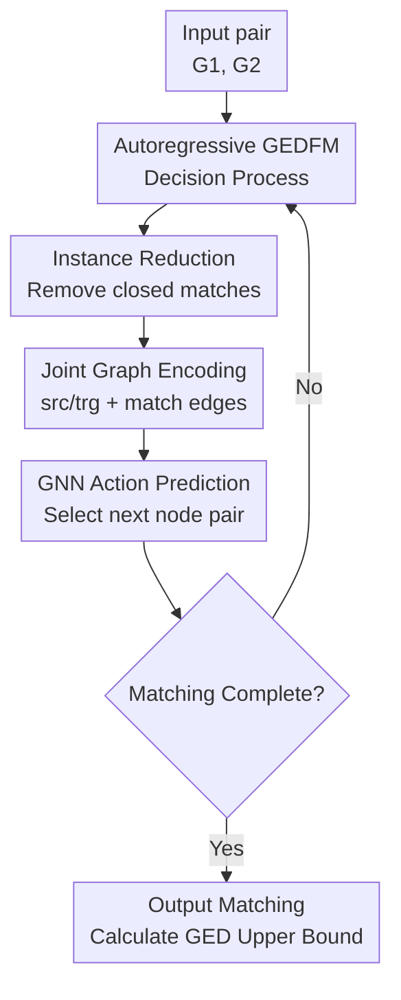

# Gelato: Graph Edit Distance via Autoregressive Neural Combinatorial Optimization

**Conference**: ICLR 2026  
**OpenReview**: [https://openreview.net/forum?id=6ZTcLNmguc](https://openreview.net/forum?id=6ZTcLNmguc)  
**Code**: https://github.com/BorgwardtLab/Gelato  
**Area**: Graph Learning / Graph Matching / Neural Combinatorial Optimization  
**Keywords**: Graph Edit Distance, Graph Matching, Neural Combinatorial Optimization, Autoregressive Decision, GNN  

## TL;DR
GELATO reformulates the approximate solution of Graph Edit Distance (GED) as an autoregressive decision-making process that incrementally constructs node matches. By using a GNN equipped with matching history to iteratively select the next source-target node pair, it achieves higher exact hit rates and faster inference speeds across multiple GED benchmarks.

## Background & Motivation
**Background**: Graph Edit Distance (GED) is a classic metric for measuring the similarity between two graphs. It sums the costs of node/edge insertion, deletion, and substitution required to transform one graph into another, seeking the edit path with the minimum total cost. Since GED can be equivalently formulated as graph matching or a quadratic assignment problem, it is naturally applicable to molecular graphs, program structures, social networks, and vision-based graph structures: finding high-quality node correspondences yields an interpretable edit path and a valid upper bound for GED.

**Limitations of Prior Work**: The core difficulty lies in the fact that exact GED computation is NP-hard. Exact solvers like A* or Integer Programming struggle with graphs larger than twenty nodes. Traditional heuristics are fast but often produce unstable matching quality. Early machine learning methods mostly directly regressed a GED value, which presents two issues: first, they only provide a distance without reconstructing the matching (poor interpretability); second, predicted values do not necessarily correspond to any real edit path, thus failing to guarantee a reachable upper bound.

**Key Challenge**: Recent feasible solution generation methods typically transform GED into linear assignment: the model assigns an independent cost to each candidate node pair, followed by Hungarian or linear assignment algorithms to select the global matching. The problem is that edge edit costs in GED are determined by pairs of node matches; whether a node pair is reasonable depends on which pairs were selected previously. A one-time cost matrix lacks conditional update capabilities, making it difficult to express structural dependencies like "given that $(u_1, v_1)$ is selected, $(u_5, v_5)$ is more consistent than $(u_5, v_6)$."

**Goal**: The authors aim to develop an approximate GED solver that both outputs feasible matchings and leverages historical decisions. It needs to learn graph structures and matching patterns on small graphs and generalize to larger ones, without being as slow as A* search-based learning methods or overly dependent on expensive, full exact supervision.

**Key Insight**: A key observation of this paper is that GED matching can be viewed as a "step-by-step solution construction" process, similar to TSP/CVRP in neural combinatorial optimization. The currently selected matching $\mu$ defines a subproblem GEDFM with fixed matches; the next action is to select a pair from the remaining source and target nodes. By observing the current local state and history at each step, the model can learn dependencies that one-time linear assignments miss.

**Core Idea**: GELATO replaces the static assignment matrix with an "autoregressive GNN policy": it encodes the selected matching into the graph at each step, predicts the next node pair, and updates/reduces the subproblem until a complete matching is obtained.

## Method
### Overall Architecture
The input to GELATO is a pair of graphs $G_1, G_2$, and the output is a set of matchings from source nodes to target nodes; unmatched nodes naturally correspond to deletions or insertions, from which a GED upper bound is calculated. Instead of predicting the entire matching matrix at once, it starts from an empty matching and selects a new node pair $(u, v)$ at each step based on the partial matching $\mu$, writing this choice back into the state to form a new GEDFM subproblem.

The pipeline comprises three contributions: transforming the partial matching into a more compact GED subproblem, encoding this subproblem into a joint graph processed by a GNN, and incrementally expanding the matching using link-prediction-style action projection. During inference, a top-$k$ start-point ensemble is used for the first step to mitigate the randomness associated with the lack of historical information.

Formally, given a fixed matching $\mu$, GEDFM seeks the minimum cost among all valid matchings containing $\mu$. The action set for the current state $s=(G_1,G_2,\mu)$ consists of all unused source/target node pairs: $A(G_1,G_2,\mu)=\{(u,v):u,v\text{ both not in }\mu\}$. After selecting an action, the state transitions to $(G_1,G_2,\mu\cup\{(u,v)\})$. This recursive perspective transforms GED from "solving for a massive combinatorial object" to "repeatedly answering who to select next."

### Key Designs
**1. Autoregressive GEDFM Decision: Framing Node Matching as Conditional Generation**

Traditional linear assignment methods estimate a static cost matrix $C$ for all candidates $(u, v)$ before a one-time assignment. Their weakness is not an inability to rank pairs, but rather that ranking occurs without knowing if other pairs will ultimately be selected. GELATO explicitly incorporates $\mu$ into the state, making the candidates' scores at step $t$ dependent on choices from steps $1$ to $t-1$. Consequently, once the model sees that a local structure is aligned, it can prioritize completing neighborhood matches that are consistent with it, avoiding the common mistake in static matrices where nodes with identical orbits or local labels are indistinguishable.

The theoretical backbone is the recursive formula for GEDFM:

$$
GEDFM(G_1,G_2,\mu)=\min\left(c(\mu),\min_{(u,v)\in A(G_1,G_2,\mu)}GEDFM(G_1,G_2,\mu\cup\{(u,v)\})\right).
$$

Rather than claiming the model computes exact dynamic programming values, it delegates the difficulty of "choosing the next action" to a learnable policy. For data distributions with repetitive substructures (like molecules or programs), the model learns matching patterns of local structures from training instances, approximating the optimal policy via greedy search or limited start-point search.

**2. Instance Reduction: Retaining Only Local States Affecting Future Matching**

The cost of autoregressive modeling is that the state changes with history. Feeding full original graphs and all historical matches into the model at every step would lead to a massive state space and redundant nodes. GELATO defines a `reduce` operation: if for a matched pair $(u, v)$, all neighbors of $u$ in the source and all neighbors of $v$ in the target are matched, the influence of this pair on future edge edit costs is fixed, and it can be removed from the subproblem.

This reduction is not mere pruning but a subproblem compression with equivalence guarantees. The paper proves that if $\mu^*$ is the optimal matching for the original GEDFM instance, restricting it to the nodes remaining after reduction remains an optimal solution for the reduced instance. Intuitively, "closed" matches only contribute a constant irrelevant to subsequent choices. This reduces both the search space and GNN input size, and allows different historical paths to converge on the same smaller subproblems, improving training sample sharing.

**3. Joint Graph Encoding and GINE Action Prediction: Transforming History into Message-Passing Edges**

To allow the GNN to read the GEDFM state, GELATO takes the disjoint union of $G_1$ and $G_2$, adding `src` and `trg` markers to nodes. Fixed matches $(u,v)\in\mu$ are added as cross-graph `match` edges for message passing. Thus, matching history is not just an external list but a topological change in the joint graph, allowing information to propagate along both original and matching edges.

Action prediction is essentially link prediction. GELATO uses GINE layers with edge features to update node representations, combined with BatchNorm and residual connections:

$$
h^{\ell+1}_u=h^\ell_u+ReLU\left(BatchNorm\left(MLP\left(h^\ell_u+\sum_{v\in N(u)}ReLU(h^\ell_v+e_{v,u})\right)\right)\right).
$$

After obtaining the final node representations, for each unmatched source/target pair, $h^L_u\Vert h^L_v$ is concatenated and passed through an MLP to generate a logit $o_{u,v}$. During inference, the highest-scoring pair is selected; during training, nodes belonging to the optimal matching are assigned high probabilities. This encoding is proven to be lossless: the original graphs and fixed matches can be recovered from the joint graph.

**4. Symmetric Supervision and Ensemble: Reducing Conflicts and Initial Sensitivity**

Isomorphism and automorphism are common in GED: two candidate pairs may be indistinguishable in the current state, but an exact solution might only include one in $\mu^*$. Treating the other as a negative sample would provide contradictory supervision. GELATO handles this via pair automorphism: candidates automorphic to a pair in the optimal matching are also treated as positive examples. Negatives only come from candidates not in these positive equivalence classes.

For inference, a pragmatic fix is applied: since the first step has no historical context, the model is sensitive to the starting point. GELATO selects the top-$k$ non-isomorphic starting points and expands autoregressive greedy branches for each, returning the matching with the lowest GED cost. Defaulting to $k=32$ is simpler than a full beam search but significantly improves over a greedy $k=1$ baseline.

### Loss & Training
Training data is derived from graph pairs with exact optimal matchings. The authors use exact solvers like MIP-F2 to obtain $\mu^*$, then sample a subset of source nodes $U$ to construct partial matchings $\mu=\{(u,v)\in\mu^*:u\in U\}$. Since $\mu\subseteq\mu^*$, the original $\mu^*$ remains an optimal completion for these GEDFM subproblems, allowing one graph pair to generate training states for various stages, acting as cost-effective data augmentation.

The supervision objective is cross-entropy link prediction. For a state $(G_1, G_2, \mu)$, positives are the remaining pairs in $\mu^*\setminus\mu$ and their automorphic equivalents; negatives are other valid actions. The model does not learn a fixed action sequence, as any remaining optimal pair is a valid next step; this aligns better with the combinatorial structure of GED than forcing an artificial order.

The default implementation uses 5 GINE layers with hidden dimension $d=128$, Adam optimizer, and a learning rate of $10^{-3}$. Inference defaults to $k=32$ start-point ensemble, with internal greedy autoregressive selection for each branch.

## Key Experimental Results

### Main Results
Evaluation was conducted on AIDS, LINUX, IMDB-16, ZINC-16, molhiv-16, and code2-22 datasets using nMAE and Exact Hit Rate (EHR). nMAE measures relative error compared to optimal GED, while EHR is the ratio of predicted GEDs that match the exact value perfectly.

| Dataset | Metric | GELATO | Strongest Baseline | Conclusion |
|---------|--------|--------|--------------------|------------|
| AIDS | nMAE / EHR | 0.1 / 99.3 | GRAIL 2.7 / 82.1 | Near-perfect hits, significantly outperforms LLM heuristics. |
| LINUX | nMAE / EHR | 0.1 / 99.9 | GRAIL 0.0 / 100.0 | Near saturation; GELATO matches SOTA performance. |
| IMDB-16 | nMAE / EHR | 0.1 / 99.9 | GRAIL 0.0 / 99.9 | Similar saturation with minimal performance gaps. |
| ZINC-16 | nMAE / EHR | 0.7 / 91.1 | GRAPHEDX 7.7 / 35.3 | Largest advantage found in edge-labeled molecular graphs. |
| molhiv-16 | nMAE / EHR | 0.5 / 95.3 | GRAIL 8.5 / 33.1 | Significantly reduces the GED gap. |
| code2-22 | nMAE / EHR | 0.6 / 95.7 | MATA* 5.1 / 61.1 | Maintains high accuracy for program syntax trees. |

Inference speed is also a key result. GELATO averages 2.9-5.3 ms per pair on GPU. In contrast, GEDGNN/GEDHOT often reach hundreds to thousands of milliseconds, and MATA* takes 6329.8 ms on code2-22. GELATO achieves higher accuracy and speed without relying on heavy search.

| Method | AIDS | ZINC-16 | molhiv-16 | code2-22 | Notes |
|--------|------|---------|-----------|----------|-------|
| GELATO | 3.2 ms | 4.2 ms | 4.1 ms | 5.3 ms | Default $k=32$, GPU inference |
| GEDGNN | 742.0 ms | 1383.2 ms | 1252.7 ms| 2813.9 ms| Relies on linear assignment and heavy search |
| GEDHOT | 1210.7 ms| 2064.7 ms| 1954.1 ms| 3951.6 ms| Slowest learning-based baseline |
| MATA* | 6.8 ms | 24.2 ms | 37.5 ms | 6329.8 ms| Exponential pressure with graph size |
| GRAIL | 8.4 ms | 44.1 ms | 18.9 ms | 99.6 ms | Heuristic quality varies by dataset |

### Ablation Study
Ablations addressed the necessity of autoregressive order, reduction, automorphic supervision, and the ensemble. Results in nMAE / EHR:

| Configuration | AIDS | ZINC-16 | molhiv-16 | code2-22 | Notes |
|---------------|------|---------|-----------|----------|-------|
| GELATO, $k=1$ | 6.4 / 74.2 | 8.6 / 41.4 | 5.4 / 52.8 | 20.6 / 65.3 | Single-start greedy still strong but weaker than $k=32$. |
| No seq. process | 61.0 / 11.6 | 70.4 / 2.0 | 48.0 / 2.5 | 38.8 / 23.0 | Static linear assignment degrades significantly. |
| No reduction | 8.0 / 68.7 | 9.4 / 38.2 | 5.5 / 51.5 | 14.5 / 60.9 | Reduction helps by minimizing state redundancy. |
| Naive symm. | 7.5 / 72.1 | 8.7 / 41.2 | 6.3 / 50.5 | 9.5 / 70.9 | Consistent supervision prevents training conflicts. |

Weak supervision experiments show GELATO is robust to label quality. On ZINC-16, 10k training pairs yield 1.5 nMAE / 83.1 EHR. If matches are generated by MIP-F2 with a 1s limit, results are 1.7 / 81.6; even with a 0.1s limit, it maintains 3.7 / 62.6.

### Key Findings
- Autoregressive modeling is the most critical contribution. Without it, the model regresses to static linear assignment, and ZINC-16 EHR drops from 91.1 to 2.0, proving pairwise dependencies in GED cannot be solved via static scoring.
- Start-point ensembles are crucial for the first step. While $k=1$ outperforms many baselines, $k=32$ provides huge gains. $k=128$ further pushes ZINC-16 EHR to ~97% at a cost of ~6.3 ms.
- Instance reduction is effective. While its contribution is smaller than autoregressive decision-making, it consistently improves performance and creates a smaller, more reusable state space.
- Generalization to larger graphs shows gradual performance decline rather than a crash, outperforming GEDHOT, GRAIL, and short-time MIP-F2 on larger test sets.

## Highlights & Insights
- The paper identifies why historical dependence matters: rather than just deeper GNNs, it requires a decision form where each step is conditioned on prior matches. This explains why static methods fail on symmetric structures.
- The combination of GEDFM and `reduce` is insightful. It brings the subproblem reuse concept from dynamic programming/search into GNN state representation.
- The training objective correctly avoids enforcing a matching sequence. Multiple pairs in an optimal matching have no natural order; allowing any remaining optimal pair as a positive avoids overfitting to incidental orderings.
- Automorphic supervision is often overlooked in graph tasks. Inherent indistinguishability in graphs is not noise; treating equivalent positives as negatives creates artificial training conflict.

## Limitations & Future Work
- Inference currently uses "multi-start greedy" rather than full search. The authors acknowledge that beam search or systematic tree search might further improve quality.
- The model primarily relies on supervised exact matchings, which are expensive to generate. Future work could include RL or search-learning loops to reduce this dependency.
- Generalization across datasets is constrained by node/edge label semantics. One-hot representations with different meanings across datasets hinder transferability.
- Scaling to even larger graphs remains an area for growth. As node counts increase, the combinatorial space expands rapidly, necessitating hierarchical matching or tighter integration with Branch-and-Bound.

## Related Work & Insights
- **vs. GED Regression (SimGNN, GraphEdX)**: These predict distance values without edit paths. GELATO generates matchings, providing reachable upper bounds and interpretability.
- **vs. Linear Assignment (GEDGNN, GEDHOT)**: These predict costs for all pairs once. GELATO updates states and scores per step, capturing inter-match dependencies.
- **vs. Search Guidance (GENNA*, MATA*)**: Search methods have limited scalability. GELATO acts as a constructive heuristic, trading optimality guarantees for millisecond inference.

## Rating
- Novelty: ⭐⭐⭐⭐⭐ Clear modeling of GED feasible matching as autoregressive NCO.
- Experimental Thoroughness: ⭐⭐⭐⭐⭐ Comprehensive coverage of diverse graphs and robustness tests.
- Writing Quality: ⭐⭐⭐⭐⭐ Excellent articulation of the gap in static assignment methods.
- Value: ⭐⭐⭐⭐⭐ A strong reference for constructive heuristics in combinatorial graph problems.

<!-- RELATED:START -->

## Related Papers

- [\[ICLR 2026\] $\ell_1$ Latent Distance Based Continuous-Time Graph Representation](ell_1_latent_distance_based_continuous-time_graph_representation.md)
- [\[AAAI 2026\] Sheaf Graph Neural Networks via PAC-Bayes Spectral Optimization](../../AAAI2026/graph_learning/sheaf_graph_neural_networks_via_pac-bayes_spectral_optimization.md)
- [\[ICLR 2026\] Learning from Historical Activations in Graph Neural Networks](learning_from_historical_activations_in_graph_neural_networks.md)
- [\[ICLR 2026\] Are We Measuring Oversmoothing in Graph Neural Networks Correctly?](are_we_measuring_oversmoothing_in_graph_neural_networks_correctly.md)
- [\[ICLR 2026\] WATS: Wavelet-Aware Temperature Scaling for Reliable Graph Neural Networks](wats_wavelet-aware_temperature_scaling_for_reliable_graph_neural_networks.md)

<!-- RELATED:END -->
