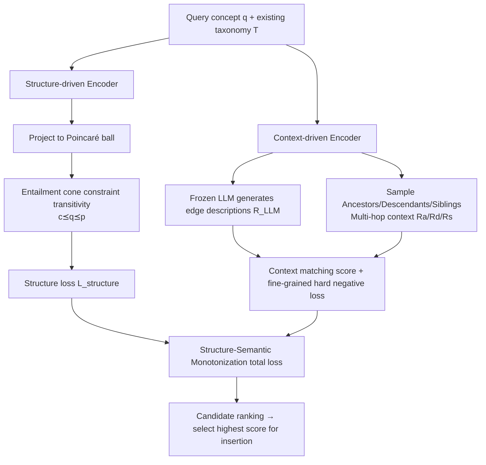

# Geometric Constraints for Small Language Models to Understand and Expand Scientific Taxonomies

**Conference**: ICLR 2026  
**OpenReview**: [https://openreview.net/forum?id=FI075FwAnb](https://openreview.net/forum?id=FI075FwAnb)  
**Code**: [https://github.com/LiriFang/SS-Mono](https://github.com/LiriFang/SS-Mono)  
**Area**: Graph Learning / Scientific Taxonomy Expansion / Hyperbolic Geometry / Small Model Knowledge Distillation  
**Keywords**: Taxonomy Expansion, Hyperbolic Embedding, Entailment Cones, Small Language Model, Self-Supervised  

## TL;DR
By encoding the hierarchy transitivity constraint of "parent → query → child" into hyperbolic space and augmenting semantic context via a frozen LLM, a 110M DistilBERT (SS-MONO) outperforms frozen large models like GPT-4o mini and Gemma-2-9B, as well as domain-specific baselines, on scientific taxonomy expansion tasks.

## Background & Motivation
- **Background**: Scientific taxonomies (e.g., MeSH, WordNet) are Directed Acyclic Graphs (DAGs) with textual attributes where nodes represent concepts and edges represent hypernym-hyponym relationships. As new concepts emerge, they must be "inserted" into the correct positions within existing systems, a task known as taxonomy expansion. Recent findings suggest that LLM token embeddings exhibit strong hyperbolicity, implying their embedding spaces are naturally suited for tree-like hierarchies, leading researchers to explore LLMs for taxonomy tasks.
- **Limitations of Prior Work**: The authors empirically discovered that direct prompting of LLMs for expansion results in four failure modes: **long context limitations** (the entire text-attribute graph cannot fit), **hallucination** (creating non-existent edges), **No Answer** (failing to generate usable outputs), and **Partial Answer** (only partially correct). On SemEval-Food, GPT-4o mini achieved an R@1 of only 0.016, while Gemma-2-9B scored zero across all metrics. Furthermore, fine-tuning LLMs for domain-specific systems is prohibitively expensive.
- **Key Challenge**: LLMs have potential but are expensive and prone to hallucinations, making them unsuitable for direct use; meanwhile, taxonomy tasks rely heavily on domain knowledge. The challenge is whether one can "borrow" LLM knowledge while shifting the inference responsibility to a lightweight, affordable SLM.
- **Goal**: Propose an LLM → SLM knowledge transfer pipeline that allows small models to accurately expand taxonomies at any position (root/leaf/intermediate) using a fully self-supervised training process without human labeling.
- **Core Idea**: **Structure-Semantic Monotonization**—integrating the "hard constraint" of hierarchy transitivity $c \preceq q \preceq p$ into the representation space via hyperbolic geometry and entailment cones (structure side), while augmenting semantics using a frozen LLM for edge descriptions and multi-hop context sampling (semantic side). Both scoring streams jointly determine the optimal insertion position for a query concept.

## Method

### Overall Architecture
SS-MONO models the task of finding the best insertion edge $(p,c)$ for query $q$ as a candidate ranking problem, coordinated by two complementary encoders: a **Structure-driven encoder** ensuring the query falls within a monotonic hierarchy, and a **Context-driven encoder** ensuring semantic matching between the query and the candidate neighborhood. Scores from both are summed for ranking, followed by LLM calibration. Training is conducted in a self-supervised manner by "removing a concept from an existing taxonomy and tasking the model to restore it."

### Key Designs

**1. Hyperbolic Encoding + Entailment Cones: Transforming hierarchy transitivity into optimizable geometric constraints.** The fundamental constraint of a taxonomy is transitivity—if $(p,c)$ is a valid insertion edge for $q$, then $c \le q \le p$ must hold. The authors map context embeddings $H$ from a language model through a linear transformation and exponential mapping into the Poincaré ball $\mathbb{D}^d=\{x\in\mathbb{R}^d:\|x\|<1\}$. Hyperbolic space offers significantly higher "capacity" for tree structures than Euclidean space, leaving more room for lower-level nodes. They introduce "entailment cones" $S^{\phi(u)}_u$, where each node $u$ opens a cone with a half-aperture $\phi(u)$, requiring children $v\le u$ to fall within the parent's cone, denoted by the angle $\Xi(u,v)\le\phi(u)$. The violation is measured by an energy score $E(u,v):=\max(0,\Xi(u,v)-\phi(u))$ with a max-margin loss: positive samples (true parent-child) require $E=0$, while negative samples require $E>\gamma$. The structure loss is the sum of cone losses for $(p,q)$ and $(q,c)$: $L_{structure}=L_{cone}(H'_p,H'_q)+L_{cone}(H'_q,H'_c)$, embedding the "monotonic hierarchy" directly into the geometry.

**2. Context-driven Encoder: Frozen LLM semantic augmentation + Multi-hop neighborhood sampling.** Taxonomies often lack edge descriptions, making internal semantics sparse. The authors use a **frozen** LLM (Gemma/Llama) with templates to generate textual descriptions explaining "why edge $(p,c)$ exists," which is then encoded by a small PLM and passed through self-attention to obtain a relation vector $R_{LLM}=\mathrm{SAM}[e,H_{LLM}]$. The LLM is never fine-tuned, serving only as a one-time knowledge source. Simultaneously, three types of neighborhoods are sampled along the candidate position: ancestors $R_a=\mathrm{SAM}[e,H_{p''},H_{p'},H_p,H_q]$, descendants $R_d=\mathrm{SAM}[e,H_q,H_c,H_{c'},H_{c''}]$, and siblings $R_s=\mathrm{SAM}[e,H_q,H_b,H_{w}]$. Since siblings can be numerous and semantically divergent, only the most similar ($b$) and least similar ($w$) are selected via cosine similarity to anchor the semantic boundaries. These four vectors are concatenated and passed through an MLP to obtain a matching score $F=W_2(\mathrm{ReLU}(W_1 R_{concat}+b_1)+b_2)$, optimized via cross-entropy loss $L_{context}$.

**3. Fine-grained Hard Negative Splits: Making every neighborhood discriminative.** Standard negative samples (where parent, child, and siblings are all incorrect) are too easy to distinguish. The authors construct harder negatives—such as $(p,\hat{c})$ where the parent is correct but the child is wrong—and decompose matching scores into independent sub-items for each neighborhood. For example, a descendant-only score $F_{desc}(R_d)=W_4(\mathrm{ReLU}(W_3 R_d+b_3)+b_4)$ is computed with its corresponding loss $L_{context\_desc}$, with similar treatments for ancestors and siblings. This forces the model to penalize local errors, significantly improving discrimination for non-leaf (intermediate) nodes.

**4. Self-Supervised Optimization and Total Loss: Training without labels.** Training samples are automatically generated from existing taxonomies: a triplet $(p,q,c)$ is selected, $q$ is removed to act as the query, and positive samples $(p,c,b,w)$ are derived while negative samples are created by randomly replacing components. The total loss combines structural and fine-grained context losses:
$$L_{total}=\alpha L_{structure}+\beta L_{context}+\mu L_{context\_desc}+\lambda L_{context\_anc}+\xi L_{context\_sib}$$
No human labels are required. During expansion, an LLM can be used for a final calibration step on the top-ranked insertions.

## Key Experimental Results

### Main Results (Across three taxonomy expansion benchmarks, excerpting Total/Non-leaf)
Dataset statistics: SemEval-Food (1,486 nodes/depth 8), MeSH (9,710 nodes/depth 10), WordNet-Verb (13,936 nodes/depth 12). Baselines include 7 domain-specific models (TaxoExpan/TMN/QEN/TaxBox, etc.) and 4 LLMs (>1B). The SS-MONO backbone is a mere **DistilBERT-base-110M**.

| Dataset | Method | Total MRR ↑ | Total R@1 ↑ | Non-leaf MRR ↑ |
|---|---|---|---|---|
| SemEval-Food | GPT-4o mini | – | 0.016 | – |
| SemEval-Food | TaxBox | 0.359 | 0.132 | 0.133 |
| SemEval-Food | **SS-MONO** | **0.400** | **0.186** | – |
| SemEval-Food | SS-MONO (w/o AD) | 0.430 | 0.161 | 0.225 |
| WordNet-Verb | QEN | 0.340 | 0.081 | 0.166 |
| WordNet-Verb | **SS-MONO** | 0.334 | 0.106 | 0.122 |
| MeSH | QEN | 0.423 | 0.071 | 0.322 |

> LLM baselines performed poorly across all datasets with R@1 typically between 0.000~0.016 (Gemma-2-9B scored zero in many cases), indicating frozen LLMs are nearly unusable for direct expansion. In contrast, the 110M SS-MONO achieved 0.186 R@1 on SemEval-Food, approximately 1.4x the performance of the strongest domain baseline, TaxBox.

### Ablation Study (AD = LLM Augmented Descriptions)

| Configuration | SemEval-Food Total MRR | SemEval-Food Non-leaf R@10 |
|---|---|---|
| SS-MONO (w/o AD) | 0.430 | 0.098 |
| SS-MONO (Full Model) | 0.400 | 0.059 |

- LLM Augmented Descriptions (AD) help with leaf node expansion (e.g., SemEval-Food leaf R@10 improved from 0.642 → 0.645, MR improved from 228 → 144), but **do not always benefit intermediate/non-leaf node expansion**. Certain non-leaf metrics decreased after adding AD, a phenomenon analyzed by the authors in Appendix O.

### Key Findings
- **SLM > Frozen LLM**: A fine-tuned 110M DistilBERT consistently outperforms frozen LLMs like GPT-4o mini, Gemma-2-9B, and DeepSeek-R1-8B in root, leaf, and intermediate expansions, validating that SLMs can be both economical and powerful with the right approach.
- **Geometric Constraints are Crucial**: The combination of hyperbolic space and entailment cones allows the model to explicitly follow transitivity, preventing the hallucinations and edge-creation errors common in LLM prompting.
- **AD is Not a Silver Bullet**: Semantic augmentation via LLMs is beneficial for leaf nodes but may introduce noise for intermediate nodes, suggesting that semantic additions should be applied selectively based on node type.

## Highlights & Insights
- **Geometrizing "Hard Knowledge Constraints"**: The core of taxonomy expansion is transitivity. Instead of letting the model learn it "softly," the authors use hyperbolic entailment cones to turn it into an optimizable angular constraint, fundamentally suppressing hallucinated edges.
- **LLM as a "One-time Knowledge Faucet"**: The frozen LLM is only used to generate edge descriptions, while inference and ranking are handled by the small model. This utilizes LLM knowledge while keeping costs fixed, representing a pragmatic LLM → SLM distillation paradigm.
- **Clean Self-Supervised Loop**: The "remove-and-restore" design allows the method to train with zero labels, making it highly suitable for scientific taxonomies where manual annotation is scarce.
- **Versatile Insertion Support**: The model explicitly addresses root and intermediate node insertions (breaking old edges and adding two new ones), making it more general than most baselines that focus solely on leaf expansion.

## Limitations & Future Work
- **Negative Impact of AD on Non-leaf Nodes**: LLM descriptions are hit-or-miss for intermediate nodes, and there is currently no adaptive mechanism to filter this noise.
- **Dependence on LLM Explanation Quality**: If the LLM has weak knowledge in niche domains, the semantic gains will diminish (though Appendix M validates reliability, it remains a potential vulnerability).
- **Scalability of Absolute Ranking on Large Systems**: On larger, deeper systems like MeSH or WordNet-Verb, SS-MONO's Total MRR is competitive but does not always dominate the strongest baselines like QEN, suggesting room for improvement in geometric scalability.
- **Hyperparameter Sensitivity**: The model involves several hyperparameters (cone aperture, margin $\gamma$, and five loss weights), leading to non-trivial tuning costs.

## Related Work & Insights
- **Taxonomy expansion**: Directly compares against domain baselines like TaxoExpan, TMN, ARBORIST, QEN, and TaxBox. SS-MONO differentiates itself through hyperbolic geometric constraints and LLM semantic augmentation.
- **Hyperbolic Representation Learning**: Poincaré ball embeddings and entrapment cones (Ganea et al. 2018) form the geometric foundation of the structural encoder, transitioned here to a hybrid "LLM context + taxonomy" scenario.
- **Hyperbolicity of LLMs**: Recent observations that LLM token embeddings possess hyperbolic structures served as the starting point for this paper, inspiring the use of geometric priors to interface with LLM knowledge.
- **Insight**: For tasks with strong structural constraints (transitivity, partial order, hierarchy), rather than relying on LLMs to follow rules via prompting, encoding those rules into geometric or topological constraints for SLM optimization is far more effective—it is cheaper, robust against hallucinations, and applicable to other tasks like knowledge graph completion or ontology alignment.

## Rating
- **Novelty**: ⭐⭐⭐⭐ The combination of hyperbolic entailment cones, frozen LLM semantic augmentation, and self-supervision for universal taxonomy expansion is well-conceived and directly addresses LLM hallucinations.
- **Experimental Thoroughness**: ⭐⭐⭐⭐ Extensive evaluation across three taxonomies and 15 metrics against 7 domain models and 4 LLM baselines, including leaf/non-leaf breakdowns; however, it lacks total dominance on some larger datasets.
- **Writing Quality**: ⭐⭐⭐⭐ The logic flows smoothly from motivation (LLM failures) to methodology (structural/semantic dual paths), with well-integrated formulas and diagrams.
- **Value**: ⭐⭐⭐⭐ Demonstrates that a 110M SLM can outperform massive frozen models on structured knowledge tasks, providing a strong economic case that expensive LLMs are not always necessary.

<!-- RELATED:START -->

## Related Papers

- [\[ACL 2025\] The Role of Exploration Modules in Small Language Models for Knowledge Graph Question Answering](../../ACL2025/graph_learning/the_role_of_exploration_modules_in_small_language_models_for_knowledge_graph_que.md)
- [\[ICLR 2026\] Global-Recent Semantic Reasoning on Dynamic Text-Attributed Graphs with Large Language Models](global-recent_semantic_reasoning_on_dynamic_text-attributed_graphs_with_large_la.md)
- [\[ICLR 2026\] HGNet: Scalable Foundation Model for Automated Knowledge Graph Generation from Scientific Literature](hgnet_scalable_foundation_model_for_automated_knowledge_graph_generation_from_sc.md)
- [\[ICLR 2026\] Geometric Graph Neural Diffusion for Stable Molecular Dynamics Simulations](geometric_graph_neural_diffusion_for_stable_molecular_dynamics_simulations.md)
- [\[ICLR 2026\] Knowledge Reasoning Language Model: Unifying Knowledge and Language for Inductive Knowledge Graph Reasoning](knowledge_reasoning_language_model_unifying_knowledge_and_language_for_inductive.md)

<!-- RELATED:END -->
