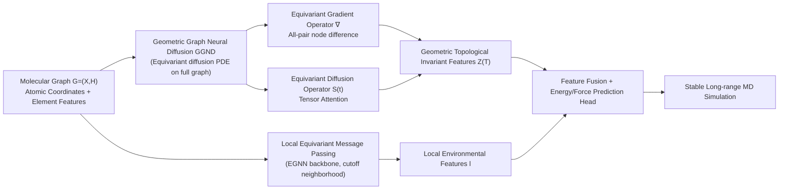

# Geometric Graph Neural Diffusion for Stable Molecular Dynamics Simulations

**Conference**: ICLR 2026  
**OpenReview**: [https://openreview.net/forum?id=T8VcTykTf1](https://openreview.net/forum?id=T8VcTykTf1)  
**Code**: TBD  
**Area**: Geometric Graph Neural Networks / Molecular Dynamics Force Fields / Equivariant Diffusion  
**Keywords**: Geo-GNN, Molecular Dynamics, Equivariance, Graph Diffusion, Conformational Extrapolation, Simulation Stability  

## TL;DR
This paper introduces graph heat diffusion equations into geometric graph neural networks, utilizing "equivariant gradient operators + equivariant diffusion operators" to perform all-to-all node information flow on fully connected molecular graphs. Acting as a plug-and-play module, it captures geometric topological invariant features insensitive to conformational changes, thereby enabling machine learning force fields to run stable long-range MD simulations even on unseen conformations.

## Background & Motivation

**Background**: Geometric Graph Neural Networks (Geo-GNN, e.g., NequIP, MACE, VisNet) have become mainstays in molecular dynamics (MD) simulations. They approximate potential energy surfaces via message passing on graphs to predict energy and forces at near-DFT accuracy and significantly lower cost than quantum mechanics methods, driving long-term trajectory evolution.

**Limitations of Prior Work**: Most Geo-GNN evaluations focus solely on the "in-distribution accuracy of force prediction," ignoring **stability** in real MD simulations. The issue is that training sets cover limited molecular conformations, while long-range trajectories naturally wander into conformations outside the training distribution. Even small force prediction errors on these unseen conformations accumulate over integration steps, eventually leading to non-physical chemical bonds (bond collapse, atom scattering) and overall simulation failure.

**Key Challenge**: The authors quantify this **geometric topological shift** using the 3BPA dataset (where three temperatures 300/600/1200 K form distinct conformational domains). Experiments reveal a trade-off: the Prev. SOTA VisNet is extremely strong in-domain (300 K) but collapses in accuracy as temperature rises and conformations shift (stability at 1200 K is only 0.004 ps). Conversely, SEGNO, which enhances generalization via physical bias, achieves better extrapolation but sacrifices in-domain accuracy. Neither addresses the root cause of "geometric topological shift."

**Goal**: Design a new framework that maintains in-domain accuracy while providing robust extrapolation under conformational drift, ensuring long-range stability in real MD.

**Core Idea**: The authors abstract conformational domain changes as "geometric topological shifts" and start from the **graph heat equation** in spectral graph theory. Since local message passing only propagates within a cutoff radius and is sensitive to topological changes, it is replaced by a continuous diffusion process on a **fully connected graph**, allowing instantaneous information exchange between any pair of atoms. **Novelty**: Utilizing SE(3)-equivariant gradient and diffusion operators to drive node representation evolution, making learned global features invariant to conformation-induced topological changes while maintaining equivariance. This is implemented as a plug-and-play module grafted onto existing local equivariant message-passing backbones.

## Method

### Overall Architecture

GGND consists of two complementary branches: (i) Traditional **local equivariant message passing** (EGNN backbone, e.g., VisNet/MACE) responsible for capturing local environmental features within a cutoff neighborhood; (ii) The proposed **geometric graph neural diffusion module**, which uses a diffusion PDE with global attention on a fully connected graph to capture global topological features invariant to geometric topological shifts. The outputs of both branches are fused at the energy prediction head, achieving both local accuracy and extrapolation stability across conformations. GGND is modular and can be grafted onto most EGNN frameworks.

### Key Designs

**1. Continuous Diffusion on Geometric Graphs: Replacing discrete GNN layers with graph heat equations.** GGND treats node embeddings $Z(t)=\{z_i(t)\}$ as fields evolving over continuous time according to the graph diffusion equation $\frac{\partial Z(t)}{\partial t}=\mathrm{div}\,[S(Z(t),X,t)\odot\nabla Z(t)]$, with initial values $Z(0)=\phi_E(X,H)$ provided by an RBF embedding layer. Node features are spherical tensors $z_{i,kLM}$ labeled by O(3) irreducible representations ($L=0$ for scalar invariants, $L=1$ for vectors, higher $L$ for tensors), over which diffusion occurs. Intuitively, diffusion spreads information across the graph like heat, smoothing out local topological differences caused by varying conformations—the root of "geometric topological invariance."

**2. Equivariant Gradient Operator: Generalizing scalar differences to high-order tensors across all node pairs.** The gradient operator maps node fields to edge fields, defined as $(\nabla z)_{ij,kl_3m_3}=\sum_{\tilde k}W_{k\tilde k l_2}(z_{j,\tilde k l_2 m_2}-z_{i,\tilde k l_2 m_2})$. This is essentially a tensor difference $z_j-z_i$ between node pairs, maintaining SE(3)-equivariance with directional information via spherical harmonics and learning channel mixing via weights. Crucially, the index $j$ **traverses all nodes in the graph** rather than just the cutoff neighborhood, inducing all-to-all information flow. Since this flow covers all atom pairs and does not rely on configuration-dependent local adjacency, the resulting representations remain invariant to conformational changes induced by the environment $E$ (temperature, pressure).

**3. Equivariant Diffusion Operator: Tensor-valued attention controlling the rate and breadth of information propagation.** The diffusivity $S(t)$ is constructed as a tensor-valued attention matrix $S(t)[i,j]_{kl_3m_3}=\sum C^{l_3m_3}_{l_1m_1,l_2m_2}R_{kl_1l_2l_3}(\|x_{ji}\|)Y^{l_1}_{m_1}(\hat x_{ji})\,\phi(z_i,z_j)_{l_2m_2}$, using Clebsch-Gordan coefficients for coupled equivariance, spherical harmonics $Y^l_m$ for directional equivariance, and Bessel+MLP radial bases $R$ for distance invariance. It acts as an "equivariant filter" determining the speed of information flow between any two nodes. Since the attention matrix $S$ is right-stochastic, the diffusion equation can be rewritten in linear form $\frac{\partial Z(t)}{\partial t}=(S(Z(t),X,t)-I)Z(t)$; as $S$ depends on $Z$, the overall process remains nonlinear diffusion. The final energy prediction uses the invariant component $z_{i,k00}(T)$ of $Z(T)$, fused with local features: $f_{i,\tilde k}=W[l_{i,k};z_{i,k00}(T)]$, ensuring invariant site energy $E_i$.

**4. Regret Theoretical Guarantees under Geometric Topological Shift.** The authors decompose the extrapolation gap into an in-distribution term $D_{in}$, an OOD model error $D_M$, and an OOD label error $D_L$, where $D_M$ measures representation sensitivity to topological shifts. Theorem 3.1 proves: if node functions $f,h$ are injective, GGND bounds the representation change $\|Z(T;A')-Z(T;A)\|_2$ by an **arbitrary polynomial order** $O(\psi(\|\Delta\tilde A\|_2))$ relative to the normalized adjacency difference. In contrast, pure local message-passing models have an **exponential** upper bound on feature variance. Corollary 3.2 establishes that GGND keeps model-related extrapolation bounds at polynomial orders, explaining why force predictions remain robust despite cutoff or conformational changes.

## Key Experimental Results

### Main Results

3BPA dataset (trained at 300 K, tested at 300/600/1200 K and dihedral slices). GGND grafted onto four backbones, results in parentheses for +GGND; E = Energy MAE (eV), F = Force MAE (eV/Å), S = Stability (ps, higher is better):

| Conformation | Metric | MACE → +GGND | NequIP → +GGND | SEGNO → +GGND | VisNet → +GGND |
|--------------|--------|--------------|----------------|----------------|-----------------|
| 300K         | E↓     | 0.113 → 0.010 | 0.165 → 0.094  | 0.593 → 0.293  | 0.002 → 0.002   |
| 300K         | S↑     | 100 → 100    | 100 → 100      | 99.81 → 100    | 100 → 100       |
| 600K         | E↓     | 0.161 → 0.023 | 0.335 → 0.122  | 0.908 → 0.295  | 1.405 → **0.022**|
| 600K         | S↑     | 100 → 100    | 98.27 → 100    | 59.89 → **100**| 25.36 → **100** |
| 1200K        | E↓     | 0.271 → 0.109 | 0.770 → 0.477  | 2.836 → 0.503  | 3.464 → 0.583   |
| 1200K        | S↑     | 1.97 → **29.22**| 0.018 → **17.05**| 0.009 → **16.20**| 0.004 → **11.21**|
| Dihedral     | S↑     | 100 → 100    | 89.12 → 100    | 72.28 → 100    | 47.79 → **100** |

SAMD23 Semiconductor dataset (SiN/HfO, direct comparison of GGND with SOTA, E/A = energy per atom eV):

| Molecule | Split | Metric | Prev. SOTA | GGND |
|----------|-------|--------|-------------|------|
| SiN      | Test  | F↓ / S↑| 0.451 / 98.28 (EquiformerV2) | **0.443 / 100** |
| SiN      | OOD   | F↓ / S↑| 0.832 / 86.51 | **0.754 / 99.89** |
| HfO      | Test  | F↓ / S↑| 0.298 / 97.18 | **0.179 / 100** |
| HfO      | OOD   | F↓ / S↑| 0.430 / 86.37 | **0.279 / 97.93** |

### Ablation Study

3BPA ablation verifying the necessity of "All-to-all Diffusion" and "Equivariant Diffusion Operators":

| Variant | 600K E↓ | 600K S↑ | 1200K E↓ | 1200K S↑ |
|---------|---------|---------|----------|----------|
| Baseline (VisNet) | 1.405 | 25.36 | 3.464 | 0.004 |
| GGND† (Local Diffusion only) | 0.982 | 39.08 | 3.049 | 0.291 |
| GGND‡ (Local MP + Global MP) | 0.643 | 69.29 | 1.908 | 2.892 |
| **GGND (Full)** | **0.022** | **100** | **0.583** | **11.21** |

### Key Findings

- **Better Gains with More Drift**: At in-domain (300 K), GGND provides marginal improvements, but as temperature and conformational drift increase, the gains amplify. At 1200 K, stability improvements reach magnitudes of 15× (MACE), 947× (NequIP), 1800× (SEGNO), and 2802× (VisNet), pulling near-zero stability back to double-digit ps.
- **VisNet 600 K Drama**: Energy MAE dropped from 1.405 to 0.022 eV, and stability recovered from 25.36 ps to a perfect 100 ps.
- **Ablation Confirms Causal Chain**: Local-only diffusion (†) or simply adding a fully-connected message-passing layer (‡) only partially mitigates the issue. Only the combination of "Full Graph + Equivariant Diffusion" achieves perfect stability at 600 K, proving they are the true sources of stability.
- **No Extra DFT Data Needed**: All gains were achieved without additional high-quality labels, distinguishing this from approaches like MatterSim that rely on expensive active learning data collection.

## Highlights & Insights
- **Stability as a First-class Citizen**: Moving beyond "Force MAE," the paper targets the root cause of non-physical bonds caused by error accumulation in real MD, using quantifiable stability metrics (100 ps NVE simulations, Velocity Verlet).
- **Elegant Grafting of Spectral Graph Diffusion & Equivariance**: Generalizing the graph heat equation from scalar fields to O(3) spherical tensor fields while maintaining SE(3)-equivariance via Clebsch-Gordan/spherical harmonics is theoretically sound and complementary to existing EGNNs.
- **Alignment between Theory and Phenomena**: The regret bound proves GGND compresses extrapolation error from "exponential" to "arbitrary polynomial order," explaining why gains increase with drift.
- **Plug-and-play**: Consistently provides gains across four different backbones, making it highly practical for engineering.

## Limitations & Future Work
- **Complexity of Fully Connected Graphs**: All-to-all diffusion scales as $O(N^2)$. While manageable for SAMD23 (up to 510 atoms), scalability and memory costs for larger systems (proteins, long-chain polymers) require further validation.
- **Evaluation Scope**: 3BPA and SAMD23 focus on small molecules and semiconductors; validation on complex systems like solutions or large biomolecules is missing.
- **Diffusion Stopping Time $T$ and Continuous PDE Solving**: There is limited discussion on the trade-off between accuracy and cost regarding when to stop the evolution and which numerical integrator to use.
- **Theoretical Assumptions**: The regret bounds depend on assumptions like injective functions and Lipschitz losses, the alignment of which with real force fields remains an open question.

## Related Work & Insights
- **ML Force Fields / Geo-GNN**: Backbones like NequIP, MACE, and VisNet are targets for grafting; GGND complements rather than replaces them.
- **Extrapolation and Stability**: Follows the MD stability evaluation proposed by Fu et al. (2023). While SEGNO uses second-order laws of motion and MatterSim uses active learning, this paper uses "global diffusion to smooth topological drift."
- **Graph Diffusion / Graph Heat Equations**: Introducing diffusion PDEs (like GRAND) into equivariant geometric graphs is an interesting intersection of "Continuous Depth + Physical Science." Insight: Many geometric tasks sensitive to distribution drift might benefit from "all-to-all equivariant diffusion" for topological invariance.

## Rating
- Novelty: ⭐⭐⭐⭐ Generalizing graph heat diffusion to SE(3)-equivariant tensor fields specifically for "geometric topological drift" in MD is a fresh and theoretically complete perspective.
- Experimental Thoroughness: ⭐⭐⭐⭐ Covers various temperatures, dihedral angles, and two dataset types across four backbones with real NVE simulations. Clear ablations, though lacked large-scale biomolecular validation.
- Writing Quality: ⭐⭐⭐⭐ The link between motivation, phenomena, theory, and experiments is tight. Causal mechanisms and stability definitions are clear.
- Value: ⭐⭐⭐⭐ Plug-and-play, significantly improves long-range MD stability without extra DFT data, holding direct significance for force field deployment.

<!-- RELATED:START -->

## Related Papers

- [\[ICLR 2026\] Improving Long-Range Interactions in Graph Neural Simulators via Hamiltonian Dynamics](improving_long-range_interactions_in_graph_neural_simulators_via_hamiltonian_dyn.md)
- [\[NeurIPS 2025\] Graph Neural Networks for Interferometer Simulations](../../NeurIPS2025/graph_learning/graph_neural_networks_for_interferometer_simulations.md)
- [\[ICML 2026\] Deep Neural Sheaf Diffusion](../../ICML2026/graph_learning/deep_neural_sheaf_diffusion.md)
- [\[ICLR 2026\] Entropy-Guided Dynamic Tokens for Graph-LLM Alignment in Molecular Understanding](entropy-guided_dynamic_tokens_for_graph-llm_alignment_in_molecular_understanding.md)
- [\[ICLR 2026\] FSD-CAP: Fractional Subgraph Diffusion with Class-Aware Propagation for Graph Feature Imputation](fsd-cap_fractional_subgraph_diffusion_with_class-aware_propagation_for_graph_fea.md)

<!-- RELATED:END -->
