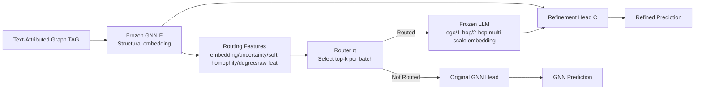

# Glance for Context: Learning When to Leverage LLMs for Node-Aware GNN-LLM Fusion

**Conference**: ICLR 2026  
**OpenReview**: [https://openreview.net/forum?id=oODFyykHF5](https://openreview.net/forum?id=oODFyykHF5)  
**Code**: TBD  
**Area**: Graph Learning / Text-Attributed Graphs / GNN-LLM Fusion  
**Keywords**: text-attributed graph, GNN-LLM fusion, LLM routing, local homophily, heterophily, contextual bandit  

## TL;DR
For text-attributed graphs, this paper moves away from applying LLMs uniformly across all nodes. Instead, it employs a lightweight router to "glance" at the LLM only for "heterophilous/low-degree" nodes where GNNs typically fail. This non-differentiable routing decision is trained using counterfactual advantage signals, significantly reducing LLM calls while boosting accuracy on heterophilous nodes by up to +13%.

## Background & Motivation
- **Background**: Text-Attributed Graphs (TAGs) naturally contain both text and structure. Prevailing approaches fuse LLMs with GNNs—either as LLM-as-Enhancer (using text embeddings to enhance node features) or LLM-as-Predictor (serializing graphs into text for direct LLM classification).
- **Limitations of Prior Work**: Almost all fusion strategies **apply the same fusion uniformly to all nodes in the graph**. Consequently, overall metrics improve only marginally, expensive LLM calls are wasted on nodes GNNs already handle well, and the precision-cost tradeoff is poor.
- **Key Challenge**: GNNs perform excellently in **high homophily (edges connecting same-label nodes) + high degree** regions, which often do not hold in real TAGs. LLMs generalize better on low-sample, heterophilous nodes, but serializing graphs into text destroys structural relations, potentially harming performance on nodes with simple structures. Aggregate metrics completely mask this "win some, lose some" phenomenon.
- **Goal**: To answer **"how and for which nodes should LLMs be invoked to augment GNNs,"** ensuring LLMs intervene only where GNNs truly fail.
- **Core Idea**: **(1) Diagnostic Signal**—Systematic evaluation of existing routing heuristics (degree/clustering density/uncertainty) reveals they are highly unstable or even worse than random. It is discovered that **local homophily $h_v$ is a strong signal** for predicting whether LLMs are beneficial. **(2) Adaptive Routing**—GLANCE is proposed, using a cheap feature-driven learnable router to decide whether to query the LLM, trained via a **counterfactual advantage** objective.

## Method

### Overall Architecture
GLANCE (GNN with LLM Assistance for Neighbor- and Context-aware Embeddings) consists of three components: **frozen GNN/LLM encoders**, a **trainable lightweight router $\pi$**, and a **refinement head $C$** that fuses GNN and LLM representations. The process: First, a pre-trained GNN produces structural embeddings and a set of cheap routing features for each node -> The router selects top-k nodes per batch most in need of LLM assistance -> Multi-layer neighborhood text of routed nodes is fed to the LLM to get multi-scale embeddings -> The refinement head concatenates GNN and LLM embeddings for the final prediction. Unrouted nodes directly use the original GNN prediction head. Only $\pi$ and $C$ are updated during training; the GNN and LLM remain frozen.

### Key Designs

**1. Soft Local Homophily as an Unlabeled Routing Prior: Transforming diagnostic conclusions into inference-time signals.** The core diagnostic finding is that true local homophily $h_v=\frac{1}{|N(v)|}\sum_{u\in N(v)}\mathbb{1}[y_u=y_v]$ is the strongest indicator of LLM benefit (ranking 1st in average NCS), but it depends on labels which are unavailable at inference. GLANCE thus trains an MLP $Q$ to predict node label distributions $p_{Q,v}$ and upgrades hard voting to a soft homophily estimate $\hat h_v=p_{Q,v}\cdot\big(\frac{1}{|N_1(v)|}\sum_{u\in N_1(v)}p_{Q,u}\big)$, measuring "category consistency between self and neighbors" via inner products. An MLP is used instead of a GNN to estimate homophily to avoid the GNN's own structural bias toward heterophily. While $\hat h_v$ alone is not a perfect router, it serves as a prior to bias the router toward heterophilous nodes before fine-tuning.

**2. Top-k Budget Router: Treating "whether to query LLM" as a fixed-budget relative decision.** The router uses a minimal linear scoring function $a_v=\pi(f_v)=\sigma(w^\top f_v)$, taking cheap features $f_v$ as input—GNN structural embeddings, dropout uncertainty (difficulty proxy), soft homophily $\hat h_v$, raw attributes, and degree. Crucially, **it uses no absolute threshold**; instead, it selects the $k$ nodes with the highest scores within each mini-batch for LLM routing. This provides a fixed query budget (controlling costs) and avoids the difficulty of calibrating routing probabilities across the whole graph or the problem of "single homophily thresholds failing across datasets."

**3. Multi-scale LLM Neighborhood Embedding: Mimicking GNN aggregation while controlling prompt length.** For routed nodes, the LLM does not just produce a single embedding. Instead, the neighborhood is serialized into three levels—pure ego text, ego + sampled 1-hop neighbors, and ego + sampled 2-hop neighbors—encoded and concatenated as $z_L(v)=[z_{L,0}(v)\Vert z_{L,1}(v)\Vert z_{L,2}(v)]$. This preserves ego and multi-hop information, aligning with high-order GNN aggregation, while keeping prompt lengths controllable via sampling. Using embeddings instead of generation avoids expensive decoding steps. The refinement head سپس computes $p_{C,v}=\mathrm{softmax}\big(C([z_G(v)\Vert z_L(v)])\big)$, allowing flexible replacement of backbones.

**4. Counterfactual Advantage Training: Making non-differentiable routing decisions learnable.** Routing is discrete and involves prompt construction, making it non-differentiable. GLANCE treats it as a contextual bandit: for routed nodes, it calculates both the "LLM query loss" $\ell_v^{(LLM)}$ and the "counterfactual loss if only GNN were used" $\ell_v^{(GNN)}$ (via pre-trained head $H$). The reward is defined as:
$$r_v=\begin{cases}\ell_v^{(GNN)}-\ell_v^{(LLM)}-\beta,&a_v\in\text{top-}k\\-\ell_v^{(GNN)},&\text{otherwise}\end{cases}$$
where $\beta\ge0$ represents the LLM call cost. The routing loss uses a REINFORCE-style objective $\ell_v^{(route)}=-r_v\log\pi(f_v)-\lambda_H H_{ent}[\pi(f_v)]$. The total objective $L=\frac{1}{|B|}\sum_v \ell_v^{(pred)}+\lambda_{router}\ell_v^{(route)}$ jointly optimizes prediction accuracy and cost-aware routing.

## Key Experimental Results

### Main Results Table (Overall Accuracy, Avg. of 3 runs)

| Model | Cora | Pubmed | Arxiv23 |
|------|------|--------|---------|
| GCNII (Enhanced) | 87.7 | 92.1 | 80.2 |
| FAGCN (Enh.) | 89.4 | 91.8 | 79.2 |
| GGCN (Enh.) | 85.4 | 92.2 | 81.2 |
| **GLANCE** | **89.5** | **92.6** | **82.1** |

GLANCE achieves the best performance across all three datasets, outperforming the next best model by an average of +0.5% while using far fewer LLM queries.

### Ablation Study (Accuracy binned by local homophily, showing most heterophilous bin )

| Model | Cora | Pubmed | Arxiv23 |
|------|------|--------|---------|
| GCN (Enh.) | 17.9 | 55.9 | 27.8 |
| GCNII (Enh.) | 32.0 | 69.7 | 41.6 |
| **GLANCE** | **46.4** | **71.5** | **45.2** |

GLANCE shows significant gains over GNN baselines on the most heterophilous nodes (up to +13% on Cora) while achieving the best balance across all homophily bins. Ablations show that removing the homophily feature causes accuracy for nodes with $h_v<0.5$ to drop by 6.5% (Cora) / 6.3% (Pubmed), proving homophily is key to avoiding mis-routing.

### Key Findings
- **Existing heuristics are unstable**: The NCS of degree/density/uncertainty varies by dataset; on Cora, uncertainty is often negative, performing worse than random routing.
- **Homophily is a strong routing prior**: True $h_v$ ranks first in NCS (upper bound), and unlabeled $\hat h_v$ ranks best after $h_v$ is excluded.
- **Routing favors heterophily**: Nodes that are routed and "benefit" (GNN wrong -> LLM right) are concentrated in low-homophily regions, validating the hypothesis that heterophily captures GNN failure modes.
- **The Top-k Budget Double-edge**: Increasing K generally improves heterophilous nodes but routing too many "easy" nodes handled well by GNNs can introduce noise; full-batch routing actually leads to a drop in performance.
- **Scalability**: On large-scale datasets like Arxiv-Year and OGB-Products, GLANCE remains superior with only ~1.6% query rate (K=1 for batch 64).

## Highlights & Insights
- **Reframing the Problem**: Reinterprets the marginal gains of GNN-LLM fusion as "incorrect usage" rather than "LLMs being unsuitable for graphs"—gains at heterophilous regions are neutralized by losses at homophilous ones. This reframing is valuable in itself.
- **Diagnosis-driven Design**: Conducts systematic node-level analysis to identify "local homophily" as an interpretable signal and designs an unlabeled proxy $\hat h_v$, rather than arbitrarily selecting thresholds.
- **Cost-Accuracy Win-win**: Treats LLMs as "expensive experts for on-demand glancing" rather than "standard graph components." This saves cost and improves performance by preventing LLM noise on simple nodes.
- **Elegant Bandit Training**: Uses counterfactual advantage + top-k budget to transform non-differentiable routing into a learnable objective with an embedded cost term $\beta$.

## Limitations & Future Work
- The overall accuracy improvement is relatively small (+0.5% range); the primary value lies in heterophilous subgroups and cost reduction.
- $\hat h_v$ depends on the quality of predictions from the auxiliary MLP $Q$, which may degrade under sparse labels or weak features.
- The top-k budget requires manual tuning of K and cost $\beta$. Budget adaptation remains an open problem.
- Validated only on node classification with Qwen3-8B embeddings; generalizability to link prediction or generative routing remains to be explored.

## Related Work & Insights
- **Static GNN-LLM Fusion**: Differs from LLM-as-Enhancer/Predictor lines and MoE routing between GNNs by selectively calling the LLM itself instead of switching between GNNs.
- **Adaptive GNN-LLM Fusion**: Unlike E-LLaGNN (fixed heuristics) or LOGIN (graph editing), GLANCE identifies structural attributes that predict LLM benefit and trains the router under non-differentiable queries without editing the graph structure.
- **Insight**: Using heterophily/low-degree as an actionable "failure mode" signal is useful for any system aiming for model cascading (small model + on-demand large model)—the key is finding a cheap, unlabeled, and interpretable difficulty prior.

## Rating
- **Novelty**: ⭐⭐⭐⭐ Upgrading LLM invocation from heuristics to diagnostic-driven learnable routing is novel.
- **Experimental Thoroughness**: ⭐⭐⭐⭐ Complete evidence chain through diagnostic evaluation, stratified analysis, and large-scale tests.
- **Writing Quality**: ⭐⭐⭐⭐ Clear "diagnosis before design" narrative.
- **Value**: ⭐⭐⭐⭐ Highly practical for low-cost deployment of GNN-LLMs on large graphs.

<!-- RELATED:START -->

## Related Papers

- [\[ICLR 2026\] GNN-as-Judge: Unleashing the Power of LLMs for Graph Learning with GNN Feedback](gnn-as-judge_unleashing_the_power_of_llms_for_graph_learning_with_gnn_feedback.md)
- [\[ICLR 2026\] DAMR: Efficient and Adaptive Context-Aware Knowledge Graph Question Answering with LLM-Guided MCTS](damr_efficient_and_adaptive_context-aware_knowledge_graph_question_answering_wit.md)
- [\[ICLR 2026\] Graph Representational Learning: When Does More Expressivity Hurt Generalization?](graph_representational_learning_when_does_more_expressivity_hurt_generalization.md)
- [\[ICML 2026\] GILT: An LLM-Free, Tuning-Free Graph Foundational Model for In-Context Learning](../../ICML2026/graph_learning/gilt_an_llm-free_tuning-free_graph_foundational_model_for_in-context_learning.md)
- [\[ICLR 2026\] Forest-Based Graph Learning for Semi-Supervised Node Classification](forest-based_graph_learning_for_semi-supervised_node_classification.md)

<!-- RELATED:END -->
