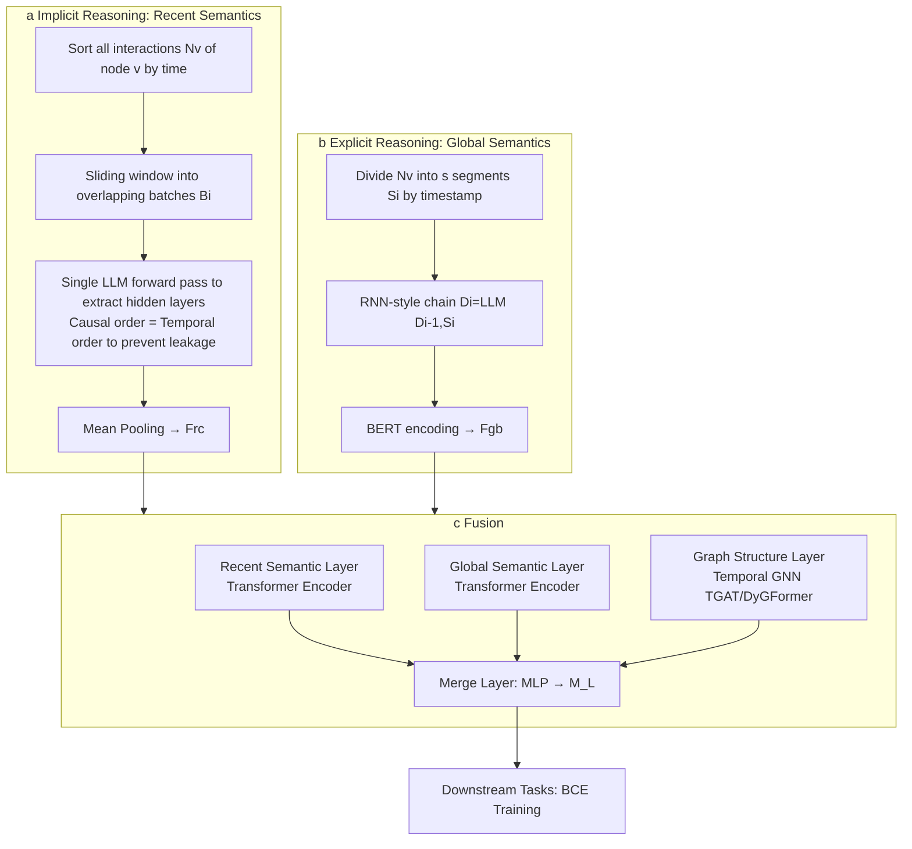

# Global-Recent Semantic Reasoning on Dynamic Text-Attributed Graphs with Large Language Models

**Conference**: ICLR 2026  
**OpenReview**: [https://openreview.net/forum?id=puocvrFZRl](https://openreview.net/forum?id=puocvrFZRl)  
**Code**: [https://github.com/Nala-YN/DyGRASP](https://github.com/Nala-YN/DyGRASP)  
**Area**: Graph Learning / Dynamic Text-Attributed Graphs / LLM × GNN  
**Keywords**: DyTAG, Dynamic Graphs, Temporal GNN, LLM Reasoning, Implicit/Explicit Reasoning, Link Prediction  

## TL;DR
DyGRASP utilizes the **implicit reasoning** of LLMs to capture "recent semantic dependencies" and **explicit reasoning** to capture "global semantic evolution". By fusing these with temporal GNNs, it improves destination node retrieval Hit@10 by up to 34% on Dynamic Text-Attributed Graphs (DyTAG) while reducing LLM reasoning complexity from $O(|E|\cdot d)$ to $O(|E|)$.

## Background & Motivation
**Background**: Real-world e-commerce, knowledge graphs, and social networks are represented as **Dynamic Text-Attributed Graphs (DyTAG)**—where both nodes and interactions (edges) contain text and evolve over time, with each interaction denoted as $I=(u,r,v,t)$. However, existing methods mostly target **static** TAGs: pure GNNs excel at structure but use shallow text encodings (like Bag-of-Words or word vectors), resulting in weak semantic understanding; work integrating LLMs into TAGs (e.g., TAPE, SimTeG, GraphGPT) generates only **static** embeddings or explanations.

**Limitations of Prior Work**: Directly applying these methods to DyTAG faces two unavoidable difficulties. First, they **ignore semantic dynamics across "recent-global" temporal granularities**—recent dependencies (e.g., "notebook" following "bookstore" likely refers to a paper notebook, whereas following "electronics store" it likely refers to a laptop) and global evolution (e.g., a user's interest slowly migrating from literature to technology). Second, **efficiency disaster**: DyTAG text is primarily attached to edges, which are orders of magnitude more numerous than nodes and span hundreds of timestamps. Naively concatenating historical interactions for every interaction to feed into an LLM results in a token complexity of $O(|E|\cdot d)$ ($d$ being the average degree), which is unscalable to real-world graphs.

**Key Challenge**: To simultaneously model "multi-granularity temporal semantics" while compressing LLM reasoning overhead on massive dynamic edges to an acceptable level.

**Goal**: Propose a DyTAG reasoning framework capable of capturing both recent and global semantics while reducing LLM complexity to linear.

**Core Idea**: **Divide labor using two types of LLM reasoning abilities**—implicit reasoning (extracting hidden layer embeddings) with a sliding window to capture recent semantics, and explicit reasoning (generating text summaries) with an RNN-style chain to capture global semantics, then fusing structural information via a three-layer architecture with temporal GNNs.

## Method

### Overall Architecture
DyGRASP (Dynamic Global-Recent Adaptive Semantic Processing) consists of three steps: (a) **Implicit reasoning** to extract recent temporal semantic features $\mathbf{F}^{rc}$; (b) **Explicit reasoning** to extract global temporal semantic descriptions $D_i$; (c) **Layer-wise fusion** of both semantic types with structural features from a temporal GNN through Recent/Global/Graph semantic layers and a Merge layer to generate comprehensive node representations for downstream tasks (destination node retrieval, future link prediction).

### Key Designs

**1. Node-centric implicit reasoning: Aligning LLM causal order with temporal order to process a node's history in one forward pass.** The naive edge-centric approach—concatenating history for every interaction—has $O(|E|\cdot d)$ complexity. Ours switches to a **node-centric** approach: all interactions $N_v$ of node $v$ are arranged as a sequence by timestamp and fed into the LLM at once to extract hidden features. The key insight is that the LLM's **causal attention (unidirectional) naturally aligns with the unidirectional nature of temporal order**—earlier interactions in the sequence cannot see later ones, effectively preventing future information leakage. Thus, a single forward pass allows all interactions to obtain recent semantics from their respective histories simultaneously, reducing complexity to $O(|E|)$ (proven in Appendix C).

**2. Sliding window mechanism: Using overlapping batches to address context length, computation, and long-input degradation.** Feeding the entire $N_v$ sequence would hit LLM context limits, memory constraints, and the "lost in the middle" effect. Thus, $N_v$ is partitioned into overlapping batches: $B_i=\{I_k \mid \tfrac{c}{2}i+1\le k\le \tfrac{c}{2}i+c\}$, with window length $c$. **The first $c/2$ interactions in each batch serve only as temporal context for the subsequent $c/2$**. Each batch is organized using dataset-specific prompt templates and fed into the LLM. Mean pooling is applied to the output hidden layers of each interaction to obtain recent semantic features $\mathbf{F}^{rc}_i\in\mathbb{R}^{d_{LLM}}$. Overlapping ensures that recent dependencies between batches are not severed.

**3. Explicit reasoning + RNN-style reasoning chain: Enabling the LLM to cumulatively summarize global node evolution with memory.** Recent features only cover local contexts; global evolution relies on the LLM's **generative capability**. $N_v$ is divided into $s$ equal segments $S_i$ by timestamp, and an RNN-style chain iteratively generates descriptions: $D_i=\text{LLM}(D_{i-1}, S_i)$, where $D_0$ represents the node's original text attributes. **The key is that this process is cumulative**—$D_{i-1}$ is not a local feature of the previous segment, but a rolling summary of the entire history up to that point. The LLM merges the new segment $S_i$ into the old summary at each step (e.g., $D_2$ incorporates $S_2$ based on $D_1$). Consequently, $D_i$ encodes long-range semantic evolution from $S_1$ to $S_i$. Each interaction is fed only twice, maintaining $O(|E|)$ complexity.

**4. Three-layer semantics + Merge layer: Layer-wise temporal alignment and fusion of recent, global, and structural features.** The fusion stage produces node representations for the prediction time $t$. The **Recent Semantic layer** uses a learnable time encoder for $\mathbf{F}^{rc}_i$ of $N^t_v$ (interactions before $t$) to encode intervals $\Delta t_i=t-t_i$ and concatenates $R^{(0)}_i=[P(\mathbf{F}^{rc}_i)\,\|\,T(t-t_i)]$, followed by a Transformer Encoder. The **Global Semantic layer** similarly encodes BERT-processed $\mathbf{F}^{gb}_i$ with time and passes it through a Transformer, using $\hat i=\max\{i\mid\hat t_i<t\}$ to truncate and prevent leakage. The **Graph layer** uses $S^{(l)}=\text{MergeTGNN}(M^{(l-1)},\text{MPG}(v,t))$, compatible with any message-passing temporal GNN (implemented with TGAT/DyGFormer). The three paths are fused via an MLP after readout: $M^{(l)}=\text{Merge\_Layer}(\mathcal{R}_r(\{R^{(l)}_i\}),\mathcal{R}_g(\{G^{(l)}_i\}),S^{(l)})$, where recent semantics use mean pooling and global semantics use the chain-end feature $G^{(l)}_{\hat i}$ (since the RNN chain and attention have already aggregated history). Finally, $M^{(L)}$ is trained end-to-end via MLP + BCE loss.

## Key Experimental Results

### Main Results (Destination node retrieval Hit@10 %, using DyGFormer as backbone)

| Dataset | DyGFormer | DyGRASP(DyGFormer) | Gain | Setting |
|---|---|---|---|---|
| GDELT | 91.64 | **93.24** | +1.60 | Transductive |
| Enron | 92.04 | **99.40** | +7.36 | Transductive |
| Googlemap | 51.32 | **85.88** | +34.56 | Transductive |
| Stack_elec | 94.39 | **99.59** | +5.20 | Transductive |
| Googlemap | 43.84 | **81.14** | +37.30 | Inductive |
| Stack_elec | 56.23 | **99.74** | +43.51 | Inductive |

Using TGAT as a backbone, there is also a +45.48 gain on Stack_elec under the inductive setting. Future link prediction (AP/AUC) also shows comprehensive leads. Gains are larger on text-rich datasets, highlighting the role of the LLM.

### Ablation Study (Hit@10 %, Enron / Googlemap_CT Transductive)

| Configuration | Enron | Googlemap_CT |
|---|---|---|
| Ours (Full) | **99.40** | **87.28** |
| −Global | 94.89 | 82.30 |
| −Recent | 97.31 | 81.73 |
| −Recent & −Global | 92.04 | 51.32 |

### Key Findings
- **Complementarity of Recent and Global modules**: Adding either module alone yields gains, and adding both exceeds either individually, confirming that "recent-global" semantics are complementary.
- **Strong Generalization across LLMs**: Performance is stable with minimal fluctuations across Qwen2.5, Mistral, and Llama-3.1 (e.g., 99.05/97.98/99.40 on Enron).
- **Cross-GNN Generalization**: Significant gains are achieved whether using TGAT or DyGFormer as the backbone; the modular design is compatible with any message-passing temporal GNN.
- **Efficiency**: Theoretical complexity is reduced from $O(|E|\cdot d)$ to $O(|E|)$, allowing the method to scale to real-world DyTAGs with millions of edges (where JODIE/DyRep might OOM on large graphs).

## Highlights & Insights
- **The observation "Causal Order = Temporal Order" is elegant**: It repurposes the LLM's unidirectional attention to prevent future leakage, eliminating extra masking engineering and allowing a node's entire history to be compressed into one forward pass.
- **Division of Implicit/Explicit reasoning** matches the two semantic granularities: hidden embeddings are suited for fine-grained recent dependencies, while generative summaries are suited for coarse-grained global evolution.
- **RNN-style cumulative summary chain** transforms the "long context" problem into "short context + state transfer," saving tokens while preserving long-term memory.

## Limitations & Future Work
- The global reasoning chain is **serial** ($D_i$ depends on $D_{i-1}$), which may become a latency bottleneck for nodes with extremely long histories.
- Token budgets for recent and global semantics are controlled by hyperparameters like window length $c$ and segment count $s$, requiring per-dataset tuning; prompt templates are also dataset-specific.
- Global summaries are generated by the LLM, posing risks of hallucination or semantic drift; factual consistency of the generated descriptions is not deeply quantified in the paper.
- Evaluation is concentrated on 4 DTGB datasets and two tasks (retrieval/link prediction); verification on tasks like node classification is limited.

## Related Work & Insights
- **LLM for TAG** (TAPE/SimTeG/GraphGPT/ENGINE): These integrate LLM text understanding into static graphs; this paper notes their inability to model temporal semantic relationships.
- **Temporal GNN** (TGAT/CAWN/DyRep/DyGFormer/GraphMixer): These excel at structural evolution but struggle to interpret text semantics; this paper uses them as pluggable structural backbones.
- **LLM for DyTAG** (Parallel works like LKD4DyTAG/CROSS/GAD and the DTGB benchmark): These do not address LLM reasoning efficiency on dynamic edges, nor do they explicitly distinguish between "recent-global" multi-granularity semantics—the core differentiator for DyGRASP.
- **Insight**: When "long sequence + massive edges + text" overlap, rather than concatenating long contexts, it is better to employ "node-centric one-time implicit encoding + cumulative explicit summarization" to reduce complexity from multiplicative to additive.

## Rating
- **Novelty**: ⭐⭐⭐⭐ — The combination of "Causal = Temporal" implicit reasoning and RNN-style cumulative global summaries for DyTAG is novel and theoretically supported for $O(|E|)$ efficiency.
- **Experimental Thoroughness**: ⭐⭐⭐⭐ — Comprehensive generalization and ablation across 4 datasets, 2 tasks, 2 settings, 3 LLM families, and 2 GNN backbones. Task coverage and node classification verification are slightly lacking.
- **Writing Quality**: ⭐⭐⭐⭐ — Motivation is clearly explained with "recent/global" examples; method description is well-layered and illustrated.
- **Value**: ⭐⭐⭐⭐ — DyTAG is a common industrial scenario; the gains (up to 34%-45%) and linear complexity offer strong practical value. Code is open-sourced.

<!-- RELATED:START -->

## Related Papers

- [\[ICLR 2026\] GDGB: A Benchmark for Generative Dynamic Text-Attributed Graph Learning](gdgb_a_benchmark_for_generative_dynamic_text-attributed_graph_learning.md)
- [\[NeurIPS 2025\] Dynamic Bundling with Large Language Models for Zero-Shot Inference on Text-Attributed Graphs](../../NeurIPS2025/graph_learning/dynamic_bundling_with_large_language_models_for_zero-shot_inference_on_text-attr.md)
- [\[CVPR 2026\] Mario: Multimodal Graph Reasoning with Large Language Models](../../CVPR2026/graph_learning/mario_multimodal_graph_reasoning_with_large_language_models.md)
- [\[ICML 2025\] Graph-constrained Reasoning: Faithful Reasoning on Knowledge Graphs with Large Language Models](../../ICML2025/graph_learning/graph-constrained_reasoning_faithful_reasoning_on_knowledge_graphs_with_large_la.md)
- [\[ICLR 2026\] Knowledge Reasoning Language Model: Unifying Knowledge and Language for Inductive Knowledge Graph Reasoning](knowledge_reasoning_language_model_unifying_knowledge_and_language_for_inductive.md)

<!-- RELATED:END -->
