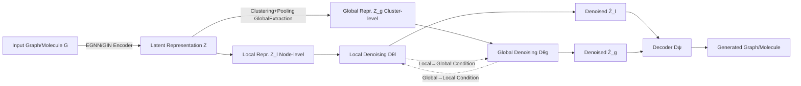

# Global and Local Topology-Aware Graph Generation via Dual Conditioning Diffusion

**Conference**: ICLR 2026  
**OpenReview**: [https://openreview.net/forum?id=IZV9k5BGxi](https://openreview.net/forum?id=IZV9k5BGxi)  
**Code**: To be confirmed  
**Area**: Graph Generation / Latent Diffusion Models  
**Keywords**: Graph Generation, Latent Diffusion, Global-Local Dependencies, Bidirectional Conditioning, Molecule Generation  

## TL;DR
DualDiff decomposes graphs into node-level (local) and cluster-level (global) diffusion branches. By employing a "bidirectional conditioning" mechanism, global and local information alternately serve as conditions during the denoising process. This joint modeling of $p(Z_l, Z_g)$ in a unified latent space significantly improves the generation quality of both general and molecular graphs.

## Background & Motivation
- **Background**: Diffusion models have become the mainstream paradigm for graph generation. Latent space diffusion (e.g., GEOLDM, LGD, EDM-SyCo) further moves the process from the raw graph space to a low-dimensional latent space, balancing efficiency and scalability.
- **Limitations of Prior Work**: Most existing methods focus on "node-level" generation—treating nodes as independent entities during denoising, which struggles to capture dependencies within and between substructures. A few works incorporating global information (e.g., SubgDiff's subgraph prediction, Graphusion's cluster pseudo-labels) treat it only as one-way guidance, **ignoring inter-substructure dependencies and failing to model the joint distribution of global and local features**.
- **Key Challenge**: Graph data naturally exhibits multi-scale coupled dependencies. Molecules contain both local details (functional groups) and global topologies (spatial distribution of groups); these interact with each other. Single-way or single-scale modeling cannot adequately describe both levels simultaneously.
- **Goal**: Design a unified generative model capable of **dynamically** capturing both global and local topological information to model their joint distribution.
- **Core Idea**: **"Joint Distribution Bidirectional Decomposition"**. Based on the identity $p(Z_l, Z_g) = p(Z_l|Z_g)p(Z_g) = p(Z_g|Z_l)p(Z_l)$, the joint modeling is decomposed into two complementary processes: "global-to-local" and "local-to-global." A bidirectional conditioning mechanism allows the two diffusion branches to alternately condition on each other, achieving dual topology awareness.

## Method

### Overall Architecture
DualDiff is a two-stage latent diffusion framework. First, a pre-trained graph autoencoder maps the graph $G=(H,A)$ to a unified latent space to obtain local representations $Z_l \in \mathbb{R}^{N \times d}$, then clusters $Z_l$ to aggregate global representations $Z_g \in \mathbb{R}^{K \times d}$. Subsequently, a dual-branch diffusion (node-level + cluster-level) is performed in the latent space. A bidirectional conditioning mechanism enables information exchange during denoising. Finally, the decoder reconstructs the graph from the joint $\hat Z_l, \hat Z_g$.

### Key Designs

**1. Global Information Extraction: Explicitly encoding "substructure topology" into the global branch via clustering.** The framework encodes the graph into latent space for node-level $Z_l$, while $Z_g$ is derived via clustering—the source of global topology awareness. Different strategies are used: Molecule graphs use K-means in atomic coordinate space for geometrically enhanced labels; general graphs use spectral clustering of Graph Laplacian eigenvectors for community partitioning. Given the assignment matrix $S_g \in \{0,1\}^{N \times K}$, cluster-level embeddings are obtained via $Z_g = \mathrm{Pooling}(S_g, Z) \in \mathbb{R}^{K \times d}$. Thus, $Z_g$ carries long-range dependencies such as "which nodes belong to the same substructure" and "how substructures are distributed."

**2. Dual-Branch Diffusion: SDEs for node-level and cluster-level branches.** Given the different topological characteristics, DualDiff defines separate forward SDEs for $Z_l$ and $Z_g$ in the latent space: $\mathrm{d}Z_{l,t}=f_{l,t}\mathrm{d}t+s_{l,t}\mathrm{d}W_{l,t}$ and $\mathrm{d}Z_{g,t}=f_{g,t}\mathrm{d}t+s_{g,t}\mathrm{d}W_{g,t}$. Within the EDM framework, the drift term is set to 0 and the diffusion term $s_{l,t}=s_{g,t}=\sqrt{2t}$. Two GNN denoising networks $D_{\theta_l}, D_{\theta_g}$ are trained to recover clean latent representations: $\mathbb{E}[\|D_{\theta_l}(\tilde Z_l,\sigma)-Z_{l,0}\|^2 + \|D_{\theta_g}(\tilde Z_g,\sigma)-Z_{g,0}\|^2]$.

**3. Bidirectional Conditioning: Approximating the joint distribution via alternate conditioning.** This is the core contribution. Based on the decomposition $p(Z_l,Z_g)=p(Z_l|Z_g)p(Z_g)=p(Z_g|Z_l)p(Z_l)$, two complementary processes are defined: (i) Global-to-local ($p(Z_l|Z_g)$) and (ii) Local-to-global ($p(Z_g|Z_l)$). Practically, self-conditioning provides the previous step's predictions $\hat Z_{l,0}, \hat Z_{g,0}$. The model switches between processes with probability $p$: Process (i) uses $(C_l,C_g)=((\hat Z_{l,0},\hat Z_{g,0}),0)$, while process (ii) uses $(0,(\hat Z_{l,0},\hat Z_{g,0}))$. Process (i) uses FiLM-inspired modulation: $\hat Z_{g,0}$ generates cluster-specific scaling/shifting parameters $\gamma_i, \beta_i$ to modulate $Z_l$ based on node-cluster similarity. Process (ii) compresses local details into a global condition using message passing and pooling: $C=\mathrm{Linear}(\mathrm{Pool}(\mathrm{MP}(\hat Z_{l,0})))$.

**4. Alternating Sampling: Stabilizing generation via a "server-client" approach from Federated Learning.** Inspired by central servers aggregating client updates, global clusters are treated as servers and nodes as clients. Process (i)/(ii) correspond to local updates and global aggregation, respectively. During sampling, process (ii) is triggered only every $m$ steps of process (i) (e.g., when `t % (m+1) == 0`). This scheduling significantly improves stability and quality.

## Key Experimental Results

### Main Results

General Graph Generation (Planar / SBM, lower MMD is better, higher V.U.N. is better):

| Model | Planar Clus.↓ | Planar Spec.↓ | Planar V.U.N.↑ | SBM Deg.↓ | SBM Spec.↓ |
|------|------|------|------|------|------|
| DiGress | 0.0372 | 0.0106 | 75.0 | 0.0013 | 0.0400 |
| GruM | 0.0353 | 0.0062 | 90.0 | 0.0007 | 0.0050 |
| GraphBFN | 0.0294 | 0.0046 | 96.7 | 0.0005 | 0.0053 |
| **DualDiff** | **0.0275** | **0.0038** | **97.5** | **0.0004** | **0.0042** |

Molecule Generation (ZINC250k, higher FCD / KL is better):

| Method | FCD↑ | KL↑ | Novelty↑ | Validity↑ |
|------|------|------|------|------|
| DiGress | 0.65 | 0.91 | 0.99 | 0.85 |
| GruM | 0.64 | N.A. | 1.00 | 0.99 |
| EDM-SyCo | 0.85 | 0.96 | 1.00 | 0.88 |
| **DualDiff** | **0.91** | **0.98** | 1.00 | 0.92 |

3D Molecule Generation (QM9): DualDiff achieves **99.3%** on Valid & Unique, outperforming GEOLDM (92.7%) and EQUIFM (93.5%).

### Ablation Study

Ablation of Bidirectional Conditioning (ZINC250k):

| Configuration | FCD↑ | KL↑ |
|------|------|------|
| No conditioning | 0.65 | 0.82 |
| Self-conditioning | 0.72 | 0.89 |
| Only $Z_l \to Z_g$ | 0.75 | 0.95 |
| Only $Z_g \to Z_l$ | 0.83 | 0.95 |
| **Bidirectional $Z_g \leftrightarrow Z_l$** | **0.91** | **0.98** |

### Key Findings
- **Bidirectional exceeds self-conditioning**: Improving FCD from 0.72 to 0.91 proves that global-local interaction is the primary source of quality gain.
- **Directional value**: $Z_g \to Z_l$ (global guiding local) is more effective than $Z_l \to Z_g$, though bidirectional is needed to approximate the joint distribution.
- **Superiority over hierarchical methods**: Compared to autoregressive/coarse-to-fine methods (HiGen, PPGN), DualDiff's dynamic interaction captures the joint distribution more effectively.
- **Optimization of parameters**: Moderate values for $p$ and larger $m$ (focusing on local details during sampling) yield better performance with a small cluster number $K$.
- **Efficiency**: Competitive results are achieved in ~200 steps with manageable overhead from bidirectional conditioning.

## Highlights & Insights
- **Probabilistic grounding**: The entire design is derived from the expansion of $p(Z_l, Z_g)$, giving the bidirectional mechanism a clear probabilistic interpretation rather than being just an engineering heuristic.
- **Reusing self-conditioning semantics**: The "zeroing out" of one branch during training aligns with the robustness design of self-conditioning, allowing seamless integration.
- **Federated Learning analogy**: Mapping global clusters to "servers" and nodes to "clients" provides an intuitive rationale for the $m:1$ sampling schedule.
- **Generality**: The framework is versatile, compatible with EGNN (for SE(3) equivariance in 3D molecules) or GIN/GCN (general graphs).

## Limitations & Future Work
- **Dependence on clustering**: Global information relies on K-means or spectral clustering; poor clustering could negatively impact the global branch.
- **Hyperparameter sensitivity**: $p, m, K$ require tuning for different datasets.
- **Validity gap**: While FCD/KL are high, Validity on ZINC250k (0.92) is still lower than GruM (0.99) or MoLeR (1.00).
- **Two-stage training**: The latent space is fixed after autoencoder pre-training; end-to-end optimization remains unexplored.

## Related Work & Insights
- **Latent Graph Diffusion (GEOLDM / EDM-SyCo)**: DualDiff extends the "autoencode-then-diffuse" paradigm from a single branch to dual branches.
- **Global-informed generation (SubgDiff / Graphusion)**: These use one-way guidance; DualDiff addresses the lack of joint distribution modeling.
- **Self-Conditioning**: DualDiff upgrades single-scale self-conditioning to a cross-scale bidirectional mechanism.
- **FiLM (Feature Modulation)**: Used as a tool to inject cluster-level global information into local nodes.

## Rating
- **Novelty**: ⭐⭐⭐⭐ — Clear probabilistic derivation for dual-branch interaction.
- **Experimental Thoroughness**: ⭐⭐⭐⭐ — Comprehensive testing across 8 datasets including general and 2D/3D molecular graphs.
- **Writing Quality**: ⭐⭐⭐⭐ — Logical flow from motivation to sampling schedules.
- **Value**: ⭐⭐⭐⭐ — A generalizable multi-scale modeling paradigm for complex graph structures.

<!-- RELATED:START -->

## Related Papers

- [\[NeurIPS 2025\] DuetGraph: Coarse-to-Fine Knowledge Graph Reasoning with Dual-Pathway Global-Local Fusion](../../NeurIPS2025/graph_learning/duetgraph_coarse-to-fine_knowledge_graph_reasoning_with_dual-pathway_global-loca.md)
- [\[ICLR 2026\] FSD-CAP: Fractional Subgraph Diffusion with Class-Aware Propagation for Graph Feature Imputation](fsd-cap_fractional_subgraph_diffusion_with_class-aware_propagation_for_graph_fea.md)
- [\[ICLR 2026\] Low-Rank Few-Shot Node Classification by Node-Level Graph Diffusion](low-rank_few-shot_node_classification_by_node-level_graph_diffusion.md)
- [\[ICLR 2026\] Discrete Bayesian Sample Inference for Graph Generation](discrete_bayesian_sample_inference_for_graph_generation.md)
- [\[ICLR 2026\] Topology Matters in RTL Circuit Representation Learning](topology_matters_in_rtl_circuit_representation_learning.md)

<!-- RELATED:END -->
