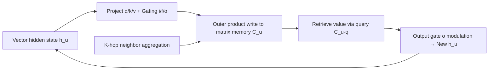

# gLSTM: Mitigating Over-Squashing by Increasing Storage Capacity

**Conference**: ICLR 2026  
**OpenReview**: [https://openreview.net/forum?id=c4mXEOXlAL](https://openreview.net/forum?id=c4mXEOXlAL)  
**Code**: Committed to open source (PyG GraphGym framework, configuration and plotting code included)  
**Area**: Graph Neural Networks / Graph Representation Learning  
**Keywords**: over-squashing, storage capacity, associative memory, xLSTM, fast weight programmers, message passing  

## TL;DR
This paper disentangles GNN over-squashing into two independent failure modes: "sensitivity limitation" and "storage capacity saturation." It proposes the NAR synthetic task to measure capacity bottlenecks separately and introduces the gLSTM architecture, which incorporates associative memory and gating mechanisms from xLSTM into message passing to explicitly increase node storage capacity.

## Background & Motivation
**Background**: Message Passing Neural Networks (MPNN) are the dominant paradigm for graph learning, but deep MPNNs suffer from over-squashing—where an exponentially growing receptive field is compressed into a fixed-size vector, creating an information bottleneck. When Alon & Yahav (2021) first identified this, they described it as a **capacity** issue ("information cannot fit"); however, subsequent works by Topping et al. (2022) and Di Giovanni et al. (2023) reframed it as a **sensitivity** problem characterized by the upper bound of the node Jacobian, which has since become the mainstream perspective.

**Limitations of Prior Work**: Conflating these two perspectives has led to two main issues. First, mainstream synthetic benchmarks (e.g., RingTransfer) fill the graph with constants except for target nodes, thus failing to test how much information can be stored, only how far signals propagate. While Tree-NeighborsMatch controls information volume, it uses deep binary trees where sensitivity decays exponentially with depth, **making it impossible to isolate capacity and sensitivity failure modes**. Second, most mitigation strategies (graph rewiring, controlling information flow) target sensitivity or topological bottlenecks, with almost no work directly addressing **increasing storage capacity at the architectural level**.

**Key Challenge**: Over-squashing involves both "information cannot reach the destination (low sensitivity)" and "information cannot be stored (capacity saturation)." These have different root causes, behaviors, and solutions; mixing them makes it difficult to measure or fix the problem accurately.

**Goal**: Isolate the capacity problem from sensitivity and gradient disappearance in the shallow (2-layer) regime and provide an architecture specifically designed to increase capacity.

**Core Idea**: **[Capacity Perspective]** Redefine over-squashing as whether a node representation "can store more information." **[Sequence Modeling Leverage]** Borrow matrix memory, outer product updates, and exponential gating from associative memory, fast weight programmers, and xLSTM, allowing each node to maintain a matrix memory in addition to a vector hidden state to expand capacity.

## Method

### Overall Architecture
The paper follows two main lines: separating capacity and sensitivity conceptually and through evaluation (the NAR task), and introducing the gLSTM architecture to address capacity bottlenecks. gLSTM maintains a **matrix hidden state** $C_u^{(l)}$ for each node $u$ as associative memory, alongside the standard vector hidden state $h_u^{(l)}$. Neighboring key-value pairs are written into this matrix via outer products, and the next layer uses a query vector to "retrieve" corresponding values, scaling the information a single node can store from vector dimensions to matrix size.

### Key Designs

**1. Capacity Over-Squashing and the NAR Task: Isolating Capacity from Sensitivity.** The authors argue that over-squashing should be classified by **failure mode** rather than "computation tree vs. topological bottleneck." They define storage capacity as the "amount of information a node representation can store for subsequent use." To measure this independently, they propose Neighbor Associative Recall (NAR): a graph with $N+3$ nodes where $N$ neighbor nodes each carry a key-value pair $x_n=[e_k(k_n); e_v(v_n)]$, all connected to a central node. The central node connects via an intermediate node to a query node carrying a specific key $x_q=[e_k(k_m); 0]$. The query node must predict the corresponding value $v_m$. Since this is a **shallow (2-layer) task with a high-degree node**, the receptive field does not expand exponentially with depth, effectively bypassing sensitivity and gradient issues to test purely how many key-value pairs a node can store.

**2. gLSTM Matrix Memory and Outer Product Updates: Moving xLSTM into Message Passing.** Each node maintains a matrix memory $C_u^{(l)}$ and a normalization vector $n_u^{(l)}$, updated using FWP-style outer product rules—a forget gate $f$ decays old memory, and an input gate $i$ writes the neighbor’s (including its own) value $\otimes$ key:
$$C_u^{(l)} = f_u^{(l)} C_u^{(l-1)} + \sum_{v\in N_u^{(l)}\cup\{u\}} i_v^{(l)}\, v_v^{(l)} \otimes k_v^{(l)}$$
Queries, keys, and values are projections of the previous layer's hidden states. The query $q_u^{(l)} = W_q[h_u^{(l-1)};\sum_{v\in N_u}h_v^{(l-1)}]$ concatenates the **node itself** with its **neighbor aggregation**, making the retrieval dependent on both the node and its neighborhood. The output is retrieved from memory, normalized, and modulated by an output gate:
$$\tilde h_u^{(l)} = \frac{C_u^{(l)} q_u^{(l)}}{\max\{|n_u^{(l)\top} q_u^{(l)}|,\,1\}},\qquad h_u^{(l)} = o_u^{(l)} \odot \tilde h_u^{(l)}$$
Using xLSTM's **exponential gating** allows the model to "revise storage decisions" dynamically. The theoretical capacity for orthogonal key/value pairs equals the memory dimension.

**3. mLSTM Block Structure + K-hop Aggregation: Stabilizing Gradients and Providing Inductive Bias.** Borrowing from Arroyo et al. (2025), sensitivity over-squashing often stems from vanishing gradients. gLSTM adopts the mLSTM block structure with **residual connections** to keep the Jacobian norm near the "edge of chaos." For aggregation, it uses **K-hop**—at layer $l$, node $u$ directly retrieves info from nodes at graph distance $l$, i.e., $N_u^{(l)}=\{v: d_G(u,v)=l\}$. This high-connectivity structure mitigates sensitivity bottlenecks and provides an inductive bias: information already written to memory does not mix with subsequent message passing rounds, allowing subsequent nodes to query this memory in isolation.

## Key Experimental Results

### Main Results (GPP Long-Range Tasks, log₁₀(MSE), lower is better)

| Method | Diam. | Ecc. | SSSP |
|---|---|---|---|
| GCN | 0.742 | 0.846 | 0.950 |
| GIN | 0.613 | 0.950 | -0.541 |
| GCNII | 0.529 | 0.764 | -1.132 |
| A-DGN | -0.546 | 0.305 | -3.402 |
| **gLSTM (ours)** | **-0.715** | **-4.036** | -2.836 |
| gLSTM − K-hop | 0.042 | 0.673 | -3.377 |

LRGB (500k parameter limit):

| Method | Peptides-Func AP↑ | Peptides-Struct MAE↓ |
|---|---|---|
| GCN | 0.6860 | 0.2460 |
| GPS | 0.6534 | 0.2509 |
| kGCN-SSM | 0.6902 | 0.2581 |
| **gLSTM (ours)** | **0.7250** | 0.2527 |

### Ablation Study (Effect of K-hop)

| Setting | Diam. | Ecc. | Peptides-Func |
|---|---|---|---|
| gLSTM (Full) | **-0.715** | **-4.036** | **0.7250** |
| − K-hop | 0.042 | 0.673 | 0.6030 |

Removing K-hop leads to significant degradation in most tasks (except SSSP).

### Key Findings
- **gLSTM outperforms GCN on NAR**: gLSTM maintains perfect recall until the number of neighbors $N$ exceeds the memory dimension, followed by a "graceful saturation." Standard GCN begins saturating at $N=8$.
- **Capacity and Sensitivity are indeed separable**: The Jacobian norm (measuring sensitivity) does not correlate with NAR performance—GCN sensitivity recovers at $N>16$ while performance stays flat; gLSTM performance drops while sensitivity is still rising, proving **capacity over-squashing can occur independently of sensitivity**.
- **Selective sensitivity aligns with capacity**: The ratio of Jacobian norms for selected vs. background neighbors collapses at the capacity inflection point, indicating that capacity saturation undermines the ability to distinguish between different nodes.
- gLSTM achieves SOTA on Diameter/Eccentricity and leads significantly on Peptides-Func. Performance on Peptides-Struct is weaker, likely because long-range interactions are less critical for that task.

## Highlights & Insights
- **Conceptual decoupling as a contribution**: By re-extracting "capacity" from the dominant "sensitivity narrative," the paper clarifies semantic confusion in literature and provides both a metric (NAR) and a solution (gLSTM).
- **The precision of NAR lies in "shallow and wide"**: Using a high-degree node in one layer rather than a deep tree cleanly separates capacity from depth-coupled sensitivity/gradient issues.
- **Evidence-based cross-domain transfer**: Associative memory = matrix outer product writing + query retrieval. The paper maps FWP/xLSTM capacity logic directly to "how many key-values a node can store," with a verifiable saturation point where "orthogonal keys = memory dimension."
- The "graceful saturation" phenomenon echoes Smolensky's (1990) Tensor Product Representation theory, adding theoretical depth to the capacity perspective.

## Limitations & Future Work
- **Lack of mathematical characterization for capacity**: While sensitivity has theoretical tools like Jacobian bounds, capacity currently relies on empirical measurement through synthetic tasks. Future work should quantify capacity theoretically.
- **Trade-offs in efficiency and parallel training**: Moving xLSTM components to graphs loses some original parallelization benefits; matrix memory also introduces overhead.
- **Task dependency**: Average performance on Peptides-Struct suggests gLSTM's gains are specific to tasks requiring long-range/high-capacity interactions and may be redundant for short-range tasks.
- Parameter comparisons were biased toward GCN; a fair comparison between matrix and vector memory is non-trivial.

## Related Work & Insights
- **Over-squashing Genealogy**: Capacity (Alon & Yahav, 2021) → Sensitivity Jacobian bounds (Topping et al., 2022; Di Giovanni et al., 2023) → Gradient/Smoothing refinement (Arroyo et al., 2025) → Current work (revisiting capacity alongside sensitivity).
- **Mitigation Mapping**: Graph rewiring (DIGL, DRew, LASER) and flow control (Gated GCN) target sensitivity/topology; this work follows the rarer "architectural expansion" route.
- **Leveraging Sequence Modeling**: FWP (Schmidhuber 1992, Schlag et al. 2021), xLSTM (Beck et al. 2024), and Associative Memory are direct sources for gLSTM.
- **Insight**: Categorizing problems by "failure mode" rather than "cause" is an effective strategy for handling conflated concepts; designing isolated synthetic tasks for neglected failure modes is a high-value validation method.

## Rating
- **Novelty**: ⭐⭐⭐⭐ Disentangling capacity/sensitivity + NAR task + associative memory GNN; however, core techniques leverage existing modules.
- **Experimental Thoroughness**: ⭐⭐⭐⭐ Comprehensive across synthetic tasks, Jacobian/Hessian analysis, and standard benchmarks like GPP and LRGB.
- **Writing Quality**: ⭐⭐⭐⭐ Clear conceptual distinctions and logical progression supported by strong visualization.
- **Value**: ⭐⭐⭐⭐ Opens a new "architectural capacity" path in over-squashing research; the NAR task may become a standard tool for evaluating capacity.

<!-- RELATED:START -->

## Related Papers

- [\[ICML 2025\] Mitigating Over-Squashing in Graph Neural Networks by Spectrum-Preserving Sparsification](../../ICML2025/graph_learning/mitigating_over-squashing_in_graph_neural_networks_by_spectrum-preserving_sparsi.md)
- [\[ICLR 2026\] Rethinking the Gold Standard: Why Discrete Curvature Fails to Fully Capture Over-squashing in GNNs?](rethinking_the_gold_standard_why_discrete_curvature_fails_to_fully_capture_over-.md)
- [\[NeurIPS 2025\] Over-squashing in Spatiotemporal Graph Neural Networks](../../NeurIPS2025/graph_learning/over-squashing_in_spatiotemporal_graph_neural_networks.md)
- [\[ICLR 2026\] DR-GGAD: Dual Residual Centering for Mitigating Anomaly Non‑Discriminativity in Generalist Graph Anomaly Detection](dr-ggad_dual_residual_centering_for_mitigating_anomaly_nondiscriminativity_in_ge.md)
- [\[ICLR 2026\] On The Expressive Power of GNN Derivatives](on_the_expressive_power_of_gnn_derivatives.md)

<!-- RELATED:END -->
