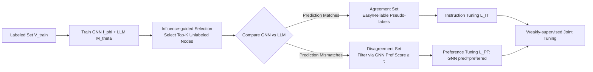

# GNN-as-Judge: Unleashing the Power of LLMs for Graph Learning with GNN Feedback

**Conference**: ICLR 2026  
**OpenReview**: [https://openreview.net/forum?id=nOlhDjNXKa](https://openreview.net/forum?id=nOlhDjNXKa)  
**Code**: [https://github.com/rux001/GNN-as-Judge](https://github.com/rux001/GNN-as-Judge)  
**Area**: Graph Learning / Text-Attributed Graphs / LLM-as-Predictor  
**Keywords**: Text-Attributed Graphs, Few-shot Semi-supervised Learning, Pseudo-labeling, LLM Fine-tuning, GNN Feedback, Preference Alignment  

## TL;DR
GNNs with structural inductive bias act as "judges" to filter reliable pseudo-labels using agreement/disagreement signals between LLM and GNN predictions. A weakly-supervised algorithm combining "Instruction Tuning + Preference Tuning" distills pseudo-label knowledge into the LLM, significantly improving node classification performance on text-attributed graphs where annotations are extremely scarce.

## Background & Motivation
**Background**: In Text-Attributed Graphs (TAGs, where nodes are documents and edges are relationships, e.g., citation networks, social networks, e-commerce graphs), LLMs are widely used as LLM-as-Predictors due to their strong semantic understanding. They predict node categories by serializing graph structures into prompts or injecting them via graph encoders. However, existing methods (e.g., LLaGA, GraphGPT) mostly assume supervised scenarios with **sufficient annotations**.

**Limitations of Prior Work**: Real-world graphs often have extremely sparse annotations (only a few nodes per class). LLMs lack the message-passing mechanism of GNNs and cannot exploit massive unlabeled nodes, leading to overfitting and poor generalization during fine-tuning. A natural idea is to expand the training set with pseudo-labels, but pseudo-labeling faces a core dilemma: high-confidence "easy" samples have low informativeness, while low-confidence "hard" samples are more informative but introduce significant label noise.

**Key Challenge**: 1) LLMs struggle to understand complex graph structures and suffer from hallucinations and self-bias, making it unreliable to select pseudo-labels based on LLM confidence alone. Furthermore, unlabeled nodes vary in value, requiring the selection of the most informative subset under computational constraints. 2) Directly applying supervised fine-tuning on noisy "hard" pseudo-labels can degrade LLM performance; specialized algorithms are needed to distill knowledge while suppressing noise.

**Goal**: Investigate the overlooked problem of "LLM-as-Predictor in few-shot semi-supervised graph learning" by solving two sub-problems: selecting reliable pseudo-labels and safely fine-tuning LLMs under noisy labels.

**Core Idea**: **GNN-as-Judge**. Instead of distinguishing easy/hard samples based on LLM confidence (as in standard self-training), the GNN with structural inductive bias and the text-centric LLM complement each other. **Agreement between the two identifies a reliable "easy" set, while disagreement identifies an informative "hard" set.** A weakly-supervised fine-tuning strategy is then designed to treat these sets using instruction tuning and preference tuning, respectively.

## Method

### Overall Architecture
GNN-as-Judge trains a structure-aware GNN $f_\phi$ and a text-centric LLM $M_\theta$ on the labeled set $V_{train}$. It follows three steps: first, select the unlabeled subset most influenced by labeled nodes using graph structure; second, let the GNN and LLM collaboratively label this subset (splitting into agreement/disagreement sets); finally, perform joint weakly-supervised fine-tuning on both sets.

### Key Designs

**1. Influence-guided Node Selection: Using Structural Proxies to Select Informative Subsets.** Labeling all unlabeled nodes is computationally impractical, and LLMs cannot perceive which nodes are truly influenced by labeled data. This work introduces **Node Influence**, defined as the Jacobian norm between final representations: $I_{v_i,v_j}=\|\partial x^{(\infty)}_{v_j}/\partial x^{(\infty)}_{v_i}\|$, characterizing how effectively information propagates. The authors prove a computable upper bound (Theorem 1): influence decays with shortest path distance $h^*$, $I_{v_i,v_j}\le |P^*_{v_i,v_j}|/(D^*_{GM})^{h^*}$, where $|P^*|$ is the number of shortest paths and $D^*_{GM}$ is the geometric mean of node degrees along the path. The influence score $IS(v_j)$ is the maximum influence from any labeled node. High-influence nodes receive stronger signals, ensuring reliable pseudo-labels and better representation of the labeled distribution.

**2. GNN-as-Judge for Easy/Hard Distinction: Reliability in Agreement, Preference Filtering in Disagreement.** Predictions on $V_{selected}$ are split into the agreement set $V_{agreed}=\{\hat y^{GNN}_i=\hat y^{LLM}_i\}$ and the disagreement set $V_{disagreed}$. For the agreement set, the authors prove (Theorem 2) that under the assumption of independent errors and uniform error distribution, the expected accuracy of agreed labels exceeds $\max(p_{LLM},p_{GNN})$ if both models are better than random. For the disagreement set, the GNN acts as the judge: since the GNN uses local neighborhood info and the nodes are structurally influential, GNN predictions are assumed more reliable. A **preference score** $S_{pref}(v_i)=P_{GNN}(\hat y^{GNN}_i|v_i)-P_{GNN}(\hat y^{LLM}_i|v_i)$ measures GNN's relative confidence. Only nodes with $S_{pref}(v_i)\ge\tau$ are kept to form $V'_{disagreed}$, extracting "hard but reliable" samples.

**3. Weakly-supervised Fine-tuning: Instruction Tuning for Agreement, Preference Tuning for Disagreement.** Different noise characteristics require different losses. The joint objective is $L(\theta)=\mathbb{E}_{D_{agreed}}[L_{IT}]+\lambda\,\mathbb{E}_{D'_{disagreed}}[L_{PT}]$. For the agreement set, standard instruction tuning is used: $L_{IT}=-\log p_\theta(y_i|x_i)$. For the disagreement set, where noise risk is higher, the task is reformulated as a **preference learning problem**: GNN prediction $y_{w,i}$ is "preferred" and LLM prediction $y_{l,i}$ is "dispreferred". Using ORPO, the model learns relative preference: $L_{PT}=-\log\sigma(g_\theta(x_i,y_{w,i},y_{l,i}))$, where $g_\theta$ is the log-odds ratio. This increases the relative likelihood of the GNN prediction while suppressing overfitting to noise, effectively replacing human feedback with GNN feedback.

## Key Experimental Results

### Main Results
Node classification accuracy (%) in few-shot semi-supervised settings (3/10-shot) using Llama-3-8B-Instruct as the backbone:

| Shot | Method | Cora | Citeseer | Pubmed | ogbn-arxiv | ogbn-products |
|------|------|------|----------|---------|------------|---------------|
| 3-shot | GCN | 69.45 | 63.12 | 65.23 | 38.33 | 59.19 |
| 3-shot | TAPE | 73.71 | 64.96 | 71.33 | 48.25 | 69.64 |
| 3-shot | LLaGA | 54.79 | 32.93 | 43.96 | 29.73 | 30.67 |
| 3-shot | GraphGPT | 57.77 | 52.34 | 57.51 | 31.26 | 40.83 |
| 3-shot | **Ours** | **77.89** | **73.59** | **87.12** | **62.21** | **81.02** |
| 10-shot | GCN | 78.22 | 68.38 | 75.33 | 50.95 | 69.65 |
| 10-shot | TAPE | 79.33 | 69.39 | 77.18 | 60.37 | 79.53 |
| 10-shot | **Ours** | **80.71** | **74.62** | **90.17** | **67.88** | **82.48** |

Ours achieves SOTA across all datasets and shot settings. The gain is especially significant in extreme low-resource settings (e.g., +14% over TAPE on ogbn-arxiv in 3-shot).

### Zero-shot Transfer (ogbn-arxiv training → other tests)

| Train → Test | LLaGA | GraphGPT | Ours |
|--------------|-------|----------|--------------|
| → Cora | 16.24 | 6.29 | **68.27** |
| → Citeseer | 14.72 | 5.37 | **56.67** |
| → Pubmed | 30.52 | 10.54 | **83.41** |

Ours better preserves the inherent generalization of LLMs compared to structural-token-based methods like LLaGA.

### Ablation Study
Ablation of components (Accuracy %):

| Variant | Cora | Citeseer | Pubmed | ogbn-arxiv | ogbn-products |
|------|------|----------|--------|------------|---------------|
| w/o Pseudo Labels | 69.2 | 59.1 | 83.0 | 53.6 | 76.4 |
| w/o Disagreement Set | 71.0 | 66.8 | 86.0 | 59.9 | 77.8 |
| w/o Weakly-supervised (SFT only) | 77.4 | 72.5 | 85.4 | 61.7 | 80.8 |
| **GNN-as-Judge (Full)** | **77.9** | **73.6** | **87.1** | **62.2** | **81.0** |

## Key Findings
- Removing pseudo-labels causes the largest drop, confirming the value of unlabeled nodes.
- The disagreement set provides critical additional learning signals.
- Replacing weakly-supervised fine-tuning with standard SFT degrades performance, particularly on noisy datasets like Pubmed, validating the robustness of preference tuning.
- Influence-guided selection yields higher pseudo-label accuracy than Random, Degree, or LLM-based strategies.

## Highlights & Insights
- **Repositioning GNNs as "Judges"**: Instead of serving as predictors, GNNs act as quality control for LLMs via agreement/disagreement signals.
- **Divergence as a Proxy for Difficulty**: The hard-to-determine "easy/hard" distinction is elegantly mapped to the "GNN-LLM agreement" signal.
- **Knowledge Distillation via Preference Alignment**: Treating noisy pseudo-labels as preference pairs (GNN feedback) rather than absolute truths allows safer distillation of structural knowledge.
- **Theoretical Grounding**: Theorem 1 (Influence bound) and Theorem 2 (Agreement reliability) provide provable support for the heuristic designs.

## Limitations & Future Work
- Pseudo-label quality is upper-bounded by the base models; systematic errors in both models would invalidate the agreement reliability.
- The assumption that GNNs are more reliable in disagreement sets might not hold for heterophilic graphs or high-noise structures.
- Several hyperparameters (Top-K, $\tau$, $\lambda$) require tuning.
- Evaluation is limited to node classification on homophilic/OGB graphs; generalization to link prediction or complex relational graphs is yet to be explored.

## Related Work & Insights
- **LLM-as-Predictor**: LLaGA/GraphGPT focus on structural alignment but struggle in low-resource settings.
- **Pseudo-labeling**: Moves from confidence-based selection to exploring the potential of "hard" samples.
- **Preference Optimization**: Originally for RLHF; this work replaces human feedback with GNN feedback, suggesting a broader paradigm for cross-architecture distillation.

## Rating
- **Novelty**: ⭐⭐⭐⭐ — Creative combination of GNN-as-judge, agreement splitting, and ORPO for graph learning.
- **Experimental Thoroughness**: ⭐⭐⭐⭐ — Comprehensive benchmarks, zero-shot tests, and ablation studies.
- **Writing Quality**: ⭐⭐⭐⭐ — Clear motivation and logically sound derivation of theorems.
- **Value**: ⭐⭐⭐⭐ — Directly addresses a practical bottleneck in few-shot graph learning with strong performance gains.

<!-- RELATED:START -->

## Related Papers

- [\[ICLR 2026\] On The Expressive Power of GNN Derivatives](on_the_expressive_power_of_gnn_derivatives.md)
- [\[ICLR 2026\] Glance for Context: Learning When to Leverage LLMs for Node-Aware GNN-LLM Fusion](glance_for_context_learning_when_to_leverage_llms_for_node-aware_gnn-llm_fusion.md)
- [\[ICLR 2026\] Exchangeability of GNN Representations with Applications to Graph Retrieval](exchangeability_of_gnn_representations_with_applications_to_graph_retrieval.md)
- [\[ICLR 2026\] On the Universality and Complexity of GNN for Solving Second-order Cone Programs](on_the_universality_and_complexity_of_gnn_for_solving_second-order_cone_programs.md)
- [\[ICLR 2026\] GNN Explanations that do not Explain and How to find Them](gnn_explanations_that_do_not_explain_and_how_to_find_them.md)

<!-- RELATED:END -->
