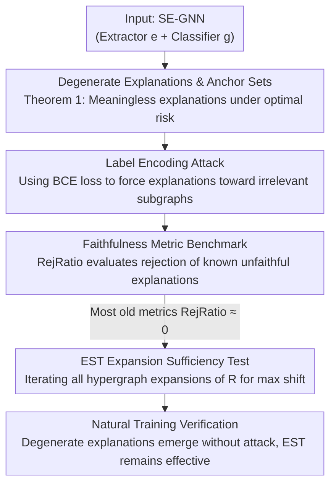

# GNN Explanations that do not Explain and How to find Them

**Conference**: ICLR 2026  
**OpenReview**: [https://openreview.net/forum?id=HBcgLe6NZD](https://openreview.net/forum?id=HBcgLe6NZD)  
**Code**: None  
**Area**: Graph Learning / Explainability  
**Keywords**: Self-interpretable GNN, Faithfulness, Degenerate Explanations, Explanation Auditing, EST

## TL;DR
This paper reveals a fatal failure mode of self-explaining Graph Neural Networks (SE-GNNs): models can output "degenerate explanations" that are completely unrelated to their actual reasoning process while maintaining optimal accuracy. It proves that most existing faithfulness metrics fail to identify such explanations. To address this, the authors construct a controllable benchmark and propose a new metric, EST, which reliably identifies these degenerate explanations as unfaithful.

## Background & Motivation
**Background**: SE-GNNs (e.g., GSAT, LRI, CAL, GMT-lin, SMGNN) couple an "explanation extractor" $e$ and a "classifier" $g$. The extractor $e$ selects an explanatory subgraph $R=e(G)$ from the input graph $G$, and $g$ makes predictions using only this subgraph, i.e., $f(G)=g(e(G))$. Since explanations are generated "endogenously" during inference (ante-hoc), they are considered inherently trustworthy and suitable for high-risk scenarios such as power grid analysis, health prediction, and drug discovery.

**Limitations of Prior Work**: Existing works have sporadically pointed out that SE-GNN explanations may be redundant, fuzzy, fail to reflect the importance of individual components, or be contaminated by spurious correlations. However, these are viewed as "minor issues." No one has systematically characterized whether SE-GNNs can **catastrophically** provide completely meaningless explanations.

**Key Challenge**: The implicit assumption of SE-GNNs is "explanatory subgraph = model decision basis." However, $g$ only receives $R$; it can entirely **encode the "predicted label" into the relative positions or values within $R$**, even if $R$ itself lacks discriminative power for the task. Consequently, the explanation can perfectly predict the label without revealing what the model is truly observing—completely decoupling explanation from reasoning.

**Goal**: (1) Formally characterize when "degenerate explanations" can appear under optimal loss; (2) Verify if an attacker can manually plant such explanations; (3) Verify if existing faithfulness metrics can detect them; (4) Verify if they emerge naturally; (5) Provide a new metric to reliably identify them.

**Key Insight**: Examining SE-GNNs from the perspective of the loss function. The authors discover a class of "non-discriminative but ubiquitous node sets" called **anchor sets**, which can be utilized by the explanation extractor as "label encoding slots," leading to degenerate explanations under optimal true risk.

**Core Idea**: Use an "expansion sufficiency test" (EST) that holistically considers all hypergraph expansions, bypassing the weakness where "each old metric only tests one type of perturbation and can thus be specifically circumvented."

## Method

### Overall Architecture
This paper does not propose a stronger SE-GNN but rather an argumentation chain of "falsification followed by tool construction": first, theoretically characterize when SE-GNNs output degenerate explanations (anchor sets + Theorem 1); second, use a **label encoding attack** to manually plant such explanations into real models as "known unfaithful" samples; third, use these samples to construct a **faithfulness metric benchmark** to evaluate existing metrics (where most fail with rejection rates near 0); finally, propose the new metric **EST** to robustly catch degenerate explanations by testing all hypergraph expansions, and return to natural training scenarios to verify that degenerate explanations emerge even without attacks.

### Key Designs

**1. Degenerate Explanations & Anchor Sets: Falsifying explanations via optimal loss**

The pain point is the default assumption: "If SE-GNN achieves high accuracy and the explanation is internal, then the explanation must reflect the decision basis." The authors formalize "non-discriminative but ubiquitous substructures" as **anchor sets**: a set of single-node subgraphs $Z=\{z_i\}_{i=1}^{m}$ ($m=|\mathcal{Y}|$, one per class) that appear in **every** input graph. Since these nodes exist in every graph, they contribute nothing to class discrimination. Theorem 1 proves that for hard extractors (outputs in $\{0,1\}$), there exist an extractor $e(G):=z_{\phi(G)}$ and a classifier $g(z_y):=y$ such that SE-GNNs implemented by GSAT, LRI, CAL, GMT-lin, and SMGNN **achieve optimal true risk**. The intuition is counter-intuitive: if the model truly only relied on these constant nodes, it could not predict the labels; achieving high accuracy means it must be looking at **other parts** of the graph—but those parts do not appear in the explanation. This proves that "optimal accuracy" and "completely unfaithful explanations" can coexist. The authors extend this to mutually exclusive node sets and subgraph-level encoding, noting that the same explanation can even correspond to opposite classes in different optimal SE-GNNs, indicating a lack of consistency.

**2. Label Encoding Attack: Manually turning specified irrelevant subgraphs into explanations**

Existential theorems are insufficient; the authors turn them into a reproducible "known unfaithful sample generator." The attack involves two steps: first, specify a **task-irrelevant** explanation for each class (e.g., green/purple nodes for RBGV, background pixels for MNISTsp, punctuation for SST2P); second, train the SE-GNN to output these specified explanations. Practically, a Binary Cross Entropy (BCE) loss is added alongside the standard classification loss $\mathcal{L}_{clf}$ to push relevance scores of nodes in the specified explanation toward 1 and others toward 0:

$$\min_{g,e}\sum_{G,y}\mathcal{L}_{clf}(g,e,G,y)+\mathcal{L}_{expl}(e,G,y),\quad \mathcal{L}_{expl}:=\frac{1}{|V|}\sum_{u\in V}\mathrm{BCE}\big(e(G)_u,\,p^y_u\big)$$

A key finding is that despite the specified explanations being weak predictors, the model **accuracy barely drops** after the attack (most F1 ≥ 92%), and sometimes even increases (e.g., DIR on MNISTsp increases by +50%). This indicates that the model encodes the predicted label **into the explanation relevance scores themselves**—the explanation appears to highlight irrelevant nodes while the truly utilized features are hidden. This step proves attackers can hide dependencies on protected attributes and provides "standard answers" for the next benchmark.

**3. Faithfulness Metric Benchmark & RejRatio: Feeding "known unfaithful" to existing metrics**

Existing faithfulness metrics were previously validated only by comparison with human ground truth or correlation with step-wise randomization rankings; they were never directly tested on whether they can "classify known unfaithful explanations as unfaithful." The authors use explanations from the attack model as audit samples. For sufficiency-type metrics, the rejection ratio is defined as:

$$\mathrm{RejRatio}_I(\mathcal{D})=\frac{1}{|\mathcal{D}|}\sum_{(G,R)\in\mathcal{D}}\max_{G'\in I}\mathbf{1}\{g(e(G))\neq g(e(G'))\}$$

where $I$ is the perturbation family allowed by the metric (edge deletion, complement deletion, complement swapping, etc.), with a budget of 50 perturbations per sample. Necessity-type metrics replace the internal condition with an equality check. Ideally, the rejection ratio should be as high as possible. The results were poor: Suf, RFid-, and CF on RBGV, Fid- on SST2P, and Fid+ on MUTAG all had RejRatio near 0—they **completely failed to detect** these intentionally crafted degenerate explanations. This exposes a systemic weakness: each metric focuses on a single type of perturbation, allowing explanations to be constructed to bypass them.

**4. EST Expansion Sufficiency Test: Bypassing the "single perturbation" trap**

The root cause of failure in old metrics is their confinement to specific perturbations. The logic of EST is to no longer rely on a specific perturbation but to **holistically** examine all hypergraph expansions of $R$ within $G$:

$$\mathrm{EST}(R,G)=\max_{R\subseteq G'\subseteq G} d\big(g(e(G)),\,g(e(G'))\big)$$

Essentially, if $R$ is truly sufficient, adding any additional content should not change the prediction. If any expansion exists that can flip the prediction, it indicates that $R$ missed features the model truly relies on, leading EST to yield a high value (more unfaithful). The authors admit EST is conservative—it might misjudge a faithful explanation due to OOD hypergraph construction—but in scenarios where model/data distribution access is limited, it is preferable to be conservative and reliably flag truly unfaithful explanations. In practice, hypergraphs are enumerated with a fixed budget. EST is the only metric achieving the highest or near-highest RejRatio across all configurations.

### An Example: Degenerate Explanations on RBGV
Consider the binary classification dataset RBGV: graphs consist of randomly connected red and blue nodes. The positive class occurs if there are more blue than red nodes (the task **depends only on the count comparison**). However, each graph contains two additional isolated nodes—one green ($u_{green}$) and one purple ($u_{violet}$), forming an anchor set irrelevant to the task. Nevertheless, the following SE-GNN achieves perfect accuracy using only green/purple nodes as explanations:

$$R=e(G)=\begin{cases}u_{green}&\#red\geq\#blue\\ u_{violet}&\#blue>\#red\end{cases}\qquad g(R)=\begin{cases}0&R=u_{green}\\ 1&R=u_{violet}\\ 0.5&\text{otherwise}\end{cases}$$

The extractor actually counts the nodes internally (the true decision basis) but "translates" the result into "highlight green or purple," misleading the user. Metrics that only delete edges cannot detect the issue with $u_{green}$/$u_{violet}$. EST, by finding an expansion that flips the prediction, identifies it as unfaithful.

## Key Experimental Results

### Main Results (Attack Success Rate + RejRatio)
Attacks succeeded on three representative architectures (GSAT, DIR, SMGNN) across four datasets: explanation F1 scores were generally ≥ 92%, with accuracy comparable to or higher than the unattacked baseline.

| Dataset | Model | Natural Acc | Post-Attack Acc | Expl. F1 |
|---------|-------|-------------|-----------------|----------|
| RBGV | GSAT | 100.0 | 99.1 | 99.7 |
| MNISTsp | DIR | 41.8 | 94.7 | 96.3 |
| MUTAG | SMGNN | 79.2 | 78.2 | 94.9 |
| SST2P | SMGNN | 83.1 | 82.8 | 59.2 (OOD, Test: 96.5) |

On the faithfulness benchmark, old metrics had RejRatio near 0 in many cases, while EST was consistently highest or near-highest (RejRatio %):

| Dataset | Model | Fid- | Suf | CF | RFid- | EST (Ours) |
|---------|-------|------|-----|----|-------|------------|
| RBGV | SMGNN | 12 | 00 | 05 | 00 | **48** |
| MNISTsp | DIR | 93 | 99 | 91 | 99 | **100** |
| MUTAG | SMGNN | 59 | 99 | 55 | 72 | **96** |
| SST2P | GSAT | 51 | 07 | 37 | 14 | **62** |

### Natural Emergence Experiment (RQ3, No Attack)
When trained under original protocols, degenerate explanations **emerge naturally without attack**, and EST effectively identifies them.

| Dataset | Model | Test Acc | EST RejRatio | Fid- | RFid- |
|---------|-------|----------|--------------|------|-------|
| RBGV | SMGNN | 98.9 | 86.8 | 54.1 | 77.6 |
| MNISTsp | SMGNN | 86.8 | 99.5 | 68.9 | 95.5 |
| MUTAG | SMGNN | 77.9 | 75.2 | 61.9 | 50.3 |
| SST2P | GSAT | 84.0 | 0.0 | 0.0 | 0.0 |

### Key Findings
- **Labels can be encoded into explanations without harming accuracy**: Post-attack accuracy remains stable or even increases (e.g., DIR/SMGNN on MNISTsp), suggesting "label encoding" might even help the model improve its own accuracy during training.
- **Existing faithfulness metrics have systemic blind spots**: Each metric targets one type of perturbation and can be specifically bypassed. Fid-/RFid- exhibit high variance across seeds on RBGV, making them unreliable.
- **EST is more robust**: In configurations where old metrics fail completely, EST still rejects about 50%, with RejRatio increasing with the budget. It also correctly accepts truly sufficient non-degenerate explanations.
- **DIR as a counterexample**: DIR is not covered by Theorem 1, but by setting a very small sparsity ratio $K$, it still encodes label information into non-discriminative subgraphs, proving degenerate explanations are not limited to anchor sets.

## Highlights & Insights
- **Falsifying implicit assumptions via "Optimal Loss"**: Theorem 1 proves that "high accuracy $\Rightarrow$ trustworthy explanation" is a false link. High accuracy may actually imply the model uses information outside the explanation.
- **Utilizing attacks as "Known Unfaithful Sample Generators"**: Typically used to show vulnerability, attacks here provide a controllable target for evaluating faithfulness metrics.
- **Extensibility of the "Hypergraph Expansion" approach**: Rather than designing specific perturbations, checking if "adding anything changes the prediction" captures the essence of sufficiency.
- **Engineering trade-off: Conservative vs. False Negative**: EST chooses to be conservative, preferring to flag potentially faithful explanations as unfaithful rather than missing truly unfaithful ones, which is safer for auditing.

## Limitations & Future Work
- Theorem 1 is limited to the anchor set setting to highlight the counter-intuitive nature; more general explanation forms require formalization.
- EST is conservative and may misjudge faithful explanations as unfaithful due to OOD hypergraphs.
- EST only estimates sufficiency, not necessity, and requires hypergraph enumeration (controlled via budget).
- How to design **intrinsically robust** SE-GNNs remains an open question, as degenerate explanations can emerge randomly.

## Related Work & Insights
- **vs. Manipulable Post-hoc Methods (Dombrowski/Heo/Slack et al.)**: Prior studies focused on post-hoc manipulation; this work focuses on ante-hoc SE-GNNs and formalizes conditions for optimal loss.
- **vs. Tai et al. 2025**: While they noted that lack of sparsity regularization leads to unfaithful explanations, this work proves that **strong sparsity regularization** also leads to unfaithfulness—both extremes are dangerous.
- **vs. Existing Faithfulness Metrics**: Standard metrics are limited by specific perturbations. EST fills this gap with a holistic hypergraph expansion test.

## Rating
- Novelty: ⭐⭐⭐⭐⭐ Falsifying the "High Accuracy $\Rightarrow$ Credibility" link via optimal loss is unique.
- Experimental Thoroughness: ⭐⭐⭐⭐ Covers 3 architectures × 4 datasets across attack and natural scenarios.
- Writing Quality: ⭐⭐⭐⭐⭐ Driven by Research Questions; Example 1 effectively illustrates abstract theorems.
- Value: ⭐⭐⭐⭐⭐ Directly warns against blind trust in SE-GNNs in high-risk scenarios and provides the EST auditing tool.

<!-- RELATED:START -->

## Related Papers

- [\[ICLR 2026\] GNN-as-Judge: Unleashing the Power of LLMs for Graph Learning with GNN Feedback](gnn-as-judge_unleashing_the_power_of_llms_for_graph_learning_with_gnn_feedback.md)
- [\[ICLR 2026\] On The Expressive Power of GNN Derivatives](on_the_expressive_power_of_gnn_derivatives.md)
- [\[NeurIPS 2025\] GnnXemplar: Exemplars to Explanations -- Natural Language Rules for Global GNN Interpretability](../../NeurIPS2025/graph_learning/gnnxemplar_exemplars_to_explanations_--_natural_language_rules_for_global_gnn_in.md)
- [\[ICLR 2026\] Exchangeability of GNN Representations with Applications to Graph Retrieval](exchangeability_of_gnn_representations_with_applications_to_graph_retrieval.md)
- [\[ICLR 2026\] Learning Concept Bottleneck Models from Mechanistic Explanations](learning_concept_bottleneck_models_from_mechanistic_explanations.md)

<!-- RELATED:END -->
## Related Papers

- [\[ICLR 2026\] On The Expressive Power of GNN Derivatives](on_the_expressive_power_of_gnn_derivatives.md)
- [\[ICLR 2026\] GNN-as-Judge: Unleashing the Power of LLMs for Graph Learning with GNN Feedback](gnn-as-judge_unleashing_the_power_of_llms_for_graph_learning_with_gnn_feedback.md)
- [\[ICLR 2026\] Exchangeability of GNN Representations with Applications to Graph Retrieval](exchangeability_of_gnn_representations_with_applications_to_graph_retrieval.md)
- [\[ICLR 2026\] On the Universality and Complexity of GNN for Solving Second-order Cone Programs](on_the_universality_and_complexity_of_gnn_for_solving_second-order_cone_programs.md)
- [\[NeurIPS 2025\] GnnXemplar: Exemplars to Explanations -- Natural Language Rules for Global GNN Interpretability](../../NeurIPS2025/graph_learning/gnnxemplar_exemplars_to_explanations_--_natural_language_rules_for_global_gnn_in.md)

<!-- RELATED:END -->
