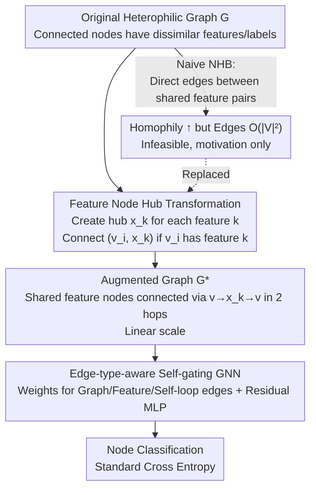

# GRAPHITE: Graph Homophily Booster — Reimagining the Role of Discrete Features in Heterophilic Graph Learning

**Conference**: ICLR 2026  
**arXiv**: [2602.07256](https://arxiv.org/abs/2602.07256)  
**Code**: [https://github.com/q-rz/ICLR26-GRAPHITE](https://github.com/q-rz/ICLR26-GRAPHITE)  
**Area**: Graph Learning  
**Keywords**: heterophilic graph, homophily boosting, graph transformation, feature nodes, GNN

## TL;DR
Ours proposes GRAPHITE, a non-learning graph transformation method that **directly boosts graph homophily** by introducing "feature nodes" as hubs to indirectly connect nodes sharing common features. It addresses the heterophily problem by "modifying graph structure" rather than "modifying GNN architecture" for the first time, significantly outperforming 27 SOTA methods on difficult benchmarks such as Actor.

## Background & Motivation

1.  **Heterophilous Graph Dilemma**: The core of GNNs—neighborhood aggregation—fails on heterophilic graphs because the features/labels of connected nodes are inherently dissimilar; aggregation only dilutes useful signals.
2.  **Architectural Patches at a Bottleneck**: Numerous heterophilic GNNs (H2GCN, GPR-GNN, FAGCN, OrderedGNN, etc.) have been designed to separate ego/neighbor embeddings, utilize multi-hop information, or frequency filtering. However, experiments show that 23 recent GNNs still perform worse than a simple MLP on the Actor dataset.
3.  **Core Observation**: The root cause lies in the low homophily of the **graph structure itself** rather than insufficient model capacity. Therefore, one should directly transform the graph structure to be more homophilous instead of designing more complex models.
4.  **Key Insight**: The definition of homophily states that nodes sharing features are more likely to be adjacent. A naive solution—directly adding edges between all node pairs sharing features—provably boosts homophily, but the number of edges grows by $O(|V|^2)$, making it computationally infeasible.

## Core Problem
How to directly boost the homophily of heterophilic graphs through deterministic graph transformation without a massive increase in graph scale, enabling standard GNNs to work effectively?

## Method

### Overall Architecture

GRAPHITE moves the battlefield for "solving heterophily" from GNN architecture back to the graph structure itself. The core idea is: since homophily implies that "nodes sharing features should be adjacent," the most intuitive approach is to add edges between all pairs of nodes sharing features (NHB scheme). However, this leads to an $O(|V|^2)$ edge explosion. GRAPHITE breaks this by introducing "feature nodes" as hubs, replacing direct pair-wise connections with indirect ones. The original graph is first rewritten via a **deterministic, non-learning** transformation into an augmented graph $\mathcal{G}^*$ with higher homophily and only linear scale growth. A **edge-type-aware** self-gating GNN is then applied to this new graph for node classification. Since the transformation is parameter-free, it is plug-and-play for any GNN.

### Key Designs

**1. Naive Homophily Booster (NHB): Proving "adding edges boosts homophily" while exposing its infeasibility**

The starting point is the definition of homophily itself—nodes sharing features should be adjacent. The most direct way is to add a "shortcut edge" for every node pair $(v_i, v_j)$ sharing at least one feature (i.e., $\|\mathbf{X}[v_i,:] \land \mathbf{X}[v_j,:]\|_\infty > 0$), termed the Naive Homophily Booster (NHB). Theorem 1 proves that under mild assumptions, this strictly increases graph homophily, theoretically validating the structural modification approach. However, the cost is an increase in edges up to $O(|V|^2)$—a 2,000-node graph could result in nearly 2 million edges, making training impossible. NHB serves as a stepping stone to confirm the direction but highlights the need for a more efficient implementation.

**2. Feature Node Hub Transformation: Reducing $O(|V|^2)$ to linear via indirect connections**

To solve the edge explosion of NHB, GRAPHITE avoids direct pair-wise connections. Instead, it creates a "feature node" $x_k$ (totaling $|\mathcal{X}|$) for each feature $k$ to act as a hub. Any graph node $v_i$ possessing feature $k$ (i.e., $\mathbf{X}[v_i,k]=1$) is connected via a "feature edge" $(v_i, x_k)$. The feature nodes themselves compute their features as the mean of their connected graph nodes (Ablation showed little difference between mean, learnable embeddings, attention, or majority voting). This step transforms the requirement of "direct edges between pairs" into "connectivity within 2 hops via $v_i \to x_k \to v_j$" (Observation 2). This equivalently recovers the desired homophilous message passing while ensuring that the number of edges grows only linearly with feature occurrences. Theorem 3 ensures both Gain: $\text{hom}(\mathcal{G}^*) > \text{hom}(\mathcal{G})$ and scalability: $|\mathcal{V}^*| \leq O(|\mathcal{V}|)$, $|\mathcal{E}^*| \leq O(|\mathcal{E}|)$.

**3. Edge-Type-Aware Self-Gating GNN: Differentiating "Graph Edges" and "Feature Edges"**

The augmented graph $\mathcal{G}^*$ contains two types of edges with distinct semantics: original graph edges carrying topological adjacency and new feature edges carrying attribute sharing. Aggregating them uniformly would waste structural information. GRAPHITE assigns different weights to three types of connections—graph edge weight $w_\mathcal{E}=1$, feature edge weight $w_\mathcal{X}$, and self-loop weight $w_0$—allowing the model to learn which type to trust. For aggregation, it adopts the self-gating mechanism from FAGCN, calculating a gating score $\alpha_{u,u'} = \tanh\!\big(\frac{\mathbf{a}^T(\mathbf{h}_u \| \mathbf{h}_{u'}) + b}{\tau}\big)$ (where $\tau$ is temperature) for each edge to adaptively determine whether to absorb or repel neighbor signals. This is followed by degree normalization and an MLP with residual connections and GELU activations. This design allows "false positive homophilous connections" (sharing features but having different labels) to be suppressed by gating, while truly homophilous feature edges are amplified.

### Loss & Training

The graph transformation is a deterministic non-learning preprocessing step that introduces no additional parameters and can be decoupled from any existing GNN. Downstream node classification is trained using standard cross-entropy loss (using an 8-layer, 512-hidden dimension GNN for heterophilic graphs, which degrades to FAGCN on homophilous ones).

## Key Experimental Results

### Main Results: Comparison with 27 Methods (6 Datasets)

| Method | Actor | Squirrel-F | Chameleon-F | Minesweeper | Cora | CiteSeer |
|------|-------|-----------|------------|------------|------|----------|
| MLP | 35.04 | 33.91 | 38.44 | 50.99 | 75.45 | 71.53 |
| GCN | 30.21 | 35.57 | 40.06 | 72.32 | 87.50 | 75.77 |
| FAGCN | 36.18 | 36.52 | 39.83 | 84.69 | 88.66 | 76.82 |
| JKNet | 28.63 | 40.81 | 40.39 | 81.00 | 86.24 | 73.11 |
| SGFormer | 25.89 | 34.54 | 42.79 | 52.06 | 86.24 | 70.74 |
| **GRAPHITE** | **37.69** | **43.06** | **45.08** | **94.78** | 88.23 | 76.41 |

Ours achieves significantly better performance across all 4 heterophilic graphs, exceeding the best baseline by +4.17%/+5.23%/+5.35%/+3.47%, and remains competitive with SOTA on homophilous graphs.

### Homophily Gain (Before → After GRAPHITE Transformation)

| Dataset | Feature Homophily Gain | Adjusted Homophily Gain |
|--------|----------------------|------------------------|
| Actor | +179% | +2767% |
| Squirrel-F | +961% | +215% |
| Chameleon-F | +1739% | +402% |
| Minesweeper | +41% | +1023% |

### Gain for Homophilous GNNs (Plug-and-play)

| Method | Actor (Original → Transformed) | Minesweeper (Original → Transformed) |
|------|-------------------|-------------------------|
| GCN | 30.21 → 34.83 | 72.32 → 75.38 |
| GAT | 28.86 → 32.09 | 87.59 → 88.66 |
| JKNet | 28.63 → 35.96 | 81.00 → 85.56 |
| GIN | 28.29 → 33.75 | 75.89 → 87.07 |

### Efficiency Analysis

| Dataset | Training Time (No Transf.) | Training Time (w/ Transf.) |
|--------|----------|----------|
| Minesweeper (10k nodes) | 1.9 min | 2.3 min |
| Actor (7.6k nodes) | 1.5 min | 2.0 min |
| Squirrel-F (2.2k nodes) | 0.7 min | 1.1 min |

The increase in runtime is controllable and significantly outweighed by the accuracy gains.

### Ablation Study on Feature Node Aggregation
There is almost no difference in performance between Mean aggregation, learnable embeddings, learnable attention, or majority voting; thus, simple Mean aggregation is chosen.

## Highlights & Insights
- **New Paradigm**: First to propose the idea of "directly boosting graph homophily" instead of "designing stronger GNNs," which has been an overlooked direction.
- **Simple but Powerful**: The core operation only involves adding feature nodes and edges—parameter-free, no training required, deterministic transformation, and plug-and-play with any GNN.
- **Theoretical Completeness**: Both homophily gain and graph scale growth are supported by rigorous mathematical proofs.
- **Persuasive Experiments**: Comprehensive comparison with 27 baselines, achieving SOTA on all heterophilic graphs, with the graph transformation alone significantly enhancing homophilous GNNs.

## Limitations & Future Work
- **Dependency on Discrete/Binary Features**: Continuous features must be discretized (e.g., one-hot encoding), but theoretical guidance for choosing discretization granularity is lacking.
- **Feature Dimension Sensitivity**: The number of feature nodes equals the feature dimension $|\mathcal{X}|$; high-dimensional sparse features may lead to a large number of hub nodes.
- **False Positive Homophilous Connections**: Nodes sharing a feature but having different labels are still connected in 2 hops; self-gating alleviates but does not fully eliminate this.
- **Theoretical Assumptions**: Theorem 1/3 rely on "mild and realistic assumptions"; scenarios where these fail were not discussed in detail.

## Related Work & Insights
- **vs H2GCN / GPR-GNN / ACM-GNN**: These handle heterophily at the architecture level (separation, filters); GRAPHITE modifies the graph structure—orthogonal and complementary.
- **vs FAGCN**: FAGCN uses self-gating for adaptive signals; GRAPHITE's GNN part also uses it, but the core innovation is the upstream graph transformation.
- **vs Graph Augmentation / Reconstruction**: Most methods learn edge weights or add/remove edges (DropEdge, IDGL); GRAPHITE is a **deterministic transformation based on feature structure** without learning.
- **vs Virtual Node**: Virtual nodes connect to all nodes and lack feature discrimination; GRAPHITE's hubs connect at a fine-grained feature level.
- **vs Graph Transformer (NodeFormer, SGFormer, DIFFormer)**: These capture long-range info via global attention but are not necessarily effective on small heterophilic graphs; GRAPHITE is more direct via structural transformation.

## Rating
- Novelty: ⭐⭐⭐⭐⭐ New paradigm—structural transformation to boost homophily.
- Experimental Thoroughness: ⭐⭐⭐⭐⭐ 27 baselines, homophily quantification, plug-and-play validation, ablation, efficiency analysis.
- Writing Quality: ⭐⭐⭐⭐⭐ Clear logical progression from NHB to GRAPHITE.
- Value: ⭐⭐⭐⭐⭐ Simple, effective, and establishes a new paradigm with theoretical guarantees.

<!-- RELATED:START -->

## Related Papers

- [\[ICLR 2026\] Graph Random Features for Scalable Gaussian Processes](graph_random_features_for_scalable_gaussian_processes.md)
- [\[ICLR 2026\] Discrete Bayesian Sample Inference for Graph Generation](discrete_bayesian_sample_inference_for_graph_generation.md)
- [\[ICLR 2026\] CORDS - Continuous Representations of Discrete Structures](cords_-_continuous_representations_of_discrete_structures.md)
- [\[AAAI 2026\] GCL-OT: Graph Contrastive Learning with Optimal Transport for Heterophilic Text-Attributed Graphs](../../AAAI2026/graph_learning/gcl-ot_graph_contrastive_learning_with_optimal_transport_for_heterophilic_text-a.md)
- [\[ICLR 2026\] HarmonyGNNs: Harmonizing Heterophily and Homophily in GNNs via Self-Supervised Node Encoding](harmonygnns_harmonizing_heterophily_and_homophily_in_gnns_via_self-supervised_no.md)

<!-- RELATED:END -->
