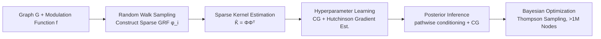

# Graph Random Features for Scalable Gaussian Processes

**Conference**: ICLR 2026  
**OpenReview**: [https://openreview.net/forum?id=89SQfLguNn](https://openreview.net/forum?id=89SQfLguNn)  
**Code**: [https://github.com/MatthewZhang473/Graph-Random-Features-for-Scalable-Gaussian-Processes](https://github.com/MatthewZhang473/Graph-Random-Features-for-Scalable-Gaussian-Processes)  
**Area**: Graph Learning / Probabilistic Methods (Gaussian Processes on Graphs)  
**Keywords**: Graph Random Features, Gaussian Process, Graph Node Kernel, Random Walk, Conjugate Gradient, Bayesian Optimization, Scalable Inference  

## TL;DR
Sparse and unbiased graph node kernel estimates are constructed using random walk-based Graph Random Features (GRF), reducing Bayesian inference for Gaussian processes on graphs from $\mathcal{O}(N^3)$ to $\mathcal{O}(N^{3/2})$ with probabilistic accuracy guarantees, enabling Bayesian optimization on graphs exceeding 1 million nodes on a single GPU.

## Background & Motivation
**Background**: Gaussian Processes (GPs) are powerful for modeling functions with uncertainty. However, when the input space consists of graph nodes (e.g., traffic networks, social networks), Euclidean distance kernels are unsuitable. Instead, node kernels defined on graphs (diffusion kernels, Matérn kernels, etc.) are required. These kernels are typically expressed as a power series of a weighted adjacency matrix $\mathbf{W}$: $\mathbf{K}_\alpha(\mathbf{W})=\sum_{r=0}^{\infty}\alpha_r\mathbf{W}^r$.

**Limitations of Prior Work**: Similar to Euclidean GPs, exact graph GPs require dense operations like $\exp(\cdot)$ or inversion on $N\times N$ matrices. Evaluating the kernel alone costs $\mathcal{O}(N^3)$, making it computationally prohibitive for large graphs. Existing speed-up methods involve trade-offs: Graph Fourier Features use truncated eigenvalue expansions, losing high-frequency kernel information; sparse kernel families limit flexibility; and local subgraph kernels abandon inference over the entire graph.

**Key Challenge**: Graph node kernels must **preserve global graph structure and high-frequency information (flexibility)** while **avoiding dense matrix operations (scalability)**—a balance difficult to achieve with prior methods.

**Goal**: To find a graph node kernel approximation that is both sparse and scalable while providing unbiased estimates for flexible kernel families, and to integrate it end-to-end into the entire GP workflow, including hyperparameter learning, posterior inference, and Bayesian optimization.

**Key Insight**: **Monte Carlo estimation via random walks**. Graph Random Features (GRF) serve as unbiased estimators of adjacency matrix power series (analogous to Von Neumann’s Russian Roulette estimator). Each feature contains only $\mathcal{O}(1)$ non-zero elements yet satisfies exponential concentration inequalities. This work demonstrates that replacing dense kernels with sparse GRF kernels $\hat{\mathbf{K}}=\mathbf{\Phi}\mathbf{\Phi}^\top$, combined with conjugate gradient iterations, reduces inference to $\mathcal{O}(N^{3/2})$ without the need to explicitly materialize the kernel matrix.

## Method

### Overall Architecture
The method consists of three steps: first, sparse features $\varphi(i)$ are sampled for each node using random walks to construct an unbiased estimate of the kernel matrix $\mathbf{K}_\alpha$ as $\hat{\mathbf{K}}=\mathbf{\Phi}\mathbf{\Phi}^\top$. Second, hyperparameters (including the modulation function $f$ and noise) are learned by maximizing the log-marginal likelihood. Gradients are computed using the Conjugate Gradient (CG) method for linear systems combined with Hutchinson trace estimation to avoid explicit inversion. Finally, posterior sampling is transformed into "prior sampling + one sparse linear solve" via pathwise conditioning to support Thompson sampling for Bayesian optimization. The entire process interacts only with $\mathcal{O}(N)$ non-zero elements, maintaining a space complexity of $\mathcal{O}(N)$.

### Key Designs

**1. Sparse Unbiased Kernel Estimation via Random Walks: Transforming Matrix Power Series into Monte Carlo Sampling.** The starting point for GRF is a "deconvolution" of the coefficient sequence to find a set of modulation functions $(f_l)$ such that $\sum_{l=0}^{r}f_l f_{r-l}=\alpha_r$, ensuring that $\mathbf{\Psi}=\sum_{l=0}^{\infty}f_l\mathbf{W}^l$ satisfies $\mathbf{\Psi}^\top\mathbf{\Psi}=\mathbf{K}_\alpha$ for symmetric $\mathbf{W}$. Since $\mathbf{W}^l_{ij}$ counts (weighted) walks of length $l$ between nodes $i$ and $j$, the entire kernel can be interpreted as a "weighted sum of walks of various lengths." The core of GRF involves simulating random walks from each node and recording three items for each prefix (first $l$ steps): the product of edge weights, the modulation function $f$, and the marginal probability $p$ of the prefix under the sampling mechanism. These are accumulated into the feature vector as $(\prod \text{edge weights})\cdot f(\text{len})/p(\text{prefix})$. **Importance sampling** via the $1/p$ factor is crucial: it weights long and rare walks appropriately to ensure $\mathbb{E}(\varphi(i)^\top\varphi(j))=[\mathbf{K}_\alpha]_{i,j}$ is unbiased. Each feature has $\mathcal{O}(1)$ non-zeros, and the entire $\hat{\mathbf{K}}$ has $\mathcal{O}(N)$ non-zeros, satisfying the exponential concentration bound (Theorem 1), with the number of walks $n$ being independent of the graph size $N$.

**2. Well-conditioned Sparse Kernels → $\mathcal{O}(N^{3/2})$ Solution via Conjugate Gradient (New Theory).** Sparsity alone is insufficient; it is critical to prove that solving linear systems with such kernels is also fast. Theorem 2 provides two properties of $\hat{\mathbf{K}}$: (1) Due to $\mathcal{O}(N)$ non-zeros, matrix-vector multiplication $\hat{\mathbf{K}}\boldsymbol{v}$ takes only $\mathcal{O}(N)$; (2) Under the assumption that $\|\varphi(i)\|_1\le c$, the regularized condition number is bounded by $\kappa(\hat{\mathbf{K}}+\sigma_n^2\mathbf{I})\le 1+\frac{Nc^2}{\sigma_n^2}=\mathcal{O}(N)$. This leads to Lemma 1: solving $(\hat{\mathbf{K}}+\sigma_n^2\mathbf{I})\boldsymbol{v}=\boldsymbol{b}$ using CG requires $\sqrt{\kappa}=\mathcal{O}(N^{1/2})$ iterations, each costing $\mathcal{O}(N)$, totaling $\mathcal{O}(N^{3/2})$. In practice, $\hat{\mathbf{K}}$ is not explicitly formed; instead, two linear-time matrix-vector multiplications $\mathbf{\Phi}(\mathbf{\Phi}^\top\boldsymbol{v})$ are used.

**3. End-to-End Iterative GP Workflow: Hyperparameter Learning + Pathwise Conditioning.** For hyperparameter learning, the log-marginal likelihood $\mathcal{L}(\boldsymbol{\theta})=-\frac12\boldsymbol{y}^\top\mathbf{H}_{\boldsymbol{\theta}}^{-1}\boldsymbol{y}-\frac12\log\det\mathbf{H}_{\boldsymbol{\theta}}-\frac{N}{2}\log(2\pi)$ is maximized, where $\mathbf{H}_{\boldsymbol{\theta}}=\hat{\mathbf{K}}_{xx}+\sigma_n^2\mathbf{I}$. Inversions in the gradient are solved using CG, and the trace term $\mathrm{tr}(\mathbf{H}_{\boldsymbol{\theta}}^{-1}\partial\mathbf{H}_{\boldsymbol{\theta}})$ is solved as a linear system for a batch of random probes using the Hutchinson estimator. Posterior inference uses pathwise conditioning, expressing posterior samples as "prior samples + correction terms": $\boldsymbol{g}_{|\boldsymbol{y}}(\cdot)=\boldsymbol{g}(\cdot)+\hat{\mathbf{K}}_{(\cdot)x}(\hat{\mathbf{K}}_{xx}+\sigma_n^2\mathbf{I})^{-1}(\boldsymbol{y}-(\boldsymbol{g}(\boldsymbol{x})+\boldsymbol{\varepsilon}))$. Prior samples are efficiently drawn as $\boldsymbol{g}=\mathbf{\Phi}\boldsymbol{w},\ \boldsymbol{w}\sim\mathcal{N}(\mathbf{0},\mathbf{I})$ (since $\mathrm{Cov}(\mathbf{\Phi}\boldsymbol{w})=\hat{\mathbf{K}}$), and the inverse in the correction term is handled by CG. This workflow relies exclusively on sparse matrix-vector multiplication, naturally fitting the GRF structure and providing scalable posterior samples for Thompson sampling BO on large graphs.

## Key Experimental Results

### Main Results: Scalability and Regression
- **Sparse vs. Dense GRF (Synthetic Graphs)**: On 8,192 nodes, the sparse implementation achieves a **50×** wall-clock speedup compared to the dense implementation that materializes the kernel matrix. The sparse version extends to **1 million nodes**, while the dense version is limited to 8,192 nodes due to VRAM constraints.
- **Traffic Speed Prediction (San Jose Road Network)**: When the number of walks $n\gtrsim 500$, the GRF kernel with learnable modulation functions **outperforms the exact diffusion kernel** $\mathbf{K}_{\text{diff}}$ in NLPD and RMSE, and consistently beats "diffusion-shaped" GRF variants.
- **Global Wind Field Interpolation (ERA5, 10K node kNN graph)**: The exact diffusion kernel is omitted due to $\mathcal{O}(N^3)$ complexity. The learnable GRF kernel improves continuously as $n$ increases, outperforming diffusion-shaped variants in both NLPD and RMSE.

### Ablation Study

| Experiment | Setting | Conclusion |
|------|------|------|
| Empirical Scaling | Sparse GRF | Memory $1.00$, Init $0.81$, Train $1.04$, Infer $1.04$ ($\mathcal{O}(N^b)$) |
| Empirical Scaling | Dense GRF | Memory $2.00$, Train $1.97$, Infer $2.16$ (Confirms sparsity is transformative) |
| Importance Sampling | Removed $1/p(\text{prefix})$ reweighting | Regression performance **degrades significantly**; long-range dependencies are hard to model |
| Modulation Function | Learnable $f_l$ vs. Fixed Diffusion Shape | Learnable version is consistently better, showing the value of implicit kernel learning |

### Key Findings
- The sparsity of GRF acts as a **reasonable inductive bias**: two nodes have non-zero covariance only if their sets of random walks intersect. This makes predictions rely primarily on local neighborhoods while sampling long-range dependencies with low probability, preventing the "over-smoothing" caused by noise-driven spurious long-range correlations in dense kernels.
- In various tasks including synthetic graphs, social networks (Enron / Facebook / Twitch / YouTube), and ERA5 wind speed BO, GRF-BO (Thompson sampling) yields lower regret than random search, BFS, or DFS across almost all datasets.
- Strong performance is also observed in Cora citation network multi-classification (variational inference, non-conjugate setting), serving as a preliminary exploration for future work.

## Highlights & Insights
- **Linking "Sparsity + Unbiasedness + Well-conditioning" into a complete complexity proof**: Theorem 2's conclusion regarding the $\mathcal{O}(N)$ condition number is novel. It connects "sparse features" to "CG iteration count $\mathcal{O}(N^{1/2})$," strictly yielding $\mathcal{O}(N^{3/2})$.
- **Win-win for Flexibility and Scalability**: Learnable modulation functions allow the GRF kernel to outperform exact diffusion kernels, breaking the intuition that approximation necessarily sacrifices accuracy.
- **Sparsity as Inductive Bias**: Interpreting the byproduct of Monte Carlo approximation (sparsity) as a reasonable prior for graph signals is insightful.
- **Solid Engineering**: Successfully executing BO on >1M nodes on a single RTX 2080 Ti (11GB) with open-sourced reproducible code.

## Limitations & Future Work
- **Lack of complexity guarantees for classification/non-conjugate settings**: Under variational GP classification, pathwise conditioning is non-trivial, and Lemma 1's $\mathcal{O}(N^{3/2})$ guarantee does not directly apply. This is left for future work.
- **Theoretical dependence on finite constant $c$**: Convergence requires $c=\sum_r|f_r|(\max_{ij}\mathbf{W}_{ij}d_i/(1-p))^r$, meaning the spectral radius must fall within the convergence domain. While this holds in practice with truncated walk lengths, caution is needed for graphs with heavy-tailed degree distributions or large edge weights.
- **Near-linear trends as finite-scale phenomena**: The observed near-linear time for training/inference is due to fixed iteration budgets; the $\mathcal{O}(N^{3/2})$ term may become dominant at even larger scales.
- **Walk number $n$ requires tuning**: $n$ directly determines variance and the number of non-zeros. While independent of $N$, it must be selected based on accuracy requirements.

## Related Work & Insights
- **Original GRF Works** (Choromanski 2023; Reid et al. 2023, 2024a/b): This work builds on these foundations, completing the puzzle of "sparsity acceleration + BO applications" (Reid et al. 2024a only performed theoretical posterior analysis on small diffusion kernels without utilizing sparsity or BO).
- **Euclidean Random Features** (Rahimi & Recht 2007): This work is the discrete graph domain counterpart, sharing the same concept (expectation of dot products equals a kernel).
- **Iterative GP Inference** (Gardner et al. 2018; Lin et al. 2024) and **Pathwise Conditioning** (Wilson et al. 2020/2021): This scalable workflow connects these two lines of research to the sparse structure of GRF.
- **Insight**: When an estimator possesses "unbiasedness + sparsity + controllable condition number," it can leverage the entire iterative numerical linear algebra toolkit (CG / Hutchinson / pathwise). This serves as a general paradigm for making Monte Carlo kernel methods scalable, transferable to other discrete structures like hypergraphs or simplicial complexes.

## Rating
- **Novelty**: ⭐⭐⭐⭐ Solid combination of innovation by providing a critical new condition number theory (Theorem 2) and enabling BO applications on top of existing GRF estimators.
- **Experimental Thoroughness**: ⭐⭐⭐⭐ Covers scaling ablations, importance sampling ablations, regression, social/wind BO, and preliminary classification, reaching scales of 1M nodes. Comparisons with more approximate GP baselines are missing.
- **Writing Quality**: ⭐⭐⭐⭐ Clear logic from theory to algorithm to experiments. Complete complexity derivations and intuitive explanations of GRF.
- **Value**: ⭐⭐⭐⭐ Practically pushes graph GP/BO into the million-node scale while maintaining competitiveness, offering real momentum for applications in graph signal modeling and network optimization.

<!-- RELATED:START -->

## Related Papers

- [\[ICLR 2026\] FLOCK: A Knowledge Graph Foundation Model via Learning on Random Walks](flock_a_knowledge_graph_foundation_model_via_learning_on_random_walks.md)
- [\[ICLR 2026\] GRAPHITE: Graph Homophily Booster — Reimagining the Role of Discrete Features in Heterophilic Graph Learning](graph_homophily_booster_reimagining_the_role_of_discrete_features_in_heterophili.md)
- [\[ICLR 2026\] HGNet: Scalable Foundation Model for Automated Knowledge Graph Generation from Scientific Literature](hgnet_scalable_foundation_model_for_automated_knowledge_graph_generation_from_sc.md)
- [\[ICML 2026\] Full-Spectrum Graph Neural Network: Expressive and Scalable](../../ICML2026/graph_learning/full-spectrum_graph_neural_network_expressive_and_scalable.md)
- [\[ACL 2026\] LogosKG: Hardware-Optimized Scalable and Interpretable Knowledge Graph Retrieval](../../ACL2026/graph_learning/logoskg_hardware-optimized_scalable_and_interpretable_knowledge_graph_retrieval.md)

<!-- RELATED:END -->
