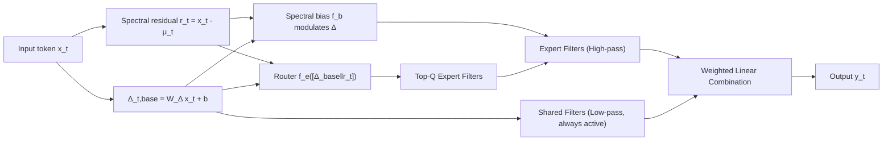

# Graph Signal Processing Meets Mamba2: Adaptive Filter Bank via Delta Modulation

**Conference**: ICLR 2026  
**OpenReview**: [https://openreview.net/forum?id=w0XhHcXfKv](https://openreview.net/forum?id=w0XhHcXfKv)  
**Code**: To be confirmed  
**Area**: Graph Signal Processing / State Space Models / Efficient Sequence Modeling  
**Keywords**: Mamba2, Graph Signal Processing, Filter Bank, Delta Modulation, Expert Routing, Interpretability  

## TL;DR
This paper reinterprets the multi-head recursion of Mamba2 as a graph filter bank on a line graph. It proposes HADES, a hierarchical structure of "shared low-pass filters + expert high-pass filters" via spectral residual-based delta modulation, achieving or exceeding Mamba2 performance with only 58.9% of the parameters.

## Background & Motivation
**Background**: State Space Models (SSMs) provide an efficient alternative to attention with linear-time recursion. Mamba2 achieves strong benchmarks through selective input gating and multi-head structures for parallel computation.

**Limitations of Prior Work**: The multi-head recursions in Mamba2 run independently without structural constraints or analysis. By analyzing spectral responses via effective rank (Fig. 1), the authors found that Mamba2 heads collapse into a low-rank spectral subspace—most heads operate in highly overlapping frequency bands, failing to form complementary filters as in an ideal filter bank, leading to significant redundancy.

**Key Challenge**: While multi-head structures theoretically provide rich spectral diversity, without an explicit coordination mechanism, these heads degrade into functionally identical "generic smoothing kernels," wasting parameters and failing to balance global long-range information with local high-frequency details.

**Goal**: To inject structured, adaptive filtering roles into Mamba2 without sacrificing efficiency, ensuring different heads cover distinct frequency bands.

**Key Insight**: **[GSP Reinterpretation]** A 1D token sequence can be viewed as a signal on a line graph (tokens as nodes, temporal connections as edges), where each Mamba2 head acts as a graph filter and the multi-head setup as a graph filter bank. **[Hierarchical Filtering]** Based on this, a hierarchy of shared filters (global low-pass) and expert filters (local high-pass) is designed, achieving frequency division by imposing structural biases on the discrete step parameter $\Delta$.

## Method

### Overall Architecture
HADES (Hierarchical ADaptive filter bank for Efficient SSMs) splits the $M$ filters (heads) of Mamba2 into two types: $S$ **shared filters** that are always active to handle global smoothing (low-frequency), and $E$ **expert filters** where a router dynamically selects the Top-$Q$ per token for local high-frequency details. At each timestep, $H=S+E$ filters are activated. Routing scores are determined by the spectral residual $r_t$ and the base step size $\Delta_{t,\text{base}}$. The final output is a weighted linear combination of the selected filters, supplemented by two regularization losses to prevent degradation of filter specialization.

### Key Designs

**1. Filter Bank Reinterpretation from a GSP Perspective.** On a line graph, S4 is a Linear Time-Invariant (LTI) system where the convolution kernel $h_k=CA^kB$ represents graph filter coefficients, expressed as graph convolution $y=\sum_k h_k S^k x$. Mamba becomes a Linear Time-Varying (LTV) system due to input-dependent parameters, with coefficients $h_k^{(t)}=C_tA_{t:t-k}B_{t-k}$ (where $A_{t:t-k}=\prod A_i$). Multi-head Mamba2 naturally corresponds to a filter bank of $M$ parallel filters $y_t=\Phi(\{\sum_k h_k^{(i,t)}S^k x\}_{i=1}^M)$. This reinterpretation clarifies that redundancy occurs because filters are not guided toward different frequency bands.

**2. Expert Filters + Spectral Residual Routing.** For each token, the spectral residual $r_t=x_t-\mu_t$ is calculated (where $\mu_t$ is the running mean), measuring the "local deviation" from the global trend—representing high-frequency components. Concatenating the base step size with the residual, a linear projection yields expert selection scores $s_t=f_e([\Delta_{t,\text{base}}\Vert r_t])\in\mathbb{R}^E$, activating the Top-$Q$ experts. Experts are not rigidly bound to fixed bands but induce different dynamics via their $\Delta$ configurations, implicitly shaping responses based on token frequency characteristics.

**3. Spectral Bias Modulation of $\Delta$.** The residual $r_t$ also modulates $\Delta$ itself by injecting a frequency-sensitive bias: $\Delta_{t,\text{HADES}}=\text{Softplus}(\Delta_{t,\text{base}}+\gamma\cdot f_b([\Delta_{t,\text{base}}\Vert r_t]))$, where $f_b$ is a single-layer projection and $\gamma$ controls intensity. Since $\Delta$ determines discretization and subsequently $A_t, B_t$, increasing the step size favors local high-frequencies, while occasional negative biases shrink the step size to better incorporate global context. Shared filters deliberately omit this bias, using only $\Delta_{t,\text{base}}$ to maintain a stable low-pass base, similar to GCN smoothing kernels.

**4. Dual Regularization for Filter Specialization.** To prevent routing collapse, a load balancing loss punishes preference variance using the squared coefficient of variation: $\mathcal{L}_{\text{balance}}=\text{Var}(s_t)/(\mathbb{E}[s_t]^2+\epsilon)$. A diversity loss imposes an ortho-decorrelation constraint on $\ell_2$-normalized filter outputs: $\mathcal{L}_{\text{diversity}}=\mathbb{E}_{i,j}[(\langle\hat y_i,\hat y_j\rangle-\delta_{ij})^2]$. The total loss is $\mathcal{L}=\mathcal{L}_{\text{task}}+\lambda_1\mathcal{L}_{\text{balance}}+\lambda_2\mathcal{L}_{\text{diversity}}$.

## Key Experimental Results

### Main Results (Language Modeling + 8 Zero-shot Reasoning tasks, 370M parameter scale)

| Model | Wiki ppl↓ | LMB ppl↓ | 8-Task Avg↑ |
|------|-----------|----------|-------------|
| Linear Transformer | 45.43 | 73.93 | 39.63 |
| RetNet | 34.12 | 29.46 | 41.54 |
| DeltaNet | 33.25 | 26.82 | 41.33 |
| Mamba1 | 47.51 | 85.53 | 39.47 |
| Mamba2 | 31.34 | 24.38 | 41.63 |
| **HADES (Ours)** | 31.48 | **21.74** | **42.91** |

HADES utilizes only 218M parameters (58.92% of Mamba2-370M) and outperforms all baselines in LMB perplexity and average accuracy. Training used ~200B tokens from the Pile.

### Ablation Study (Table 2)

| Variant | Wiki ppl↓ | LMB ppl↓ | 8-Task Avg↑ |
|------|-----------|----------|-------------|
| **HADES (Full)** | 31.51 | 21.74 | **42.91** |
| w/o L_balance | 34.73 | 26.84 | 41.57 |
| w/o L_diversity | 33.83 | 27.40 | 42.15 |
| Shared Only | 34.55 | 27.64 | 42.21 |
| Expert Only | 36.34 | 30.12 | 41.68 |
| Fixed Selection | 34.55 | 27.64 | 42.21 |
| Random Selection | 35.78 | 32.77 | 41.03 |
| Pos. Bias | 30.23 | 21.93 | 42.15 |
| No Bias | 34.57 | 28.79 | 41.11 |

### Key Findings
- **Dual losses are essential**: Removing $\mathcal{L}_{\text{balance}}$ leads to concentrated selection and under-trained experts, degrading performance.
- **Shared > Pure Expert**: Using only shared filters (42.21) outperforms using only experts (41.68), confirming global low-frequency information as a stable foundation.
- **Spectral Residual Routing > Random/Fixed**: Selection based on spectral properties is optimal; "No Bias" performed worst, highlighting delta modulation as key.
- **Long Context Retrieval**: HADES significantly outperforms Mamba2 in passkey retrieval tasks, validating the effectiveness of adaptive filtering for remote dependencies.
- **Spectral Visualization**: Mamba2 outputs primarily retain low frequencies. In HADES, shared filters emphasize low frequencies while expert filters (rippled kernels) cover high frequencies, resulting in higher effective rank and lower redundancy than Mamba2.

## Highlights & Insights
- **Clear Theoretical Bridge**: Interprets Mamba2 multi-head redundancy through the lens of frequency bands and transfers the "low-pass = smoothing" intuition from GCNs to SSMs.
- **Superior Efficiency**: Outperforming Mamba2 with 58.9% parameters proves that structured specialization is more efficient than simply stacking heads.
- **Strong Interpretability**: Analysis of filter selection shows distinct specialization of experts between Passkey/Query regions and dummy text.
- **Lightweight Modification**: Spectral residuals, Top-$Q$ routing, and $\Delta$ bias are implemented via single-layer linear projections, ensuring low engineering overhead.

## Limitations & Future Work
- The filter bank is a **conceptual tool**; the model does not explicitly compute graph spectra, making the interpretation more of a post-hoc analysis.
- Experts are not explicitly bound to fixed frequency bands; division of labor emerges implicitly, which may limit controllability.
- Experiments are focused on the 370M scale with the Pile; scalability to larger models or other modalities remains to be verified.
- Additional inference overhead from Top-$Q$ routing and hardware friendliness of sparse experts were not discussed in depth.

## Related Work & Insights
- **Delta modulation in Mamba long context** (Ben-Kish 2025, Azizi 2025): HADES upgrades delta modulation from a long-range enhancement tool to a control knob for frequency specialization.
- **Criticism of SSM Architectures** (Wang 2025): Points out recency bias and information bottlenecks; HADES addresses these via structured filter banks in real-world tasks.
- **GSP / Graph Filter Banks**: Provides a theoretical reference for the low-pass role of shared filters.
- **Insight**: Quantifying whether multi-head/multi-expert setups actually specialize using spectra/effective rank is a universal methodology for diagnosing redundancy in efficient sequence models.

## Rating
- **Novelty**: ⭐⭐⭐⭐ — Reinterpreting Mamba2 via GSP filter banks and implementing a hierarchical shared/expert structure is novel and self-consistent.
- **Experimental Thoroughness**: ⭐⭐⭐⭐ — Covers LM, reasoning tasks, long-context retrieval, and rich ablations; scale is moderate.
- **Writing Quality**: ⭐⭐⭐⭐ — Clear progression from theory to method to analysis; visualizations are helpful.
- **Value**: ⭐⭐⭐⭐ — Surpassing Mamba2 with fewer parameters and better interpretability offers practical insights for efficient SSM design.

<!-- RELATED:START -->

## Related Papers

- [\[ICLR 2026\] Adaptive Mixture of Disentangled Experts for Dynamic Graph Out-of-Distribution Generalization](adaptive_mixture_of_disentangled_experts_for_dynamic_graph_out-of-distribution_g.md)
- [\[ICLR 2026\] AdaSpec: Adaptive Spectrum for Enhanced Node Distinguishability](adaspec_adaptive_spectrum_for_enhanced_node_distinguishability.md)
- [\[ICML 2025\] Positional Encoding meets Persistent Homology on Graphs](../../ICML2025/graph_learning/positional_encoding_meets_persistent_homology_on_graphs.md)
- [\[AAAI 2026\] Self-Adaptive Graph Mixture of Models](../../AAAI2026/graph_learning/self-adaptive_graph_mixture_of_models.md)
- [\[AAAI 2026\] Adaptive Riemannian Graph Neural Networks](../../AAAI2026/graph_learning/adaptive_riemannian_graph_neural_networks.md)

<!-- RELATED:END -->
