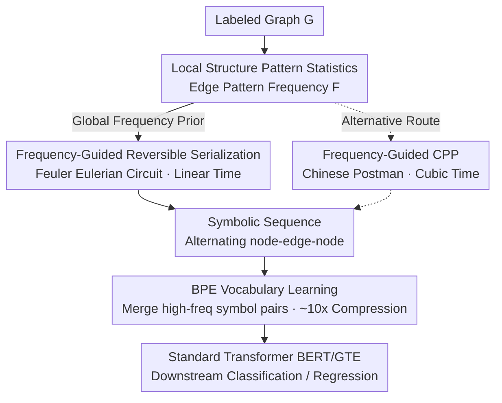

# Graph Tokenization for Bridging Graphs and Transformers

**Conference**: ICLR 2026  
**arXiv**: [2603.11099](https://arxiv.org/abs/2603.11099)  
**Code**: Available (provided in supplementary materials)  
**Area**: Graph Learning  
**Keywords**: graph tokenization, BPE, graph serialization, Transformer, graph classification

## TL;DR
The GraphTokenizer framework is proposed to convert graphs into symbolic sequences through reversible frequency-guided serialization, followed by BPE to learn a graph substructure vocabulary. This allows standard Transformers (e.g., BERT/GTE) to process graph data directly without architectural modifications, achieving SOTA results across 14 benchmarks.

## Background & Motivation

**Background**: Learning from graph-structured data primarily relies on GNNs (aggregating neighbor information via message passing) or specifically designed Graph Transformers (introducing attention mechanisms for graphs). Another research line involves converting graphs into continuous embeddings for Transformer consumption.

**Limitations of Prior Work**: (a) Graph Transformers require graph-specific architectural designs, preventing the direct reuse of pretrained models and training techniques from the LLM ecosystem; (b) mapping graphs to continuous embeddings often leads to information loss or unstable representations; (c) existing graph serialization methods (Random Walk, BFS/DFS) are either irreversible (losing edge connectivity) or non-deterministic (isomorphic graphs producing different sequences).

**Key Challenge**: Text is naturally a path graph with fixed neighborhood structures and order—tokenization is straightforward. However, neighborhoods in general graphs can branch in multiple directions, lack a unique node ordering, and n-gram co-occurrence statistics cannot be directly applied.

**Goal**: Design a universal graph tokenizer that faithfully converts any labeled graph into a discrete token sequence, enabling standard sequence models to process graph data directly.

**Key Insight**: Graph tokenization is decomposed into two steps: (1) reversible and deterministic graph serialization, and (2) learning a substructure vocabulary from the serialized corpus using BPE. The key insight is that guiding the serialization through global frequency statistics ensures common substructures appear adjacently in the sequence, making them ideal for BPE's greedy merging strategy.

**Core Idea**: Frequency-guided reversible graph serialization + BPE = Graph Tokenizer, reframing graph learning as a sequence modeling problem.

## Method

### Overall Architecture
The core question GraphTokenizer addresses is: Can a Transformer process graphs like text without any architectural changes? The solution is to transform graphs into discrete token sequences. The pipeline, denoted as $\Phi = T \circ f$, involves three steps: first, scan the training set to count the frequencies $F$ of local edge patterns to obtain a global prior; next, use this frequency map to guide a reversible traversal $f_g(\mathcal{G}, F)$, "straightening" the graph into a lossless symbolic sequence of alternating node-edge-node symbols; finally, use a BPE tokenizer $T$ to compress the symbolic sequence into a token sequence $S_T$ for a standard Transformer (BERT/GTE). Since both serialization and BPE are reversible, the original graph can be fully reconstructed by applying $f^{-1} \circ T^{-1}$ during decoding—this lossless property is fundamental to the framework's performance. Two interchangeable routes are provided for serialization: the default Eulerian Circuit (Feuler) and the Chinese Postman Problem (CPP).

### Key Designs

**1. Local Structure Pattern Statistics: Providing a Global Prior for Serialization**

The first question in the pipeline is "in what order should the graph be traversed?" GraphTokenizer derives the answer from statistical priors of the training set. It scans all graphs to count the frequency $F(p)$ of each local edge pattern $p = (l_u, l_e, l_v)$ (start label, edge label, end label). Edge patterns are chosen because they are the minimal substructures that preserve typed relationships between two entities: they have low computational cost and are naturally invariant under node permutation. This frequency map $F$ serves as a global signal throughout subsequent steps—it provides deterministic priority for serialization (eliminating ordering ambiguity) and ensures high-frequency substructures appear adjacently, providing ideal input for BPE.

**2. Frequency-Guided Reversible Serialization (Feuler): Straightening Graphs Losslessly**

Text is easy to tokenize because it is inherently a path graph with a unique sequence; general graphs branch and lack natural node ordering. The key difficulty is "how to faithfully flatten a graph into a line." This work traverses along an Eulerian circuit, ensuring every edge is visited exactly once. Each undirected edge is first split into two directed edges, so any connected graph satisfies the existence condition for an Eulerian circuit. During traversal, upon arriving at node $u$, the next edge is selected from the unvisited outgoing edge set $\mathcal{E}_u$ according to frequency priority: $e^* = \arg\max_{e_i \in \mathcal{E}_u} \pi(e_i, F)$, where the priority is simply the frequency $\pi(e_i, F) = F(p_i)$. The output is a symbolic sequence of alternating node-edge-node. This design offers three advantages: the Eulerian circuit ensures every edge is recorded, making serialization naturally reversible (the graph can be reconstructed by reversing the process); frequency guidance eliminates the uncertainty of the classic Hierholzer algorithm, ensuring isomorphic graphs produce identical sequences; the traversal takes $O(|\mathcal{E}|)$ time. In contrast, Random Walk is irreversible, BFS/DFS lose edge connectivity, and SMILES is limited to molecular graphs.

**3. BPE Vocabulary Learning: Discovering Semantic Substructure Tokens**

Serialization transforms the graph into a symbol string; BPE performs the actual compression and provides semantic meaning. It is trained on the serialized corpus, iteratively merging the most frequent adjacent symbol pairs into new tokens. Because the previous step placed high-frequency substructures in adjacent positions, BPE's greedy merging effectively "assembles" meaningful graph substructures—each merged token corresponds to a decodable subgraph fragment. This step provides three benefits: sequence length is compressed by approximately 10x, significantly reducing Transformer computational overhead; the learned vocabulary is hierarchical and semantic (e.g., corresponding to functional groups in molecular graphs); the process is entirely data-driven, requiring no domain knowledge.

**4. Frequency-Guided CPP (Chinese Postman Problem): Alternative Serialization Route**

As a comparison to Feuler, serialization based on the Chinese Postman Problem is also provided: the graph is covered using a minimum-weight traversal of all edges, with frequency information encoded into edge weights $w(e) = \alpha \cdot 1 + (1-\alpha) \cdot g(F(p_e))$, causing high-frequency edges to be visited consecutively. Since CPP solving itself produces highly structured sequences, the gain from frequency guidance is relatively limited compared to Feuler. However, the cost is complexity—CPP is $O(|\mathcal{V}|^3)$, much higher than Feuler's $O(|\mathcal{E}|)$, making Feuler the preferred practical choice.

### Loss & Training
The Tokenizer itself requires no gradient-based training (BPE is a statistical algorithm). Downstream training uses standard Transformers:
- GT+BERT: BERT-small architecture, prepending a [CLS] token.
- GT+GTE: Larger GTE model (approximately BERT-base parameter scale).
- Standard classification/regression losses.

## Key Experimental Results

### Main Results

| Model | molhiv (AUC↑) | p-func (AP↑) | mutag (Acc↑) | zinc (MAE↓) | qm9 (MAE↓) |
|------|--------------|-------------|-------------|------------|------------|
| GCN | 74.0 | 53.2 | 79.7 | 0.399 | 0.134 |
| GIN | 76.1 | 61.4 | 80.4 | 0.379 | 0.176 |
| GraphGPS | 78.5 | 53.5 | 84.3 | 0.310 | 0.084 |
| GraphMamba | 81.2 | 67.7 | 85.0 | 0.209 | 0.083 |
| GCN+ | 80.1 | **72.6** | 88.7 | 0.116 | 0.077 |
| GT+BERT | 82.6 | 68.5 | 87.5 | 0.241 | 0.122 |
| **GT+GTE** | **87.4** | 73.1 | **90.1** | **0.131** | **0.071** |

GT+GTE achieves SOTA on most of the 14 benchmarks using standard off-the-shelf Transformers without any graph-specific architectural modifications.

### Ablation Study

| Serialization Method | molhiv (w/ BPE) | molhiv (w/o BPE) | zinc (w/ BPE) | zinc (w/o BPE) |
|-----------|----------------|-----------------|-------------|--------------|
| BFS | 72.3 | 81.2 | 0.453 | 0.696 |
| DFS | 76.0 | 79.1 | 0.446 | 0.705 |
| Eulerian | 84.5 | 81.0 | 0.164 | 0.160 |
| **Feuler** | **87.4** | 81.3 | **0.131** | 0.171 |
| CPP | 86.9 | 81.2 | 0.141 | 0.145 |

### Key Findings
- **Reversible serialization is critical**: Edge traversal methods (Eulerian/CPP) significantly outperform node traversal methods (BFS/DFS/TOPO) by preserving complete edge connectivity information.
- **Frequency guidance is effective**: Feuler consistently outperforms unguided Eulerian traversal and exhibits lower variance.
- **BPE is a key component**: It improves performance in almost all configurations while providing ~10× sequence compression and 2.5× training acceleration.
- **Model scalability**: Scaling from GT+BERT to GT+GTE yields consistent performance gains, unlike GNNs which may degenerate due to over-smoothing.
- BPE-learned vocabulary has chemical semantics: Token size distribution peaks at 4-6 nodes (corresponding to functional groups); atom-level tokens account for only 7.1%.

## Highlights & Insights
- **Paradigm Shift in Graph Learning**: Graph learning is completely reframed as a sequence modeling problem, decoupling data representation from model architecture. This means the graph domain can directly benefit from all advances in the LLM ecosystem (longer contexts, efficient attention, pretrained models, etc.).
- **Co-design of Frequency-Guided Serialization and BPE**: These are not simply cascaded; they are designed for synergy—serialization creates the ideal compressed input for BPE, and BPE in turn finds meaningful substructures. This co-design philosophy can be transferred to the tokenization of other non-sequential data.
- **Reversibility as Quality Assurance**: The reversibility of serialization is not just a theoretical advantage; it directly correlates with better downstream performance—lossless information is the foundation of high-quality tokenization.

## Limitations & Future Work
- Only validated on graph-level tasks (classification/regression); node-level and edge-level tasks remain untested.
- Serialization relies on the connected graph assumption; non-connected graphs must be serialized separately and concatenated.
- Frequency statistics are based on the simplest edge patterns $(l_u, l_e, l_v)$; statistical guidance from larger substructure patterns has not been explored.
- BPE is a greedy algorithm and may not find the globally optimal substructural decomposition.
- Pretraining+fine-tuning paradigm is unexplored—pretraining a tokenizer+Transformer on large-scale graph data could further improve performance.

## Related Work & Insights
- **vs GraphGPS**: GraphGPS is a specifically designed Graph Transformer requiring graph-specific components like positional encodings; GT uses off-the-shelf Transformers and achieves better performance.
- **vs GraphMamba**: GraphMamba uses serialization with the Mamba architecture, but its serialization is non-reversible and non-deterministic; GT's serialization has superior theoretical properties.
- **vs GCN+**: GCN+ is an enhanced GNN baseline that performs close to GT+GTE on some datasets but lags significantly on others like molhiv (80.1 vs 87.4).
- **vs SMILES**: SMILES is a domain-specific serialization for molecular graphs and cannot generalize to general graphs; GT is applicable to any labeled graph.

## Rating
- Novelty: ⭐⭐⭐⭐⭐ Fully ports the NLP tokenization paradigm to the graph domain with a novel concept and complete execution.
- Experimental Thoroughness: ⭐⭐⭐⭐⭐ 14 benchmarks, comprehensive ablations, efficiency analysis, and visualization.
- Writing Quality: ⭐⭐⭐⭐⭐ Clear problem definition, rigorous theoretical framework, and well-designed visuals.
- Value: ⭐⭐⭐⭐⭐ Potentially changes the research paradigm for graph learning, making standard Transformers directly applicable to graph data.

<!-- RELATED:START -->

## Related Papers

- [\[ICLR 2026\] Bridging Input Feature Spaces Towards Graph Foundation Models](bridging_input_feature_spaces_towards_graph_foundation_models.md)
- [\[AAAI 2026\] GT-SNT: A Linear-Time Transformer for Large-Scale Graphs via Spiking Node Tokenization](../../AAAI2026/graph_learning/gt-snt_a_linear-time_transformer_for_large-scale_graphs_via_spiking_node_tokeniz.md)
- [\[ICLR 2026\] Bridging ML and Algorithms: Comparison of Hyperbolic Embeddings](bridging_ml_and_algorithms_comparison_of_hyperbolic_embeddings.md)
- [\[ACL 2025\] Multimodal Transformers are Hierarchical Modal-wise Heterogeneous Graphs](../../ACL2025/graph_learning/multimodal_transformers_are_hierarchical_modal-wise_heterogeneous_graphs.md)
- [\[ICML 2026\] What Structural Inductive Bias Helps Transformers Reason Over Knowledge Graphs? A Study with Tabula RASA](../../ICML2026/graph_learning/what_structural_inductive_bias_helps_transformers_reason_over_knowledge_graphs_a.md)

<!-- RELATED:END -->
