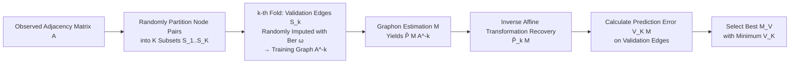

# Graphon Cross-Validation: Assessing Models on Network Data

**Conference**: ICLR 2026  
**OpenReview**: [https://openreview.net/forum?id=8J3GTeQmwl](https://openreview.net/forum?id=8J3GTeQmwl)  
**Code**: TBD  
**Area**: Graph Learning / Network Statistical Inference  
**Keywords**: graphon, cross-validation, model selection, network data, link prediction, hyperparameter tuning  

## TL;DR
To address the challenge where traditional cross-validation (CV) fails due to the non-independence of edges in network data, this paper proposes **CV-imputation**. By treating edges in the validation set as missing values and filling them with Bernoulli random variables at a fixed probability to construct the training graph, the method uses an affine transformation to recover the probability matrix. This allows for hyperparameter tuning and model selection for graphon estimation methods while preserving the graph topology, theoretically ensuring that the CV score is asymptotically parallel to the true estimation error.

## Background & Motivation
**Background**: Graphon models are the primary non-parametric tools for characterizing complex network structures. They assume that the probability of an edge existing between nodes $i$ and $j$ is given by a symmetric measurable function $f(\mu_i, \mu_j)$ defined on a unit square, encompassing sub-models like Stochastic Block Models (SBM), piecewise constant/linear graphons, and smooth graphons. Prevailing estimation methods (Neighborhood Smoothing NS, Sorting-and-Smoothing SAS, Universal Singular Value Thresholding USVT, Iterative Collaborative Estimation ICE) all rely on a tuning parameter $M$ that controls the "goodness-of-fit vs. model complexity" trade-off—such as neighborhood size in NS or the number of blocks in SAS.

**Limitations of Prior Work**: Tuning parameters directly determine estimation accuracy (as shown in Figure 1, different neighborhood sizes yield vastly different graphon estimates), yet reliable tools for parameter tuning on network data are lacking. While CV is the gold standard for tuning, it assumes independent observations—a condition violated by the interconnected nature of network nodes. Randomly partitioning nodes does not work; direct random edge sampling (edge-sampling) destroys the network topology and neighborhood structure, introducing significant bias into graphon estimation and causing distribution shift between training/testing sets, which contaminates standard deviation estimates and confidence intervals.

**Key Challenge**: The need to partition the data into training/validation sets for generalization assessment inherently conflicts with the need to preserve network connectivity and neighborhood structure. Existing Edge Cross-Validation (ECV, Li et al. 2020a) uses matrix completion to fill held-out node pairs, but it requires the probability matrix $P$ to be low-rank (which fails in dense networks), lacks theoretical guarantees for general graphons, and is computationally prohibitive due to iterative matrix completion (approx. $O(n^3)$ via full SVD) per fold.

**Goal**: To propose a theoretically grounded, computationally efficient, and model-agnostic network cross-validation framework for hyperparameter tuning and model selection in graphon estimation.

**Key Insight**: **[Perturbative Sampling + Affine Recovery]** Instead of deleting edges, the method treats validation edges as missing values and fills them randomly using a Bernoulli distribution with a fixed mean $\omega$. Since edges are independent, the relationship between the probability matrix of the imputed training graph and the original graph is a known affine transformation. This allows for an analytical inverse mapping to predict the true probability matrix, effectively preserving the topology while ensuring training/validation independence.

## Method

### Overall Architecture
The method operates on a $K$-fold cross-validation backbone: all node pairs are randomly partitioned into $K$ subsets, with one subset $S_k$ serving as the validation set in each fold. When constructing the training graph, edges within $S_k$ are "imputed" (rather than deleted) with random Bernoulli values with fixed probability $\omega$, maintaining the full $n\times n$ dimensions of the adjacency matrix. Any graphon estimation method $M$ is applied to the training graph to estimate the probability matrix, which is then restored to a prediction of the true $P$ via an analytical inverse affine transformation. Finally, the prediction error is calculated on the validation edges to select the optimal $M$.

### Key Designs

**1. Training Graph Construction via Random Imputation: Preserving Topology by "Filling" instead of "Deleting"** Traditional edge sampling deletes validation edges, destroying connectivity and neighborhood structures upon which smoothing methods rely. This paper proposes an alternative: the training adjacency matrix $A^{[-k]}$ maintains the same dimensions as the original graph. Elements outside the validation set $S_k$ retain their original values $a_{ij}$, while elements within $S_k$ are replaced by i.i.d. $b_{ij}\sim\text{Ber}(\omega)$, where $\omega$ is a constant hyperparameter. This maintains the network scale and connectivity, allowing neighborhood smoothing to function normally, while the random imputation "erases" the true information of validation edges to prevent leakage.

**2. Affine Transformation and Analytical Recovery: Precisely Removing Imputation-Induced Distribution Shift** While imputation protects the structure, it artificially distorts the training graph's distribution. Lemma 1 provides the crucial analytical relationship: given $P$, the training graph elements $A^{[-k]}_{ij}$ follow a Bernoulli distribution with mean $w_k\omega+(1-w_k)p_{ij}$ (where $w_k$ is the proportion of $S_k$ in all node pairs). Thus, the training graph probability matrix $P^{[-k]}=w_k\omega\mathbf{1}\mathbf{1}^T+(1-w_k)P$ is an affine transformation of the true $P$. Crucially, it ensures that $A^{[-k]}$ and the validation set $A^{[k]}$ are conditionally independent given $P$. Based on this, the estimate can be solved back to the prediction of $P$:
$$\hat{P}_k(M)=\frac{\hat{P}(M|A^{[-k]})-w_k\omega\mathbf{1}\mathbf{1}^T}{1-w_k}.$$
This provides an unbiased analytical expression for the predicted probabilities $\hat{p}^{[k]}_{ij}(M)$ on validation edges, with out-of-bounds values truncated to $[0,1]$.

**3. CV-imputation Score and Model Selection: Measuring Generalization on Validation Edges** The cross-validation score is obtained by aggregating the squared differences between the predicted probabilities and actual observations for all validation edges:
$$V_K(M)=\frac{2}{n(n-1)}\sum_{k=1}^{K}\sum_{(v_i,v_j)\in S_k}\big(\hat{p}^{[k]}_{ij}(M)-a_{ij}\big)^2,$$
The model $M_V$ that minimizes $V_K(M)$ is selected. This score can be used both for internal hyperparameter tuning of a single method (e.g., neighborhood size in NS) and for selecting between different methods (e.g., picking the best among NS/SAS/USVT/ICE), as it makes no assumptions about the underlying model form.

**4. Asymptotic Consistency Guarantee: CV Score Parallel to True Error** Theorem 1 proves that as $n\to\infty$ and $K\to\infty$, $V_K(M)-L(M)-\Delta=O_p\big(\tfrac{1}{n}\vee\tfrac{1}{K^{(1+\alpha)/2}}\vee\tfrac{1}{K^\alpha}\big)$ holds uniformly, where $L(M)$ is the true mean squared estimation error and $\Delta=\frac{2}{n(n-1)}\sum_{i<j}p_{ij}(1-p_{ij})$ is a constant independent of $M$. Since $\Delta$ does not depend on $M$, the validation score function $V_K(\cdot)$ is **asymptotically parallel** to the loss function $L(\cdot)$. Therefore, the minimizer of $V_K$ approaches the minimizer of $L$ with high probability, meaning the selected model converges asymptotically to the optimal model.

**Computational Complexity**: The total complexity of CV-imputation is $O(|M|\cdot(K\cdot C_{\text{estim}}(n)+n^2))$. Compared to the $O(|M|\cdot(K\cdot C_{\text{estim}}(n)+K\cdot T_{\text{mc}}(n)))$ of ECV, the overhead per fold is only $O(n^2)$ for imputation and transformation, whereas ECV adds an $O(n^3)$ matrix completion step. Thus, the proposed method is significantly faster. For extremely large networks, structural representative sub-sampling can be performed before tuning.

## Key Experimental Results

### Main Results: Estimation Accuracy on Synthetic Graphons (MSE×100, n=200, 100 trials)
Using 4 graphons from Chan & Airoldi (1/2 dense, 3/4 sparse; 1/3/4 low-rank, 2 full-rank), CV-imputation is compared against ECV and default settings for NS/USVT/SAS/ICE:

| Method | Graphon 1 | Graphon 2 | Graphon 3 | Graphon 4 |
|------|-----------|-----------|-----------|-----------|
| CV-imputation (NS) | **0.51 ± 0.07** | **2.13 ± 0.15** | 0.79 ± 0.07 | **1.05 ± 0.06** |
| ECV (NS) | 9.15 ± 19.25 | 3.82 ± 0.21 | 3.07 ± 0.95 | 1.06 ± 0.10 |
| Default NS (M=1) | 39.05 ± 3.33 | 2.75 ± 0.16 | **0.74 ± 0.04** | 1.06 ± 0.10 |
| CV-imputation (USVT) | **0.28 ± 0.03** | **2.99 ± 0.19** | **0.61 ± 0.10** | **0.75 ± 0.05** |
| ECV (USVT) | 0.60 ± 0.09 | 5.06 ± 0.27 | 1.18 ± 0.02 | 1.08 ± 0.74 |
| CV-imputation (ICE) | **0.31 ± 0.03** | **2.69 ± 0.24** | **0.50 ± 0.06** | 0.82 ± 0.06 |
| ECV (ICE) | 0.32 ± 0.05 | 3.05 ± 0.55 | 0.53 ± 0.06 | 0.86 ± 0.06 |

In nearly all method-graphon combinations, CV-imputation selects models with the lowest MSE. ECV exhibits high-variance failure (9.15) on NS-Graphon 1.

### Ablation Study / Convergence and Method Selection
- **Rank Consistency**: Comparison of normalized $V_K$ and $L$ curves shows that at $n=50$, the selected model already aligns with the optimal model for Graphon 1/2, and at $n=200$, alignment is achieved for all graphons.
- **Method Selection Accuracy**: When choosing the method with the lowest MSE among NS/SAS/USVT/ICE, CV-imputation achieves **100%** accuracy at $n=200$, showing a significant advantage over ECV in small networks.

### Link Prediction on Real Networks (AUC / Runtime, 100 trials)

| Network | Metric | CV-imputation | ECV |
|------|------|---------------|-----|
| PolBlog | AUC | **0.88 ± 0.01** | 0.80 ± 0.02 |
| NetSci | AUC | **0.72 ± 0.01** | 0.70 ± 0.01 |
| Yeast | AUC | 0.80 ± 0.02 | 0.80 ± 0.02 |
| PolBlog | Time (s) | **56.90** | 258.65 |
| NetSci | Time (s) | **51.01** | 771.23 |
| Yeast | Time (s) | **240.90** | 6021.12 |

### Key Findings
- On the Yeast network, CV-imputation reduces runtime from 6021 seconds (ECV) to 241 seconds (approx. **25x acceleration**) while maintaining or improving AUC.
- In a COVID-19 drug-disease co-occurrence network case study, the method identified the connection between COVID-19 and ledipasvir with the third-highest predicted probability among unlinked pairs, suggesting drug repurposing potential later supported by phase-3 clinical trials.

## Highlights & Insights
- **"Imputation instead of Deletion" is the Core Innovation**: Using random imputation preserves the network size and neighborhood structure, while the affine transformation derived from edge independence precisely subtracts the artificial bias. This bypasses the issues of topology destruction and high computational cost in matrix completion.
- **Win-Win in Theory and Computation**: The method provides an asymptotic consistency proof while reducing complexity from $O(n^3)$ to $O(n^2)$ overhead.
- **Model-agnostic**: It is a "universal model evaluator" for network data, plug-and-play for any graphon estimation method to tune hyperparameters or select models.

## Limitations & Future Work
- The foundation relies on the **edge independence assumption**, making it difficult to extend directly to dynamic networks with temporal or sequential dependencies.
- Affine recovery depends on the choice of the fixed imputation probability $\omega$. Sensitivity analysis for this parameter is not fully expanded in the main text.
- Very large networks still require subgraph sampling approximations; the impact of sub-sampling on tuning consistency lacks formal guarantees.

## Related Work & Insights
- **Graphon Estimation**: NS, SAS, USVT, and ICE are the targets for tuning; this paper provides a unified evaluation and selection tool for them.
- **Network Cross-Validation**: The direct competitor is ECV (Li et al. 2020a), which relies on low-rank assumptions and is computationally expensive. This work avoids both by using random imputation and affine recovery.
- **Insight**: The paradigm of "treating validation sets as missing values for random imputation, then analytically recovering via known distribution shifts" could be migrated to other structured data evaluation scenarios where partitioning destroys the inherent structure.

## Rating
- **Novelty**: ⭐⭐⭐⭐ — "Random imputation instead of deletion + analytical recovery via affine transformation" is a clean and theoretically supported new perspective.
- **Experimental Thoroughness**: ⭐⭐⭐⭐ — Covers multiple synthetic graphons, estimation methods, and real-world networks with significant speedup and AUC gains.
- **Writing Quality**: ⭐⭐⭐⭐ — Clear motivation and logical flow from lemmas to theorems.
- **Value**: ⭐⭐⭐⭐ — Provides a plug-and-play, theoretically sound, and significantly faster solution for parameter tuning and model selection on network data.

<!-- RELATED:START -->

## Related Papers

- [\[AAAI 2026\] On Stealing Graph Neural Network Models](../../AAAI2026/graph_learning/on_stealing_graph_neural_network_models.md)
- [\[ICLR 2026\] Latent Geometry-Driven Network Automata for Complex Network Dismantling](latent_geometry-driven_network_automata_for_complex_network_dismantling.md)
- [\[ICML 2026\] When Do Graph Foundation Models Transfer? A Data-Centric Theory](../../ICML2026/graph_learning/when_do_graph_foundation_models_transfer_a_data-centric_theory.md)
- [\[ICLR 2026\] A Graph Meta-Network for Learning on Kolmogorov–Arnold Networks](a_graph_meta-network_for_learning_on_kolmogorovarnold_networks.md)
- [\[ICLR 2026\] Federated Graph-Level Clustering Network with Dual Knowledge Separation](federated_graph-level_clustering_network_with_dual_knowledge_separation.md)

<!-- RELATED:END -->
## Related Papers

- [\[AAAI 2026\] On Stealing Graph Neural Network Models](../../AAAI2026/graph_learning/on_stealing_graph_neural_network_models.md)
- [\[ICLR 2026\] Latent Geometry-Driven Network Automata for Complex Network Dismantling](latent_geometry-driven_network_automata_for_complex_network_dismantling.md)
- [\[ICML 2026\] When Do Graph Foundation Models Transfer? A Data-Centric Theory](../../ICML2026/graph_learning/when_do_graph_foundation_models_transfer_a_data-centric_theory.md)
- [\[ICLR 2026\] A Graph Meta-Network for Learning on Kolmogorov–Arnold Networks](a_graph_meta-network_for_learning_on_kolmogorovarnold_networks.md)
- [\[ICLR 2026\] Federated Graph-Level Clustering Network with Dual Knowledge Separation](federated_graph-level_clustering_network_with_dual_knowledge_separation.md)

<!-- RELATED:END -->
