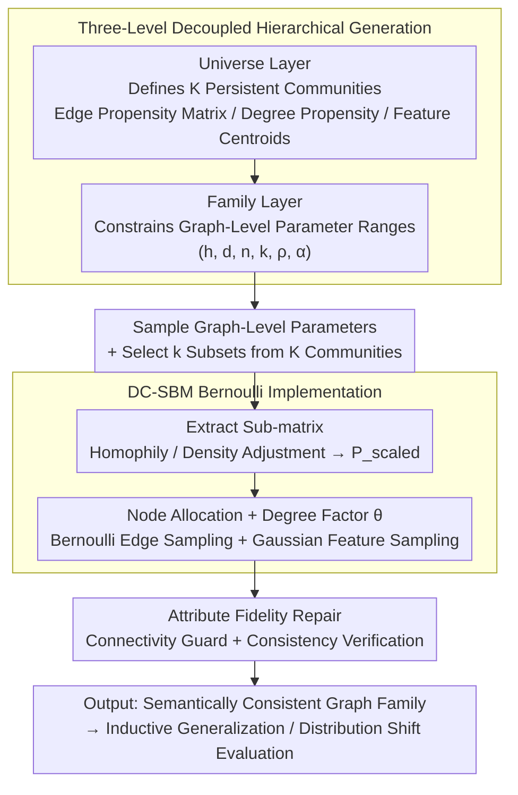

# GraphUniverse: Synthetic Graph Generation for Evaluating Inductive Generalization

**Conference**: ICLR2026  
**arXiv**: [2509.21097](https://arxiv.org/abs/2509.21097)  
**Code**: [GitHub](https://github.com/LouisVanLangendonck/GraphUniverse)  
**Area**: Graph Learning  
**Keywords**: synthetic graph generation, inductive generalization, graph benchmarking, stochastic block model, distribution shift

## TL;DR
The authors propose GraphUniverse, a framework for generating graph families with persistent semantic communities across a global universe. This allows for the first systematic evaluation of inductive generalization capability in graph learning models, revealing the critical finding that transductive performance does not reliably predict inductive generalization capacity.

## Background & Motivation

**Background**: Benchmarking in graph learning suffers from a fundamental flaw—existing synthetic generation tools (e.g., GraphWorld) only produce independent single graphs. Consequently, evaluation is restricted to transductive settings where models are trained and tested on the same graph structure. This prevents the assessment of two capabilities essential for building Graph Foundation Models: (1) **inductive generalization**, the ability to generalize to entirely unseen graphs; and (2) **robustness to distribution shifts**, performance stability when graph attributes (homophily, degree distribution, etc.) change.

**Limitations of Prior Work**: Recent critical analyses (Bechler-Speicher et al., 2025; Wang et al., 2025) note that existing static benchmarks lack coverage, have non-adjustable attributes, and provide limited support for heterogeneous graphs, hindering the development of generalized graph learning models.

**Goal**: To generate families of graphs with controllable structures and consistent semantics, where the same community semantics persist throughout the family, enabling systematic evaluation of inductive generalization and robustness to distribution shifts.

## Method

### Overall Architecture

GraphUniverse deconstructs the generation of "semantically consistent graph families" into three levels: the Universe level fixes a set of persistent communities across the family; the Family level constrains the allowable range of graph-level attributes; and the Graph level samples specific graph instances within these ranges. Crucially, global community attributes (connectivity patterns, degree propensities, feature centroids) are defined once at the Universe layer and shared by all graphs, ensuring that "Community $k$" maintains consistent semantics across different graphs. On this basis, the Graph layer implements parameters as Bernoulli graphs using a Degree-Corrected SBM (DC-SBM), followed by a fidelity repair step to ensure connectivity and consistency. This produces a family of graphs that share the same community logic but vary in structure.

### Key Designs

**1. Three-Level Decoupled Generation: Separating "Community Identity" from "Graph Instantiation"**

Existing tools (GraphWorld) sample each graph independently, preventing community semantics from being reused across graphs and limiting them to transductive evaluation. GraphUniverse defines $K$ persistent communities at the Universe level, each carrying three attributes: an edge propensity matrix $\tilde{\mathbf{P}} \in \mathbb{R}^{K\times K}$ (incorporating heterophily via $\tilde{P}_{rs}=1+\xi_{rs}$ where $\xi_{rs}\sim\mathcal{N}(0,(2\epsilon)^2)$); a community-level degree propensity vector $\boldsymbol{\delta}\in[-1,1]^K$ where $\delta_k=-1$ indicates low-degree and $+1$ indicates high-degree bias; and community centroids $\boldsymbol{\mu}_k\sim\mathcal{N}(\mathbf{0},\sigma_{\text{center}}^2\mathbf{I}_d)$ for feature sampling. The Family layer specifies ranges for graph-level parameters: homophily $h$, average degree $d$, node count $n$, number of communities $k$, degree dispersion $\rho$, and power-law index $\alpha$. The Graph layer then inherits Universe attributes to generate single graphs, allowing structural properties to fluctuate within the Family range while keeping community semantics constant.

**2. DC-SBM Bernoulli Implementation: Ensuring Targets are Met**

Graph generation follows four steps: uniform sampling of $(n,k,h,d,\rho,\alpha)$ from the Family range; random selection of $k$ communities from the Universe; adjustment of the sub-matrix for homophily and density to meet $h$ and $d$ constraints; and node assignment. Degree factors $\theta_i$ are coupled with community degree propensities, and edges are sampled independently via Bernoulli probabilities:

$$P_{ij}=\min\!\big(1,\ \theta_i\theta_j\,\mathbf{P}_{\text{scaled}}[c(i),c(j)]\big)$$

Using Bernoulli sampling instead of traditional Poisson prevents the attribute shifts caused by collapsing multi-edges into simple graphs, ensuring high control over the generated properties.

**3. Attribute Fidelity Repair: Balancing Constraints and Structure**

Controlled evaluation requires precise graph attributes. After instantiation, consistency is enforced: if disconnected components appear, edges are added with minimal bias to the block structure to ensure connectivity without significantly altering the target community structure. The process maintains linear time complexity (approx. 23ms for 100 nodes, 1.3s for 1000 nodes).

### A Complete Example

To generate a target graph, parameters flow through the layers: The Universe defines $K=10$ communities with fixed $\tilde{\mathbf{P}}$, $\boldsymbol{\delta}$, and $\boldsymbol{\mu}_k$. The Family specifies a homophily range and node count (e.g., 50–200). For a specific graph, parameters are sampled (e.g., $n=150, k=5$). Five communities are selected, their $5\times5$ sub-matrix is scaled to $\mathbf{P}_{\text{scaled}}$ based on $h$ and $d$. 150 nodes are assigned to communities, and edges are formed using the Bernoulli probability $P_{ij}$. When a second graph is generated, community semantics remain the same while structural parameters are resampled, providing the consistent community set required for inductive evaluation.

## Key Experimental Results

### RQ1: Inductive vs. Transductive Performance Gaps
- Evaluated 9 architectures (DeepSet, GraphMLP, GCN, GraphSAGE, GIN, GATv2, TopoTune, Neural Sheaf Diffusion, GPS) on community detection.
- **Key Finding**: Model rankings differ significantly between settings. Neural Sheaf Diffusion (NSD) performs excellently in inductive settings but mediocrely in transductive ones; GIN performs best in transductive settings but fails in inductive ones.
- Transductive settings tend to amplify the impact of specific graph attributes (homophily, density) on performance.

### RQ2: Robustness to Distribution Shift
- Tested controlled shifts in homophily (±0.1), average degree (±4), and size (±200).
- **Key Finding**: Robustness is not an inherent model property but an interaction between architecture and graph attributes. The same shift can have opposite effects depending on the training domain (e.g., increasing homophily hurts performance in low-homophily domains but helps in moderate ones).

### RQ3: Graph Size Generalization
- Training: 50-200 nodes; Testing: 250-400 and 550-700 nodes.
- Node-level tasks (community detection): Performance drops by only ~2%.
- Graph-level tasks (triangle counting): Traditional MPNNs (e.g., GIN) fail to generalize to larger graphs, while GPS and NSD maintain performance.

### RQ4: Predictiveness for Real-world Data
- Validated on 5 real inductive datasets.
- The model rankings generated by GraphUniverse show a significantly higher correlation with real dataset rankings compared to GraphWorld, maintaining positive correlation across all datasets.

## Highlights & Insights
1. **Addressing Critical Gaps**: The first synthetic graph generation framework designed for systematic inductive evaluation, solving the lack of multi-graph benchmarks.
2. **Persistent Semantic Communities**: The hierarchical architecture ensures cross-graph semantic consistency while allowing fine-grained structural control.
3. **Exposing Paradigm Bias**: The discovery that transductive performance is not a reliable proxy for inductive generalization has major implications for graph learning evaluation culture.
4. **Controlled Robustness Framework**: Enables testing of distribution shifts, revealing that model robustness is highly context-dependent rather than an intrinsic trait.
5. **High Engineering Maturity**: Includes a PyPI package, TopoBench integration, a Streamlit tool, and a thorough validation suite.

## Limitations & Future Work
1. **Generative Model Constraints**: Being DC-SBM based, it lacks fine control over high-order structures (motifs like triangles or cliques), which may not perfectly capture the topological richness of some real networks.
2. **Community Distribution Assumption**: Defaults to uniform community sizes, whereas real-world networks often follow a power-law distribution for community sizes.
3. **Simplified Feature Generation**: Community features use isotropic Gaussians, which might not reflect complex real-world feature distributions.
4. **Task Coverage**: Primarily covers node classification and graph regression; lacks link prediction and graph classification tasks.
5. **Large-Scale Validation**: The maximum scale tested was 1000 nodes; performance on graphs with 10k+ nodes remains unverified.

## Related Work & Insights

| Method | Multi-graph Generation | Semantic Consistency | Attribute Control | Inductive Evaluation |
|------|---------|-----------|---------|---------------|
| GraphWorld | ✗ | ✗ | ✓ | ✗ |
| OGB | ✗ (Static) | N/A | ✗ | Partial |
| GOOD | ✗ (Static) | N/A | ✗ | ✓ (OOD Splits) |
| CGT | ✗ | ✗ | ✓ | ✗ |
| **GraphUniverse** | **✓** | **✓** | **✓** | **✓** |

GraphUniverse's core advantage is supporting both multi-graph generation and cross-graph semantic consistency, enabling controlled inductive experiments for the first time.

## Rating
- Novelty: ⭐⭐⭐⭐ — First framework for inductive generalization evaluation using synthetic graph families.
- Experimental Thoroughness: ⭐⭐⭐⭐⭐ — Comprehensive RQ coverage and convincing real-world data correlation.
- Writing Quality: ⭐⭐⭐⭐ — Clear structure, well-motivated, and technically detailed.
- Value: ⭐⭐⭐⭐ — Re-evaluates benchmarking paradigms and provides a significant open-source contribution.

<!-- RELATED:START -->

## Related Papers

- [\[ICLR 2026\] Scaling Knowledge Graph Construction through Synthetic Data Generation and Distillation](scaling_knowledge_graph_construction_through_synthetic_data_generation_and_disti.md)
- [\[ICLR 2026\] ReLaSH: Reconstructing Joint Latent Spaces for Efficient Generation of Synthetic Hypergraphs with Hyperlink Attributes](relash_reconstructing_joint_latent_spaces_for_efficient_generation_of_synthetic_.md)
- [\[ICLR 2026\] Adaptive Mixture of Disentangled Experts for Dynamic Graph Out-of-Distribution Generalization](adaptive_mixture_of_disentangled_experts_for_dynamic_graph_out-of-distribution_g.md)
- [\[ICLR 2026\] Bures-Wasserstein Flow Matching for Graph Generation](bures-wasserstein_flow_matching_for_graph_generation.md)
- [\[ICLR 2026\] Discrete Bayesian Sample Inference for Graph Generation](discrete_bayesian_sample_inference_for_graph_generation.md)

<!-- RELATED:END -->
