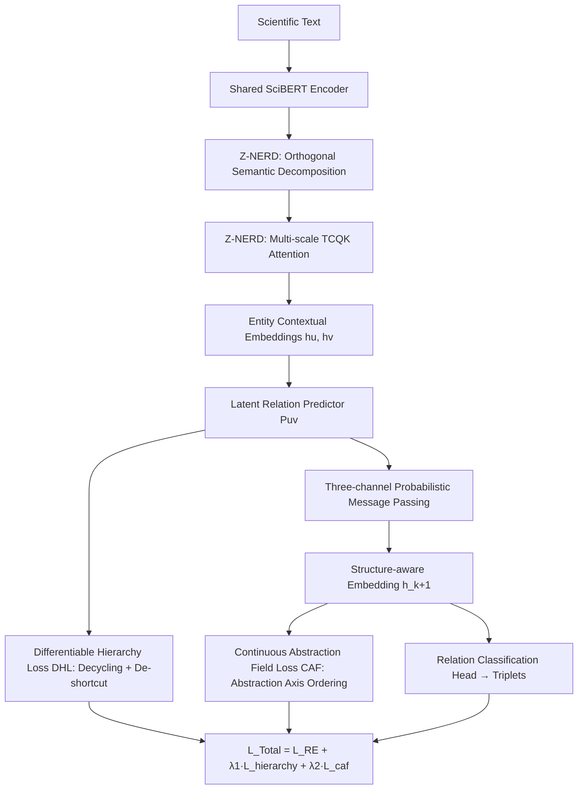

# HGNet: Scalable Foundation Model for Automated Knowledge Graph Generation from Scientific Literature

**Conference**: ICLR 2026  
**OpenReview**: [https://openreview.net/forum?id=NWd53rltx8](https://openreview.net/forum?id=NWd53rltx8)  
**Code**: [https://github.com/basiralab/HGNet](https://github.com/basiralab/HGNet) (Dataset [SPHERE](https://github.com/basiralab/SPHERE))  
**Area**: Graph Learning / Scientific Knowledge Graph Construction  
**Keywords**: Knowledge Graph Construction, Named Entity Recognition, Relation Extraction, Hierarchy-aware GNN, Zero-shot Generalization  

## TL;DR
A two-stage framework with ~300M parameters is proposed: Z-NERD utilizes "Orthogonal Semantic Decomposition + Multi-scale TCQK Attention" for domain-agnostic multi-word entity recognition, while HGNet employs "Parent/Child/Peer three-channel message passing + Differentiable Hierarchy Loss + Continuous Abstraction Field Loss" to constrain relation extraction into a logically consistent and geometrically ordered Directed Acyclic Graph (DAG), achieving new SOTA results on SciERC, SciER, and SPHERE.

## Background & Motivation
**Background**: Automatic construction of Knowledge Graphs (KGs) from scientific literature involves two sub-tasks: Named Entity Recognition (NER) to identify nodes and Relation Extraction (RE) to establish edges. NER has long been dominated by supervised transformers like SciBERT/BioBERT, while RE has evolved from sentence-level models toward cross-document GNNs.

**Limitations of Prior Work**: Existing methods suffer from four intertwined shortcomings: (1) Long multi-word entities (e.g., "in situ transmission electron microscopy") are often fragmented because mainstream models treat token boundaries as byproducts rather than explicit targets; (2) Poor cross-domain generalization, where supervised models fail out-of-distribution while 10B+ general LLMs are expensive and unstable on specialized tasks; (3) "Hierarchy blindness," relying on shallow co-occurrence statistics rather than hierarchical structures (e.g., "Deep Learning is a subfield of Machine Learning"); (4) Lack of global logical consistency, failing to ensure valid DAGs, leading to contradictions like "A belongs to B and B belongs to A."

**Key Challenge**: General LLMs offer generalization but are costly and unstable; specialized supervised models are lightweight but struggle with multi-word entities, hierarchy, and global consistency. Neither simultaneously achieves "lightweight + zero-shot generalization + hierarchy + logical consistency."

**Goal**: To build a lightweight model (~300M parameters) that addresses these four challenges end-to-end, achieving foundation-model-level zero-shot capabilities with the computational cost of specialized baselines.

**Core Idea**: **Treat hierarchical abstraction as a continuous geometric property**—explicitly modeling hierarchical direction via three-channel message passing, while using two complementary losses to ensure "logical DAG structure" and "geometric order along a learnable abstraction axis," replacing vocabulary memory with "semantic shift" signals for domain-agnostic recognition.

## Method

### Overall Architecture
The system shares a SciBERT encoder and is trained end-to-end. In the first stage, Z-NERD transforms raw text into entities. In the second stage, HGNet receives entity context embeddings from the same encoder, infers their hierarchical and peer relationships, and constructs a globally consistent KG. HGNet treats relations as latent variables, utilizing a latent relation predictor to output soft edge weights, which drive parallel paths of "message passing" and "logical regularization." Finally, a standard classification head outputs $\langle \text{head, relation, tail} \rangle$ triplets.

### Key Designs
**1. Orthogonal Semantic Decomposition (OSD): Replacing vocabulary memory with "semantic shifts" for zero-shot generalization.** The authors hypothesize that the key to domain-agnostic generalization is not tracking overall semantic flow but explicitly identifying the moments a "new concept is introduced." Adjacent word embedding change vectors $\Delta E_t = E_t^{text} - E_{t-1}^{text}$ are orthogonally decomposed: the projection onto $E_{t-1}^{text}$, denoted as $v^{sustaining}_t$, represents the extension of an old concept, while the orthogonal component $v^{divergent}_t = \Delta E_t - v^{sustaining}_t$ captures conceptual jumps or "semantic shifts." By concatenating $v^{divergent}_t$ with raw contextual embeddings for the encoder, the model shifts from "remembering domain vocabulary" to "perceiving discourse structure," enabling entity recognition in unseen disciplines.

**2. Multi-scale TCQK Attention: Specializing attention heads for different n-gram lengths.** Standard self-attention lacks a strong structural bias for word adjacency, leading to fragmented boundaries for long entities. The authors modify Query and Key values using 1D convolutions before calculating attention scores: $H$ heads are divided into $G$ groups, each associated with a kernel width $k_g$ (e.g., 1, 3, 5) for a convolution $C_g$, calculating $Q_{conv,h}=C_g(Q_h)$ and $K_{conv,h}=C_g(K_h)$. This integrates local sequence perception into the global attention view, forcing different heads to specialize in single tokens, short phrases, and long entities, ensuring coherent recognition of both short abbreviations and long chemical names.

**3. Probabilistic Hierarchy Message Passing: Parental/Child/Peer three-channel information flow.** Traditional GNNs are "hierarchy-blind," propagating messages uniformly and failing to distinguish whether information flows "upward" from specific sub-nodes, "downward" from abstract parent nodes, or "horizontally" from peers. HGNet predicts a relation distribution $P_{uv}=\mathrm{softmax}(\mathrm{MLP}([h_u\|h_v]))$ for each entity pair $(u,v)$ across types {parent-of, peer-of, no-edge}, using these probabilities as soft edge weights. Three independent weight matrices $W_{up}, W_{down}, W_{peer}$ aggregate corresponding messages, which are concatenated with the node's previous state to produce structure-aware embeddings: $h^{(k+1)}_v = \mathrm{UpdateMLP}([h^{(k)}_v\|m^{parents}_v\|m^{children}_v\|m^{peers}_v])$, decoupling "textual proximity" from "conceptual hierarchy."

**4. Differentiable Hierarchy Loss (DHL): Compressing graphs into valid DAGs and prohibiting cross-level shortcuts.** Unconstrained latent graphs may predict cycles or redundant shortcuts, corrupting message passing. DHL operates on the predicted parent adjacency matrix $A_{parent}$ as a weighted sum $L_{hierarchy}=\lambda_{acyclic}L_{acyclic}+\lambda_{separation}L_{separation}$. The acyclic loss ensures a DAG via the trace of the matrix exponential: $L_{acyclic}=\mathrm{tr}(e^{A_{parent}\circ A_{parent}})-d$ (where $d$ is the number of nodes). The hierarchy separation loss $L_{separation}=\sum_{u,w}(A^2_{parent})_{uw}\cdot(A_{parent})_{uw}$ penalizes "shortcut edges" that skip intermediate nodes by multiplying the number of length-2 paths by direct edges, enforcing a strict parent-child hierarchy.

**5. Continuous Abstraction Field Loss (CAF): Treating abstraction as an intrinsic geometric axis.** The authors argue that hierarchical understanding is a geometric property of the embedding space. They introduce a learnable unit vector—the abstraction field vector $w_{abs}$—defining a "universal abstraction axis." The abstraction level of entity $v$ is its projection $\hat y_{abs}(v)=h_v\cdot w_{abs}$ (a continuous value). The composite loss $L_{caf}=L_{ranking}+\gamma_1 L_{anchor}+\gamma_2 L_{regression}$ shapes this field: the ranking term uses a margin $\delta$ to enforce relative parent-child order $\max(0,(h_c-h_p)\cdot w_{abs}+\delta)$; the anchor term fixes known root/leaf nodes to scores of 1 and 0; and the regression term pulls predicted scores toward the ground-truth topological depth $y_{topo}(v)$. This allows the model to learn a continuous abstraction spectrum. This is the first approach to formalize abstraction as a continuous attribute in standard Euclidean space, which the authors claim is simpler and more interpretable than hyperbolic embeddings.

## Key Experimental Results

### Main Results
**NER (micro F1 %)**, average improvement of 8.08% over supervised baselines, and 10.76% on zero-shot SPHERE domains:

| Model | SciERC | SciER | BioRED | SemEval | SPHERE-CS(Sup) | CS(ZS) |
|------|--------|-------|--------|---------|----------------|--------|
| SciBERT | 67.52 | 89.15 | 68.19 | 72.90 | 75.83 | 67.29 |
| HGERE | 75.92 | 89.43 | 69.82 | 72.46 | 76.42 | 68.51 |
| UniversalNER-7b | 66.09 | 88.46 | — | — | OOM | — |
| llama-3.3-70b (ZS) | 46.20 | 54.82 | OOM | — | — | — |
| **Z-NERD** | **78.84** | **91.05** | **80.47** | **82.39** | **84.35** | **74.21** |

**RE (strict Rel+ F1 %, across hierarchy/peer)**, average improvement of 5.99% on benchmark datasets:

| Model | SciERC-Overall | SciER-Overall | BioRED | SemEval-Overall |
|------|----------------|---------------|--------|------------------|
| HGERE | 43.86 | 58.47 | 32.39 | 38.63 |
| GAT | 46.21 | 57.64 | 32.40 | 39.25 |
| GPT-3.5 Turbo (ZS) | 14.98 | 8.58 | 6.36 | 16.74 |
| **HGNet** | **53.19** | **65.38** | 33.85 | **47.03** |

**SPHERE Zero-Shot RE (Rel+ F1 %, All)**, average improvement of 26.20% over SOTA HGERE:

| Model | Comp.Sci. | Physics | Biology | Mat.Sci. |
|------|-----------|---------|---------|----------|
| HGERE | 57.93 | 56.28 | 55.21 | 55.43 |
| **HGNet** | **79.51** | **80.60** | **83.74** | **83.65** |

### Ablation Study

| Configuration | SciERC-Overall | SciER-Overall |
|------|----------------|---------------|
| HGNet (Full) | **53.19** | **65.38** |
| w/o DHL (Diff. Hierarchy Loss) | 51.68 | 62.79 |
| w/o CAF Loss (Abstraction Field) | 47.33 | 58.67 |
| Z-NERD w/o TCQK (NER) | 73.43(SciERC) | 84.43(SciER) |
| Z-NERD w/o OSD (NER) | 74.39(SciERC) | 90.12(SciER) |

### Key Findings
- **TCQK is vital for NER**: Removing it leads to severe drops across all datasets, proving that standard attention struggles with coherent multi-word entity recognition without explicit n-gram structural bias.
- **OSD is critical for zero-shot**: Disabling OSD results in the largest performance drop in cross-domain tasks, validating that "semantic shifts" are key to learning domain-independent patterns.
- **CAF Loss impacts RE more than DHL**: Removing CAF (53.19→47.33) leads to a larger drop than removing DHL (→51.68), indicating that geometric abstraction attributes are crucial for hierarchical reasoning.
- **Largest gains in zero-shot scenarios**: The 26.20% improvement in RE on SPHERE far exceeds the 5.99% on standard benchmarks, demonstrating foundation-model-like transferability.

## Highlights & Insights
- **Continuous Abstraction Axis in Euclidean Space**: By using a learnable unit vector and projection scores, the model encodes "how abstract a concept is" as an intrinsic geometric coordinate, avoiding the complexity of hyperbolic geometry while remaining interpretable.
- **Relations as Latent Variables + Soft Edge Weights**: Instead of explicit graph construction followed by GNN, edge prediction probabilities serve as message-passing weights, allowing structure inference and representation learning to mutually enhance each other in an end-to-end differentiable manner.
- **Lightweight yet Foundation-level**: With ~300M parameters, the model matches specialized baseline efficiency while achieving zero-shot generalization typically seen in LLMs, vastly outperforming 70B-grade LLMs on specialized tasks (e.g., GPT-3.5 at 14.98 F1 vs. 53.19 F1 for RE).
- **Large-scale SPHERE Benchmark**: A benchmark covering CS, Physics, Biology, and Material Science with over 1 million paragraphs and 111k annotated relations was created using an LLM generate-and-label pipeline, mitigating data scarcity.

## Limitations & Future Work
- **Dependency on Topological Depth Supervision**: The CAF regression term requires $y_{topo}$ derived from ground-truth hierarchies; acquiring this signal for datasets without clean hierarchical labels remains challenging.
- **Single Abstraction Axis Assumption**: Compressing all concepts onto a single "universal abstraction axis" may oversimplify multi-dimensional or interdisciplinary abstractions where a concept's hierarchy varies across dimensions.
- **SPHERE generated by LLMs**: Reliance on LLM-generated data for training and evaluation risks inheriting noise and biases; further study is needed to decouple zero-shot gains from distributional similarities.
- **Acyclic Loss Computational Cost**: The trace of the matrix exponential is expensive for large graphs. While Krylov subspace methods are used for acceleration, scalability for extremely large-scale KGs remains to be verified.

## Related Work & Insights
- **NER**: Shifts focus from supervised SciBERT/BioBERT and zero-shot span matching (GLiNER/UniversalNER) toward discourse structure via OSD, distinguishing it from approaches relying solely on surface semantics or world knowledge.
- **RE and Hierarchy Modeling**: Evolution from sentence-level (PURE/PL-Marker/HGERE) to cross-document GNNs. HGNet is the first GNN explicitly designed with three-channel message passing for scientific hierarchical RE.
- **Geometric/Logical Representation of Hierarchy**: Unlike hyperbolic geometry (Nickel & Kiela) for low-distortion tree embeddings, HGNet uses CAF for globally consistent abstraction ordering in Euclidean space, combined with DHL for DAG constraints, unifying geometric and logical lines of research.
- **Insight**: Decoupling "structural constraints" into "Logic (DAG) + Geometry (Abstraction Axis)" via two differentiable losses is a generalizable design pattern for any graph generation task requiring hierarchical consistency.

## Rating
- **Novelty**: ⭐⭐⭐⭐⭐ The "Continuous Abstraction Field in Euclidean Space" is a truly original hierarchical representation paradigm. The semantic shift perspective of OSD and n-gram head specialization of TCQK are highly ingenious.
- **Experimental Thoroughness**: ⭐⭐⭐⭐ Covers 4 public benchmarks plus the four-domain SPHERE, with both supervised/zero-shot and NER/RE settings and comprehensive ablation. However, some evidence is relegated to the appendix, and the link between SPHERE and its LLM generation slightly weakens the zero-shot claims.
- **Writing Quality**: ⭐⭐⭐⭐ Components are organized via "Hypothesis → Mechanism → Formula," providing clear logic. Formulations and notations are standard, though the transition between message passing and final relation prediction is somewhat abrupt.
- **Value**: ⭐⭐⭐⭐⭐ Achieves foundation-level zero-shot scientific KG construction with a lightweight model. The release of open-source code and a large-scale benchmark provides immediate value for automated literature review and knowledge synthesis.

<!-- RELATED:START -->

## Related Papers

- [\[ICLR 2026\] Towards a Foundation Model for Crowdsourced Label Aggregation](towards_a_foundation_model_for_crowdsourced_label_aggregation.md)
- [\[ICLR 2026\] FLOCK: A Knowledge Graph Foundation Model via Learning on Random Walks](flock_a_knowledge_graph_foundation_model_via_learning_on_random_walks.md)
- [\[ICLR 2026\] HYPER: A Foundation Model for Inductive Link Prediction with Knowledge Hypergraphs](hyper_a_foundation_model_for_inductive_link_prediction_with_knowledge_hypergraph.md)
- [\[ICLR 2026\] RAS: Retrieval-And-Structuring for Knowledge-Intensive LLM Generation](ras_retrieval-and-structuring_for_knowledge-intensive_llm_generation.md)
- [\[ICLR 2026\] Knowledge Reasoning Language Model: Unifying Knowledge and Language for Inductive Knowledge Graph Reasoning](knowledge_reasoning_language_model_unifying_knowledge_and_language_for_inductive.md)

<!-- RELATED:END -->
