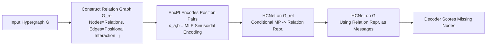

# HYPER: A Foundation Model for Inductive Link Prediction with Knowledge Hypergraphs

**Conference**: ICLR 2026  
**Code**: [https://github.com/HxyScotthuang/HYPER](https://github.com/HxyScotthuang/HYPER)  
**Area**: Graph Learning / Knowledge Hypergraphs / Foundation Models  
**Keywords**: Knowledge Hypergraphs, Inductive Link Prediction, Foundation Models, Arbitrary-arity Relations, Positional Interaction Encoding, Conditional Message Passing  

## TL;DR
HYPER is the first foundation model for link prediction on knowledge hypergraphs. By encoding "positional interactions between relations" into transferable base relations, the model achieves zero-shot generalization to hypergraphs containing entirely new entities, new relations, and arbitrary arities.

## Background & Motivation
**Background**: Knowledge hypergraphs generalize the binary relations of traditional knowledge graphs (KGs) to arbitrary-arity relations. For instance, `Research(Bengio, ClimateAI, Montreal, CIFAR)` is a 4-ary hyperedge that naturally expresses multi-entity facts. Existing conditional message-passing methods for inductive link prediction on hypergraphs (predicting missing hyperedges involving new entities) include G-MPNN, RD-MPNN, and HCNet.

**Limitations of Prior Work**: These hypergraph methods **assume a fixed relation vocabulary**. They store a learnable embedding for each relation type, leading to a sharp performance collapse when encountering unseen relation types during inference. They are effective for "entity induction" but fail at "relation induction."

**Key Challenge**: On the other hand, Knowledge Graph Foundation Models (KGFMs, such as ULTRA and MOTIF) can perform link prediction for both unseen entities and unseen relations. They achieve this by abstracting head/tail interactions between relations into four "base relations" for transfer. However, KGFMs only support binary relations: a binary fact generates exactly 4 types of interactions (head-to-head, head-to-tail, tail-to-head, tail-to-tail), which can be enumeratively encoded. In contrast, $m$-ary and $n$-ary relations in a hypergraph have $m \times n$ positional interactions, and since arity is unbounded, it is impossible to pre-assign independent embeddings for every $(a,b)$ pair.

**Goal**: Design a hypergraph foundation model that generalizes to **unseen entities + unseen relations + arbitrary arity**.

**Core Idea**: **Treat "positional interactions between relations" as transferable learning units**. If two hyperedges share an entity, and that entity occupies specific positions in each edge, the pair of positions $(i,j)$ characterizes a fundamental interaction between the two relations. Relations with similar structural roles in different graphs (e.g., `Teaches \mapsto Sells`, `Research \mapsto Trading`) will exhibit similar interaction patterns. By learning to infer relation semantics from these interaction patterns, the model can transfer to unfamiliar relations. This is combined with a **shared, extrapolatable position encoding** to handle unbounded arity.

## Method

### Overall Architecture
HYPER uses a two-level encoding: first, it calculates query-conditioned representations for each relation on a **relation graph** $G_{rel}$; then, it uses these relation representations as messages to perform conditional message passing on the **original hypergraph** $G$ to obtain entity representations and scores. The nodes of the relation graph are relation types, and directed edges record that "position $i$ of relation $r_1$ intersects with position $j$ of relation $r_2$ at some entity," with the edge label being the position pair $(i,j)$.

### Key Designs

**1. Relation Graph: Explicitly learning interactions as structures**. Given a hypergraph $G=(V,E,R)$, HYPER constructs a relation graph $G_{rel}=(V_{rel},E_{rel},R_{rel})$ where the node set $V_{rel}=R$ (each relation type is a node). For any two hyperedges $e_1, e_2$, if a shared entity $v$ exists at the $i$-th position of $e_1$ and the $j$-th position of $e_2$, a directed edge $(r_1, r_2)$ with label $(i, j) \in R_{rel}$ is added. These positional interactions can be computed efficiently via sparse matrix multiplication and remain invariant to relation renaming—the foundation for generalizing to unseen relations.

**2. Positional Interaction Encoding (EncPI): Solving arbitrary arity with shared, extrapolatable codes**. A naive approach would assign independent embeddings to each $(a,b)$ pair, but this fails for unseen arities. Instead, HYPER uses a **shared, compositional** encoder $\text{EncPI}: \mathbb{N}_{>0} \times \mathbb{N}_{>0} \to \mathbb{R}^d$, which concatenates sinusoidal position encodings $p_a, p_b$ for positions $a$ and $b$ and passes them through a two-layer MLP: $x_{a,b} = \text{MLP}([p_a \Vert p_b])$. The paper requires this to satisfy two properties: **extrapolatability** (generalizing to positions unseen during training) and **injectivity** (mapping different $(a,b)$ pairs to distinct embeddings). Theorem 4.1 proves the existence of parameters that make EncPI injective, bounded, and Lipschitz (locally smooth). For binary graphs, $(1,1)/(1,2)/(2,2)/(2,1)$ correspond exactly to the four base relations in KGFMs, maintaining consistency with existing work.

**3. Dual-layer HCNet Encoding: Relation Encoder + Entity Encoder**. Both levels utilize Hypergraph Conditional Networks (HCNet) for query-conditioned message passing. The **Relation Encoder** aggregates on $G_{rel}$ using $\text{EncPI}((a,b))$ as typed edge messages to produce query-conditioned relation representations $h_{r|q}^{(T)}$. The **Entity Encoder** runs a variant of HCNet on the original hypergraph $G$: each node $v$ aggregates from its incident hyperedges using the computed $h_{r|q}^{(T)}$ as messages for each hyperedge type, transformed by layer-specific MLPs. Finally, a Decoder calculates link probabilities for candidate entities. The entire pipeline maintains equivariance for both nodes and relations (proven in Appendix C).

**4. Reification Perspective and Comparison**: To apply secondary KGFMs to hypergraphs, the paper introduces "reification"—introducing an `edge_id` node for each $k$-ary hyperedge and splitting it into $k$ position-specific binary edges (e.g., `Research-3`). This serves as a baseline (denoted as $\ddagger$) for KGFMs like ULTRA. It also highlights HYPER's advantage in direct hypergraph modeling: reified graphs create atypical structures like tripartite graphs, increase path lengths, and break inverse relation modeling, which hinders KGFM generalization.

## Key Experimental Results

### Main Results (Node + Relation Inductive, MRR)
Across four hypergraphs (JF/MFB/WP/WD) with varying proportions of unseen relations (25/50/75/100%), HYPER(3KG+2HG) zero-shot performance leads almost across the board. Representative values (Node-Inductive dataset MRR):

| Method | JF-IND | WP-IND | MFB-IND |
|------|--------|--------|---------|
| RD-MPNN (End-to-End) | 0.402 | 0.304 | 0.122 |
| HCNet (End-to-End) | 0.435 | 0.414 | 0.368 |
| HYPER (End-to-End) | 0.422 | 0.435 | 0.427 |
| ULTRA‡(50KG) Zero-shot | 0.007 | 0.029 | 0.026 |
| ULTRA‡(3KG+2HG) Zero-shot | 0.410 | 0.341 | 0.294 |
| **HYPER(3KG+2HG) Zero-shot** | **0.459** | 0.415 | 0.404 |
| **HYPER(3KG+2HG) Fine-tuned** | **0.463** | **0.446** | **0.455** |

Key comparison: HYPER pre-trained on only 2 hypergraphs + 3 KGs consistently outperforms ULTRA‡ pre-trained on **50 KGs**. Notably, ULTRA‡(50KG) performs worse than ULTRA‡(3KG), suggesting that increasing training graph quantity cannot bridge the gap left by a lack of explicit hypergraph modeling.

### Ablation Study (Position Encoding Schemes, Mean Zero-shot MRR on 19 Hypergraphs)

| EncPI Encoding | MRR | Hits@3 | Issue |
|-----------|-----|--------|------|
| All-one | 0.236 | 0.262 | Collapses all positions, violates injectivity |
| Random | 0.213 | 0.239 | Unstructured, hard to generalize |
| Magnitude | 0.227 | 0.251 | Unbounded, incompatible with MLP |
| **Sinusoidal** | **0.285** | **0.281** | Injective, bounded, and extrapolatable |

### Key Findings
- **Robustness in Relation Induction (Q2)**: Node-inductive baselines like HCNet weaken significantly at 25% unseen relations and collapse as the ratio reaches 100%. HYPER remains stable across all ratios.
- **Position Encoding is Key (Q5)**: The injectivity and boundedness of sinusoidal encoding are critical for zero-shot generalization; the other three schemes lead to significant performance drops.
- **Sensitivity to Positional Semantics (Position Corruption Experiment)**: Randomly shuffling argument positions for 50% of hyperedges of the most frequent relations in test graphs causes a sharp performance drop. This proves that each position carries independent semantic roles (e.g., musical/game/song), which HYPER learns implicitly.
- **Importance of Pre-training Mixture (Q4)**: Pure hypergraph pre-training (4HG) is strong on high-arity datasets like JF/MFB but weak on WP, which is predominantly binary. The mixture of KGs and hypergraphs (3KG+2HG) provides the best overall performance.

## Highlights & Insights
- **Elegant Concept Transfer**: Naturally generalizes the "4 base relations" of KGFMs to arbitrary $(a,b)$ positional interactions on hypergraphs. By using a continuous, extrapolatable encoder, it achieves downward compatibility with binary graphs and upward coverage for arbitrary arity.
- **"Doing More with Less"**: Pre-training on 2 hypergraphs + 3 KGs beats ULTRA trained on 50 KGs, demonstrating that **structural matching** of data is more decisive for generalization than data **volume**.
- **Theoretical + Empirical Loop**: The three properties of injectivity, boundedness, and Lipschitz continuity are guaranteed by theorems and validated through ablation and corruption experiments, forming a complete logical chain.
- **Benchmark Contribution**: Constructed 16 new datasets with varying unseen relation ratios, providing a systematic evaluation bed for "relation-inductive hypergraph link prediction."

## Limitations & Future Work
- **Complexity Scales Quadratically with Arity**: The number of positional interactions expands quadratically with the arity of each hyperedge, making high-arity relations costly. Scalable approximations should be explored.
- **Binary Task Lag**: On standard KG tasks, specialized KGFMs (like ULTRA) usually perform better. HYPER's high-order capabilities do not grant an advantage in purely binary settings; bridging this gap is an open question.
- **Reliance on Stable Positional Semantics**: The method heavily relies on argument positions carrying fixed semantic roles. Performance degrades if the position meanings in the data are ambiguous (as shown in corruption experiments).

## Related Work & Insights
- **KGFM Lineage**: ULTRA, InGram, TRIX, KG-ICL, and MOTIF use relation graphs + base relations for relation induction; HYPER is their natural extension to hypergraphs.
- **Hypergraph Link Prediction**: HypE/BoxE (shallow embeddings) and G-MPNN/RD-MPNN/HCNet (message passing) handle high-arity but fail at relation induction. HYPER combines HCNet's conditional message passing with KGFM transfer mechanisms.
- **Insight**: When a task involves "unbounded discrete structures" (like arbitrary arity or positions), instead of enumerating embeddings, design continuous compositional encodings that satisfy injectivity and extrapolation. This approach can transfer to other graph/sequence tasks requiring generalization to unseen structural scales.

## Rating
- Novelty: ⭐⭐⭐⭐⭐ First hypergraph foundation model for arbitrary arity and dual induction (entity+relation). The positional interaction encoding is original and elegant.
- Experimental Thoroughness: ⭐⭐⭐⭐ 16 new + 3 old benchmarks, multiple pre-training mixtures, and comprehensive ablation/corruption experiments. Slightly trails KGFMs on pure binary tasks.
- Writing Quality: ⭐⭐⭐⭐ Clear progression from motivation and examples to theory and experiments. Diagrams (relation graph/reified KG/overall architecture) are intuitive.
- Value: ⭐⭐⭐⭐ Opens a path for foundation models on high-order relational data. Open-source code and reusable benchmarks. Practical bottleneck lies in the quadratic complexity relative to arity.

<!-- RELATED:START -->

## Related Papers

- [\[ICLR 2026\] Knowledge Reasoning Language Model: Unifying Knowledge and Language for Inductive Knowledge Graph Reasoning](knowledge_reasoning_language_model_unifying_knowledge_and_language_for_inductive.md)
- [\[ICLR 2026\] FLOCK: A Knowledge Graph Foundation Model via Learning on Random Walks](flock_a_knowledge_graph_foundation_model_via_learning_on_random_walks.md)
- [\[ICLR 2026\] Towards a Foundation Model for Crowdsourced Label Aggregation](towards_a_foundation_model_for_crowdsourced_label_aggregation.md)
- [\[ICLR 2026\] HGNet: Scalable Foundation Model for Automated Knowledge Graph Generation from Scientific Literature](hgnet_scalable_foundation_model_for_automated_knowledge_graph_generation_from_sc.md)
- [\[ICLR 2026\] Inductive Reasoning for Temporal Knowledge Graphs with Emerging Entities](inductive_reasoning_for_temporal_knowledge_graphs_with_emerging_entities.md)

<!-- RELATED:END -->
