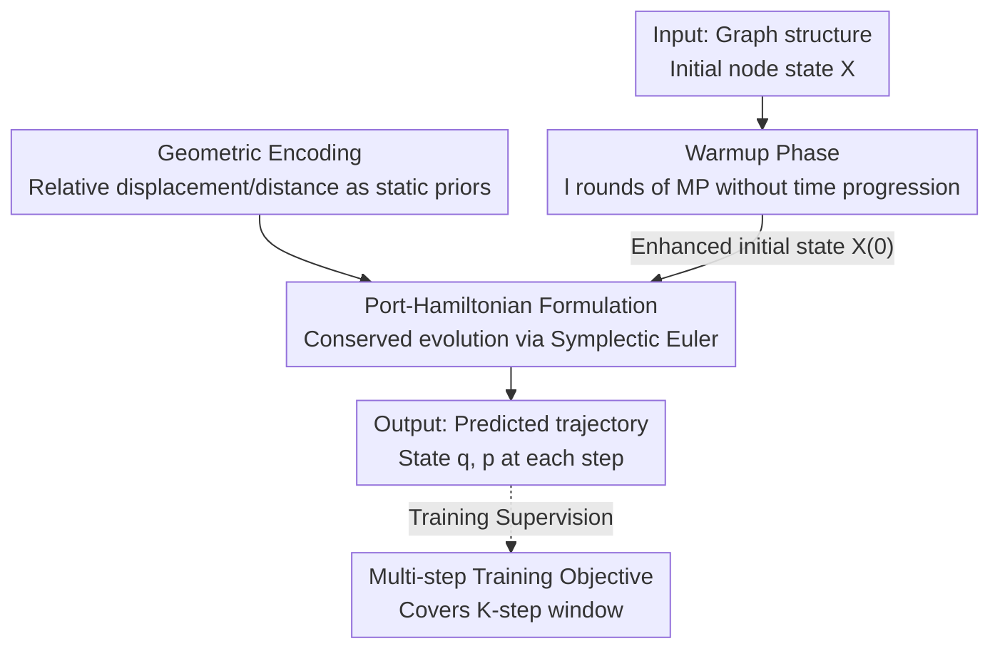

# Improving Long-Range Interactions in Graph Neural Simulators via Hamiltonian Dynamics

**Conference**: ICLR 2026  
**arXiv**: [2511.08185](https://arxiv.org/abs/2511.08185)  
**Code**: [thobotics/neural_pde_matching](https://thobotics.github.io/neural_pde_matching)  
**Area**: 3D Vision  
**Keywords**: Graph Neural Simulators, Hamiltonian Dynamics, Long-range Interactions, Port-Hamiltonian, Multi-step Training

## TL;DR
Information-preserving Graph Neural Simulators (IGNS) are proposed to maintain non-dissipative information flow on graphs using port-Hamiltonian dynamics. Combining warmup initialization, geometric encoding, and multi-step training objectives, IGNS consistently outperforms existing graph neural simulators across six physical simulation benchmarks.

## Background & Motivation
Physical system simulation is a core task in scientific computing, where traditional numerical solvers (e.g., Finite Element Methods) are computationally expensive under high-precision requirements. Graph Neural Simulators (GNS) accelerate simulations by several orders of magnitude by learning dynamics on graph-structured data. However, existing GNS face two fundamental problems: (1) **Difficulty in modeling long-range interactions**—the message-passing mechanism loses information between distant nodes due to over-smoothing and over-squashing after stacking multiple layers; (2) **Error accumulation**—errors amplify rapidly during autoregressive rollout after single-step training. Existing implicit/explicit denoising objectives only mitigate local noise and fail to capture low-frequency drifts occurring after multiple steps. The **Core Idea** is to leverage the information-preserving properties of Hamiltonian dynamics to prevent information dissipation on the graph, thereby enabling effective long-range propagation and stable multi-step rollout.

## Method

### Overall Architecture
IGNS seeks to resolve the chronic issues of information dissipation in long-range interactions and error accumulation in multi-step rollouts. The **Mechanism** involves embedding graph dynamics within a port-Hamiltonian structure: first, a warmup phase without time progression diffuses the global context; second, geometric relationships of irregular meshes are encoded as static priors into edges and injected into external force terms; third, the system evolves forward according to conserved Hamiltonian dynamics, supervised by a multi-step loss covering the entire window. The conservation structure serves as the foundation of the pipeline—ensuring that global information gathered during warmup and gradients backpropagated from distant time steps are not attenuated, thus simultaneously enabling long-range propagation and stable rollout.

### Key Designs

**1. Port-Hamiltonian Formulation: Conserving Information on the Graph**

To address information loss from over-smoothing/over-squashing, IGNS parameterizes dynamics as a port-Hamiltonian system: $\dot{\mathbf{x}}_i = \mathbf{J} \nabla_{\mathbf{x}_i} H_\theta(t, \mathbf{X}) - \begin{bmatrix} 0 \\ \mathbf{D}_\theta \nabla_{\mathbf{p}_i} H_\theta \end{bmatrix} + \begin{bmatrix} 0 \\ \mathbf{r}_\theta(t, \mathbf{X}) \end{bmatrix}$. Here, $\mathbf{J}$ is a skew-symmetric matrix; $H_\theta$ is a learnable Hamiltonian parameterized via message passing that consumes both node and neighbor states; the pure Hamiltonian part handles energy conservation and information preservation, the damping term $\mathbf{D}_\theta$ captures non-conservative effects like friction, and the external force term $\mathbf{r}_\theta$ models external drives. A Symplectic Euler integrator is used to maintain energy conservation properties. It is effective because the system is purely rotational (divergence-free) in the absence of damping and external forces, fully preserving information; theoretically, the sensitivity matrix norm is bounded below by $\|\partial \mathbf{x}(t) / \partial \mathbf{x}(s)\| \geq 1$ (Theorem 2). This prevents exponential gradient decay common in GCNs, supporting effective long-range propagation. Theorem 1 further proves that IGNS reduces to a neural oscillator framework and can approximate any mapping from initial conditions to solutions at time $\tau$, ensuring expressivity is not compromised by conservation constraints.

**2. Warmup Phase: Compensating for Missing Global Context**

Message passing only moves information to direct neighbors at each step, yet long-range interactions are often critical from the first step in physical simulations. Propagating information step-by-step is often too slow. IGNS executes $l$ rounds of extra message passing (without advancing time) before the formal temporal propagation, allowing each node to aggregate information within a radius $l$ to obtain an enhanced initial state $\mathbf{X}(0) = \bar{\mathbf{X}}^{(l)}$. The conservation property of the Hamiltonian core ensures this aggregated global information is preserved throughout the rollout, unlike standard GNNs where it dissipates quickly.

**3. Geometric Encoding: Injecting Geometry as Static Priors on Irregular Meshes**

Accurate encoding of geometric structure is vital for physical simulation on irregular meshes. IGNS encodes relative displacement vectors $\mathbf{s}_{ij}$ and distances $\mathbf{d}_{ij}$ into edge features to form external force terms. Unlike MeshGraphNets which updates edge messages at every time step, IGNS treats edge information as static priors to weight neighbor messages, reducing overfitting to specific grid configurations.

**4. Multi-step Training Objective: Covering the Trajectory with Supervision**

Focusing on the pain point of error accumulation in autoregressive rollouts, IGNS performs a rollout from $q^{(t)}$ for a given window $(q^{(t)}, \ldots, q^{(t+K)})$ and optimizes all intermediate predictions: $\mathcal{L}_{\text{multi-step}} = \sum_{\tau=1}^{K} \left( \|\hat{q}^{(t+\tau)} - q^{(t+\tau)}\|_2^2 + \|\hat{p}^{(t+\tau)} - p^{(t+\tau)}\|_2^2 \right)$. This objective naturally aligns with IGNS—the non-dissipative core ensures signals do not decay over time, preventing gradient vanishing for distant steps. The model effectively utilizes supervision from the entire trajectory rather than just learning the next step.

## Key Experimental Results

### Main Results
The paper evaluates the model on six benchmarks, categorized into Lagrangian and Eulerian systems:

| Dataset | Type | IGNS MSE | MGN MSE | Gain |
|--------|------|----------|---------|------|
| Plate Deformation | Long-range | **Best** | 1.27 | Both IGNS & MGN perform well, but IGNS avoids overfitting |
| Impact Plate | Long-range | **Best** | 3095.75 | IGNS leads by a large margin |
| Sphere Cloth | Complex Dynamics | **Best** (~25×10⁻³) | 32.07×10⁻³ | Significant improvement |
| Wave Balls | Oscillatory Dynamics | **Best** (~1.5×10⁻³) | 1.78×10⁻³ | Substantial lead over all baselines |
| Cylinder Flow | Fluid Dynamics | **Best** | 12.08×10⁻³ | Comparable to GraphCON |
| Kuramoto-Sivashinsky | Chaotic Dynamics | 2.41×10⁻³ | 10.76×10⁻³ | Close to GraphCON |

### Ablation Study

| Configuration | Key Metric | Description |
|------|---------|------|
| Data Efficiency (Plate Def.) | IGNS superior at 100 samples | Port-Hamiltonian inductive bias reduces data dependence |
| Warmup Steps $l$ | Improvement $l=1 \to l=30$ | Largest gain at $l=5$; diminishing returns for $l>30$ |
| Time-varying Weight Matrix | IGNS better in long-term | Time-varying parameterization improves expressivity for non-stationary dynamics |
| Longer Rollout ($T=100$) | IGNS remains stable | Verifies long-term stability |

### Key Findings
- The port-Hamiltonian structure consistently leads standard GNS across **all tasks**.
- GraphCON is a special case of IGNS (identity mass matrix) and is theoretically less expressive.
- While MGN is competitive on Plate Deformation, analysis suggests it relies on massive parameters from non-shared processors and geometric overfitting.
- IGNS far exceeds baselines in the Wave Balls task, as port-Hamiltonian systems are essentially generalizations of wave equations.
- The three new benchmarks (Plate Deformation, Sphere Cloth, Wave Balls) effectively test long-range and oscillatory dynamics.

## Highlights & Insights
- **Fusion of Physics Inductive Bias and Data-driven Methods**: Hamiltonian dynamics do not hard-code physics but provide a structural framework for information preservation, allowing data-driven methods to learn within it.
- **Theory-Practice Consistency**: Two theorems (universality and information preservation) provide a direct explanation for the success of IGNS in long-range and multi-step tasks.
- **Effective Warmup Design**: The missing global context problem in GNS is solved simply through multiple rounds of message passing without time progression.
- **High Parameter Efficiency**: IGNS uses ~216K parameters compared to 1.8M in MGN, achieving better performance with an order of magnitude fewer parameters.

## Limitations & Future Work
- Currently only supports open-loop forward simulation; closed-loop control is not yet supported.
- The number of warmup steps $l$ requires manual selection, with optimal values varying by task.
- For systems with strong global characteristics (e.g., periodic boundary conditions), local information diffusion via warmup remains limited.
- Gains on Eulerian systems (Cylinder Flow, KS) are less significant than on Lagrangian systems.
- Integration with hierarchical or rewiring methods remains unexplored.

## Related Work & Insights
- **Relation to MeshGraphNets**: MGN uses 1st-order explicit Euler with non-shared processors; IGNS uses 2nd-order port-Hamiltonian with a symplectic integrator, representing a qualitative leap.
- **Relation to GraphCON**: GraphCON is a special case of IGNS ($\mathbf{M}=\mathbf{I}$). IGNS offers stronger expressivity via learnable mass/damping/stiffness matrices.
- **Relation to Neural ODE**: IGNS generalizes Neural ODEs to graph-based port-Hamiltonian systems while maintaining theoretical guarantees.
- **Insight**: The oscillatory nature of 2nd-order dynamics is naturally suited for wave propagation and elastic systems in physical simulations.

## Rating
- Novelty: ⭐⭐⭐⭐⭐
- Experimental Thoroughness: ⭐⭐⭐⭐⭐
- Writing Quality: ⭐⭐⭐⭐⭐
- Value: ⭐⭐⭐⭐

<!-- RELATED:START -->

## Related Papers

- [\[ICLR 2026\] Towards Quantifying Long-Range Interactions in Graph Machine Learning: A Large Graph Dataset and a Measurement](towards_quantifying_long-range_interactions_in_graph_machine_learning_a_large_gr.md)
- [\[ICML 2025\] On Measuring Long-Range Interactions in Graph Neural Networks](../../ICML2025/graph_learning/on_measuring_long-range_interactions_in_graph_neural_networks.md)
- [\[ICLR 2026\] LRIM: a Physics-Based Benchmark for Provably Evaluating Long-Range Capabilities in Graph Learning](lrim_a_physics-based_benchmark_for_provably_evaluating_long-range_capabilities_i.md)
- [\[ICLR 2026\] Geometric Graph Neural Diffusion for Stable Molecular Dynamics Simulations](geometric_graph_neural_diffusion_for_stable_molecular_dynamics_simulations.md)
- [\[AAAI 2026\] Are Graph Transformers Necessary? Efficient Long-Range Message Passing with Fractal Nodes in MPNNs](../../AAAI2026/graph_learning/are_graph_transformers_necessary_efficient_long-range_messag.md)

<!-- RELATED:END -->
