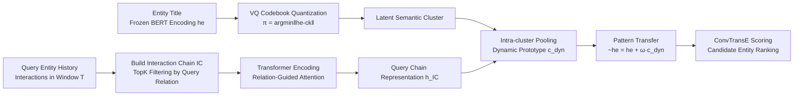

# Inductive Reasoning for Temporal Knowledge Graphs with Emerging Entities

**Conference**: ICLR 2026  
**Code**: [https://github.com/zhaodazhuang2333/TransFIR](https://github.com/zhaodazhuang2333/TransFIR)  
**Area**: Graph Learning / Temporal Knowledge Graph Reasoning  
**Keywords**: Temporal Knowledge Graph, Inductive Reasoning, Emerging Entities, Vector Quantization Codebook, Representation Collapse, Pattern Transfer  

## TL;DR
To address emerging entities with "no historical interactions" in Temporal Knowledge Graphs (TKG), TransFIR utilizes a BERT-based text embedding combined with a learnable VQ codebook to assign entities to semantic clusters. It then transfers interaction chain patterns from semantically similar known entities to avoid representation collapse, achieving an average MRR improvement of 28.6% across four benchmarks.

## Background & Motivation
**Background**: The task of Temporal Knowledge Graph (TKG) reasoning is to predict missing entities at a future time given a query $(e_s, r, ?, t_q)$, supporting applications such as event prediction, temporal QA, and clinical risk analysis. Prev. methods (REGCN, LogCL, HisRes, etc.) excel at modeling relational dynamic evolution and perform strongly on standard test sets.

**Limitations of Prior Work**: These methods are almost entirely built upon the **closed-world assumption**, where the entity set is fixed during training. However, real-world graphs see a continuous influx of entities: social platforms constantly add new users, and molecular networks add new compounds. The author's empirical study reveals that approximately **25% of entities in TKGs only appear in the inference set**, having never been seen during training and possessing no historical interactions.

**Key Challenge**: Existing transductive methods rely on entity-specific embeddings. Due to the lack of historical interaction supervision signals, the embeddings of emerging entities cannot be effectively trained. Using t-SNE and a custom Collapse Ratio (a rotation-invariant metric based on the log-det of covariance), the authors quantified that after training LogCL, the Collapse Ratio of emerging entities plummeted from 1.02 to 0.0055. This indicates severe **representation collapse**, where emerging entity embeddings cluster together and drift onto a different manifold from known entities, leading to significant performance degradation on triples involving these entities. While inductive methods for static KGs (InGram, ULTRA) can handle new entities, they assume new entities already have known interactions, failing to address "zero-interaction" emerging entities in TKGs.

**Goal**: Formally define the task of "inductive reasoning for TKG emerging entities without historical interactions" and design a framework capable of preventing representation collapse and generating informative representations for emerging entities under zero-interaction conditions.

**Key Insight**: The authors observed that **entities with similar semantic types often share transferable interaction patterns** (e.g., new presidents of different countries follow event sequences like "visit → negotiate"). Based on this, **semantic clusters are used as a bridge** to transfer interaction chain patterns from semantically similar known entities to emerging entities.

## Method

### Overall Architecture
TransFIR follows a three-stage pipeline: **Classification → Representation → Generalization**. It first uses text embeddings and a VQ codebook to map all entities (including emerging ones) to latent semantic clusters (providing a "history-free" category prior). It then constructs and encodes "Interaction Chains" around the query entity to capture transferable ordered interaction patterns. Finally, it performs dynamic prototype pooling and pattern transfer within each cluster, allowing zero-interaction emerging entities to borrow temporal patterns from known entities in the same cluster, resulting in informative time-aware representations.

### Key Designs

**1. Interaction-aware VQ Codebook Classification: Providing category priors for zero-interaction entities.** Directly updating entity embeddings causes collapse for emerging entities lacking supervision, while relying solely on frozen embeddings cannot adapt to TKG dynamics. The authors compromise: **freeze entity embeddings and keep cluster prototypes learnable**. Each entity is first encoded via a pre-trained BERT on its title to obtain a static text embedding $h_e \in \mathbb{R}^d$ (frozen, so emerging entities can be encoded even with zero interaction). A learnable codebook $C=\{c_1,\dots,c_K\}$ is maintained, quantizing entities to the nearest codeword $\pi(e)=\arg\min_k \|h_e - c_k\|_2^2$. The codebook is optimized via a codebook loss $L_{cb}=\|\mathrm{sg}[h_e]-c_{\pi(e)}\|_2^2$ (pulling prototypes toward embeddings) and a commitment loss $L_{commit}=\|h_e-\mathrm{sg}[c_{\pi(e)}]\|_2^2$ (pulling embeddings toward prototypes), where $\mathrm{sg}[\cdot]$ denotes the stop-gradient. Unlike static clustering, codewords are trained jointly with task objectives, making clusters "interaction-aware" and allowing semantically consistent types like Country / Civic & Parties / Citizen to emerge naturally.

**2. Interaction Chain Encoding: Capturing entity-agnostic temporal patterns using ordered sequences rather than unordered neighborhoods.** Since what is transferable are **ordered event sequences** like "visit → negotiate," unordered temporal neighborhoods are insufficient. For a query $q=(e_q, r_q, ?, t_q)$, historical interactions of $e_q$ within window $T$ are collected chronologically to form an interaction chain $C_q$. TopK filtering is applied based on the cosine similarity between relations and the query relation: $C_q^{(k)}=\mathrm{TopK}_i(\mathrm{sim}(h_{r_q}, h_{r_i}), C_q)$, retaining the $k$ most relevant interactions while maintaining temporal order. Each interaction undergoes component-specific transformation and fusion $x_i = f(\phi_e(h_{s_i}), \phi_r(h_{r_i}), \phi_e(h_{o_i}), \phi_\tau(h_{\Delta t_i}))$, where entity embeddings are frozen, relation embeddings are learnable, and $\Delta t_i = t_q - t_i$ encodes the relative time interval. After contextualization via a Transformer, a relation-guided attention $\alpha_i \propto \exp(w^\top \tanh(W_h h_i + W_q h_{r_q}))$ modulated by the query relation $h_{r_q}$ is used for weighted summation to obtain the query-specific chain representation $h_{e_q}^{IC}$, highlighting interactions most relevant to $r_q$.

**3. Chain Pattern Transfer: "Borrowing" temporal patterns from known entities in the same cluster for emerging entities.** The chain encoding only characterizes the query entity itself, leaving emerging entities static due to sparse interactions. Thus, at each time $t$, **intra-cluster pooling** is performed according to codebook assignments to obtain a dynamic prototype $c_k^{dyn}=\frac{1}{|Q_k|}\sum_{e\in Q_k} h_e^{IC}$ (where $Q_k$ is the set of entities in cluster $k$), aggregating the shared temporal evolution of that semantic cluster. Each entity then concatenates its static embedding with the cluster prototype $z_e=[h_e \| c_{\pi(e)}^{dyn}]$, which is mapped through parameters to generate a transfer vector $\omega_e=\Psi(z_e)$. The final representation is $\tilde{h}_e = h_e + \omega_e \cdot c_{\pi(e)}^{dyn}$. Emerging entities with zero interaction thus inherit interaction chain information from known entities in the same cluster. Scoring is performed using ConvTransE: $\phi(e_q, r_q, e_o, t)=\sigma(f(\tilde{h}_{e_q}, h_{r_q}, \tilde{h}_{e_o}))$. The total loss consists of link prediction cross-entropy and codebook loss $L = L_{lp} + \lambda L_{codebook}$, trained synchronously.

## Key Experimental Results

### Main Results
On four benchmarks (ICEWS14/18/05-15, GDELT), using a 5:2:3 time split (which exposes more emerging entities than the standard 8:1:1), only **triples involving emerging entities** were evaluated. Comparison was made against 13 graph-based / path-based / inductive baselines:

| Method | ICEWS14 MRR | ICEWS18 MRR | ICEWS05-15 MRR | GDELT MRR |
|------|------|------|------|------|
| REGCN (2021) | 0.1175 | 0.0947 | 0.0887 | 0.0222 |
| LogCL (2024) | 0.1354 | 0.0903 | 0.1917 | 0.0473 |
| HisRes (2025) | 0.1169 | 0.0445 | 0.1325 | 0.0932 |
| CompGCN (2020) | 0.0682 | 0.0638 | 0.1885 | 0.0472 |
| InGram (2023) | 0.0563 | 0.0254 | 0.0771 | 0.0471 |
| **Ours (TransFIR)** | **0.1687** | **0.1177** | **0.2204** | **0.1103** |
| Gain | +24.6% | +24.3% | +15.0% | +50.5% |

The Gain on Hits@10 for GDELT reached **101.4%**, with an average MRR improvement of **28.6%** across the four datasets.

### Ablation Study
(Measured by Hits@10; removing any module results in performance drops)

| Variant | Description | Impact |
|------|------|------|
| -Codebook | Removes codebook mapping, using only static clustering features | **One of the most significant drops** |
| -Pattern Transfer | Removes pattern transfer, using static representations | **One of the most significant drops** |
| -IC | Removes interaction chains, using entity embeddings only | Significant drop |
| -Textual encoding | Removes frozen text embeddings, using random initialization | Drop (except for GDELT) |

### Key Findings
- **Representation collapse was significantly mitigated**: The Collapse Ratio improved from 0.0055 (LogCL) to 0.8677 (TransFIR). t-SNE shows embeddings transformed from a "single dense mass" into "well-separated clusters."
- **Codebook aligns with real semantic types**: Three clusters were identified as Country / Civic & Parties / Citizen, with emerging entities consistently assigned to correct clusters. A case study showed "Mexican presidential candidate makes a statement" was successfully predicted as Gov(Mexico) by borrowing patterns like "make statement → Gov" from the Romanian Prime Minister and Mexican officials in the Civic & Parties cluster.
- **Codebook and Pattern Transfer are dual cores**: Ablations show both modules are indispensable.
- **GDELT Text Encoding counter-example**: GDELT entity titles contain many abbreviations/symbols (e.g., "EGYPT (EGY@ OPP REF...)"). Removing text encoding sometimes yielded better results, indicating that text quality affects module gains.

## Highlights & Insights
- **Valuable Problem Definition**: Formalizing "inductive reasoning for TKG emerging entities with zero historical interactions" and quantifying "representation collapse" as the root cause (using the 25% empirical data + Collapse Ratio) provides solid motivation.
- **Natural Intuition for Semantic Clusters**: Observing that "similar type entities share interaction patterns" → Codebook clustering → Intra-cluster pooling transfer creates a smooth logical loop with high interpretability (clusters actually correspond to types like Country/Party/Citizen).
- **Clever Frozen Embedding + Learnable Prototype Trade-off**: This design choice prevents emerging entity embedding collapse while allowing clustering to adapt dynamically to interactions, which is the key to preventing collapse in this paper.

## Limitations & Future Work
- **Strong Dependence on Entity Titles**: The method relies on BERT encoding of titles. It degrades on graphs where titles are missing or filled with abbreviations/symbols (e.g., GDELT). The authors acknowledge the need to introduce external knowledge for richer entity descriptions.
- **Codebook Size K is a Hyperparameter**: The number of clusters must be manually tuned. The paper does not deeply discuss K's sensitivity to different graph scales (though sensitivity analysis exists in the appendix).
- **Evaluation Limited to Emerging Entity Triples**: Main experiments focus on the emerging setting. There is less discussion on the global performance impact (including known entities) and the trade-offs with SOTA under vanilla settings.
- **Coarse Transfer Granularity**: Pattern transfer uses mean pooling at the cluster level, potentially losing fine-grained intra-cluster differences. Future work could explore attention-weighted fine-grained transfer.

## Related Work & Insights
- **TKG Reasoning**: Methods like REGCN, LogCL, and HisRes model relational dynamics but operate under the closed-world assertion. This work is among the first to systematically handle zero-interaction emerging entities.
- **Inductive KG Reasoning**: InGram builds relation affinity graphs, and ULTRA uses relative interaction representations to generalize to new entities, but both target static KGs and require existing interactions for new entities. This paper pushes inductive reasoning into the more challenging "temporal + zero-interaction" setting.
- **Vector Quantization**: Borrowing the codebook mechanism from VQ-VAE for semantic clustering highlights that VQ is not just for generation but can be a lightweight tool for "category prior injection," offering universal value for cold-start/zero-shot problems.

## Rating
- **Novelty**: ⭐⭐⭐⭐ Formalizing the neglected real-world problem of "zero-interaction emerging entities" and solving it with the VQ Codebook + Interaction Chain + Intra-cluster Pattern Transfer combo is novel and self-consistent.
- **Experimental Thoroughness**: ⭐⭐⭐⭐ Four datasets, thirteen baselines, complete ablations, representation analysis, case studies, and extended experiments on Unknown settings/robustness/sensitivity provide comprehensive coverage.
- **Writing Quality**: ⭐⭐⭐⭐ The three-perspective empirical findings (Data/Representation/Feasibility) lead into the motivation step-by-step. The Collapse Ratio quantification is clear, and the three-stage pipeline is well-articulated.
- **Value**: ⭐⭐⭐⭐ Emerging entity cold-start is a genuine pain point for TKG deployment. The 28.6% average improvement and strong interpretability give the method promising practical prospects.

<!-- RELATED:START -->

## Related Papers

- [\[ICLR 2026\] Knowledge Reasoning Language Model: Unifying Knowledge and Language for Inductive Knowledge Graph Reasoning](knowledge_reasoning_language_model_unifying_knowledge_and_language_for_inductive.md)
- [\[ICLR 2026\] Beyond Entity Correlations: Disentangling Event Causal Puzzles in Temporal Knowledge Graphs](beyond_entity_correlations_disentangling_event_causal_puzzles_in_temporal_knowle.md)
- [\[ICLR 2026\] Revisiting Node Affinity Prediction in Temporal Graphs](revisting_node_affinity_prediction_in_temporal_graphs.md)
- [\[ICLR 2026\] HYPER: A Foundation Model for Inductive Link Prediction with Knowledge Hypergraphs](hyper_a_foundation_model_for_inductive_link_prediction_with_knowledge_hypergraph.md)
- [\[ICLR 2026\] TGM: A Modular and Efficient Library for Machine Learning on Temporal Graphs](tgm_a_modular_and_efficient_library_for_machine_learning_on_temporal_graphs.md)

<!-- RELATED:END -->
