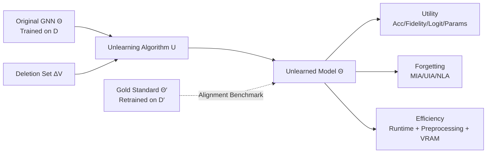

# Is Graph Unlearning Ready for Practice? A Benchmark on Efficiency, Utility, and Forgetting

**Conference**: ICLR 2026  
**OpenReview**: [https://openreview.net/forum?id=gSPkuTTWgU](https://openreview.net/forum?id=gSPkuTTWgU)  
**Code**: [https://github.com/idea-iitd/Unlearning_Benchmark](https://github.com/idea-iitd/Unlearning_Benchmark)  
**Area**: Graph Machine Learning / Graph Unlearning / Benchmark  
**Keywords**: Graph Neural Networks, Machine Unlearning, GDPR, Privacy Attacks, Benchmarking, Node Deletion

## TL;DR
This paper constructs the first systematic benchmark for graph unlearning, evaluating 10 categories of mainstream methods across 7 datasets based on three dimensions: efficiency, utility, and forgetting quality. The study reaches a dispiriting yet pragmatic conclusion: on large-scale graphs, most unlearning methods are neither faster than retraining from scratch nor thorough in forgetting. **Retraining remains the most reliable option at present.**

## Background & Motivation
**Background**: Regulations such as GDPR grant users the "Right to be Forgotten," requiring models to erase the influence of specific training data upon request. For GNNs deployed in social or recommendation scenarios, this has catalyzed the field of graph unlearning—removing the influence of specific nodes/edges from a trained GNN without retraining from scratch. Numerous methods have emerged, including learning-based (GNNDELETE, MEGU), influence function/projection-based (GIF, IDEA, GST, PROJECTOR), partition-aggregation-based (GRAPHERASER, GUIDE), and certified-based (CGU, SCALEGUN).

**Limitations of Prior Work**: The field lacks a unified yardstick. The authors identify three evaluative gaps: (1) **Inconsistent metrics**: Whether to align with the retrained model's prediction accuracy, logit distribution, or parameters remains unstandardized, making cross-method comparisons impossible; (2) **Missing efficiency comparisons**: Unlearning is only meaningful if it is faster than "retraining after data deletion," yet systematic time and memory comparisons on large graphs are often absent; (3) **Blind spots in generalization and robustness**: Performance differences across homophilic/heterophilic graphs, random vs. targeted deletions, and linear vs. non-linear GNNs have rarely been tested; many "certified" methods only hold under narrow settings like linear GNNs and binary classification.

**Key Challenge**: There is a tension between "theoretical guarantees" and "practical usability." Methods pursuing certified guarantees are often forced to use linear GNNs and one-vs-rest binary classification, losing applicability to real-world non-linear multi-class GNNs. Conversely, flexible methods often suffer from OOM (Out of Memory) or are slower than retraining on large graphs.

**Goal**: Rather than proposing a new algorithm, this paper aims to answer two questions critical for practitioners: **Do existing unlearning methods offer any actual advantage over retraining? If so, how should one choose for a given workload?**

**Core Idea**: **[Diagnostic 3D Benchmark]** The quality of unlearning is decomposed into three orthogonal questions: Is it faster (efficiency)? Does it maintain utility while staying close to the retraining gold standard (utility)? And is the data truly forgotten (forgetting)? Each dimension is scrutinized using multi-level, multi-attack fine-grained metrics to expose illusions hidden by single metrics like AUC.

## Method

### Overall Architecture
The paper proposes an evaluation protocol rather than an algorithm, structured as "Three Constraints → Multi-level Metrics → Five Research Questions (RQs)." Given the original model $\Theta$ (trained on $D$) and a deletion set $\Delta V_{train}$, an unlearning algorithm produces $\tilde{\Theta} \leftarrow U(\Theta, \Delta V_{train})$. The gold standard $\Theta'$ is obtained by retraining from scratch on $D'$. The benchmark layers comparisons between $\tilde{\Theta}$ and $\Theta'$, measures forgetting completeness, and calculates time/memory costs relative to retraining.

### Key Designs

**1. Four Levels of Utility Evaluation**: To move beyond "accuracy illusions," utility is examined at four levels of increasing granularity. The coarsest is **Aggregate Accuracy** $Acc = \frac{1}{|V_{test}|}\sum_{v} \mathbb{1}[f_\Theta(v)=y_v]$. The next level is **Fidelity** $\frac{1}{|V_{test}|}\sum_v \mathbb{1}[f_{\tilde\Theta}(v)=f_{\Theta'}(v)]$, which measures if the unlearned model and the gold standard provide identical predictions for each node. The third is **Logit Space $\ell_2$ Distance**, capturing shifts in the output distribution. The finest is **Parameter Space $\ell_2$ Distance**, directly comparing weights (the paper includes a lemma stating that proximal parameters imply proximal layer activations). This hierarchy reveals methods like IDEA, which maintain label accuracy but exhibit severely shifted confidence distributions.

**2. Three Classes of Privacy Attacks for Forgetting**: High utility does not imply thorough forgetting. A model can be close to the gold standard while retaining information about deleted data. Three complementary attacks are used: **Membership Inference Attack (MIA)** to check if an adversary can determine if a node was in the training set; **Unlearning Inversion Attack (UIA)** which attempts to reconstruct deleted edges via black-box access to $\tilde\Theta$, capturing structural leaks from message passing; and **Noisy Labeler Attack (NLA)** to check if $\tilde\Theta$ still predicts the original labels for deleted nodes with high confidence.

**3. Efficiency Accounting with Preprocessing and Realistic Deletion**: Unlike studies that only report the unlearning step time, this benchmark insists that **efficiency must be measured against the baseline of retraining**, factoring in the preprocessing overhead of partitioning or certification methods (Table 7 uses parentheses for preprocessing and red for cases slower than the gold standard). It also includes adversarial deletion distributions (by degree or label frequency, RQ5) and tests scalability on Reddit (110M edges).

**4. Five Research Questions (RQs)**: The evaluation is driven by: RQ1 Utility (proximity to retraining), RQ2 Efficiency (actual time/memory savings), RQ3 Forgetting (thoroughness), RQ4 Sequential Deletion (performance over multiple rounds), and RQ5 Workload Robustness (stability under non-random deletions).

## Key Experimental Results

Tests covered 7 datasets (CORA, CITESEER, PHOTO, AMAZON-Ratings, ROMAN-Empire, OGBN-Arxiv, and Reddit for scalability), including both homophilic and heterophilic graphs. GCN was used as the default backbone. OOM denotes Out of Memory, and OOT denotes Out of Time (>24h).

### Main Results: Accuracy after Unlearning 10% of Nodes (Table 3)

| Method | CORA | CITESEER | PHOTO | AMAZON-R | ROMAN-E | OGBN-ARXIV |
|------|------|------|------|------|------|------|
| GOLD (Retraining) | 0.88 | 0.73 | 0.93 | 0.43 | 0.41 | 0.60 |
| MEGU | 0.89 | 0.77 | 0.92 | 0.42 | 0.41 | 0.61 |
| GIF | 0.88 | 0.76 | 0.92 | 0.43 | 0.44 | 0.59 |
| IDEA | 0.87 | 0.77 | 0.93 | 0.41 | 0.48 | 0.56 |
| PROJECTOR | 0.84 | 0.77 | 0.87 | **0.47** | **0.50** | 0.61 |
| GNNDELETE | 0.76 | 0.76 | 0.34 | 0.37 | 0.33 | OOM |
| GST | OOM | OOM | OOM | OOM | OOM | OOM |
| COGNAC | 0.84 | 0.68 | 0.92 | 0.45 | 0.51 | 0.68 |
| ETR | 0.89 | 0.81 | 0.93 | 0.41 | 0.30 | 0.58 |

On homophilic graphs, MEGU/GIF/IDEA closely track the gold standard. On heterophilic graphs (AMAZON-R, ROMAN-E), rankings shift, with PROJECTOR performing well due to its customized linear GNN; GST was eliminated due to consistent OOM.

### Fine-grained Alignment: Fidelity / Logit Distance (Table 4-5, Unlearning Ratio 0.1)

| Method | Fidelity (CORA→ARXIV) | Logit $\ell_2$ (CORA→ARXIV) |
|------|------|------|
| MEGU | 0.95→0.91 (Best in GCN) | 3.05→3.53 (Best in GCN) |
| GIF | 0.93→0.85 | 3.60→5.03 |
| IDEA | 0.92→0.76 | **18.0→45.8 (Severe deviation)** |
| PROJECTOR | 0.99→0.98 ($*$Linear GNN) | 0.09→0.41 |

Note: While IDEA's fidelity appears acceptable, its logit distance explodes, indicating that while it "guesses" the correct label, its confidence distribution is entirely incorrect. MEGU is the most stable within the GCN group.

### Efficiency (Table 7, Total Time incl. Preprocessing, Red=Slower than Gold)

| Method | CORA | PHOTO | AMAZON-R | ARXIV | Reddit |
|------|------|------|------|------|------|
| GOLD | 0.65 | 0.90 | 1.70 | 9.90 | Base |
| MEGU | 0.61 | 0.51 | 2.50🔴 | 20.49🔴 | OOM |
| GIF | 0.39 | 0.37 | 0.74 | 4.79 | OOM |
| IDEA | 0.38 | 0.40 | 0.47 | 5.31 | OOM |
| GRAPHERASER | 22.9🔴 | 30.0🔴 | 28.7🔴 | 116🔴 | OOM |
| GUIDE | 77.7🔴 | 919🔴 | 782🔴 | OOM | OOM |
| ETR | 1.65🔴 | 2.02🔴 | 1.84 | — | **Only one faster than GOLD** |

### Key Findings
- **Utility-leading MEGU is slower than retraining on large graphs** (ARXIV 20.5s vs 9.9s), undermining its practical value.
- **Partitioning methods (GRAPHERASER/GUIDE) are crippled by preprocessing**, being 10x to 1000x slower; preprocessing often accounts for 50–75% of the time.
- **On Reddit (110M edges), almost all methods except COGNAC and ETR OOM.** ETR is the only one faster than retraining on Reddit.
- PROJECTOR has hidden costs: its complexity grows polynomially with feature dimensions and it is bound to linear GNNs.
- **Overall conclusion**: No method consistently achieves the trifecta of Faster + Utility-preserving + Thorough forgetting on large graphs.

## Highlights & Insights
- **The benchmark adopts a pragmatic perspective**, treating "faster than retraining" as a hard threshold and exposing embarrassing realities often avoided in papers.
- **Multi-level and multi-attack diagnostics** upgrade evaluation from single-number snapshots to holistic profiles, explaining why methods fail (e.g., IDEA's logit shift vs. SISA's "preprocessing tax").
- **Bold conclusions**: The paper explicitly suggests shifting research focus from theoretical guarantees under narrow assumptions to scalable, batchable implementations, noting that certified/projection routes currently offer limited practical value.

## Limitations & Future Work
- **Focus is primarily on node deletion**; edge and feature unlearning are only evaluated in the appendix.
- **Certified methods (CGU/SCALEGUN) are excluded from the main benchmark** due to their limitation to linear GNNs and binary classification.
- The default backbone is GCN; behavior on more complex heterogeneous or attention-based GNNs is less explored.
- The conclusion that "retraining is better" depends largely on the current engineering maturity of existing methods.

## Related Work & Insights
This work distinguishes itself from existing GNN unlearning benchmarks by: (1) providing actionable guidelines on when to unlearn versus retrain; (2) upgrading from aggregate metrics to multi-layer alignment; and (3) elevating "efficiency relative to retraining" to a first-class citizen. For practitioners, the takeaway is simple: check if a method is scalable, faster than retraining, and thorough in forgetting. If any of these cannot be answered, retraining is the honest choice.

## Rating
- **Novelty**: ⭐⭐⭐⭐ While not proposing an algorithm, the 3D diagnostic framework and efficiency threshold constitute a critical and novel systematic benchmark.
- **Experimental Thoroughness**: ⭐⭐⭐⭐⭐ 10 methods, 7 datasets, 4 utility layers, 3 attack classes, and scalability stress tests provide high coverage.
- **Writing Quality**: ⭐⭐⭐⭐ Question-driven and logically clear with high information density in tables.
- **Value**: ⭐⭐⭐⭐⭐ Directly addresses the feasibility of unlearning for GDPR compliance and provides actionable guidance for practitioners.

<!-- RELATED:START -->

## Related Papers

- [\[ICLR 2026\] LRIM: a Physics-Based Benchmark for Provably Evaluating Long-Range Capabilities in Graph Learning](lrim_a_physics-based_benchmark_for_provably_evaluating_long-range_capabilities_i.md)
- [\[ICLR 2026\] GDGB: A Benchmark for Generative Dynamic Text-Attributed Graph Learning](gdgb_a_benchmark_for_generative_dynamic_text-attributed_graph_learning.md)
- [\[ICLR 2026\] DHG-Bench: A Comprehensive Benchmark for Deep Hypergraph Learning](dhg-bench_a_comprehensive_benchmark_for_deep_hypergraph_learning.md)
- [\[CVPR 2026\] R2G: A Multi-View Circuit Graph Benchmark Suite from RTL to GDSII](../../CVPR2026/graph_learning/r2g_multi_view_circuit_graph_benchmark_suite_from_rtl_to_gdsii.md)
- [\[ICML 2025\] Balancing Efficiency and Expressiveness: Subgraph GNNs with Walk-Based Centrality](../../ICML2025/graph_learning/balancing_efficiency_and_expressiveness_subgraph_gnns_with_walk-based_centrality.md)

<!-- RELATED:END -->
