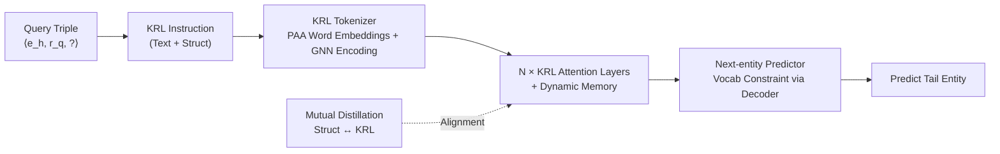

# Knowledge Reasoning Language Model: Unifying Knowledge and Language for Inductive Knowledge Graph Reasoning

**Conference**: ICLR 2026  
**OpenReview**: [https://openreview.net/forum?id=2g8EmFwNTB](https://openreview.net/forum?id=2g8EmFwNTB)  
**Code**: [https://github.com/lazyloafer/KRLM](https://github.com/lazyloafer/KRLM)  
**Area**: Graph Learning / Knowledge Graph Reasoning / LLM  
**Keywords**: Inductive Knowledge Graph Reasoning, Knowledge Graph Foundation Models, LLM, Knowledge Distortion, Knowledge Mutual Distillation  

## TL;DR
KRLM unifies Knowledge Graph (KG) structural representations and LLM internal knowledge into a "Knowledge Reasoning Language" (KRL). Through a KRL tokenizer, a KRL attention layer with knowledge memory, and a structure-aware next-entity predictor, it suppresses "knowledge distortion" caused by sparse KG contexts and out-of-scope hallucinations in inductive KGR tasks.

## Background & Motivation
**Background**: Inductive Knowledge Graph Reasoning (Inductive KGR) aims to complete facts on open-domain KGs containing unseen entities and relations. The core challenge is generalizing structural invariances from the training KG to unfamiliar ones. Early works utilized Knowledge Graph Foundation Models (KGFM, e.g., ULTRA) to capture cross-KG structural invariance for zero-shot capabilities. More recent efforts have introduced LLMs (e.g., MKGL, PROLINK) to exploit the emergent open-domain knowledge within LLMs to discover implicit facts.

**Limitations of Prior Work**: Existing LLM-based KGFMs typically **explicitly concatenate** sparse structural knowledge as prompts for the LLM. However, the contextual evidence extracted from KGs is often extremely sparse, which may **overpower the dense internal knowledge** of the LLM. The paper illustrates this with an example from "Trainspotting": if the only clue for "film\_genre" in the KG is "studied at an academy of music and drama," the LLM might be misled by this toxic association and ignore its own knowledge that the answer is "dark comedy." **Key Challenge**: A natural knowledge representation gap exists between KGs and LLMs. Insufficient coordination causes irreversible "knowledge distortion." Additionally, the emergent abilities of LLMs can lead to out-of-scope hallucinations, undermining the reliability of reasoning results.

**Goal**: To achieve unified coordination between LLM internal knowledge and KG structural context throughout the KGR process, mitigating knowledge distortion while constraining out-of-scope hallucinations.

**Core Idea**: **Implicit injection instead of explicit concatenation** — encode KG entities and relations into implicit representations and inject them into both reasoning instructions (KRL instruction) and LLM parameters (attention layers). This allows the LLM to adapt to external knowledge in a more flexible environment rather than being overridden by rigid, sparse prompts.

## Method

### Overall Architecture
Given a query triple $\langle e_h, r_q, ?\rangle$, KRLM first transforms it into a **KRL instruction** that fuses LLM internal knowledge (textual descriptions) and KG knowledge (structural embeddings). The **KRL tokenizer** produces token embedding sequences (word-level embeddings from the PAA module and structural representations from the GNN knowledge encoder). These sequences are processed by $N$ **KRL attention layers**, which coordinate the two types of knowledge via a dynamic knowledge memory mechanism during in-context learning. Finally, a **structure-aware next-entity predictor** strictly constrains the output to the entity vocabulary of the current KG. Training employs a knowledge mutual distillation objective to align the scoring distributions of the structural side and the KRL side.

### Key Designs

**1. KRL Tokenizer and PAA Module: Compressing infinite entities into fixed-parameter representations.** The KRL instruction includes a global vocabulary mapping entities/relations to their "word-form, type, description, and structural representation." This allows the LLM to understand unfamiliar elements like a dictionary. For each entity, the LLM's default tokenizer first splits "<Entity: text\_description>" into a token embedding sequence $\{t_1,\dots,t_L\}$. Then, Principal Attribute Aggregation (PAA) fuses multi-view statistics into a single word-level embedding: $w_e = \mathrm{PAA}(\{t_1,\dots,t_L\})=\big(\big\|_{\mathrm{attr}\in\{\text{mean,max,min,std}\}}\mathrm{attr}(\{t_1^*,\dots,t_L^*\})\big)W_{\text{fusion}}$. The advantage is that word-level embeddings for new entities are generated by fixed trainable matrices $W_{\text{down}}$ and $W_{\text{fusion}}$, supporting an infinite growth of entities with **constant-scale parameters** — a necessity for inductive tasks. On the structural side, an $S$-layer NBFNet acts as a knowledge encoder to produce structural invariant representations $E, R$ (Eq. 1), which are projected via $F_{\text{word}}, F_{\text{struct}}$ to the LLM's dimension to replace placeholders.

**2. KRL Attention Layer with Knowledge Memory: Enabling dynamic involvement of structural context in in-context learning.** This is the core mechanism for addressing "knowledge distortion." Standard LLM attention performs causal decoding among text, word-level, and structural tokens: $H^{(n)}=\mathrm{softmax}\big(\frac{H^{(n-1)}W_Q[H^{(n-1)}W_K]^T}{\sqrt F}+W_{\text{mask}}\big)H^{(n-1)}W_V$ (where weights are frozen). KRLM adds a **dynamic knowledge memory**: an MLP scoring function $sc^{(i)}_{\text{struct}}=S_{\text{struct}}([e_i\|r_q])$ measures the relevance between each entity's structural representation and the query. The top-$K$ most relevant entities form the memory $E_{\text{mem}}\in\mathbb{R}^{K\times d}$, which is concatenated into the query/value of the attention: $A=\mathrm{softmax}\big(\frac{H^{(n-1)}M_Q E_{\text{mem}}^T \,\|\,(H^{(n-1)}W_Q[H^{(n-1)}W_K]^T+W_{\text{mask}})}{\sqrt F}\big)$, $H^{(n)}=A[E_{\text{mem}}M_V \,\|\, H^{(n-1)}W_V]$. Only $M_Q$ and $M_V$ are trainable. By using a lightweight memory bypass and frozen backbone, external KG knowledge is introduced "dynamically and by relevance" rather than via rigid sparse prompts, preventing internal knowledge from being overridden.

**3. Structure-Aware Next-Entity Predictor: Locking hallucinations within the KG vocabulary.** Native LLM vocabularies do not overlap with KG entity sets. Direct next-token prediction causes out-of-scope results. KRLM modifies the projection head $P$: first, it maps the head to entity word-level embeddings via PAA: $p_h=\mathrm{PAA}(P[\mathrm{TKN}(\langle\text{Entity: text description}\rangle)])$. Then, an $S$-layer GNN "knowledge decoder" $\tilde P=\mathrm{GNN}_p(\{\mathbb{I}_{i=h}\cdot p_h\}_{i=1}^I, R, G)$ makes the projection matrix aware of the current KG structure. The final next-entity score $sc^{(i)}_{\text{KRLM}}=S_{\text{KRLM}}([\tilde p_i\|r_q\|g(H^{(N)}[m])])$ fuses the decoded projection, relation knowledge, and hidden states. At inference, the average of this score and $sc^{(i)}_{\text{struct}}$ is used. This **strictly constrains the output to the given KG's entity set**, fundamentally preventing out-of-scope hallucinations.

**4. Knowledge Mutual Distillation: Calibrating dual scoring paths.** The training loss consists of two symmetric terms — structural distillation and KRL distillation. Each combines Binary Cross Entropy and $\lambda$-weighted KL divergence: $L=(1-\lambda)\big[-\log sc^{(t)}_{\text{KRLM}}+\frac{1}{|N_{\text{neg}}|}\sum\log(1-sc^{(n)}_{\text{KRLM}})\big]+\lambda\mathrm{KL}(P_{\text{struct}}\|P_{\text{KRLM}}) + \text{Symmetric Structural Term} +\lambda\mathrm{KL}(P_{\text{KRLM}}\|P_{\text{struct}})$. This bidirectional alignment ensures that textual context and structural knowledge are coordinated within the same space.

## Key Experimental Results

### Main Results (Average for Inductive Datasets, PT=Pre-trained Zero-shot / FT=Fine-tuned)

| Dataset Group | Metric | Supervised SOTA | ULTRA(FT) | MOTIF(FT) | TRIX(FT) | PROLINK | KRLM(PT) | KRLM(FT) |
|---|---|---|---|---|---|---|---|---|
| IndE (12) | Hit@10 | 0.675 | 0.724 | 0.740 | 0.734 | 0.733 | 0.738 | **0.751** |
| IndE (12) | MRR | 0.527 | 0.566 | 0.582 | 0.583 | 0.562 | 0.583 | **0.590** |
| IndER (13) | Hit@10 | 0.347 | 0.542 | 0.538 | 0.536 | 0.542 | 0.546 | **0.556** |
| IndER (13) | MRR | 0.209 | 0.350 | 0.349 | 0.353 | 0.354 | 0.361 | **0.367** |

In transductive settings, KRLM reaches or exceeds strong baselines on WN18RR (MRR 0.552) and CoDEx-M (Hit@10 0.526), though it slightly trails MKGL on FB15k-237 (0.591).

### Ablation Study (Hit@10, E2E Training)

| Dataset | KRLM (Full) | -KEn (w/o encoder) | -KMe (w/o memory) | -KDe (w/o decoder) | Atten (vs PAA) | Mean (vs PAA) | -KD-KL (w/o distillation) |
|---|---|---|---|---|---|---|---|
| FB-V1 | **0.705** | 0.614 | 0.691 | 0.674 | 0.696 | 0.692 | 0.665 |

Removing any module leads to a drop. The exclusion of the knowledge encoder (-KEn) causes the largest drop (0.705 to 0.614), proving GNN structural representations are the foundation. Removing the knowledge decoder (-KDe) and distillation (-KD-KL) also significantly impairs performance.

### Key Findings
- KRLM in zero-shot (PT) mode **outperforms 87% of baselines**, including some fine-tuned KGFMs, confirming that extending structural invariance with LLM internal knowledge improves discrimination of unseen entities.
- MKGL **cannot handle IndER tasks** due to a fixed relation vocabulary; PROLINK ignores the incompatibility between sparse KG context and internal knowledge, suffering from distortion.
- Performance leads consistently across 25 (main text) / 28 (abstract) real-world inductive datasets.

## Highlights & Insights
- **Paradigm shift: Implicit injection > Explicit concatenation**. Moving KG knowledge from the text prompt to instruction placeholders and attention bypasses addresses the long-standing "knowledge distortion" in LLM-based KGR.
- **Support for infinite entities with fixed parameters**: PAA uses statistical aggregation rather than vocabulary expansion, fitting the inductive open-world perfectly and saving VRAM.
- **Hard constraints on hallucinations**: Using a structure-aware GNN decoder to remap the projection head onto the current KG prevents out-of-scope results more effectively than "soft prompt constraints."
- Efficient training by freezing the LLM backbone and only training lightweight components (PAA, memory, decoder).

## Limitations & Future Work
- **High computation and inference overhead** due to stacking GNN knowledge encoders, multi-layer KRL attention, and GNN decoders.
- Gains are limited in transductive tasks where entities/relations are fully visible and structural info alone is sufficient.
- Sensitivity to hyperparameters like Top-$K$ memory size and $\lambda$ distillation weight.
- Primarily validated on Llama2-7b; the scalability to larger LLMs or stronger reasoning models remains to be tested.

## Related Work & Insights
- **KGFM Path**: ULTRA proposed cross-KG structural invariance; MOTIF and TRIX deepened structural learning. KRLM treats LLM knowledge as an "extension" to these invariant representations.
- **LLM-based KGR Path**: CSProm-KG (prefix-tuning), MKGL (LoRA), and KICGPT/PROLINK (cooperative models) represent different paths. KRLM addresses the shared weakness of knowledge distortion.
- **Insight**: When external structural knowledge is sparse and internal knowledge is dense, "how it is injected" is more critical than "how much is injected." Implicit, relevance-based, and trainable bypasses combined with hard constraints on the output domain provide a reusable strategy to mitigate bias from weak external signals.

## Rating
- Novelty: ⭐⭐⭐⭐ The combination of implicit injection, KRL, and structure-aware vocabulary constraints effectively targets two major pain points: knowledge distortion and out-of-scope hallucinations.
- Experimental Thoroughness: ⭐⭐⭐⭐ Coverage of 28 inductive datasets and transductive benchmarks with zero-shot/fine-tuned settings and extensive ablations.
- Writing Quality: ⭐⭐⭐⭐ Use of the "Trainspotting" example makes the abstract concept of distortion intuitive; clear module descriptions despite high formula density.
- Value: ⭐⭐⭐⭐ Provides a reusable engineering paradigm and open-source implementation for coordinating LLMs with KG knowledge, applicable to RAG and tool-use scenarios.

<!-- RELATED:START -->

## Related Papers

- [\[ICLR 2026\] Inductive Reasoning for Temporal Knowledge Graphs with Emerging Entities](inductive_reasoning_for_temporal_knowledge_graphs_with_emerging_entities.md)
- [\[ICLR 2026\] HYPER: A Foundation Model for Inductive Link Prediction with Knowledge Hypergraphs](hyper_a_foundation_model_for_inductive_link_prediction_with_knowledge_hypergraph.md)
- [\[AAAI 2026\] PathMind: A Retrieve-Prioritize-Reason Framework for Knowledge Graph Reasoning with Large Language Models](../../AAAI2026/graph_learning/pathmind_a_retrieve-prioritize-reason_framework_for_knowledge_graph_reasoning_wi.md)
- [\[ICLR 2026\] FLOCK: A Knowledge Graph Foundation Model via Learning on Random Walks](flock_a_knowledge_graph_foundation_model_via_learning_on_random_walks.md)
- [\[ACL 2025\] FiDeLiS: Faithful Reasoning in Large Language Model for Knowledge Graph Question Answering](../../ACL2025/graph_learning/fidelis_faithful_reasoning_in_large_language_model_for_knowledge_graph_question_.md)

<!-- RELATED:END -->
