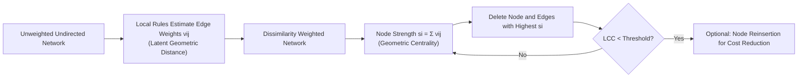

# Latent Geometry-Driven Network Automata for Complex Network Dismantling

**Conference**: ICLR 2026  
**OpenReview**: [https://openreview.net/forum?id=yz29QCGVzC](https://openreview.net/forum?id=yz29QCGVzC)  
**Code**: To be confirmed  
**Area**: Graph Learning / Complex Networks / Network Dismantling  
**Keywords**: Network Dismantling, Latent Geometry, Network Cellular Automata, Common Neighbors, Robustness Engineering  

## TL;DR
This paper proposes the LGD-NA framework, which utilizes "network cellular automata rules" based solely on local topology to approximate latent geometric distances. By using node geometric centrality as the dismantling priority, the method outperforms all existing dismantling algorithms (except the global NBC) across 1,475 real-world networks. It supports GPU acceleration and can be conversely applied to enhance network robustness.

## Background & Motivation

**Background**: Network dismantling research focuses on "removing the minimum number of nodes to fragment a network," which is crucial for evaluating and improving the robustness of critical infrastructure, biological systems, and communication networks. Since the problem is NP-hard, the field has long relied on heuristic approximations. The most recognized method is Node Betweenness Centrality (NBC), which ranks and removes nodes based on their frequency of appearing on shortest paths.

**Limitations of Prior Work**: (1) **Dependency on global information**—Methods like NBC require the complete network topology, leading to high computational costs and poor scalability for large networks; (2) **Black-box machine learning methods**—GDM, FINDER, and CoreGDM train GNN/RL to predict dismantling strategies but lack interpretability; (3) **Limited verification scale**—Historically, dismantling algorithms were tested on at most 57 real-world networks, with most using fewer than a dozen, making generalization questionable; (4) **Neglecting latent geometry**—Network science has proven that complex networks are often driven by a hidden geometric manifold, yet the dismantling field has largely ignored this information.

**Key Challenge**: The most effective dismantling signals (latent geometric centrality) were previously only estimable through global, expensive means (like NBC). While local, low-cost geometric estimators exist (e.g., RA2 for hyperbolic embedding), they have never been verified as drivers for dismantling.

**Goal**: To prove that latent geometry is the fundamental principle of dismantling and to provide a **parameter-free, purely local, GPU-accelerable, and interpretable** dismantling framework. This framework aims to approach NBC performance while significantly increasing speed and utilizing the mechanism to reinforce networks.

**Core Idea** (**Geometric Centrality-Driven Dismantling**): If two connected nodes each connect to many non-overlapping neighbors, they are likely far apart in the latent space—meaning the edge "connects two distant regions of the network." A node possessing many such "long-range edges" is critical for holding the network together; prioritize its removal to efficiently fragment the network. This "distance" can be approximated using local topology (number of common neighbors) without global computation or training.

## Method

### Overall Architecture
LGD-NA treats dismantling as a three-step pipeline: "Geometric Estimation → Strength Aggregation → Dynamic Removal." First, a **network cellular automata rule** is used to assign a weight $\nu_{ij}$ representing the "latent geometric distance" to each edge, resulting in a dissimilarity-weighted graph. Then, the sum of all incident edge weights for each node is taken as the node strength $s_i$. Nodes with the highest strength are iteratively removed along with their edges. Node strengths are recalculated at each step (dynamic dismantling) until the Largest Connected Component (LCC) falls below a threshold. Optionally, node reinsertion is performed to reduce dismantling costs.

### Key Designs

**1. Latent Geometry-Driven Dismantling (LGD): Transforming "Who to Delete" into "Deleing Geometrically Central Nodes"** — This is the overarching principle of the paper and its core distinction from traditional centrality methods. Any function capable of assigning "effective distance" weights to edges can be plugged in to construct a dissimilarity-weighted graph hidden beneath the observable topology, allowing the dismantling process to be prioritized by node geometric centrality on the latent manifold. Referencing Muscoloni et al. (2017), the authors point out that even NBC is essentially a "global latent geometric estimator"—it approximates distances in geometric space. Thus, NBC's effectiveness as a dismantler stems from its (unintentional) execution of latent geometry-driven dismantling. This observation unifies "why NBC works" and "how to replicate it more cheaply" within the same geometric framework.

**2. Network Cellular Automata + Node Strength Aggregation: Parameter-free, Purely Local Estimation of Geometric Centrality** — Under the LGD principle, the authors use "network cellular automata rules" as local geometric estimators. These rules use only the local topology around nodes and score edges without pre-training (hence "automata"). The base rule is derived from RA2 (Repulsion-Attraction rule 2):
$$\mathrm{RA2}(i,j)=\frac{1+e_i+e_j+e_i\cdot e_j}{1+\mathrm{CN}_{ij}}$$
Where $\mathrm{CN}_{ij}$ is the number of common neighbors of $i$ and $j$, and $e_i, e_j$ are their respective "external degrees" (neighbors not involved in the common neighbor interaction). The repulsion term in the numerator (larger external degree implies greater distance) and the attraction term in the denominator (more common neighbors imply closer proximity) together characterize the dissimilarity between two nodes on the latent manifold. After obtaining edge weights $\nu_{ij}$, node strength is calculated by direct summation:
$$s_i=\sum_{j\in N(i)}\nu_{ij}$$
High strength indicates that a node connects many distant and non-overlapping regions, making it a priority for dismantling. The entire process requires no hyperparameters or labeled data, contrasting sharply with black-box ML methods.

**3. Common Neighbor Dissimilarity (CND): Simplicity Wins** — The authors performed an ablation on RA2 and discovered that keeping only the denominator is sufficient:
$$\nu_{ij}\to\mathrm{CND}(i,j)=\frac{1}{1+\mathrm{CN}_{ij}}$$
Fewer common neighbors imply a greater geometric distance between two connected nodes and a higher edge weight. Intuitively, the dismantling task only requires the "attraction term"—calculating common neighbors between a seed node and its neighbor implicitly excludes nodes outside that neighborhood, rendering the "repulsion term" in the RA2 numerator redundant. The paper also validated a third variant, RA2num (keeping only the numerator), which performed worse than CND. Consequently, this minimalist "inverse common neighbor" rule provides the best performance among all local rules and remains highly interpretable—a node's vulnerability is directly determined by how few edges its neighbors share with each other.

**4. GPU Acceleration: Reformulating Automata as Matrix Operations** — All three LGD-NA variants were reformulated as adjacency matrix operations to leverage GPU parallelism. The common neighbor matrix is $\mathrm{CN}_{L2}=A\circ(A^2)$ (where $A^2$ counts paths of length 2 between node pairs, and $\circ$ is the Hadamard product ensuring values are only taken for existing edges), and the external degree matrix is $\mathrm{EL}_2=A\circ(D-\mathrm{CN}_{L2}-A)$. Complexity is $O(N^3)$ for dense graphs and $O(Nm)$ for sparse graphs. While matrix multiplication on CPU is limited by memory bandwidth and serial execution, GPU parallelism with thousands of threads provides order-of-magnitude speedups on large networks.

**5. Robustness Engineering: Leveraging CND Interpretability** — Since CND reveals that "node vulnerability ∝ shared edges among its neighbors," the reinforcement strategy is directly symmetrical: identify critical nodes with the highest dismantling scores and add edges between their currently unconnected neighbors (increasing the common neighbor count). This transforms an attack tool into a defense tool, controlled by a transparent mechanism.

## Key Experimental Results

### Main Results (ATLAS: 1,475 Real-world Networks, 32 Complex System Domains)

| Dimension | LGD-NA Result |
|------|------------|
| Verification Scale | 1,475 real-world networks / 32 domains (Prev. SOTA used at most 57, mostly < 12) |
| Overall Ranking (mean field rank) | CND/RA2/RA2num consistently **outperformed all non-latent-geometric methods** (including spectral Laplacian-based GND, and ML-based GDM/CoreGDM/FINDER) |
| Only Method Surpassing LGD-NA | NBC (which is itself a global latent geometric estimator) |
| Best Local Rule | **CND** (Inverse common neighbor only) is the strongest among all local cellular automata rules |
| Evaluation Metric | AUC of the LCC trajectory (lower is better, Simpson integration), threshold at 10% of the original network |

Distribution of second-place finishes: CND ranked second in Internet networks, RA2 in biomolecular/brain networks, and RA2num in hidden networks. Only Foodweb (Fitness Centrality), Infrastructure (GDM), and Social (GND) had non-LGD-NA second-place finishers.

### Ablation Study (RA2 Decomposition)

| Variant | Retained Terms | Relative Performance |
|------|--------|----------|
| RA2 | Full (Numerator Repulsion + Denominator Attraction) | Strong, but not optimal |
| **CND** | Denominator only $1/(1+\mathrm{CN})$ | **Best local rule** |
| RA2num | Numerator only (External Degree) | Usable, but weaker than CND |

Dynamic dismantling (recalculation at each step) consistently outperformed static variants.

### Key Findings
- **GPU Speedup**: On the largest networks, the GPU version of RA2 was **130×** faster than the CPU version and **63×** faster than NBC on CPU. GPU advantages appear when networks exceed 1,000 nodes or 100,000 edges (tested up to 23,000 nodes / 507,000 edges). NBC, which relies on shortest-path counting rather than matrix multiplication, cannot benefit from GPU acceleration, making it impractical for large scales.
- **Minimal Local Information Sufficiency**: CND's ability to approach global NBC using only "common neighbors" indicates that minimal local topology can effectively approximate latent geometry.
- **Robustness Engineering**: Adding edges only to the neighbors of the most critical nodes (adding 1% edges) improved AUC (robustness) by 36%–95%. Adding 10% edges improved it by 59%–259%. Reinforcing the top 1% of nodes alone increased robustness regardless of the attack method.
- **Functional Impact in Four Real-world Scenarios**: Validated across fruit fly connectomes (neuron firing rates), terrorist networks (commander reachability; removal of ~5% in Paris/Brussels networks caused a sudden drop), flight maps (global efficiency), and campus contact networks (SEIR epidemic size). Functional robustness Gain reached up to 363% after reinforcement.

## Highlights & Insights
- **Unified Perspective**: Reinterpreting "why NBC is the strongest" as "it performs global latent geometry estimation" provides a clear path to replicating its capability with cheap local rules—a conceptual contribution rather than mere performance engineering.
- **Counter-intuitive Simplicity**: Cutting the SOTA local rule down to just "inverse common neighbors" (CND) yielded the best results and remained fully interpretable, running contrary to the current trend of stacking GNNs/RL.
- **Attack-Defense Symmetry**: The same CND score can guide both dismantling and reinforcement (by identifying where to add edges), naturally turning an attack tool into a defense tool.
- **Scale and Diversity**: The ATLAS dataset (1,475 networks / 32 domains) represents the largest and most diverse evaluation in this field to date, significantly enhancing the credibility of the conclusions.

## Limitations & Future Work
- **Absolute Performance vs. NBC**: LGD-NA's value proposition is "approaching NBC while being much faster/scalable/interpretable"; however, if time is not a factor on small networks, NBC remains the performance ceiling.
- **Non-linear Complexity**: With $O(N^3)$ for dense graphs and $O(Nm)$ for sparse graphs, ultra-large dense networks may still be challenging, and GPU advantages depend on VRAM.
- **Boundary of Common Neighbor Signals**: CND was surpassed by other methods in certain domains (Foodweb / Infrastructure / Social), suggesting that pure common neighbor geometry may not be optimal for specific structures like strong communities or hierarchies.
- **Dual-use Risks**: Dismantling technology can inherently be used for attacks (e.g., epidemic spread, terrorist communication). Ours balances this by providing reinforcement methods, but ethical risks remain.
- **Future Directions**: Exploring more local geometric estimators, extending latent geometric dismantling to directed/weighted/temporal networks, and combining it with robustness diagnosis under incomplete observations.

## Related Work & Insights
- **Latent Geometry** (Boguñá, Krioukov, Serrano, Muscoloni & Cannistraci, etc.): Complex networks are driven by hidden geometric manifolds, explaining small-worldness, degree heterogeneity, clustering, and navigability. This paper adds "dismantling" to the list of processes explained by geometry.
- **Latent Geometric Estimators RA1/RA2** (Muscoloni et al. 2017): Originally pre-weighting strategies for hyperbolic network embedding; Ours proves for the first time that they can drive dismantling.
- **Dismantling Method Genealogy**: Global centrality (NBC, Degree, PageRank, Fitness Centrality, DomiRank, Resilience Centrality), Message Passing/Decycling (BPD, Min-Sum, CoreHD), Spectral Partitioning (GND), Influence (CI, EI), Machine Learning (GDM, FINDER, CoreGDM). Under a unified evaluation, Ours systematically surpassed these non-geometric methods.
- **Insight**: When a "black-box SOTA method" dominates a task, asking "what physical quantity it is actually estimating" often leads to finding a simpler, interpretable, and accelerable white-box proxy—CND is a prime example of this approach.

## Rating
- **Novelty**: ⭐⭐⭐⭐⭐ — Introduces latent geometry to dismantling and proves minimal local rules (CND) approach the global SOTA, providing true conceptual insight over engineering stacking.
- **Experimental Thoroughness**: ⭐⭐⭐⭐⭐ — The ATLAS dataset (1,475 networks / 32 domains) is the largest evaluation in the field, including ablation, GPU acceleration, robustness engineering, and four real-world functional scenarios.
- **Writing Quality**: ⭐⭐⭐⭐ — Logic is clear, with motivations well-aligned with contributions. Formulas and diagrams are sufficient; a few derivation details require looking at the appendix.
- **Value**: ⭐⭐⭐⭐⭐ — Simultaneously provides an efficient, scalable dismantling tool and a symmetrical reinforcement method with direct utility for infrastructure, biology, and security.

<!-- RELATED:START -->

## Related Papers

- [\[ICLR 2026\] A Graph Meta-Network for Learning on Kolmogorov–Arnold Networks](a_graph_meta-network_for_learning_on_kolmogorovarnold_networks.md)
- [\[ICLR 2026\] Graphon Cross-Validation: Assessing Models on Network Data](graphon_cross-validation_assessing_models_on_network_data.md)
- [\[ICLR 2026\] Federated Graph-Level Clustering Network with Dual Knowledge Separation](federated_graph-level_clustering_network_with_dual_knowledge_separation.md)
- [\[ICLR 2026\] AdS-GNN - a Conformally Equivariant Graph Neural Network](ads-gnn_-_a_conformally_equivariant_graph_neural_network.md)
- [\[ICLR 2026\] FlowSymm: Physics–Aware, Symmetry–Preserving Graph Attention for Network Flow Completion](flowsymm_physicsaware_symmetrypreserving_graph_attention_for_network_flow_comple.md)

<!-- RELATED:END -->
