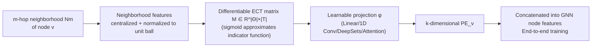

# LEAP: Local ECT-Based Learnable Positional Encodings for Graphs

**Conference**: ICLR 2026  
**OpenReview**: [https://openreview.net/forum?id=8XFPhByERc](https://openreview.net/forum?id=8XFPhByERc)  
**Code**: To be confirmed  
**Area**: Graph Learning / Geometric Topological Representation Learning  
**Keywords**: Positional Encoding, Euler Characteristic Transform, Topological Data Analysis, Graph Neural Networks, Differentiable Topology  

## TL;DR
LEAP transforms the "Local Euler Characteristic Transform" (ℓ-ECT) into an end-to-end trainable local structural positional encoding: it computes a differentiable ECT matrix for the m-hop neighborhood of each node, which is then compressed into low-dimensional vectors via learnable projections to be integrated into GNNs. This approach simultaneously encodes geometric and topological information with a complexity on the same order as a single message-passing step.

## Background & Motivation
**Background**: Graph representation learning has long been dominated by Message Passing Neural Networks (MPNNs), where nodes iteratively aggregate neighbor information. To mitigate inherent defects of MPNNs, the community has turned to injecting nodes with Positional Encodings (PE) or Structural Encodings (SE), such as Random Walk PE (RWPE), Laplacian PE (LaPE), and learnable variants like SignNet.

**Limitations of Prior Work**: Most existing PE/SE capture only a single aspect—either **geometry** (coordinates, curvature, distance) **or topology** (Laplacian spectrum, random walks)—limiting their expressivity. MPNNs themselves suffer from problems like oversquashing, oversmoothing, and an inability to efficiently count substructures. While the ECT (Euler Characteristic Transform) serves as a "joint geometric-topological invariant" that is **injective** for geometric graphs given sufficient directions (theoretically stronger than message passing), it has previously been used in only two ways: DECT for **graph-level** global descriptors, and ℓ-ECT as a **static, non-trainable** node feature expansion that treats neighborhoods as point clouds, discarding connectivity.

**Key Challenge**: Although ECT possesses both geometric and topological expressivity and theoretical injectivity, it has not been implemented as a **local, end-to-end trainable positional encoding that can be directly plugged into any GNN**.

**Goal**: To combine the locality of ℓ-ECT with the differentiability of DECT, proposing a local structural PE that retains topological expressivity while allowing joint optimization with downstream tasks.

**Core Idea**: **[Differentiable + Local + Learnable Projection]** For each node, take the m-hop neighborhood → compute a differentiable ECT matrix $M$ → project into a $k$-dimensional PE via a learnable projection $\phi$. The set of directions $\Theta$ can be either fixed or optimized during training. The entire pipeline is end-to-end differentiable and maintains a complexity comparable to message passing.

## Method

### Overall Architecture
LEAP (Local ECT And Projection) generates a $k$-dimensional positional encoding for each node in a graph through four steps: **Neighborhood extraction → Feature normalization → Differentiable ECT matrix calculation → Learnable projection for dimensionality reduction**. It is not a preprocessing step but an internal GNN component that can act on static features or MPNN latent states, trained end-to-end with downstream tasks.

### Key Designs

**1. Differentiable Local ECT as Encoding Skeleton: Turning topological invariants into differentiable tensors.** Given a feature map $(G,x)$, a set of directions $\Theta\subset S^{d-1}$, and a set of thresholds $T\subset[0,1]$, the $m$-hop subgraph $N_m(v,G)$ is extracted for node $v$. The ECT along direction $\theta$ counts the "number of nodes minus number of edges" in a filtration sequence along $\langle\theta,x(\cdot)\rangle$, forming an Euler Characteristic Curve (ECC): $\mathrm{ECT}(\theta,t)=\sum_{v}\mathbf{1}_{[\langle\theta,x(v)\rangle,\infty)}(t)-\sum_{e}\mathbf{1}_{[\max_{u\in e}\langle\theta,x(u)\rangle,\infty)}(t)$. Since the original ECT is non-differentiable due to indicator functions, LEAP follows DECT in using sigmoid functions to approximate them, producing a differentiable matrix $M\in\mathbb{R}^{|\Theta|\times|T|}$ for each node. This allows "geometric + topological" information to participate in training with backpropagated gradients. Theoretically, this encoding is more expressive than message passing and can facilitate substructure counting.

**2. Neighborhood Feature Normalization for Structural Invariance: Ensuring encodings recognize structure rather than scale and rotation.** Processing raw features directly would mix irrelevant scale and translation into the encoding. The second step performs **mean-centralization** on the neighborhood node feature set and divides by the maximum norm of the centralized set, mapping all features onto the unit ball $S^{d-1}$ to obtain $F=\{f(u_i)\}$. This results in two outcomes: LEAP becomes a true **local structural encoding** (two nodes with identical $m$-hop neighborhoods yield the same PE, aligning with definitions by Rampášek et al.); and even if node features are uninformative (e.g., sampled uniformly from a unit disk in synthetic tasks), the encoding can still distinguish different edge counts/topologies.

**3. Five ECT Projection Strategies: Balancing permutation invariance and parameter count.** The fourth step compresses the $|\Theta|\times|T|$ ECT matrix into a $k$-dimensional vector. Ideally, $\phi$ should be permutation invariant to the ECCs (direction order) to offset rotation. The paper provides five $\phi$ variants: **Linear** (flattened and multiplied by $W\in\mathbb{R}^{k\times D}$, not permutation invariant, $O(|\Theta||T|)$ parameters); **1D Convolution** (treating ECT as a multi-channel time series with thresholds as timesteps and directions as channels, $O(|\Theta|+|T|)$ parameters); **DeepSets** ($\mathrm{PE}=\mathrm{MLP}_2(\sum_{\theta}\mathrm{MLP}_1(\mathrm{ECC}_\theta))$, permutation invariant to directions, parameters independent of $|\Theta|$); **Attention** (single-head Transformer encoder without positional encoding, permutation invariant); **Attention w/ PE** (concatenating each $\mathrm{ECC}_\theta$ with its direction $\theta$ before the encoder, maintaining both permutation invariance and directional information).

**4. Learnable Directions + Adjustable Locality: Upgrading from "static expansion" to "end-to-end component".** Unlike prior work treating ℓ-ECT as a static expansion, LEAP's direction set $\Theta$ can be randomly initialized and then **fixed (LEAP-F) or optimized (LEAP-L)** during training. It can operate on learned latent states (e.g., mapping categorical features to $\mathbb{R}^3$ via an embedding layer in the HIV dataset before computing LEAP) and naturally adapts to both graph-level and node-level tasks. Locality is controlled by the hop count $m$: the default 1-hop keeps complexity on par with one-step message passing ($O(n)$ under bounded degree), while larger $m$ or multi-scale concatenations can characterize neighborhood evolution trajectories.

## Key Experimental Results

### Main Results: TU Classification Datasets (Relative Gain of best method vs. worst baseline)

| Dataset | Best Method | Worst | Best | Relative Gain (%) |
|---|---|---|---|---|
| LETTER-H | NoMP + LEAP-L + 1D Conv | 41.6 | 81.6 | 96.2 |
| LETTER-M | NoMP + LEAP-L + 1D Conv | 57.8 | 88.5 | 53.1 |
| LETTER-L | NoMP + LEAP-L + 1D Conv | 80.4 | 98.0 | 21.9 |
| FINGERPRINT | NoMP + LEAP-L + Linear | 48.8 | 55.7 | 14.1 |
| COX2 | GAT + LEAP-L + Attn w/ PE | 77.7 | 80.1 | 3.1 |
| BZR | NoMP + LEAP-L + Linear | 78.3 | 84.7 | 8.2 |
| DHFR | GCN + LEAP-L + Attn w/ PE | 70.1 | 77.6 | 10.7 |

On all datasets, the best "architecture-PE" combinations **utilize LEAP with learnable directions**. Within each dataset-architecture pairing, the two LEAP variants (F/L) typically take first and second place. On a synthetic dataset (40k three-node graphs with features sampled from a unit disk, classified by edge count), LEAP-enhanced models achieved **100.0±0.0** accuracy, while standalone GCN/GAT achieved only 71.83/69.44, proving it captures structure when node features are uninformative.

### Ablation Study: Neighborhood Size and Embedding Dimension

| Neighborhood $N_m$ | LETTER-H | LETTER-M | LETTER-L |
|---|---|---|---|
| LEAP-F, 1-hop | 81.29 | 88.00 | 96.27 |
| LEAP-F, 2-hop | 74.44 | 84.31 | 94.13 |
| LEAP-F, {1,2} | 77.91 | 84.76 | 96.09 |

| Dim | PE | LETTER-H | LETTER-M | LETTER-L |
|---|---|---|---|---|
| 2 | LaPE | 66.31 | 94.71 | 76.76 |
| 2 | RWPE | 73.82 | 94.62 | 83.47 |
| 2 | LEAP-F | 81.16 | 96.27 | 86.76 |
| 2 | LEAP-L | 78.53 | 95.56 | 87.38 |

### Key Findings
- **1-hop is often sufficient**: Increasing the neighborhood size often leads to performance drops; 1-hop performs best while maintaining complexity parity with message passing.
- **Greater gains on large datasets**: On Alchemy (202k graphs), LEAP-L significantly outperforms all baselines in $R^2$; gains are weaker on small datasets (COX2/BZR/DHFR) due to sample scarcity.
- **Complementary to global PE**: On the HIV dataset (AUROC), LaPE (global information) is strong, but **concatenating LaPE+LEAP achieves the overall best performance**, indicating that local structure and global positional information are complementary.
- **NoMP Phenomenon**: On Letter-High/Low, NoMP (Position-only, no message passing) outperforms baseline GNNs, demonstrating the structural expressivity limitations of MPNNs.

## Highlights & Insights
- **End-to-End Topological Invariants**: While ECT was previously global (DECT) or static (ℓ-ECT), LEAP integrates "local + differentiable + learnable projection + learnable directions" into a single component pluggable into any GCN.
- **Unified Geometry and Topology**: Compared to RWPE/LaPE which capture only single dimensions, ECT naturally fuses both with theoretical injectivity, providing a higher expressivity upper bound.
- **Complexity-Friendly**: Under the default 1-hop setting, it is on par with one-step message passing and is easily parallelizable.
- **Complementary, Not Substitutive**: Concatenation with global PE (LaPE) yields further improvements, showing a clear niche.

## Limitations & Future Work
- **Light Theoretical Analysis**: The authors state the main contribution is the "new local PE + empirical evaluation," leaving deeper expressivity analysis for future work.
- **Lack of Global Information**: As a local encoding, LEAP cannot capture global positions, which was evident in the need for LaPE on the HIV dataset.
- **Projection Strategy Selection**: The five projection strategies vary in performance across datasets; there is no single "best" strategy, requiring tuning.
- **Hyperparameter Sensitivity**: The study uses 16 directions and 16 thresholds; how resolution and direction count should adapt to specific tasks remains under-explored.

## Related Work & Insights
- **PE/SE Taxonomy**: LEAP fills the gap for "local learnable structural encoding based on ECT," alongside RWPE (local structure), LaPE (global position), and SignNet (learnable).
- **TDA in Networks**: DECT and ℓ-ECT are direct predecessors; LEAP merges their strengths. von Rohrscheidt & Rieck (2025) proved 1-hop ℓ-ECT contains all information needed for a single message-passing step, serving as a theoretical foundation.
- **Insight**: Turning "theoretically guaranteed geometric-topological invariants" into differentiable, learnable, and pluggable modules is a universal paradigm for injecting inductive biases into GNNs.

## Rating
- **Novelty**: ⭐⭐⭐⭐ — First to turn local ECT into an end-to-end trainable PE with learnable directions; joint geometric-topological approach with theoretical backing.
- **Experimental Thoroughness**: ⭐⭐⭐⭐ — Covers synthetic, TU, Alchemy (200k+), and HIV datasets with multi-dimensional ablations, though theoretical analysis is light.
- **Writing Quality**: ⭐⭐⭐⭐ — Clear progression from background to method and experiments; self-contained ECT introduction is well-handled.
- **Value**: ⭐⭐⭐⭐ — Provides a practical, topology-aware PE that is pluggable and complementary to existing global PEs.

<!-- RELATED:START -->

## Related Papers

- [\[ICML 2026\] Understanding Truncated Positional Encodings for Graph Neural Networks](../../ICML2026/graph_learning/understanding_truncated_positional_encodings_for_graph_neural_networks.md)
- [\[ICML 2025\] Positional Encoding meets Persistent Homology on Graphs](../../ICML2025/graph_learning/positional_encoding_meets_persistent_homology_on_graphs.md)
- [\[ICML 2025\] L-STEP: Learnable Spatial-Temporal Positional Encoding for Link Prediction](../../ICML2025/graph_learning/learnable_spatial-temporal_positional_encoding_for_link_prediction.md)
- [\[ICML 2025\] Diss-l-ECT: Dissecting Graph Data with Local Euler Characteristic Transforms](../../ICML2025/graph_learning/diss-l-ect_dissecting_graph_data_with_local_euler_characteristic_transforms.md)
- [\[ICLR 2026\] Towards Improved Sentence Representations using Token Graphs](towards_improved_sentence_representations_using_token_graphs.md)

<!-- RELATED:END -->
