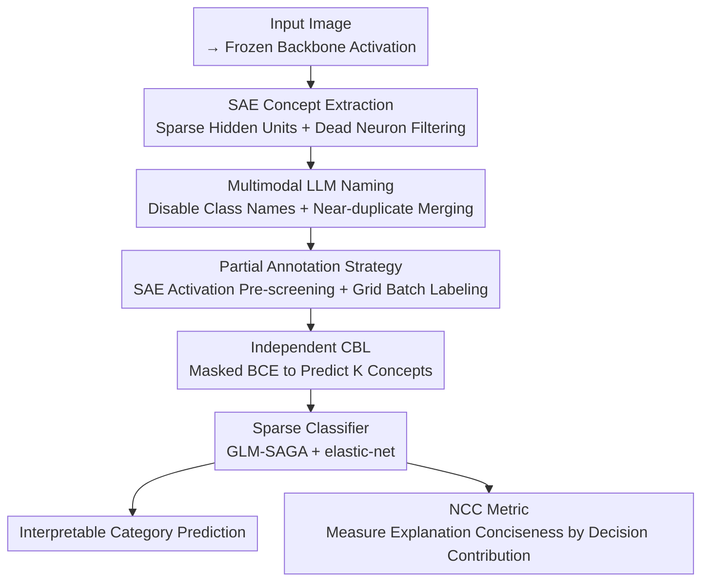

# Learning Concept Bottleneck Models from Mechanistic Explanations

**Conference**: ICLR2026  
**arXiv**: [2603.07343](https://arxiv.org/abs/2603.07343)  
**Code**: [GitHub](https://github.com/Antonio-Dee/M-CBM)  
**Area**: Graph Learning  
**Keywords**: Concept Bottleneck Model, Sparse Autoencoder, mechanistic interpretability, Explainable AI, Multimodal LLM

## TL;DR

This paper proposes Mechanistic CBM (M-CBM), which extracts concepts from the features learned by the black-box model itself using Sparse Autoencoders (SAEs). These concepts are then named and labeled by a Multimodal LLM to construct an interpretable Concept Bottleneck Model. M-CBM significantly outperforms existing CBM methods while effectively controlling information leakage.

## Background & Motivation

Concept Bottleneck Models (CBMs) are a class of inherently interpretable models that predict understandable concepts through an intermediate layer, which are then used to predict the final category. Existing concepts for CBMs primarily originate from four sources: manual specification, knowledge graphs, LLM generation, or CLIP general concepts. However, these prior concepts face two fundamental issues:

1.  **Insufficient Predictive Power**: Prior concepts may lack sufficient discriminative power for the target task or may even be unlearnable from the data (e.g., non-visual concepts like "warm to the touch" generated by LLMs for medical images).
2.  **Severe Information Leakage**: The Concept Bottleneck Layer (CBL) can implicitly encode category-related information. Even using random words as concepts can recover near black-box accuracy, rendering the explanation meaningless.

Inspired by the field of Mechanistic Interpretability—particularly the success of SAEs in disentangling model features—the authors pose a core question: **Can we construct an interpretable approximation by directly starting from the concepts learned by the black-box model itself?**

## Core Problem

How to construct a concept bottleneck model without relying on a prior concept set, such that it simultaneously satisfies: (1) high task accuracy, (2) learnable and predictive concepts, and (3) concise explanations with controllable information leakage?

## Method

### Overall Architecture

M-CBM no longer enumerates concepts from external knowledge bases or LLMs. Instead, it defines "concepts" inversely as the disentangled internal features learned by the black-box model itself. The entire pipeline consists of four steps: first, use a Sparse Autoencoder (SAE) to decompose the activations of a frozen backbone into sparse candidate concepts; second, employ a Multimodal LLM to name each candidate concept and merge near-duplicates; third, collect supervision signals for these concepts using a partial annotation strategy guided by SAE activations; finally, train an independent Concept Bottleneck Layer (CBL) and a sparse classifier using these labels. This results in an interpretable approximation model where information leakage is controlled. The authors also propose a new metric, NCC, to evaluate the conciseness of the explanations.

### Key Designs

**1. SAE Concept Extraction: Decomposing Activations into Sparse Interpretable Units**

A long-standing problem with CBMs is that prior concepts may not be learnable in the data. The authors address this by finding concepts within the model. Given a trained backbone $\phi$, an SAE is trained for each sample activation $\mathbf{a}^{(i)} = \phi(\mathbf{x}^{(i)})$. The encoder $\mathbf{h} = \text{ReLU}(\mathbf{W}_E^\top(\mathbf{a} - \mathbf{b}_D) + \mathbf{b}_E)$ maps the activation to a wider but sparse latent space, and the decoder $\hat{\mathbf{a}} = \mathbf{W}_D^\top \mathbf{h} + \mathbf{b}_D$ reconstructs it. The objective is the reconstruction error plus an L1 sparsity penalty:

$$\mathcal{L}_{\text{SAE}} = \|\mathbf{a} - \hat{\mathbf{a}}\|_2^2 + \lambda_{\text{SAE}} \|\mathbf{h}\|_1$$

The sparsity constraint forces each latent unit to respond only to a few semantic patterns, making it a monosemantic candidate concept. To keep subsequent LLM naming and annotation costs manageable, the expansion factor $m/n$ is kept within 4x. Furthermore, dead and near-dead neurons are filtered out based on a threshold where "removal does not increase the black-box cross-entropy loss by more than ~1%," ensuring only concepts that carry actual information are retained.

**2. Multimodal LLM Naming: Assigning Category-Agnostic Names to Latent Units**

SAE units are merely sequences of activations; they must be named to become human-readable concepts. For each surviving unit, the authors take the 10 images with the strongest activations as positive examples, paired with 10 contrastive images (half random, half hard negatives with high cosine similarity). Weighted feature maps generated from the decoder weights $\mathbf{W}_D$ serve as concept saliency maps. These inputs, showing "where the model is looking," are fed into GPT-4.1 to generate natural language descriptions. A key constraint is the explicit prohibition of using category names, with retries if violated—blocking information leakage at the source. Finally, `text-embedding-3-large` is used to embed all concept names, and near-duplicates with cosine similarity $> 0.98$ are merged to avoid redundancy.

**3. Partial Annotation Strategy: Efficient Labeling Guided by SAE Activations**

Concept names are merely hypotheses; SAE units might not strictly operate according to that semantics. Thus, the SAE latent layer cannot be used directly as the bottleneck. Instead, supervision signals must be collected to train an independent CBL. To avoid the high cost of full dataset annotation, the authors use SAE activations for pre-screening: up to 1000 images are labeled per concept (500 active + 500 inactive). Active samples are those with activations above the 95th percentile, while inactive samples consist of half random and half negatives most similar to the active samples. Both sets are stratified by category to avoid annotation bias. For labeling, 25 images are arranged in a 5×5 grid and sent to GPT-4.1 for batch judgment. Results are recorded as a ternary vector $z_k^{(i)} \in \{-1, 0, 1\}$ (Present / Absent / Unlabeled), where unlabeled items are masked during training.

**4. Independent CBL and Sparse Classifier: Training Bottleneck and Decision via Partial Labels**

Upon obtaining ternary labels, the CBL predicts $K$ concepts from frozen backbone features. It is optimized using Masked BCE Loss on labeled pairs $\Omega$, with category imbalance weights to handle positive/negative sample skew. Concept logits are z-normalized and fed into a sparse linear classifier, trained with the GLM-SAGA solver and an elastic-net penalty ($\alpha=0.99$). By adjusting $\lambda_{\text{CLF}}$, the number of concepts used for each decision is directly controlled, allowing for a trade-off between accuracy and explanation conciseness.

**5. NCC Sparsity Metric: Measuring Conciseness at the Decision Level**

The authors point out that the commonly used NEC (Number of Effective Concepts) limits the total number of concepts $K$, which is unfair to datasets with high intra-class diversity. Diverse classes naturally require more concepts. Thus, they propose NCC (Number of Contributing Concepts), which considers the actual number of concepts used for each decision:

$$\text{NCC}_\tau = \frac{1}{|\mathbb{D}|C} \sum_i \sum_r \min\left\{\kappa : \sum_{s=1}^{\kappa} u_{(s),r}^{(i)} \geq \tau \sum_k u_{k,r}^{(i)}\right\}$$

where $u_{k,r}^{(i)} = |[g(\mathbf{a}^{(i)})]_k \cdot [\mathbf{W}_F]_{k,r}|$ is the absolute contribution of concept $k$ to category $r$. Contributions are summed from largest to smallest until a coverage ratio $\tau$ is reached; the count $\kappa$ is the NCC for that sample and category. This metric does not rigidly cap the total concept count and is better suited for high-diversity tasks, serving as a unified coordinate axis for fair comparison.

## Key Experimental Results

**Datasets & Backbones**: CUB (ResNet18, 200 classes), ISIC2018 (ResNet50, 7 classes), ImageNet (ResNet50, 1000 classes)

| Method | CUB NCC=5 | CUB avg | ISIC NCC=5 | ISIC avg | ImageNet NCC=5 | ImageNet avg |
|------|-----------|---------|------------|----------|----------------|--------------|
| Black-box Upper Bound | 76.67% | - | 79.37% | - | 76.15% | - |
| LF-CBM | 58.08% | 71.09% | 61.44% | 67.55% | 62.20% | 69.08% |
| DN-CBM (RN) | 38.21% | 48.98% | 35.38% | 54.61% | 46.71% | 57.24% |
| VLG-CBM_CA | 69.12% | 72.25% | 64.55% | 72.61% | N/A | N/A |
| **M-CBM** | **73.70%** | **74.18%** | **72.75%** | **75.51%** | **72.18%** | **73.64%** |

Concept prediction quality (ROC-AUC): M-CBM achieves Macro 90.04% vs VLG-CBM_CA 62.03% on CUB, and 80.57% vs 73.37% on ISIC, demonstrating that concepts extracted from the model itself are more learnable.

**Information Leakage Validation**: On CUB, replacing concepts with random words showed that the original VLG-CBM reached black-box accuracy at NCC=1.5 (severe leakage). After removing category-conditional labeling, leakage decreased. M-CBM significantly outperforms the random baseline in the low NCC range.

## Highlights & Insights

1.  **Concept Source Innovation**: First systematic application of internal model concepts extracted by SAE to CBM construction, avoiding mismatches between prior concepts and tasks.
2.  **NCC Metric**: More flexible than NEC, measuring explanation conciseness at the decision level without restricting the total number of concepts.
3.  **Information Leakage Control**: Employs category-agnostic labeling combined with sparsity control, quantifying leakage through random word experiments.
4.  **Significant Boost in Concept Learnability**: ROC-AUC improved from 62% to 90% (CUB), proving that the model's own concepts are indeed easier to learn.
5.  **Efficient Annotation Strategy**: Uses SAE activation pre-screening for candidate images; labeling ~1k images per concept avoids the computational bottleneck of full dataset annotation.

## Limitations & Future Work

1.  **Concept Learning Remains a Black Box**: While the final layer is interpretable, the CBL itself is still a black box, lacking systematic methods to verify if concepts are learned as intended.
2.  **Information Leakage Not Eliminated**: Even with NCC control, random words still achieve accuracy far exceeding random chance, suggesting the leakage problem is not fundamentally solved.
3.  **Human Supervision for SAE**: Not as plug-and-play as other methods; requires manual confirmation that SAE concepts are interpretable and annotation quality is reliable.
4.  **Annotation Costs**: Approximately 0.14 USD per concept; annotating 2648 concepts for ImageNet still incurs significant overhead.
5.  **Limited to Image Classification**: Has not been extended to other visual tasks like detection or segmentation, nor explored for transfer in non-visual domains.

## Related Work & Insights

| Method | Concept Source | Requires CLIP | Leakage Control | ImageNet Feasibility |
|------|----------|------------|---------|----------------|
| LF-CBM | LLM Gen + CLIP-Dissect | No | Sparse Penalty | Feasible |
| VLG-CBM | LLM Gen + GroundingDINO | No | NEC | ~300 GPU-days, Infeasible |
| DN-CBM | CLIP SAE Latents | Yes (CLIP only) | Sparse Penalty | Feasible but low accuracy |
| **M-CBM** | Black-box SAE + MLLM Labeling | No | NCC | Feasible & Optimal |

DN-CBM is the closest predecessor, also utilizing SAEs, but is limited to the CLIP backbone and uses SAE latent layers directly as bottlenecks instead of training an independent CBL. M-CBM overcomes these limitations through MLLM labeling and independent CBL training.

## Rating

- Novelty: ⭐⭐⭐⭐ — Introducing SAE tools from the MI field into the CBM framework is a natural yet effective innovation.
- Experimental Thoroughness: ⭐⭐⭐⭐ — Three datasets of varying scales + leakage analysis + concept quality evaluation, though missing M-CBM experiments on ViT backbones.
- Writing Quality: ⭐⭐⭐⭐⭐ — Clear motivation, intuitive method flowcharts, and in-depth leakage analysis.
- Value: ⭐⭐⭐⭐ — Provides a more practical concept source solution for explainable AI; the NCC metric is worth promoting.

<!-- RELATED:START -->

## Related Papers

- [\[ICML 2026\] Graph-GRPO: Training Graph Flow Models with Reinforcement Learning](../../ICML2026/graph_learning/graph-grpo_training_graph_flow_models_with_reinforcement_learning.md)
- [\[ACL 2025\] GraphNarrator: Generating Textual Explanations for Graph Neural Networks](../../ACL2025/graph_learning/graphnarrator.md)
- [\[ICLR 2026\] CheckMate! Watermarking Graph Diffusion Models in Polynomial Time](checkmate_watermarking_graph_diffusion_models_in_polynomial_time.md)
- [\[NeurIPS 2025\] Sound Logical Explanations for Mean Aggregation Graph Neural Networks](../../NeurIPS2025/graph_learning/sound_logical_explanations_for_mean_aggregation_graph_neural_networks.md)
- [\[ICLR 2026\] Out-of-Distribution Graph Models Merging](out-of-distribution_graph_models_merging.md)

<!-- RELATED:END -->
