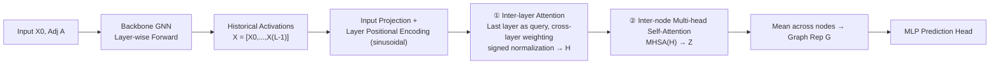

# Learning from Historical Activations in Graph Neural Networks

**Conference**: ICLR 2026  
**OpenReview**: [https://openreview.net/forum?id=8SnAGYf2wM](https://openreview.net/forum?id=8SnAGYf2wM)  
**Code**: [https://github.com/YanivDorGalron/HISTOGRAPH](https://github.com/YanivDorGalron/HISTOGRAPH)  
**Area**: Graph Learning / Graph Pooling  
**Keywords**: GNN, Graph Pooling, Historical Activations, Inter-layer Attention, Over-smoothing, Self-reflection  

## TL;DR
The authors propose HISTOGRAPH, a two-stage attention readout layer that pools the "historical activations" of GNN layers (rather than just the final layer) as a trajectory sequence. By applying inter-layer attention followed by inter-node attention, it significantly mitigates over-smoothing and improves graph classification performance in deep GNNs.

## Background & Motivation
**Background**: In tasks such as graph classification, GNNs rely on a pooling (readout) step to aggregate all node features into a fixed-length graph descriptor for a classifier. Whether using simple operations like mean/sum/max or learnable methods like DiffPool, SAGPool, or GMT, a common assumption is that **the input to pooling is the node features from the final GNN layer**.

**Limitations of Prior Work**: Relying solely on the final layer discards all intermediate activations generated during forward propagation. However, GNN layers possess "scale semantics"—shallow layers capture local neighborhoods and motifs, while deep layers encode global structures like communities and long-range dependencies, analogous to how shallow CNN layers capture textures and deep layers capture object semantics. Furthermore, deeper GNNs are prone to **over-smoothing**, where node representations become indistinguishable, effectively "overwriting" the discriminative features from earlier stages.

**Key Challenge**: Node representations drift significantly across multiple layers, and the final layer is not necessarily the most informative. Existing pooling methods focus only on the endpoint, failing to utilize multi-scale information and suffering from over-smoothing in deep architectures.

**Goal**: Enable GNNs to "look back" at their own computational trajectories, selecting the most useful representations from all activation layers for the final prediction without modifying the underlying GNN architecture.

**Core Idea**: Treat the cross-layer representation of each node $X = [X^{(0)}, \dots, X^{(L-1)}]$ as a "historical activation sequence." Use attention to learn which layers should be trusted most, followed by inter-node self-attention to complement the spatial context—a readout paradigm that treats "computational history" as a general inductive bias.

## Method

### Overall Architecture
HISTOGRAPH is a plug-and-play final aggregation layer that follows any backbone GNN. It consists of two stages: first, attention is applied along the **layer dimension** to compress each node's history into an embedding $H$; second, self-attention is applied along the **node dimension** to obtain the graph-level representation $G$. The key lies in decoupling the two axes (layer evolution and spatial interaction). Inter-layer attention is independent for each node with a cost of $O(LD)$, while inter-node attention is performed only once at the readout with a cost of $O(N^2D)$, avoiding the $O(L^2N^2D)$ complexity of naive joint attention.

### Key Designs

**1. Treating Historical Activations as a Sequence: Layer Positional Encoding + Last Layer as Query**  
The model first projects the activations of each layer through a linear layer $X' = \mathrm{Emb}_{hist}(X) \in \mathbb{R}^{N\times L \times D}$ to a unified dimension. Like a Transformer, it adds fixed sinusoidal layer positional encodings $P_{l,2k} = \sin(l/10000^{2k/D})$ to encode sequential information. A sophisticated aspect of the inter-layer attention is the query selection: **only the last layer embedding is used as the query** $Q = \tilde{X}_{L-1}W^Q$, allowing the "final state" to look back at the entire history $K=\tilde{X}W^K$, $V=\tilde{X}$. This naturally introduces a recency bias toward the final state, using the most mature representation as an anchor to determine which historical intermediate states are most valuable.

**2. Signed Normalization vs. Softmax: Enabling "Subtraction" in Layer Weighting**  
This is the most critical design in the paper. After calculating the attention scores $c = \mathrm{Average}(QK^\top/\sqrt{D}) \in \mathbb{R}^{1\times L}$, the authors **do not use softmax**. Instead, they use normalization by dividing by the sum $\alpha_l = c_l / \sum_{l'} c_{l'}$, allowing weights in the aggregation $H = \sum_l \alpha_l \tilde{X}_l$ to be negative while ensuring $\sum_l \alpha_l = 1$. Why is this important? Softmax forces a non-negative convex combination, acting as a low-pass filter (weighted average). Allowing signed weights is equivalent to a **signed FIR filter**. For example, $\alpha_l = 1/L$ is low-pass (mean), while $\alpha_l = \delta_{l,L-1}-\delta_{l,L-2}$ is high-pass (first-order difference). This transforms the readout into a learnable filter over the GNN trajectory, capable of expressing "addition/subtraction" relationships between layers. This is also the theoretical basis for mitigating over-smoothing (Proposition 1): as long as $\alpha_{l'} \neq 0$ for an early layer $l' \le L_0$, the final embedding $h_u = \sum_l \alpha_l x_u^{(l)}$ retains early discriminative features even if deep layers collapse, ensuring $\|h_u - h_v\| > 0$.

**3. Single Inter-node Self-Attention for Spatial Aggregation**  
After obtaining the per-node historical aggregation $H$, spatial context is added: $Z = \mathrm{MHSA}(H,H,H)$, followed by optional residual connections and LayerNorm, and finally a global mean $G = \mathrm{Average}(Z)$. Spatial positional encodings are intentionally omitted to maintain permutation invariance. The design choice to **only do this once at the readout** is crucial: inter-node self-attention naturally flattens node representations (the source of over-smoothing). By avoiding it in every message-passing layer and only using it at the end, the model gains global node interaction without exacerbating over-smoothing during the forward process.

**4. Dual Deployment: End-to-End vs. Frozen Backbone Post-processing**  
The HISTOGRAPH head supports two modes. End-to-end joint training enriches intermediate representations via backpropagation. Alternatively, **freezing a pre-trained backbone and training only the HISTOGRAPH head** (FT mode) is a significant engineering advantage. This mode caches the $N\times L\times D$ activations per graph, skips backbone gradients, and reduces backpropagation costs from $O(L(ED+ND^2))$ to $O(N(L+N)D)$ for the lightweight head.

## Key Experimental Results

### Main Results: Graph Classification
On TU datasets (5-layer GIN backbone), the method achieves SOTA in 5 out of 7 tasks. On OGB molecular property prediction (3-layer GCN backbone), it leads in 3 out of 4:

| Dataset | Runner-up (Method) | HISTOGRAPH | Gain |
|---|---|---|---|
| IMDB-B (Acc%) | 80.9 (DKEPool) | **87.2** | +6.3 |
| IMDB-M (Acc%) | 56.3 (DKEPool) | **61.9** | +5.6 |
| PROTEINS (Acc%) | 81.2 (DKEPool) | **97.8** | +16.6 |
| MUTAG (Acc%) | 97.3 (DKEPool) | **97.9** | +0.6 |
| NCI1 (Acc%) | 85.4 (DKEPool) | **85.9** | +0.5 |
| MOLBBBP (AUC%) | 69.73 (DKEPool) | **72.02** | +2.29 |
| TOXCAST (AUC%) | 65.44 (GMT) | **66.35** | +0.91 |

The +16.6% improvement on PROTEINS is particularly notable.

### Mitigating Over-smoothing: Deep Node Classification
GCN with HISTOGRAPH shows almost no degradation as depth increases (Accuracy%):

| Dataset | Method | 2 Layers | 8 Layers | 32 Layers | 64 Layers |
|---|---|---|---|---|---|
| Cora | GCN | 81.1 | 69.5 | 60.3 | 28.7 |
| Cora | +HISTOGRAPH | 81.3 | **80.7** | **80.6** | **77.5** |
| Citeseer | GCN | 70.8 | 30.2 | 25.0 | 20.0 |
| Citeseer | +HISTOGRAPH | 70.9 | **69.9** | **67.2** | **63.4** |
| Pubmed | GCN | 79.0 | 61.2 | 22.4 | 35.3 |
| Pubmed | +HISTOGRAPH | 78.9 | **78.6** | **80.0** | **79.3** |

At 64 layers, GCN collapses to 28.7% on Cora, while HISTOGRAPH maintains 77.5%.

### Ablation Study (PROTEINS, Component Removal)

| Variant | Acc(%) | Std |
|---|---|---|
| w/o Division by Sum (Signed norm replaced by softmax) | 74.45 | 6.28 |
| w/o Layer-wise Attention | 78.61 | 4.82 |
| w/o Node-wise Attention | 80.78 | 7.71 |
| **HISTOGRAPH (Full)** | **97.80** | **0.40** |

### Key Findings
- **Signed normalization is indispensable**: Removing it leads to a 23% drop (to 74.45%), confirming that allowing negative weights for high-pass filtering is a core mechanism.
- **Frozen FT mode often outperforms E2E**: On IMDB-M, the FT mode raised MeanPool's 54.7% to 67.3%, surpassing the 61.9% of E2E.
- Visualizations show the model places significant weights on **early layers + the final layer**, creating a task-adaptive "local + global" profile.

## Highlights & Insights
- **Novel Perspective**: Reinterpreting the GNN forward pass as a "historical activation trajectory" changes pooling from "looking at the destination" to "looking at the path," providing a clean and universal inductive bias.
- **Technical Elegance**: The use of a simple "divide by sum instead of softmax" change upgrades the readout to a learnable signed FIR filter with theoretical roots in signal processing.
- **Efficient Solution to Over-smoothing**: While other methods require architectural changes or regularization, simply retaining early layers at the readout provides theoretical guarantees and stability up to 64 layers.
- **Deployment-Friendly**: The mode of training only the head on frozen backbones offers a "free lunch" for existing pre-trained GNNs.

## Limitations & Future Work
- The $O(N^2D)$ complexity of node-wise attention limits use on large graphs without the scaling strategies mentioned in the Appendix.
- The +16.6% gain on PROTEINS is an outlier that may be strongly tied to specific dataset characteristics and warrants further investigation into potential overfitting or readout shortcuts.
- Caching the $N\times L\times D$ tensor poses memory challenges for deep models and large batches.
- Dependency on the backbone: If the backbone is too weak, the historical activations may not contain enough information to extract.

## Related Work & Insights
- **vs. JKNet (Jumping Knowledge)**: JK uses simple concatenation/max/LSTM combinations without interpreting layers as a sequence or using signed filtering.
- **vs. Attention Pooling (GMT, Set2Set)**: These apply attention only to the final layer, whereas HISTOGRAPH extends attention to the "layer" dimension.
- **vs. State Space Models / ARMA on graphs**: Those focus on training stability or dynamical system modeling of node features, whereas this work treats the internal trajectory as the primary signal for readout.

## Rating
- **Novelty**: ⭐⭐⭐⭐ — The combination of history tracking and signed FIR filtering is a fresh take on GNN readout.
- **Experimental Thoroughness**: ⭐⭐⭐⭐ — Wide coverage across graph/node classification and depth scaling, with clear ablations.
- **Writing Quality**: ⭐⭐⭐⭐ — Strong logical flow from motivation to theory and experimental validation.
- **Value**: ⭐⭐⭐⭐ — Highly practical due to its plug-and-play nature and significant performance gains.

<!-- RELATED:START -->

## Related Papers

- [\[ICLR 2026\] Canonical Tree Cover Neural Networks for Expressive and Invariant Graph Learning](canonical_tree_cover_neural_networks_for_expressive_and_invariant_graph_learning.md)
- [\[ICLR 2026\] Are We Measuring Oversmoothing in Graph Neural Networks Correctly?](are_we_measuring_oversmoothing_in_graph_neural_networks_correctly.md)
- [\[ICLR 2026\] A Graph Meta-Network for Learning on Kolmogorov–Arnold Networks](a_graph_meta-network_for_learning_on_kolmogorovarnold_networks.md)
- [\[ICLR 2026\] WATS: Wavelet-Aware Temperature Scaling for Reliable Graph Neural Networks](wats_wavelet-aware_temperature_scaling_for_reliable_graph_neural_networks.md)
- [\[ICLR 2026\] Cooperative Sheaf Neural Networks](cooperative_sheaf_neural_networks.md)

<!-- RELATED:END -->
