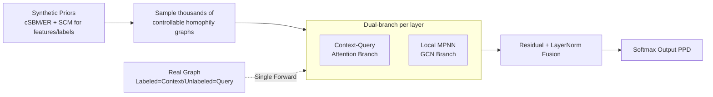

# Learning Posterior Predictive Distributions for Node Classification from Synthetic Graph Priors

**Conference**: ICLR 2026  
**OpenReview**: [https://openreview.net/forum?id=FmxRzlu0rT](https://openreview.net/forum?id=FmxRzlu0rT)  
**Code**: [https://github.com/jeongwhanchoi/NodePFN](https://github.com/jeongwhanchoi/NodePFN)  
**Area**: Graph Learning / Graph Foundation Models / Node Classification  
**Keywords**: Prior-Fitted Networks, Node Classification, Synthetic Graph Priors, In-Context Learning, Posterior Predictive Distribution, Graph Foundation Models  

## TL;DR
By migrating the Prior-Fitted Network (PFN) paradigm from tabular data to graphs, the authors pre-train NodePFN on thousands of synthetic graphs generated from controllable priors. This allows for training-free, single-forward-pass general node classification on arbitrary real-world graphs, achieving a 71.27% average accuracy across 23 benchmarks.

## Background & Motivation
**Background**: GNNs (GCN/GAT/GraphSAGE) are effective for node classification but operate in a rigid manner—requiring a model to be re-trained using labeled nodes whenever a new graph is encountered.

**Limitations of Prior Work**: Real-world graphs vary significantly in homophily levels, community structures, feature distributions, and degree distributions. A GNN trained well on Cora may fail on the heterophilic Wisconsin graph, lacking "one-model-fits-all" capability. Recent works porting LLMs to graphs (e.g., GraphGPT, OFA) rely on textual attributes and excel at semantics rather than topology. Although GraphAny is an inductive framework, it still requires training on specific source datasets, and its performance depends heavily on the choice of the training set.

**Key Challenge**: LLMs have achieved zero-shot generalization through "massive diverse data pre-training $\rightarrow$ in-context learning." However, the graph domain lacks such massive unified corpora and is hindered by structural heterogeneity, delaying the emergence of a truly "pre-train once, apply everywhere" foundation model for node classification.

**Goal**: To train a **single** pre-trained model capable of zero-training, single-forward-pass prediction of query node labels for any graph, remaining robust to both homophilic and heterophilic structures.

**Core Idea**: **[Replacing Real Data with Synthetic Priors]** Drawing inspiration from TabPFN—where PFNs learn to approximate the Posterior Predictive Distribution (PPD) on carefully designed synthetic priors—this work designs a set of controllable synthetic priors for graphs (controlling homophily, community structure, and feature-label relationships). This allows the model to learn the patterns of "extracting rules from labeled context nodes and applying them to query nodes," effectively deriving universal node classification laws from synthetic data rather than relying on any real training graphs.

## Method

### Overall Architecture
NodePFN reformulates node classification as an "on-the-fly PPD learning" problem. During training, synthetic graphs are sampled from a prior $p(\mathcal{G})$, with nodes partitioned into a context set $\mathcal{D}_{train}$ (with labels) and a query set $\mathcal{D}_{test}$ (without labels). The model learns $f_\theta:(x_{test},\mathcal{D}_{train},\mathcal{G})\mapsto p(y_{test}\mid \mathcal{D}_{train},\mathcal{G})$ to approximate the true PPD using Cross-Entropy. During inference, labeled nodes of a real graph are treated as context and unlabeled nodes as queries. A single forward pass yields predictions without any gradient updates. The pipeline consists of two components: a **Synthetic Graph Prior Generator** and **Dual-branch Layers** (Attention for in-context learning + MPNN for local topology).

### Key Designs

**1. Synthetic Graph Priors: SCM for Features-Labels and Random Graphs for Structure**　The training data is entirely synthesized from priors, which is the cornerstone of the method. Features and labels are generated via a Structural Causal Model (SCM)—sampling a random MLP per graph and pruning edges to form a DAG. Gaussian noise passes through the network; intermediate representations serve as node features $X$, and final outputs serve as labels $y$, creating complex non-linear feature-label dependencies. Two types of random graphs are used for structure: cSBM controls community and homophily $h=p_{in}/(p_{in}+p_{out})$ via intra/inter-class edge probabilities, covering $h$ from 0.1 to 0.9 (strong heterophily to strong homophily). ER graphs provide a "non-structured baseline" without community structure, forcing the model to learn patterns beyond community clusters. A key insight is that for cSBM, SCM-generated labels determine community membership, which then influences edge creation via $h$—linking features, labels, and structure into a causal chain.

**2. Dual-branch Layer: Attention for Context + MPNN for Topology**　Each layer runs two complementary branches in parallel. The Attention branch follows the asymmetric design of PFNs: initial representations of context nodes $H_{train}$ encode both features and labels, while query nodes $H_{test}$ only encode features. Self-attention is performed among context nodes to establish a global understanding of the label distribution $H^{(\ell+1,attn)}_{train}=\mathrm{SelfAttention}(H^{(\ell)}_{train})$. Query nodes then perform cross-attention over context nodes $H^{(\ell+1,attn)}_{test}=\mathrm{CrossAttention}(H^{(\ell)}_{test},H^{(\ell)}_{train},H^{(\ell)}_{train})$—this asymmetry ensures query nodes utilize training information without interfering with each other's predictions. The MPNN branch uses GCN on a symmetrically normalized adjacency matrix $\tilde A=D^{-1/2}AD^{-1/2}$ to aggregate neighborhoods $H^{(\ell+1,mpnn)}=\mathrm{MPNN}(H^{(\ell)},\tilde A)$, specifically capturing local topology independent of the train/test split. Both branches are fused with the input via residuals: $H^{(\ell+1)}=\mathrm{LayerNorm}(H^{(\ell)}+H^{(\ell+1,attn)}+H^{(\ell+1,mpnn)})$.

**3. Training as PPD Approximation, Inference as Single Forward Pass**　The training objective is to minimize the expected Cross-Entropy of query nodes on synthetic priors: $\mathcal{L}(\theta)=\mathbb{E}_{D\sim p(D)}[-\frac{1}{|V_{test}|}\sum_{v\in V_{test}}\sum_c y_{v,c}\log f_\theta(y_{v,c}\mid x_v,\mathcal{D}_{train},\mathcal{G})]$. Every synthetic graph is randomly re-partitioned into context/query sets so the model learns "how to learn from context" rather than the rules of a specific graph. During inference, real graphs undergo lightweight preprocessing, and after $L$ layers, the label distribution is obtained via $f_\theta(y_v\mid\cdots)=\mathrm{softmax}(W_{out}h_v^{(L)})$. Because the training phase approximated the true PPD, the output provides calibrated uncertainty estimates with zero gradient updates. The model is pre-trained on approximately 250,000 synthetic graphs; this computational cost is **amortized** over all subsequent inference tasks.

## Key Experimental Results

### Main Results (23 Real-world Benchmarks, Acc. / Avg. Rank)

| Type | MLP | GCN | GAT | GraphAny(Cora) | GraphAny(Wisc.) | **NodePFN** |
|---|---|---|---|---|---|---|
| Homophilic Avg Acc | 56.43 | 73.05 | 74.39 | 71.45 | 70.86 | **77.39** |
| Homophilic Avg Rank | 7.62 | 4.92 | 4.54 | 4.15 | 4.31 | **1.69** |
| Heterophilic Avg Acc | 58.17 | 58.84 | 59.11 | 60.56 | 61.62 | **65.14** |
| Heterophilic Avg Rank | 7.20 | 6.80 | 6.60 | 4.60 | 4.50 | **1.70** |
| **Overall Avg Acc** | 57.30 | 66.63 | 67.67 | 66.00 | 66.24 | **71.27** |
| **Overall Avg Rank** | 7.41 | 5.86 | 5.57 | 4.38 | 4.40 | **1.70** |

The single pre-trained NodePFN ranks first on both homophilic and heterophilic graphs with an average rank of 1.70. While GraphAny requires dataset-specific training and is sensitive to the choice of training data (e.g., the Cora version is strong on homophily but weak on heterophily), NodePFN remains stable across both types.

### Ablation Study

| Training-free | Cora | Pubmed | Wisconsin | Texas |
|---|---|---|---|---|
| SGC | 78.20 | 72.98 | 57.64 | 46.03 |
| LabelProp | 60.30 | 63.44 | 16.08 | 23.53 |
| **NodePFN** | **82.06** | **78.00** | **81.18** | **76.22** |

| Ablation | Cora | Wisconsin | Tolokers |
|---|---|---|---|
| w/o ER | 81.26 | 78.82 | 77.30 |
| w/o cSBM | 80.62 | 80.39 | 77.18 |
| TabPFN (Remove graph prior + MPNN) | 53.10 | 72.94 | 78.18 |
| NodePFN-L6 (29.01M $\rightarrow$ 14.80M) | 53.10 | 72.94 | 78.00 |
| NodePFN-Seq (Serial instead of Parallel) | 80.64 | 78.82 | 77.88 |
| **NodePFN (Full)** | **82.06** | **81.18** | **78.61** |

### Key Findings
- **Full Homophily Scan on Synthetic Cora**: While MLP remains flat and GCN/GAT performance crashes in low-homophily regions, NodePFN remains optimal across the entire range with no sudden drops, proving the synthetic priors grant robustness to varying homophily.
- **Degradation to TabPFN**: Removing graph priors and MPNN causes NodePFN to degrade into TabPFN, with mean accuracy dropping from 71.2% to 55.5% and higher variance—validating the necessity of graph-aware modeling over treating nodes as independent tabular rows.
- **Prior Redundancy and Complementarity**: Removing either ER or cSBM results in only minor performance drops, indicating they adapt to different graph properties and act as backstops for one another; however, model capacity cannot be compromised, as the L6 version significantly underperforms on the homophilic Cora.
- **Structural Role Classification**: On the Airport dataset (topology only, features as one-hot IDs), NodePFN outperforms specialized structural embedding methods like Node2Vec/LINE, indicating it successfully learns transferable structural patterns.

## Highlights & Insights
- **Clean Paradigm Shift**: Fully migrating the "synthetic prior + single forward pass to approximate PPD" concept from TabPFN to graphs, this is the first work to extend the PFN paradigm to the graph domain without depending on LLMs or textual attributes.
- **Priors as the Real Moat**: Linking SCM (feature-label causal chains) and cSBM (controllable homophily structure) into a single causal chain—rather than independent sampling—is key to covering the diversity of real-world graphs.
- **Decoupled Dual-branch Design**: Asymmetric attention handles "learning from context," while GCN handles "reading local topology." Their residual fusion effectively merges in-context learning with graph structural awareness.
- **Compelling Amortization**: Pre-training costs on 250k synthetic graphs are paid once, resulting in zero-cost inference for all new graphs hereafter.

## Limitations & Future Work
- **Fixed Class and Feature Dimensions**: The current maximum number of classes (tested up to 20) and feature dimensions are fixed; exceeding these requires structural redesign.
- **Quadratic Attention Complexity**: Context-query attention is $O(n^2)$, making it computationally expensive for large-scale graphs without an explicit scaling strategy.
- **High Pre-training Cost**: Pre-training on 250k graphs requires significant computational resources, creating a high barrier to reproduction (despite the amortization argument).
- **Suboptimal on Certain Heterophilic Data**: It does not rank first on some heterophilic datasets, such as Questions or Amazon-Ratings, suggesting gaps still exist in prior coverage.

## Related Work & Insights
- **PFN Lineage**: Müller et al. proposed PFNs, proving Transformers can approximate PPD on prior tasks. TabPFN extended this to tabular SOTA. This work serves as the "Graph version." Unlike TabPFN-GN, which converts graphs to tabular features, NodePFN uses native graph-aware modeling, which is superior for heterophilic graphs.
- **Graph Foundation Models**: While GraphGPT, LLAGA, and OFA rely on LLMs to encode text, NodePFN provides a third path: "No LLM, no text, no real training graphs."
- **Inspiration**: The combination of synthetic priors and in-context learning is highly applicable to any domain with scarce or heterogeneous data (e.g., molecules, spatio-temporal graphs). The core is explicitly encoding domain diversity into controllable prior samplers.

## Rating
- **Novelty**: ⭐⭐⭐⭐⭐ First to extend the PFN paradigm to graphs using synthetic priors for training-free classification; a conceptual breakthrough.
- **Experimental Thoroughness**: ⭐⭐⭐⭐ 23 benchmarks + homophily/heterophily stratification + training-free vs. trained comparisons + structural roles + exhaustive ablation. Lacks large-scale graph evaluation.
- **Writing Quality**: ⭐⭐⭐⭐ Logical flow from motivation to method and experiment. Figure 1 and 3 clearly explain paradigm differences and architecture.
- **Value**: ⭐⭐⭐⭐ Offers a new paradigm for GFM without LLM/text dependencies. Robustness across graph types is highly practical, though complexity and fixed dimensions limit immediate deployment.

<!-- RELATED:START -->

## Related Papers

- [\[AAAI 2026\] Posterior Label Smoothing for Node Classification](../../AAAI2026/graph_learning/posterior_label_smoothing_for_node_classification.md)
- [\[ICLR 2026\] Forest-Based Graph Learning for Semi-Supervised Node Classification](forest-based_graph_learning_for_semi-supervised_node_classification.md)
- [\[ICLR 2026\] Low-Rank Few-Shot Node Classification by Node-Level Graph Diffusion](low-rank_few-shot_node_classification_by_node-level_graph_diffusion.md)
- [\[ICLR 2026\] Scaling Knowledge Graph Construction through Synthetic Data Generation and Distillation](scaling_knowledge_graph_construction_through_synthetic_data_generation_and_disti.md)
- [\[ICLR 2026\] Glance for Context: Learning When to Leverage LLMs for Node-Aware GNN-LLM Fusion](glance_for_context_learning_when_to_leverage_llms_for_node-aware_gnn-llm_fusion.md)

<!-- RELATED:END -->
