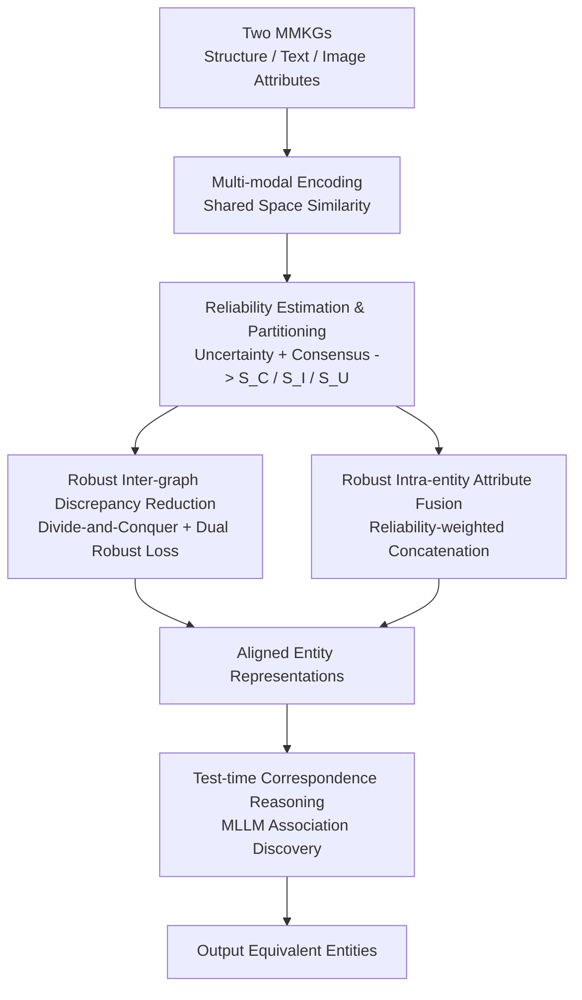

# Learning with Dual-level Noisy Correspondence for Multi-modal Entity Alignment

**Conference**: ICLR 2026  
**OpenReview**: [https://openreview.net/forum?id=mytIKuRsSE](https://openreview.net/forum?id=mytIKuRsSE)  
**Code**: https://github.com/XLearning-SCU/2026-ICLR-RULE  
**Area**: Multi-modal Knowledge Graphs / Entity Alignment / Robust Learning with Noisy Correspondence  
**Keywords**: Multi-modal Entity Alignment, Noisy Correspondence, Uncertainty, Consensus, Test-time Inference

## TL;DR
Addressing the prevalent "Dual-level Noisy Correspondence" (entity-attribute level + cross-graph level) in multi-modal entity alignment, this paper proposes the RULE framework. It estimates the reliability of each correspondence using "uncertainty + consensus" criteria to suppress noise during attribute fusion and cross-graph alignment. Additionally, it leverages MLLM reasoning during test-time to uncover implicit attribute associations, achieving an average H@1 improvement of over 5 points across five benchmarks compared to the runner-up.

## Background & Motivation

**Background**: Multi-modal Entity Alignment (MMEA) aims to identify equivalent entities across two heterogeneous Multi-modal Knowledge Graphs (MMKGs) that represent the same real-world concept. Each entity possesses various modal attributes, such as structural triples, textual descriptions, and images. Standard practices follow a two-stage pipeline: first, intra-modal attribute fusion is performed based on "entity-attribute correspondence" to obtain a unified entity representation; second, contrastive learning is used to eliminate cross-graph discrepancies based on "entity-entity / attribute-attribute correspondence."

**Limitations of Prior Work**: This pipeline assumes all correspondence labels are flawless. However, MMKG construction relies on expert annotation, which is prone to errors—for example, an image of Xu Jinjiang might be incorrectly linked to Jason Momoa due to visual similarity (intra-entity NC); or a movie entity "Mr. & Mrs. Smith" might be mismatched with the real-life Brad Pitt and Angelina Jolie couple (inter-graph NC). According to the authors' statistics in the appendix, the proportion of such noise in real benchmarks is startling (exceeding 50% in the ICEWS benchmark).

**Key Challenge**: Noise pollutes both levels simultaneously—it disrupts intra-entity attribute fusion (incorporating incorrect attributes into entity representations) and misleads cross-graph alignment (forcing the model to pull together entities that should not be aligned). The authors formally name this problem **Dual-level Noisy Correspondence (DNC)**. Existing methods lack mechanisms to distinguish the reliability of correspondences, leading to significant performance degradation under DNC.

**Goal**: To make MMEA robust under DNC, three sub-questions must be answered: How to determine if a correspondence is trustworthy? How to treat clean and noisy samples differently during training based on credibility? How to avoid ignoring attributes that "look different but are actually equivalent" during testing?

**Key Insight**: The authors observe that a single signal is insufficient—low uncertainty does not guarantee correct correspondence (proven by Theorem 1). It also requires "consensus" support from attribute similarities. Thus, two complementary criteria are used to jointly judge reliability.

**Core Idea**: Reliability scores for each correspondence are calculated using "uncertainty + consensus." These scores are used to down-weight noisy attributes during fusion and exclude/refine noisy pairs during cross-graph alignment. Furthermore, MLLM is employed during testing for attribute association reasoning—replacing the "perfect label assumption" with reliability estimation.

## Method

### Overall Architecture
RULE (dually RobUst LEarning) solves the problem of "how to align two MMKGs robustly when labels are noisy." The process consists of four steps: attribute projection to a shared space for cross-graph similarity calculation → reliability estimation and partition into three groups (Clean $S_C$ / Inconsistent $S_I$ / Uncertain $S_U$) → reliability-driven "Robust Inter-graph Discrepancy Reduction" and "Robust Intra-entity Attribute Fusion" → test-time correspondence reasoning using MLLMs to correct similarities.

### Key Designs

**1. Reliability Estimation: Joint Scoring via "Uncertainty + Consensus"**

This step addresses the limitation that existing methods treat all labeled correspondences equally. RULE calculates a reliability score $w_i = (1-u_i)\gamma + c_i(1-\gamma)$ for each correspondence (e.g., entity pair $(x_i, \tilde{x}_j)$), with $\gamma$ fixed at 0.5. The two components are complementary:

- **Uncertainty $u_i$** is derived from Dempster-Shafer evidence theory. Similarity is converted into evidence $e_{ij} = \exp(\tanh(s_{ij}/\tau))$, linked to Dirichlet parameters $\alpha_{ij} = e_{ij}+1$. Uncertainty is defined as $u_i = \tilde{N}/Q_i$ (where $Q_i = \sum_j \alpha_{ij}$ is the Dirichlet strength). The intuition is: if an entity finds no matching counterparts in the other graph, evidence is low, $Q_i$ is small, and uncertainty is high—a hallmark of noisy correspondence.
- **Consensus $c_i$** bridges the gap in uncertainty. Theorem 1 proves that "low uncertainty does not mean the highest belief is assigned to the labeled correspondence," i.e., low $u_i \not\Rightarrow \arg\max b_i = \arg\max y_i$. Therefore, consensus is defined as $c_i = \max(0, s_i \cdot y_i)$, measuring whether the labeled correspondence is supported by similarity. Low consensus implies a suspect label.

These two criteria—one checking if evidence is sufficient, the other checking if evidence is correctly directed—are both indispensable.

**2. Marginal Contribution Consensus Estimation: Handling Missing $y_i$ at Test-time**

The consensus formula requires label $y_i$, which is unavailable during inference. RULE uses a greedy strategy based on "marginal contribution." The marginal contribution of an attribute $x_i^m$ is defined as $\Delta = v(\pi \cup \{m\}) - v(\pi)$, where the value function $v(\pi)$ is the maximum of the mean similarities. Following the idea that information reduces uncertainty, the authors assume $\Delta \geq 0$ for correctly associated attributes and $\Delta < 0$ otherwise. Starting from an initial subset $\pi_0$, attributes are iteratively added if they provide positive marginal contribution to estimate $\hat{y}_i$.

**3. Three-group Partitioning: Clean, Inconsistent, and Uncertain**

Using $u_i$ and $c_i$, cross-graph pairs with $y_{ij}=1$ are divided into: High Uncertainty $S_U = \{u_i > \beta_u\}$, Inconsistent $S_I = \{u_i \leq \beta_u,\ c_i < \beta_c\}$, and Clean $S_C = \{u_i \leq \beta_u,\ c_i \geq \beta_c\}$. Thresholds $\beta_u, \beta_c$ are adaptively determined based on statistics from the True Positive set $S_{TP}$ rather than manual tuning.

**4. Robust Inter-graph Discrepancy Reduction (DRL): Divide-and-Conquer Training**

Different strategies are applied to the three groups. The goal is $L = L_{DR} + \lambda L_{Reg}$. For entity and attribute levels, a dual-path robust loss is used: pairs in $S_U$ are excluded from optimization; pairs in $S_I$ are refined using soft labels $\hat{y}_i = c_i y_i + (1-c_i)\text{Softmax}(s_i)$; and $S_C$ utilizes the original $y_i$. The robust loss $L_{DR}$ is the expected square error integrated over the Dirichlet distribution, which prevents over-optimization when evidence is limited (Theorem 2).

**5. Robust Intra-entity Attribute Fusion (DRF): Reliability-weighted Weights**

This addresses entity-attribute level noise. The authors argue that for correctly paired entities, an attribute-attribute mismatch occurs if and only if the entity-attribute correspondence is wrong. Thus, cross-graph reliability $w_i^m$ identifies unreliable intra-entity attributes. Fusion is performed as $z_i = \oplus_{m\in M}(w_i^m \cdot z_i^m)$, where high-reliability attributes are emphasized and noisy ones are suppressed.

**6. Test-time Correspondence Reasoning (TTR): MLLM for Deep Reasoning**

This is a rare design for "test-time robustness." Surface similarities might hinder the identification of equivalent entities, while implicit associations (e.g., a player's connection to their home country) are often ignored. TTR uses MLLMs to perform deep reasoning on attributes, outputting corrected similarities $\hat{s}_i = \sum_{m\in M} \hat{w}_i^m \cdot \hat{s}_i^m$. This uncovers latent attribute connections while suppressing intra-entity noise during inference.

### Loss & Training
Total loss $L = L_{DR} + \lambda L_{Reg}$: $L_{DR}$ is the sum of entity-level and attribute-level dual-path robust losses (expected square error based on Dirichlet distribution, partitioned by the three groups). $L_{Reg}$ is a KL-divergence regularization term that pushes evidence of unlinked pairs toward a uniform prior. The reliability balance coefficient is $\gamma=0.5$, and thresholds $\beta_u, \beta_c$ are adaptively calculated.

## Key Experimental Results

### Main Results
Comparison with seven SOTA methods across five benchmarks. The following table shows average results and representative benchmarks under "Inherent DNC" (no additional noise injected):

| Setting | Method | ICEWS-WIKI H@1 | ICEWS-YAGO H@1 | DBP15K ZH-EN H@1 | Average |
|------|------|------|------|------|------|
| Inherent DNC | MEAformer | 53.5 | 35.0 | 82.4 | 67.0 |
| Inherent DNC | Prev. SOTA (PMF) | 52.6 | 38.3 | 83.9 | 68.6 |
| Inherent DNC | **Ours (RULE)** | **64.2** | **48.8** | **85.6** | **73.8** |

**Ours** achieves an average H@1 of 73.8, exceeding the **Prev. SOTA** (PMF) by 5.2 points. Gains are more pronounced in heavily noisy scenarios like ICEWS-WIKI and ICEWS-YAGO (approx. 11.6 and 10.5 point leads, respectively).

### Ablation Study
Under a more aggressive "20% DNC" setting (20% additional noise injected), traditional methods (e.g., EVA on ICEWS-YAGO with H@1 of only 0.2) nearly collapse. In contrast, **Ours** maintains high accuracy, further widening the relative advantage and validating the value of dual-level anti-noise design under extreme noise.

## Highlights & Insights
- **Problem Definition as a Contribution**: Formally proposes and investigates "Dual-level Noisy Correspondence (DNC)" in MMEA, revealing that noise in real benchmarks can exceed 50%, highlighting a widespread but ignored assumption.
- **Uncertainty + Consensus Complementarity**: Proves via Theorem 1 that uncertainty alone is insufficient, introducing the consensus criterion with solid theoretical motivation rather than heuristic tricks.
- **Rare Test-time Robustness Perspective**: Most MMEA works focus solely on training; TTR uses MLLMs to excavate implicit attribute associations during inference, offering a valuable test-time robustness design.

## Limitations & Future Work
- TTR relies on MLLMs for reasoning; however, the inference overhead and dependence on MLLM capability are not fully discussed, leaving scalability on large-scale graphs questionable.
- The choice of reliability balance coefficient $\gamma=0.5$ and the initial subset size for marginal contribution are somewhat heuristic, lacking thorough sensitivity analysis.
- The method targets annotation noise but does not explicitly verify robustness against "missing or corrupted modal data."

## Related Work & Insights
- Inherits from Noisy Correspondence learning in cross-modal matching, transferring and extending it to "dual-level" noise in KG entity alignment.
- Uncertainty modeling follows Dempster-Shafer evidence theory and Subjective Logic (Sensoy et al. 2018).
- Insight for future work: In any multi-modal alignment task relying on manual labels, "reliability estimation + divide-and-conquer training + test-time recovery" serves as a reusable anti-noise paradigm.

## Rating
- Novelty: 4.5/5 (DNC definition + Dual-criterion reliability + Test-time reasoning)
- Experimental Thoroughness: 4/5 (5 benchmarks, 7 SOTAs, including injected noise settings)
- Writing Quality: 4/5 (Clear motivation, theoretical support, high formula density)
- Value: 4.5/5 (Identifies and solves a prevalent real-world problem; transferable paradigm)

<!-- RELATED:START -->

## Related Papers

- [\[AAAI 2026\] MyGram: Modality-aware Graph Transformer with Global Distribution for Multi-modal Entity Alignment](../../AAAI2026/graph_learning/mygram_modality-aware_graph_transformer_with_global_distribution_for_multi-modal.md)
- [\[ICLR 2026\] Federated Graph-Level Clustering Network with Dual Knowledge Separation](federated_graph-level_clustering_network_with_dual_knowledge_separation.md)
- [\[ACL 2026\] EA-Agent: A Structured Multi-Step Reasoning Agent for Entity Alignment](../../ACL2026/graph_learning/ea-agent_a_structured_multi-step_reasoning_agent_for_entity_alignment.md)
- [\[ICLR 2026\] Dual-Branch Representations with Dynamic Gated Fusion and Triple-Granularity Alignment for Deep Multi-View Clustering](dual-branch_representations_with_dynamic_gated_fusion_and_triple-granularity_ali.md)
- [\[ICML 2026\] Anchor-guided Hypergraph Condensation with Dual-level Discrimination](../../ICML2026/graph_learning/anchor-guided_hypergraph_condensation_with_dual-level_discrimination.md)

<!-- RELATED:END -->
