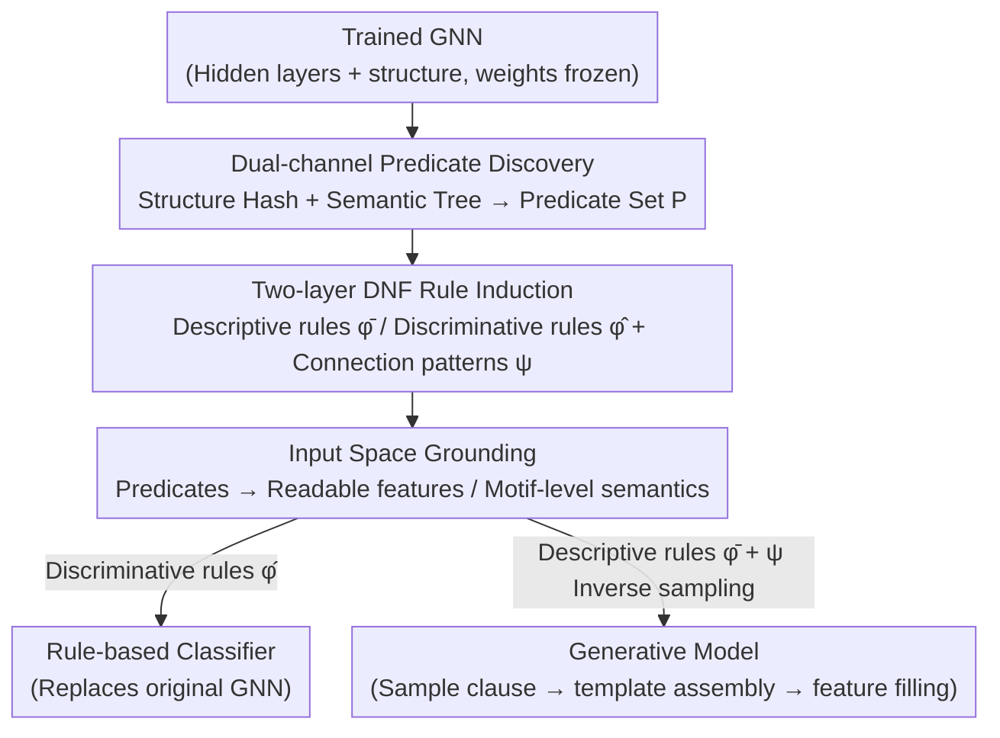

# LogicXGNN: Grounded Logical Rules for Explaining Graph Neural Networks

**Conference**: ICLR 2026  
**arXiv**: [2503.19476](https://arxiv.org/abs/2503.19476)  
**Code**: None  
**Area**: Graph Learning  
**Keywords**: GNN Interpretability, Logic Rule Extraction, Decision Trees, Knowledge Discovery, Graph Generation

## TL;DR

LogicXGNN proposes a post-hoc framework for extracting interpretable first-order logic rules from trained Graph Neural Networks (GNNs). By identifying predicates via graph structural hashing and hidden layer embedding patterns, determining discriminative DNF rule structures with decision trees, and grounding abstract predicates back to the input space, it generates a rule-based classifier that can substitute the original GNN and serve as a controllable graph generative model.

## Background & Motivation

Graph Neural Networks (GNNs) have achieved significant success in fields such as drug discovery, fraud detection, and recommendation systems. However, their black-box nature hinders their application in high-reliability scenarios like healthcare. Existing GNN interpretability methods exhibit significant shortcomings:

- **Local attribution methods** (e.g., GNNExplainer, PGExplainer) can only explain predictions for individual instances and fail to provide a description of the model's global behavior.
- **Concept-based global methods** (e.g., GCNeuron, GLGExplainer) rely on pre-defined concepts, and the generated rules only describe patterns within a single category rather than effectively distinguishing between different classes.
- The expressive power of GLGExplainer is severely insufficient—for example, on the Mutagenicity dataset, it uses only 2 predicates, resulting in performance close to a random classifier.

**Core Problem**: Can logical rules be extracted from GNNs that are simultaneously interpretable, discriminative, and model-agnostic?

## Method

### Overall Architecture

LogicXGNN decomposes the task of "reading logical rules from a trained GNN" into a three-step pipeline: first, identifying a set of hidden predicates $P$ for each node; second, organizing predicate activation patterns into DNF-form rule structures $\phi_M$; and finally, grounding abstract predicates back to the input feature space to make the rules readable, executable, and generative. The entire pipeline does not alter the weights of the original GNN, instead only performing reading and induction on its hidden layers and graph structure. Ultimately, it produces two sets of rules: descriptive rules $\bar{\phi}_M$ that fully cover intra-class variations for graph generation, and discriminative rules $\hat{\phi}_M$ streamlined to retain only the features necessary for cross-class differentiation for classification. By running this pipeline in reverse, the same set of rules can function as a generative model.

### Key Designs

**1. Dual-channel Predicate Discovery: Handling Structure and Semantics Separately**

Relying solely on GNN hidden embeddings is insufficient because the over-smoothing of message passing can blur a node's structural information. LogicXGNN extracts two types of signatures for each node $v$. The structural channel directly performs graph hashing on the receptive field subgraph formed by the node's $1$ to $L$-hop neighborhoods, obtaining $\text{Pattern}_{struct}(v) = \text{Hash}(\text{ReceptiveField}(v, A, L))$ to explicitly record "what it looks like." The semantic channel trains a decision tree on the final-layer graph embeddings to select the most discriminative set of dimensions $K$ and thresholds $T$, then broadcasts these thresholds back to node-level embeddings to assign a binary activation for each critical dimension of each node. A predicate $p_j$ is a tuple composed of these two patterns; it is true for node $v$ if and only if both the structural signature and embedding activations match. This preserves topological information that might be smoothed out while using the decision tree to automatically locate the few dimensions that are truly semantically important.

**2. Two-layer DNF Rule Induction: Splitting Descriptive and Discriminative Roles**

Once predicates are identified, predicate activations are collected for all correctly classified instances of each class $c$, forming a binary matrix $\Phi_c$. Each row represents a conjunctive clause (an AND of node predicates), and the disjunction (OR) of all rows constitutes the descriptive rule $\bar{\phi}_M^c$, which faithfully records every pattern observed within that class. However, descriptive rules are often lengthy (one class in BBBP has over a thousand clauses), making them too bloated for direct classification. Thus, the entire $\Phi$ matrix along with labels $Y$ is fed into a second decision tree to learn only the cross-class decision boundaries, outputting streamlined discriminative rules $\hat{\phi}_M$. Simultaneously, connectivity patterns $\psi_M$ (an adjacency matrix) between predicates are recorded, noting which predicates are adjacent in the graph; this information is crucial for subsequent motif-level grounding and graph generation.

**3. Input Space Grounding: Translating Abstract Tuples to Readable Features**

Regardless of how elegant the rule structure is, the predicates themselves remain hash values and activation bits. The final step translates predicates back into input features. For each node, hop-by-hop concatenated subgraph features are constructed: $Z_{v,L} = \text{CONCAT}\big(X_v, \text{Encode}(\{f(u)\,|\,u \in N^{(1)}(v)\}), \dots, \text{Encode}(\{f(u)\,|\,u \in N^{(L)}(v)\})\big)$, linking the node's own features with the encoded features of its neighbors. For pairs of predicates that are structurally isomorphic but assigned to different embedding patterns, another decision tree is trained to learn a differentiation rule based on these input features. For predicates without isomorphic counterparts, the feature dimensions with the lowest variance are selected as representative descriptions. Furthermore, combining connectivity patterns $\psi_M$ allows upgrading node-level rules to motif-level semantics—for instance, deriving the subgraph-level concept of "the existence of a ring" from "two adjacent nodes both having a degree of 2." This is why LogicXGNN can discover the "synergistic mutagenicity of aromatic rings + nitro groups" rather than treating them in isolation.

**4. Reversing Rules as a Generative Model**

Since the combination of descriptive rules $\bar{\phi}_M$, connectivity patterns $\psi_M$, and grounding rules $R$ fully characterizes "what a valid class looks like," the process can be reversed to generate new graphs. A conjunctive clause is sampled from $\bar{\phi}_M$ to determine required predicates, $\psi_M$ is used to assemble these predicates into a graph template based on adjacency relationships, and grounding rules $R$ assign specific node features to each predicate position. This process is transparent and controllable, with each step corresponding to a rule; thus, the generated graphs strictly follow the learned distribution, unlike RL-based models like XGNN which may produce structures (such as bipartite graphs) that do not fit real molecular distributions.

### Loss & Training

LogicXGNN is a purely post-hoc method that does not modify the training of the original GNN. All computational overhead stems from three decision tree training instances (extracting critical embedding dimensions, inducing discriminative rules, and grounding to input), with a complexity comparable to training standard decision trees. For experimental settings, 2-layer GNNs with a hidden dimension of 32 were used. Datasets were split 8:2 for training/testing. All decision trees were trained using the CART algorithm on hardware with Ubuntu 22.04, 32GB RAM, and a 2.7GHz processor.

## Key Experimental Results

### Main Results

| Dataset | |P| | $|\hat{\phi}_M^0|$ | $|\hat{\phi}_M^1|$ | $\phi_M$ Training Acc | $\phi_M$ Test Acc | GNN Test Acc | GLGExplainer Test Acc |
|--------|-----|-----|-----|-------|-------|-------|-------|
| HIN | 2293 | 146 | 62 | 89.12 | 85.23 | 86.93 | 49.99 |
| BBBP | 254 | 20 | 22 | 81.18 | **81.37** | 81.13 | 42.90 |
| Mutagenicity | 314 | 198 | 167 | 78.12 | 76.50 | 76.04 | 54.26 |

### Ablation Study

| Configuration | Key Features | Description |
|------|---------|------|
| Descriptive Rules $\bar{\phi}_M$ | BBBP: 146+1044 clauses | Full coverage of intra-class variation, usable for generation |
| Discriminative Rules $\hat{\phi}_M$ | BBBP: 20+22 clauses | Compact but accuracy is comparable to or exceeds GNN |
| GLGExplainer | 2 predicates | Overly simplified, performance close to random |
| GCNeuron | Dependency on input class | Lacks discriminative power, gives completely different explanations for different classes |

### Key Findings

- **Rule-based models can surpass neural networks**: On BBBP, the test accuracy of $\hat{\phi}_M$ (81.37%) exceeded that of the original GNN (81.13%) and performed comparably on Mutagenicity.
- **Accurate chemical knowledge discovery**:
    - BBBP dataset: Discovered that molecules with oxygen-rich groups are less likely to cross the blood-brain barrier (increased hydrophilicity, decreased lipophilicity).
    - MUTAG dataset: Discovered that methyl groups (-CH3) are associated with non-mutagenicity, while the combination of an aromatic ring and a nitro group is critical for mutagenicity—the latter consistent with findings in the original literature (Debnath et al., 1991).
    - Existing methods like GCNeuron and GLGExplainer treat nitro groups and carbon rings as independent entities, ignoring their synergistic effects.
- **Controllable graph generation superior to XGNN**: XGNN (an RL-based generation method) produces graph structures inconsistent with real molecular distributions (e.g., generating bipartite graphs), whereas LogicXGNN follows learned rules, enabling the reconstruction of original molecules and the generation of new instances that maintain key attributes.

## Highlights & Insights

- The first interpretable rule-based model that serves as a functional equivalent to GNNs—it does not just explain but can replace the original model.
- The three-stage design is highly modular: "Discovering predicates → Organizing rules → Grounding to input" are decoupled.
- Clever triple use of decision trees: (1) extracting critical embedding dimensions, (2) generating discriminative rules, and (3) grounding to the input space.
- Motif-level rule grounding is a highlight: node-level rules are upgraded to subgraph-level semantic understanding through connectivity patterns.
- Application as a generative model is highly imaginative, particularly for combinatorial generation in drug design.

## Limitations & Future Work

- The experimental scale is relatively small (three datasets), lacking validation on large-scale graph datasets.
- Graph hashing may generate a vast number of unique structural patterns on large graphs, potentially leading to predicate set explosion.
- The number of descriptive rules can be very high (e.g., 1044 clauses for BBBP class 1), limiting human readability.
- Currently, only classification tasks are supported, with no extension to regression (e.g., molecular property prediction, 3D structure prediction).
- Lack of analysis regarding method scalability (behavior as node count, class count, or layer count increases).
- No systematic comparison with local methods like GNNExplainer regarding explanation quality.

## Related Work & Insights

- Inspired by NeuroLogic (Geng et al., 2025), which extracts logic rules from hidden layer activation patterns in FC networks and CNNs.
- Forms a direct contrast with GLGExplainer (Azzolin et al., ICLR 2023), which relies on local explanations from PGExplainer, while LogicXGNN is entirely data-driven.
- Insight: Combining "Neural Network → Logic Program" translation with program synthesis might further enhance the performance of rule-based models.

## Rating
- Novelty: ⭐⭐⭐⭐
- Experimental Thoroughness: ⭐⭐⭐
- Writing Quality: ⭐⭐⭐⭐
- Value: ⭐⭐⭐⭐

<!-- RELATED:START -->

## Related Papers

- [\[ACL 2026\] From Nodes to Narratives: Explaining Graph Neural Networks with LLMs and Graph Context](../../ACL2026/graph_learning/from_nodes_to_narratives_explaining_graph_neural_networks_with_llms_and_graph_co.md)
- [\[ICLR 2026\] Cooperative Sheaf Neural Networks](cooperative_sheaf_neural_networks.md)
- [\[ICLR 2026\] Learning from Historical Activations in Graph Neural Networks](learning_from_historical_activations_in_graph_neural_networks.md)
- [\[ICLR 2026\] Are We Measuring Oversmoothing in Graph Neural Networks Correctly?](are_we_measuring_oversmoothing_in_graph_neural_networks_correctly.md)
- [\[NeurIPS 2025\] Sound Logical Explanations for Mean Aggregation Graph Neural Networks](../../NeurIPS2025/graph_learning/sound_logical_explanations_for_mean_aggregation_graph_neural_networks.md)

<!-- RELATED:END -->
