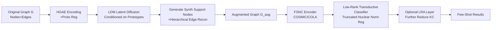

# Low-Rank Few-Shot Node Classification by Node-Level Graph Diffusion

**Conference**: ICLR 2026  
**OpenReview**: [https://openreview.net/forum?id=kXhh2lToaR](https://openreview.net/forum?id=kXhh2lToaR)  
**Code**: [https://github.com/Statistical-Deep-Learning/LR-FGDM](https://github.com/Statistical-Deep-Learning/LR-FGDM)  
**Area**: Graph Learning / Few-Shot Node Classification / Graph Diffusion Generation  
**Keywords**: Few-Shot Node Classification, Graph Diffusion Model, Latent Diffusion, Low-Rank Regularization, Transductive Classifier  

## TL;DR
This work utilizes a node-level graph diffusion model, FGDM, to synthesize "realistic" support set nodes and their edges for augmenting few-shot tasks. It further incorporates a low-rank transductive classifier—inspired by the Low-Frequency Property (LFP) and backed by generalization bounds—to resist diffusion noise, achieving SOTA performance in few-shot node classification.

## Background & Motivation
- **Background**: Few-Shot Node Classification (FSNC) aims to classify nodes with only $k$ labeled samples per new class. Mainstream approaches include meta-learning (ProtoNet/G-Meta/TENT) or self-supervised graph contrastive learning (COSMIC, COLA), with the latter achieving superior performance even using only unlabeled data.
- **Limitations of Prior Work**: Existing methods are constrained by the **limited size of the support set**. Augmentations like mix-up or random perturbations provide only marginal gains and often fail to generate faithful graph structures by merely "borrowing neighbors from real nodes." Conversely, while diffusion models are powerful, they predominantly focus on **graph-level generation** and lack support for node/edge-level structured synthesis. Traditional GANs for node augmentation suffer from training instability and distribution mismatch.
- **Key Challenge**: (1) While diffusion models can supplement the support set, the diffusion process is **inherently noisy**—Figure 1 shows that accuracy drops sharply when synthetic nodes exceed $3|V_{sup}|$. (2) Although conditional generation is desirable, test classes in FSNC are **disjoint** from training classes. Using class labels as conditions (like in DoG) is impossible during testing without labels, and using pseudo-labels leads to semantic drift.
- **Goal**: To develop a graph diffusion generator capable of faithfully synthesizing "support nodes + edges" at the node level, alongside a few-shot classifier robust to generation noise with theoretical guarantees.
- **Core Idea**: **Dual focus on generation and denoising**—utilize **FGDM** (Hierarchical Graph Autoencoder HGAE + Latent Diffusion LDM, conditioned on **prototypes** rather than class labels) for synthetic augmentation; then employ a **Low-Rank Transductive Classifier** (Truncated Nuclear Norm regularization) to retain only the low-frequency/low-rank components of node representations, filtering out high-rank noise introduced by diffusion. This is supported by a proof showing "reduced kernel complexity $\Rightarrow$ tighter test loss upper bound."

## Method

### Overall Architecture
LR-FGDM is a **plug-and-play module** designed to wrap around existing FSNC methods (e.g., COSMIC, COLA). It follows a three-step process: training FGDM on the original graph (HGAE for latent space + LDM for generation), generating synthetic support nodes and edges to create an augmented graph, and finally training a low-rank transductive classifier on the augmented support set.

### Key Designs

**1. Hierarchical Graph Autoencoder (HGAE): Compressing nodes and edges into a semantic latent space.** To ensure LDM learns the "true joint distribution of features and structure," a high-quality latent space is required. HGAE first encodes node attributes via an MLP as $f(X_i)$, then adds positional embeddings to neighbors $X'_j = X_j + \mathrm{pos}(j)$ and aggregates them into $Z'_i$ via two GAT layers. The final latent representation $Z_i = f'(Z'_i \| f(X_i))$ is produced via projection. Critically, a **prototypical regularization** $L_{proto} = \sum_i \|Z_i - p_{\pi(i)}\|^2$ is added, where $p_{\pi(i)}$ is the prototype of the cluster node $v_i$ belongs to (derived from semi-supervised K-means). This forces nodes within the same cluster to converge toward a shared prototype, creating a latent space with clear intra-class compactness and inter-class separability—the foundation for prototype-based conditioning.

**2. Hierarchical Edge Reconstruction: Bypassing the quadratic complexity of GAE.** Standard GAE edge reconstruction involves an $O(N'^2)$ adjacency matrix, which is infeasible for whole graphs. Ours adopts a **two-level decoding** strategy: an MLP first reconstructs the **inter-cluster neighbor graph** $\hat{C}_i$ ($C_{ik}=1$ if $v_i$ connects to cluster $k$), followed by decoding the **intra-cluster neighbor graph** $\hat{M}_{ik} = g'(Z_i \| g(k))$ using cluster condition embeddings $g(k)$ via Classifier-Free Guidance. Since nodes sharing a prototype are similar and naturally tend to connect, this "cluster-first, specific-neighbor-second" decoding is both efficient and structurally sound. The total HGAE loss is:
$$L_{HGAE} = \underbrace{\|X-\hat{X}\|_2^2}_{\text{Node Recon}} + \underbrace{\|C-\hat{C}\|_2^2 + \|M-\hat{M}\|_2^2}_{\text{Hierarchical Edge Recon}} + L_{proto}$$

**3. Latent Diffusion (LDM) Conditioned on Prototypes: Solving the "unseen test labels" deadlock.** Traditional class-conditioned diffusion models rely on labels, but FSNC test classes are unseen during training. Ours resolves this by directly using **prototype representations** (cluster means in latent space) as continuous, semantically meaningful condition signals within the CFG framework. During generation, the cluster labels of support nodes are taken to obtain corresponding prototypes, which guide the generation of synthetic nodes $X_{syn}$ and edges $A_{syn}$. These are integrated into the original graph to form the augmented adjacency $A_{aug} = \begin{bmatrix} A & A_{syn} \\ A_{syn}^\top & 0 \end{bmatrix}$. This enables conditional generation without ever accessing class labels.

**4. Low-Rank Transductive Classifier: Clipping diffusion noise via LFP.** Diffusion is a stochastic process, often producing nodes with semantic noise. Based on the **Low-Frequency Property (LFP)** observation—where ground-truth label projections concentrate on the **top eigenvectors** of the feature Gram matrix $K = H_{FS}H_{FS}^\top/N$—this work adds a **truncated nuclear norm** $\|K\|_{r_0} = \sum_{i=r_0+1}^N \hat{\lambda}_i$ as a low-rank regularizer:
$$\min_W \frac{1}{m}\sum_{i:v'_i\in V_L} \mathrm{KL}(y_i, [\mathrm{softmax}(H_{FS}W)]_i) + \tau\|K\|_{r_0}$$
This forces the classifier to utilize only the low-rank (low-frequency) components of representations, discarding high-rank noise. Theorem A.1 proves this is equivalent to **reducing Kernel Complexity (KC)**, thereby tightening the test loss upper bound.

**5. LRA Layer: Further compressing kernel complexity with low-rank self-attention.** Inspired by the theorem, an **LR-Attention layer** is added: $F = BH_{FS}$, where the attention matrix $B = K/\hat{\lambda}_1$. Since $d=256 \ll N$, $B$ is naturally low-rank. $BH_{FS} = H_{FS}H_{FS}^\top H_{FS}/\hat{\lambda}_1$ can be computed by first calculating the $d \times d$ matrix $H_{FS}^\top H_{FS}$, achieving $O(Nd^2)$ complexity. The Gram matrix of the new representation $K_F = K^3/\hat{\lambda}_1^2$ ensures eigenvalues $\lambda_i = \hat{\lambda}_i^3/\hat{\lambda}_1^2 \le \hat{\lambda}_i$, guaranteeing that KC does not increase. Training a matching low-rank classifier on $F$ results in **LRA-LR-FGDM**, which consistently outperforms the standard version.

## Key Experimental Results

### Main Results
Evaluation across 8 datasets (CoraFull, ogbn-arxiv, etc.) using COSMIC and COLA as backbones. Results shown for 5-way 5-shot:

| Method | CoraFull | ogbn-arxiv | Coauthor-CS | DBLP |
|------|---------|-----------|------------|------|
| STAR (Liu 2025a) | 87.31 | 66.98 | 87.60 | 87.10 |
| DoG (Wang 2025b) | 86.47 | 65.69 | 87.35 | 87.59 |
| COLA (baseline) | 87.83 | 67.52 | 87.54 | 87.23 |
| COLA (LR-FGDM) | 89.66 | 69.63 | 89.83 | 89.51 |
| **COLA (LRA-LR-FGDM)** | **90.32** | **70.22** | **90.39** | **90.07** |

LR-FGDM consistently improves COSMIC/COLA baselines across all datasets (e.g., +2.29% gain over COLA on Coauthor-CS), with LRA variants further extending the lead over SOTA and the diffusion baseline DoG.

### Ablation Study
Breakdown of COLA (LR-FGDM) components under 5-way 5-shot:

| Variant | CoraFull | ogbn-arxiv | Coauthor-CS | DBLP |
|------|---------|-----------|------------|------|
| COLA (baseline) | 87.83 | 67.52 | 87.54 | 87.23 |
| w/o Low-Rank & Proto Reg | 88.12 | 67.91 | 87.93 | 87.55 |
| w/o Low-Rank Reg | 88.74 | 68.60 | 88.72 | 88.28 |
| w/o Proto Reg | 88.79 | 68.45 | 89.02 | 88.64 |
| LR-FGDM (All) | 89.66 | 69.63 | 89.83 | 89.51 |
| LRA-LR-FGDM | 90.32 | 70.22 | 90.39 | 90.07 |

### Key Findings
- **Synthesis requires low-rank denoising**: Figure 1 demonstrates that support augmentation benefits performance only up to $q \approx 3$; beyond this, performance crashes due to diffusion noise unless low-rank regularization is applied.
- **Complementarity**: Removing either low-rank or prototypical regularization leads to performance drops, indicating that "accurate generation (prototypes)" and "stable utilization (low-rank)" are both essential.
- **Quantifiable Bound Verification**: Appendix Table 9 shows LR-FGDM results in lower KC and test loss upper bounds than non-regularized baselines, matching theoretical predictions.
- **Faithful Generation**: Metrics like Frechet Node Distance (FND) and Frechet Edge Distance (FED) confirm that synthetic components are more realistic than those from existing shot-augmentation methods.

## Highlights & Insights
- **Closed-loop "Augmentation + Denoising"**: Acknowledging that diffusion is inherently noisy, the authors use LFP/low-rank theories to actively prune noise at the classifier side, elegantly linking generative models with statistical learning theory.
- **Prototype conditioning solves the "label disjointness" trap**: Using continuous prototypes from HGAE instead of discrete labels allows the model to handle unseen test classes cleanly, a significant improvement over the pseudo-labeling used in DoG.
- **Hierarchical edge reconstruction** reduces GAE complexity from $O(N^2)$, making node-level diffusion feasible on real-world large graphs.
- **The LRA layer tightens bounds at near-zero cost**: The algebraic relation $K_F = K^3/\hat{\lambda}_1^2$ provides a simple guarantee of non-increasing KC with $O(Nd^2)$ efficiency.

## Limitations & Future Work
- **Heavy multi-stage pipeline**: The HGAE $\rightarrow$ LDM $\rightarrow$ Generation $\rightarrow$ Transductive Classifier sequence involves many hyperparameters ($q, r_0, K, \tau$) that rely on cross-validation.
- **Backbone dependency**: As a plug-in, its gains are tied to the performance of COLA/COSMIC; its effectiveness with weaker backbones remains less explored.
- **Homophily assumption**: Hierarchical clustering assumes nodes in the same cluster tend to connect, which might be challenged in strongly heterophilous graphs.
- **Generative overhead**: Despite efficiency gains, end-to-end scalability on million-node graphs still requires further testing.

## Related Work & Insights
- **FSNC**: Progresses from meta-learning (ProtoNet, G-Meta) to contrastive learning (COLA, STAR). Ours addresses the "small support set" bottleneck within the modern contrastive paradigm.
- **Graph Diffusion**: Unlike graph-level generation (GDSS, DiGress), FGDM is one of the few focusing on node-level structural synthesis for FSNC.
- **Low-Frequency & Low-Rank**: Transferring LFP and truncated nuclear norm concepts to the transductive FSNC setting provides a reusable paradigm: any scenario using synthetic data to supplement training sets should consider "low-rank denoising + generalization bounds."

## Rating
- **Novelty**: ⭐⭐⭐⭐ The combination of node-level diffusion, prototype conditioning, and low-rank denoising is novel, especially the solution to the test-label issue and the theoretical backing for LFP.
- **Experimental Thoroughness**: ⭐⭐⭐⭐ Comprehensive evaluation across 8 datasets, multiple shots, ablation studies, and theoretical metric verifications.
- **Writing Quality**: ⭐⭐⭐⭐ Clear logic chain (Motivation $\rightarrow$ Challenge $\rightarrow$ Method). Figure 1 is highly effective at illustrating the core problem.
- **Value**: ⭐⭐⭐⭐ Offers a plug-and-play module with theoretical guarantees that is relevant for both few-shot graph learning and broader generative data augmentation.

<!-- RELATED:START -->

## Related Papers

- [\[ICLR 2026\] Forest-Based Graph Learning for Semi-Supervised Node Classification](forest-based_graph_learning_for_semi-supervised_node_classification.md)
- [\[ICLR 2026\] Learning Posterior Predictive Distributions for Node Classification from Synthetic Graph Priors](learning_posterior_predictive_distributions_for_node_classification_from_synthet.md)
- [\[AAAI 2026\] Posterior Label Smoothing for Node Classification](../../AAAI2026/graph_learning/posterior_label_smoothing_for_node_classification.md)
- [\[ICLR 2026\] AdaSpec: Adaptive Spectrum for Enhanced Node Distinguishability](adaspec_adaptive_spectrum_for_enhanced_node_distinguishability.md)
- [\[ICLR 2026\] Revisiting Node Affinity Prediction in Temporal Graphs](revisting_node_affinity_prediction_in_temporal_graphs.md)

<!-- RELATED:END -->
