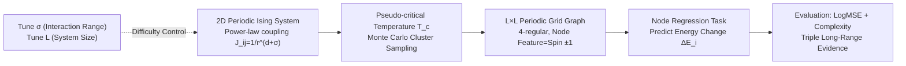

# LRIM: a Physics-Based Benchmark for Provably Evaluating Long-Range Capabilities in Graph Learning

**Conference**: ICLR 2026  
**OpenReview**: [https://openreview.net/forum?id=IAZXEX1dVV](https://openreview.net/forum?id=IAZXEX1dVV)  
**Code**: [https://github.com/iJorl/lrim_graph_benchmark](https://github.com/iJorl/lrim_graph_benchmark)  
**Area**: Graph Learning / Long-Range Dependency Benchmark / Physics-informed Modeling  
**Keywords**: Long-range dependency, Ising model, Graph Neural Networks, Graph Transformer, Message Passing, Provable benchmark  

## TL;DR
The authors construct a **provable and controllable** long-range graph learning benchmark using the well-studied long-range Ising model from statistical physics (consisting of 10 datasets, 256 to 65k nodes). The task involves predicting the energy change $\Delta E$ for each spin flip, where the ground truth mathematically necessitates interactions with distant nodes, providing a reliable metric for evaluating long-range modeling gains.

## Background & Motivation
**Background**: Graph Neural Networks (GNNs) expand their receptive fields by iteratively aggregating local neighbor information. However, many real-world tasks (e.g., protein folding, mRNA splicing, molecular properties) depend on interactions between distant nodes, known as long-range dependencies. To evaluate these capabilities, the community developed benchmarks such as LRGB (Long-Range Graph Benchmark).

**Limitations of Prior Work**: Existing long-range benchmarks fall into two problematic categories: (1) Real-world datasets (e.g., LRGB peptide classification/regression) where the ground-truth mapping function is unknown, making it **impossible to guarantee that the task actually requires long-range information**. Recent work (Tönshoff et al.) found that classic GNNs can match Graph Transformers on LRGB with proper tuning, challenging previous claims of Transformer superiority. (2) Synthetic datasets (e.g., copying distant info, predicting connectivity) which often provide **binary feedback signals**, lacking fine-grained differentiation as models either solve them perfectly or fail completely.

**Key Challenge**: To evaluate long-range capability, it is essential to quantify how much information is required from specific distances. Since ground-truth mappings in machine learning are typically unknown, the "long-range" nature of tasks remains unproven, leaving improvements built on shaky foundations.

**Goal**: To create a benchmark where the ground truth is **provably dependent on long-range information**, where the degree of long-range dependency is **precisely controllable** via physical parameters, and where the feedback signal is **continuous and differentiable**.

**Core Idea**: **[Leveraging Physics]** The authors adopt the Ising model from statistical physics, where the energy function is explicitly defined by power-law interactions $J_{ij}=1/r_{ij}^{d+\sigma}$. The exponent $\sigma$ serves as a continuous "knob" to control the interaction range. By setting the task as a node-level regression to predict the energy change $\Delta E$ of a spin flip, the ground truth naturally depends on distant spins. This range is both **provable** (via oracle decay curves, error lower bounds, and range metrics) and **controllable** (via $\sigma$ and system size $L$).

## Method

### Overall Architecture
The benchmark translates a $L\times L$ 2D periodic grid Ising system into a graph: each grid point is a node connected to its 4 nearest neighbors (a 4-regular grid graph). The node feature is the spin $s_i\in\{-1,+1\}$, and the task is to predict the energy change $\Delta E_i\in\mathbb{R}$ upon flipping that spin. While the graph topology is purely local, the ground truth of $\Delta E$ is coupled to all spins via the power-law potential $J_{ij}$, forcing the model to learn to aggregate information from distant nodes. Data is sampled via Monte Carlo (Wolff cluster variant) at the **pseudo-critical temperature** to ensure long-range correlations across all scales.

### Key Designs

**1. Power-law Ising Hamiltonian: Embedding "Long-range" into Ground Truth**. The system energy is defined as $H(\{s_i\})=-\tfrac12\sum_{ij}J_{ij}s_is_j$, where $J_{ij}=1/r_{ij}^{d+\sigma}$ decays with distance $r_{ij}$. The exponent $\sigma$ controls the range: for $\sigma < 1$, the system is in the mean-field regime with correlations across all scales; for $1 < \sigma < \sigma_\times$, the critical exponent $\eta=2-\sigma$ varies continuously; for large $\sigma$, it degrades to a short-range model. The paper uses $\sigma=0.6$ for "hard" and $\sigma=1.5$ for "easy" tasks. Using $\Delta E$ as the target is significant because its calculation is the core bottleneck in physical simulations, making the task practically relevant.

**2. Pseudo-critical Temperature Sampling: Generating Multi-scale Correlated Samples**. A long-range energy function alone is insufficient; the input spin configurations must also be informative. Samples are drawn at the **pseudo-critical temperature** $T_c(\sigma,L)$, where correlation lengths are maximal and spin clusters are fractal. At this phase transition point, the correlation function $C(r) \sim r^{-\eta}$ decays algebraically, ensuring spins are non-trivially correlated at all distances. This ensures inputs are "hard" with large-scale spatial structures rather than random noise.

**3. Triple Long-Range Evidence: Provability from Empirical, Theoretical, and Metric Perspectives**. (a) **Oracle Decay Curves**: An oracle with the true energy function but restricted to a $r$-hop neighborhood shows **smoothly decreasing** LogMSE as $r$ increases. Smaller $\sigma$ and larger $L$ require larger $r$ for the same accuracy. (b) **Worst-case Error Lower Bound** (Lemma 5.1): Mathematically proves that any model $f_\theta$ restricted to a radius $r \ll D$ must have an unavoidable error proportional to $n^{-\sigma}$. (c) **Range Metrics** (Prop 5.2/5.3): Using the range measure $\rho_u(F)$ from Bamberger et al., the authors derive an analytical expression showing it **diverges** as $L \to \infty$ for $\sigma \le 1$, confirming controllable long-range dependency.

**4. Evaluation Protocol for Computational Complexity**. Long-range improvements often come at the cost of high compute (e.g., $O(L \cdot N^2)$ for global attention). The benchmark requires reporting runtime complexity and preprocessing overhead alongside $\log_{10}$ MSE (LogMSE). This highlights the trade-off between accuracy and scalability.

## Key Experimental Results

### Main Results Table (LRIM-16/32, 3 runs, LogMSE↓)

| Model | Preprocessing | Complexity | 16-hard | 32-hard | 16-easy | 32-easy |
|---|---|---|---|---|---|---|
| GIN | - | $O(L\cdot E)$ | -2.533 | -2.249 | -3.564 | -3.446 |
| GatedGCN | - | $O(L\cdot E)$ | -3.844 | -4.087 | -4.817 | -4.940 |
| GatedGCN-VNG | $O(N)$ | $O(L\cdot E+L\cdot N)$ | -4.068 | -3.243 | -4.612 | -4.322 |
| GPS-Base | - | $O(L\cdot N^2)$ | -4.211 | -4.044 | -5.296 | -5.134 |
| GPS-RWSE | $O(k\cdot N^2)$ | $O(L\cdot N^2)$ | -4.011 | -4.134 | -5.133 | -5.103 |
| GPS-LapPE | $O(k^2\cdot E)$ | $O(L\cdot N^2)$ | -4.334 | -4.032 | -5.154 | -4.858 |

Key observations: (1) Clear separation between easy and hard tasks validates the $\sigma$ control. (2) Efficiency-focused MPNNs (GIN/GatedGCN) generally underperform compared to quadratic-complexity Graph Transformers (GPS). (3) All models fall short of the global oracle's precision.

### Extrapolation Experiment (Trained on LRIM-16-hard, Zero-shot to larger systems, LogMSE↓)

| Model | 16-hard | 32-hard | 64-hard | 128-hard | 256-hard |
|---|---|---|---|---|---|
| GIN | -2.406 | -1.043 | -0.774 | -0.703 | -0.903 |
| GatedGCN | -3.919 | -1.050 | -0.781 | -0.708 | -0.952 |
| GPS Series | … | … | … | … | **OOM** |

Accuracy drops as system size increases. MPNNs saturate quickly, while vanilla global-attention GPS models encounter Out-of-Memory (OOM) on LRIM-256 (requiring ~160GB VRAM even with batch=1).

### Key Findings
- **Local Information is Insufficient**: Oracle performance degrades smoothly with restricted neighborhood radius $r$, proving that low error requires covering a large portion of the graph.
- **Bi-dimensional Difficulty Control**: Reducing $\sigma$ or increasing $L$ precisely adjusts the long-range dependency and task difficulty.
- **Current Models are Sub-optimal**: Both MPNNs and Graph Transformers are far from the oracle upper bound. Scalable (linear complexity) methods perform significantly worse, indicating that balancing range and scalability remains an open challenge.

## Highlights & Insights
- **Physics as a Yardstick**: By using the Ising model as a ground-truth generator, the benchmark transforms "perceived" long-range dependency into a mathematically provable and physically tunable property.
- **Continuous Feedback Signals**: Unlike existing binary synthetic tasks, $\Delta E$ and oracle decay curves provide continuous signals, allowing for fine-grained model ranking and gradient-rich supervision.
- **Triple Evidence Loop**: The convergence of empirical (oracle), theoretical (lower bounds), and metric (range measure) evidence ensures a rigorous foundation for the benchmark.
- **Complexity Accountability**: Including computational complexity in the protocol discourages "score chasing" through excessive resource consumption and encourages scalable long-range architectures.

## Limitations & Future Work
- **Synthetic vs. Real-world**: While the Ising model is physically significant, the generalization of performance on LRIM to real protein or molecular tasks requires further verification.
- **Homogeneous Topology**: The current benchmark focuses on 2D periodic grids. Future iterations could include heterogeneous topologies, irregular graphs, or dynamic structures.
- **Baseline Scope**: While representative models are tested, many newer scalable architectures (State Space Models, Graph Sampling, Sparse Attention) have yet to be systematically evaluated.

## Related Work & Insights
- **LRGB Benchmark** (Dwivedi et al.): Established the need for large-graph tasks but cannot guarantee long-range necessity (as revealed by subsequent failure to distinguish MPNNs from Transformers).
- **Synthetic Tasks** (Copy/Retrieve, Diameter prediction): Provide steps toward provability but often rely on binary signals with low discriminative power.
- **Over-squashing & Bottlenecks**: Theories by Alon & Yahav and others explain why local message passing fails to scale, justifying LRIM's choice of grid topology to challenge models.
- **Range Metrics** (Bamberger et al.): This work adopts and derives analytical range measures for the Ising model to provide theoretical grounding.

## Rating
- **Novelty**: ⭐⭐⭐⭐⭐ — Successfully addresses provability, controllability, and continuous feedback in one framework using statistical physics.
- **Experimental Thoroughness**: ⭐⭐⭐⭐ — 10 datasets across sizes up to 65k nodes; robust triple evidence. Baseline diversity could be broader for large systems.
- **Writing Quality**: ⭐⭐⭐⭐ — Logical and well-structured, though the physics background may pose a slight barrier for some readers.
- **Value**: ⭐⭐⭐⭐⭐ — Provides a highly credible "measuring stick" for the long-range graph learning community, likely to influence method evaluation significantly.

<!-- RELATED:START -->

## Related Papers

- [\[ICLR 2026\] Towards Quantifying Long-Range Interactions in Graph Machine Learning: A Large Graph Dataset and a Measurement](towards_quantifying_long-range_interactions_in_graph_machine_learning_a_large_gr.md)
- [\[ICLR 2026\] Improving Long-Range Interactions in Graph Neural Simulators via Hamiltonian Dynamics](improving_long-range_interactions_in_graph_neural_simulators_via_hamiltonian_dyn.md)
- [\[ICML 2025\] On Measuring Long-Range Interactions in Graph Neural Networks](../../ICML2025/graph_learning/on_measuring_long-range_interactions_in_graph_neural_networks.md)
- [\[ICLR 2026\] GDGB: A Benchmark for Generative Dynamic Text-Attributed Graph Learning](gdgb_a_benchmark_for_generative_dynamic_text-attributed_graph_learning.md)
- [\[NeurIPS 2025\] Sketch-Augmented Features Improve Learning Long-Range Dependencies in Graph Neural Networks](../../NeurIPS2025/graph_learning/sketch-augmented_features_improve_learning_long-range_dependencies_in_graph_neur.md)

<!-- RELATED:END -->
