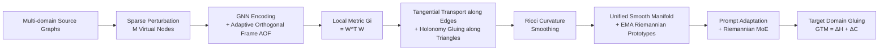

# Multi-Domain Riemannian Graph Gluing for Building Graph Foundation Models

**Conference**: ICLR 2026  
**OpenReview**: [https://openreview.net/forum?id=G3uNHQpP7J](https://openreview.net/forum?id=G3uNHQpP7J)  
**Code**: [https://github.com/RiemannGraph/GraphGlue](https://github.com/RiemannGraph/GraphGlue)  
**Area**: Graph Foundation Model / Riemannian Geometry Representation Learning / Multi-domain Graph Pre-training  
**Keywords**: Graph Foundation Model, Multi-domain Pre-training, Riemannian Manifold, Manifold Gluing, Holonomy, Transferability  

## TL;DR
This paper reconstructs multi-domain graph pre-training from the perspective of "manifold gluing" in differential geometry: it fuses arbitrary graph datasets onto a unified and smooth Riemannian manifold. This provides the first rigorous theoretical characterization of "how knowledge is integrated and transferred across domains" and leads to the GRAPHGLUE framework, which features quantifiable transfer difficulty and geometric scaling laws.

## Background & Motivation
**Background**: Graph Foundation Models (GFMs) aim to replicate the "multi-domain pre-training + downstream transfer" success seen in NLP/CV. One class of methods utilizes LLMs to extract textual semantics, but these are restricted to text-attributed graphs. Another class targets text-free graphs, learning shared or invariant knowledge through graph codebooks, motifs, or computation trees, and then performing downstream adaptation using domain tokens or in-context learning.

**Limitations of Prior Work**: Despite their effectiveness, these solutions consistently avoid a fundamental question—**how is knowledge actually integrated and transferred across domains**? Existing cross-domain similarity metrics (e.g., GFT, Ruiz, etc.) do not place "pre-training" and "domain adaptation" within a single consistent framework, making it impossible to evaluate transfer difficulty and leaving the model helpless when faced with unseen graphs.

**Key Challenge**: The semantic heterogeneity between multiple domains is high (e.g., social networks vs. biomolecules). They lack a unified mathematical structure capable of simultaneously carrying "integration" and "transfer," making transferability neither interpretable nor quantifiable.

**Goal**: Establish a consistent theoretical framework for both pre-training and adaptation that can explain the mechanism of knowledge integration/transfer and provide a quantifiable, interpretable measure of transfer difficulty.

**Key Insight** (**Manifold Gluing**): Characterize the local geometry of each graph as a small Riemannian manifold patch, and then, similar to "gluing atlases" in topology, **glue** these local patches into a unified, smooth global Riemannian manifold along edges and triangles. On this unified manifold, different domains occupy different locations; knowledge transfer then becomes "transport along the manifold," and transfer difficulty is naturally measured by geometric deformation.

## Method

### Overall Architecture
GRAPHGLUE is a "pre-training–adaptation" framework. In the pre-training phase, it first uses sparse perturbation and an Adaptive Orthogonal Frame to learn the **local geometry** of each node. Then, it glues local patches via tangential transport along edges and triangular holonomy, smoothing the manifold using Ricci curvature, and implements large-scale pre-training with EMA Riemannian prototypes. In the adaptation phase, it uses learnable prompts and Riemannian Mixture-of-Experts (RMoE) to "glue" the target domain onto the pre-trained manifold, ensuring geometric consistency and naturally deriving the Geometric Transfer Metric (GTM) from metric compatibility.

### Key Designs

**1. Adaptive Orthogonal Frame (AOF): Creating "Local Tangent Spaces" with Deep Learning**. The local geometry at each point on a manifold is determined by its tangent space, but the traditional Cartan moving frame method lacks a deep learning implementation. This paper defines $(k, M)$-sparse perturbation: $M$ virtual perturbation nodes $P=\{p_m\}$ are added to the graph, and each virtual node is connected to the top-$k$ real nodes via attention $h(x_i, p_m)$. This mimics the directional derivative $D_v f=\lim_{t\to 0}\frac{f(p+tv)-f(p)}{t}$ to generate a set of tangent vectors. Following GNN encoding and QR decomposition, the lengths are restored to obtain an orthogonal frame $\{w_m\}$ and its dual frame $\{\theta_m\}$. The paper proves that length restoration is critical—the tangent vector length is constrained by the perturbation upper bound $\|w_m^p\|\le(1+\varepsilon)\|P\|$. The angles and lengths of the frame reflect the degree to which space is "twisted" and "stretched," respectively. Finally, the local metric at each point is written in diagonal form $G_i=W^{(i)\top}W^{(i)}=\mathrm{diag}(\|w_1\|^2,\dots,\|w_M\|^2)$, grounding "geometry" as a differentiable tensor.

**2. Gluing along Edges and Triangles: Assembling Isolated Patches into a Continuous Whole**. After obtaining $N$ isolated local patches $\{M^{(i)}\}$, they must be assembled into a unified manifold with a global metric. The method first performs **tangential transport along edges**: $P^{(i,j)}=G_j^{-1/2}\big(G_j^{1/2}G_iG_j^{1/2}\big)^{1/2}G_j^{-1/2}$. This is proven to be the optimal solution for $\min_P\|P^\top G_jP-G_i\|_F^2$, constituting an isometry between boundaries. This ensures **metric compatibility** along edges and induces a unique global metric (Thm 4.5, 4.6), with complexity reduced to $O(M)$ via QR decomposition. However, traversing triangles or loops generates offsets, making the manifold connected but not everywhere continuous. To address this, **holonomy** is introduced: the composition of transport maps along a closed curve $C$ is $H(C)=\prod_\ell P^{(i_\ell,i_{\ell+1})}$. When this equals the identity map, the offset vanishes. The corresponding holonomy loss $L_{holo}=\frac{1}{|A|}\sum_{A_{ijk}}\|P^{(k,i)}P^{(j,k)}P^{(i,j)}-I\|_F^2$ penalizes triangular offsets. Thm 4.8 proves that if every edge belongs to a triangle and all triangular holonomies are trivial, then all loop holonomies are trivial—extending "piecewise straightening" to "global $C^1$ continuity."

**3. Ricci Curvature Smoothing & Geometric Scaling Law: From $C^1$ Continuity to $C^2$ Smoothness**. $C^1$ continuity is insufficient; "folds" hindering knowledge transport must be eliminated via $C^2$ smoothness, achieved by controlling Ricci curvature. Since directly computing Ricci curvature is too expensive, the paper uses the **volume change ratio** $r(z^{(i)},z^{(j)})=\frac{\det G_i}{\det G_j}\approx 1-\frac{1}{3}\mathrm{Ric}(\dot\gamma)$ (Thm 4.9) between two adjacent points to estimate the curvature sign. A log-volume density scalar field $g_i=\frac{1}{2}\log\det G_i$ is defined, and the graph Dirichlet energy $\|L^k g\|^2$ is used to characterize $k$-th order smoothness, leading to the curvature loss $L_{Curv}=\frac{1}{|A|}\sum_{A_{ijk}}|\log r_{ij}-\log r_{jk}|^2$. As the dataset scale increases and the manifold approaches an ideal smooth state, the paper derives a **geometric scaling law**: more graph data leads to a smoother manifold and stronger model transferability (empirically verified in Sec 6.2).

**4. EMA Riemannian Prototypes & Quantifiable Transfer Metric (GTM)**. In pre-training, each graph is assigned a Riemannian prototype $(z_{S_k},\log G_{S_k})$ (global position + log-mean of metrics), updated in batches via EMA. Since metric matrices belong to the symmetric positive definite (SPD) manifold, the update is performed using the matrix logarithm $\log G_{S_k}\leftarrow\beta\log G_{S_k}+(1-\beta)\frac{1}{|B_k|}\sum_{G\in B_k}\log G(z_G)$. This handles large graphs efficiently and separates domain semantics on the manifold via sample-prototype contrastive loss $L_{proto}$. In adaptation, a prompt matrix $Q$ adjusts coordinates $z_{adapt}=Qz^T$ and metrics $G_{adapt}=\mathrm{diag}(\|Qw_1^T\|^2,\dots)$, and target samples are connected to $k$-nearest prototypes to form a transfer graph $G_0$. Gluing is completed by applying $L_{holo}(G_0)+L_{curv}(G_0)$, and a Riemannian MoE treats each prototype as an expert for weighted fusion. Transfer difficulty is naturally given by **GTM** $= \Delta H + \Delta C$: $\Delta H = L_{holo}(G_0)$ measures the "twist" introduced by the target, and $\Delta C = L_{curv}(G_0)$ measures "bending/abrupt volume changes." A low GTM indicates the target can integrate into the manifold with almost no deformation (high transferability), while a high GTM indicates the target is geometrically "incompatible."

## Key Experimental Results

### Main Results
Cross-domain transfer (5 source, 1 target) across 6 representative domains under few-shot (1/5-shot) fine-tuning settings. Mean of 10 independent runs. Node/edge classification uses ACC, and graph classification uses AUC.

| Model | Arxiv 1-shot | Arxiv 5-shot | Computers 1-shot | Computers 5-shot | Reddit 1-shot | Reddit 5-shot | FB15k 1-shot | FB15k 5-shot | PROTEINS 1-shot | PROTEINS 5-shot |
|---|---|---|---|---|---|---|---|---|---|---|
| GCN | 12.6 | 27.6 | 33.8 | 65.7 | 11.1 | 28.3 | 32.1 | 52.4 | 50.1 | 55.0 |
| GIN | 11.2 | 26.0 | 44.7 | 69.5 | 18.5 | 29.0 | 38.2 | 63.7 | 54.2 | 58.8 |
| GFT | 26.5 | 36.7 | 54.6 | 69.1 | 58.8 | 66.2 | 58.0 | 79.1 | 55.4 | 62.1 |
| GCOPE | 26.5 | <u>39.1</u> | 54.5 | <u>72.2</u> | 62.7 | <u>80.4</u> | 58.2 | <u>79.3</u> | 55.1 | <u>64.8</u> |
| MDGFM | 26.0 | 32.2 | 46.6 | 64.0 | <u>64.8</u> | 76.5 | 56.1 | 77.6 | 53.4 | 57.7 |
| **GRAPHGLUE** | **28.8** | 37.0 | **59.5** | **73.2** | **67.1** | **85.0** | **59.7** | **81.5** | **59.8** | **65.3** |

> GRAPHGLUE achieves SOTA in most settings: for 1-shot, it outperforms the strongest baseline on Computers and Reddit by 4.9% and 2.3%, respectively; for 5-shot on Reddit, it reaches 85.0% ACC, exceeding the runner-up by 4.6%.

### Ablation Study
(Appendix G) Sequential removal of $L_{curv}$ and $L_{holo}$.

| Variant | Effect |
|---|---|
| Full GRAPHGLUE | Optimal |
| w/o $L_{holo}$ (No holonomy gluing) | Degradation in downstream performance |
| w/o $L_{curv}$ (No curvature smoothing) | Degradation in downstream performance |

> Conclusion: Both holonomy-based gluing and Ricci curvature-based smoothing are indispensable for downstream tasks.

### Key Findings
- **GTM effectively measures transfer difficulty**: During 2000-epoch transfer on Computers, holonomy loss vanishes quickly, and curvature loss converges as training progresses. The loss for the test task follows the same pattern. The convergence of curvature loss amplitude also predicts test loss convergence, aligned with flat minima theory (Keskar, Czarnecki).
- **Geometric scaling law holds**: When pre-training corpora are gradually expanded from Reddit to Reddit+PROTEINS to Reddit+PROTEINS+HIV by adding heterogeneous domains, more data produces a smoother manifold, resulting in improved transferability. This validates the theoretical prediction of Thm 4.11.

## Highlights & Insights
- **Elevates GFM transfer from an empirical problem to a differential geometry problem**: Manifold gluing provides the first consistent, provable mathematical framework for "knowledge integration/transfer," unifying pre-training and adaptation under the goal of "constructing/aligning the same smooth manifold."
- **One-to-one mapping between theory and operational losses**: Metric compatibility $\to$ edge tangential transport, continuity $\to$ holonomy loss, smoothing $\to$ curvature loss. Every theorem translates directly into a differentiable objective, making theory the direct driver of training.
- **Quantifiable and interpretable transfer difficulty**: GTM = Twist ($\Delta H$) + Bend ($\Delta C$). It is an intrinsic quantity derived from the model's own geometry, characterizing "integration difficulty" better than simple source-target similarity and applying even to unseen domains.
- **Geometric explanation for scaling laws**: More data makes the manifold smoother, which in turn improves transfer, grounding scaling laws in manifold curvature.

## Limitations & Future Work
- **Strong theoretical assumptions**: Thm 4.11 requires $\infty$-order log-determinant smoothness and trivial holonomy to strictly glue a smooth manifold. In practice, only approximations (2nd-order smoothness, triangular holonomy) are possible, leaving a gap between theory and implementation.
- **High computational/implementation hurdles**: It involves QR decomposition, matrix logarithm EMA, SPD manifold updates, and per-triangle holonomy/curvature losses. Engineering complexity and hyperparameter tuning ($\beta, \tau, \lambda, k, M$) are substantial.
- **Limited evaluation scale**: The study is restricted to 6 domains and few-shot (1/5-shot) settings, lacking validation on larger scales, zero-shot scenarios, or more diverse task types (e.g., regression, generation). Heterogeneous graphs are only covered in the appendix.
- **Future Directions**: Apply the manifold gluing concept to cross-modal scenarios (Graph+Text / Molecule+Protein) or explore GTM as an active data selection signal to decide "whether to transfer" or "which source domains to select."

## Related Work & Insights
- **Graph Foundation Models**: LLM-driven text-attributed graph methods, specialized GFMs for knowledge graphs/recommendations/molecules, and multi-domain pre-training for text-free graphs. Ours aligns with the "text-free + unified manifold" approach.
- **Multi-domain Graph Pre-training**: Generative (GraphMAE) / contrastive (DGI, GCC) self-supervision, alongside methods learning shared/invariant knowledge like GFT, MDGFM, and GCOPE. Ours provides the "transfer mechanism theory" missing in these works.
- **Riemannian Graph Representation Learning**: Previous work focused on specific manifolds (hyperbolic, spherical, product manifolds) for specific tasks; Sun et al. designed GNN backbones on product manifolds. This paper shifts towards "constructing a general manifold + multi-domain pre-training framework" rather than using fixed manifolds.
- **Insight**: The deep learning adaptation of the Cartan moving frame method (AOF) is a general tool that could be transferred to other scenarios requiring "differentiable geometry construction on data," such as diffusion models on manifolds or geometry-aware contrastive learning.

## Rating
- **Novelty**: ⭐⭐⭐⭐⭐ Recasts multi-domain graph pre-training as a differential geometry problem using manifold gluing + holonomy + Ricci curvature; both the perspective and theoretical construction are highly original.
- **Experimental Thoroughness**: ⭐⭐⭐⭐ Solid verification of 6-domain transfer, GTM, and the geometric scaling law. However, the number of domains, task types, and scale are somewhat limited, and zero-shot evaluation is missing.
- **Writing Quality**: ⭐⭐⭐⭐ Rigorous theoretical narrative, clear mapping between theorems and losses, and intuitive framework diagrams. However, the high mathematical density poses a steep learning curve for readers without a geometry background.
- **Value**: ⭐⭐⭐⭐⭐ Provides a firm theoretical foundation for "interpretable and quantifiable transfer" in GFMs. The geometric scaling law and GTM offer strong methodological extensibility.

<!-- RELATED:START -->

## Related Papers

- [\[ICLR 2026\] Bridging Input Feature Spaces Towards Graph Foundation Models](bridging_input_feature_spaces_towards_graph_foundation_models.md)
- [\[ICML 2026\] Are Common Substructures Transferable? Riemannian Graph Foundation Model with Neural Vector Bundles](../../ICML2026/graph_learning/are_common_substructures_transferable_riemannian_graph_foundation_model_with_neu.md)
- [\[AAAI 2026\] Adaptive Riemannian Graph Neural Networks](../../AAAI2026/graph_learning/adaptive_riemannian_graph_neural_networks.md)
- [\[ICLR 2026\] G-Merging: Graph Models Merging for Parameter-Efficient Multi-Task Knowledge Consolidation](g-merging_graph_models_merging_for_parameter-efficient_multi-task_knowledge_cons.md)
- [\[ICLR 2026\] FLOCK: A Knowledge Graph Foundation Model via Learning on Random Walks](flock_a_knowledge_graph_foundation_model_via_learning_on_random_walks.md)

<!-- RELATED:END -->
