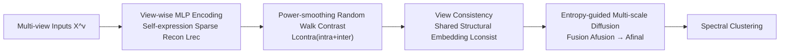

# Multi-Scale Diffusion-Guided Graph Learning with Power-Smoothing Random Walk Contrast for Multi-View Clustering

**Conference**: ICLR 2026  
**OpenReview**: [https://openreview.net/forum?id=ynT6rqo4Lp](https://openreview.net/forum?id=ynT6rqo4Lp)  
**Code**: To be confirmed  
**Area**: Graph Learning / Multi-view Clustering / Contrastive Learning  
**Keywords**: Multi-View Clustering, Graph Diffusion, Contrastive Learning, Random Walk, False Negatives  

## TL;DR
The proposed MANGO framework uses "entropy-guided multi-scale graph diffusion" to dynamically fuse similarity matrices of different step lengths, balancing local and global structures. It further employs "random walk + $\beta$ power-smoothing" to correct false negatives in contrastive learning and mitigates the contradiction between consistency and specificity through a shared structural embedding module, achieving new SOTA results across 12 datasets.

## Background & Motivation
- **Background**: Graph-based Deep Multi-View Clustering (GDMVC) has become a mainstream approach for integrating multi-source heterogeneous information and discovering latent cluster structures by explicitly modeling sample topological relationships, often combined with contrastive learning to refine the graph structure.
- **Limitations of Prior Work**: The authors summarize three long-standing technical challenges: (1) Reliance on **static graph structures**, using only local neighborhoods for similarity calculation, which fails to model global semantic associations across views, leading to information loss and distortion; (2) **False negative contamination** in contrastive learning, where semantically similar intra-class samples are mistaken as negative samples, creating a "noise-optimization" positive feedback loop via gradient backpropagation that erodes similarity quality; (3) **Contradiction between consistency and specificity**, where excessive alignment damages modality-specific features while insufficient alignment breaks cross-view semantic correspondence, ultimately blurring cluster boundaries.
- **Key Challenge**: Fixed diffusion steps cannot simultaneously capture "local details of directly connected samples" and "global semantics of distant samples," while the unsupervised setting makes it difficult to ensure negative samples are truly irrelevant. Both issues combined make contrastive signals neither global nor noise-free.
- **Goal**: To simultaneously address the issues of static graphs, false negatives, and the consistency-specificity trade-off within a unified framework, producing a more robust and semantically expressive graph structure and clustering partition.
- **Core Idea**: **Multi-scale diffusion** uses entropy as a quality metric to dynamically weight and fuse multi-step diffusion matrices; **Random walk correction + power-smoothing** reshapes the contrastive target distribution to filter false negatives; **Structure-aware view consistency** aligns semantics via shared structural embeddings while preserving view-specific discriminative features.

## Method

### Overall Architecture
MANGO consists of four modules: a self-expression module first encodes view-wise MLPs and performs sparse self-reconstruction to obtain embeddings preserving local geometry; a power-smoothing random walk contrastive module performs denoised contrastive learning on these embeddings; a view-consistency module uses shared mapping to align cross-view semantics; finally, entropy-guided multi-scale diffusion fuses the refined affinity matrices into a final graph for downstream spectral clustering. The losses of the four modules are jointly optimized.

### Key Designs

**1. Self-expression Module: Sparse reconstruction for clean embeddings.** Each view is first encoded as $Z^v = f^v(X^v)$, then a sparse coefficient matrix is used for self-reconstruction $\hat{X}^v = C^v Z^v$. $C^v$ is obtained by weighted fusion of cosine similarities between samples within each view, filtered by an adaptive threshold $b$. The objective includes reconstruction loss $L_{rec} = \frac{1}{2}\sum_v \|X^v - \hat{X}^v\|_F^2$ and a hybrid L1/L2 regularization $L_{reg} = \sum_v \lambda\|C^v\|_1 + \frac{1-\lambda}{2}\|C^v\|_F^2$. This step ensures embeddings retain both global semantics and local geometry.

**2. Random Walk Correction + Power-Smoothing Contrast: Filtering false negatives.** Traditional InfoNCE assumes all non-anchor samples are true negatives and equally important. However, intra-class samples may appear dissimilar due to cross-view heterogeneity. MANGO builds an affinity matrix $A_{ij} = \exp(-\sigma\|z_i - z_j\|^2)$ and normalizes it into a transition matrix $M_{ij} = A_{ij}/\sum_k A_{ik}$. It then calculates $t$-step transitions $M^t$ to capture higher-order structures and constructs a target distribution $T = \eta I + (1-\eta)M^t$. $T_{ij}$ serves as the negative sample weight—weights for semantic neighbors are suppressed. Furthermore, a $\beta$ power operation is applied to negative terms for non-linear smoothing, resulting in the intra-view contrastive loss:
$$L_{intra} = \frac{1}{m}\sum_p\left(-\frac{1}{n}\sum_i \log\frac{\exp(s(z_i^p,z_i^p)/\tau)}{\exp(s(z_i^p,z_i^p)/\tau)+\sum_{j\neq i}T_{ij}\exp(s(z_i^p,z_j^p)/\tau)^\beta}\right)$$
The inter-view loss $L_{inter}$ follows a similar structure but uses uniform weights $W_{ij}$. Combined with $\mu$, they form $L_{contra} = L_{intra} + \mu L_{inter}$.

**3. Structure-aware View Consistency: Aligning semantics without erasing specificity.** This module models view consistency by maximizing mutual information $I(Z^p;Z^q)$. By learning a mapping $f_{p\to q}$ such that $\hat{Z}^p = f_{p\to q}(Z^p)\approx Z^q$, the pairwise consistency loss is $L_{p\to q} = \frac{1 - d(\hat{Z}^p, Z^q)}{\tau}$, where $d$ is cosine distance. The average across all view pairs yields $L_{consist}$.

**4. Entropy-guided Multi-scale Diffusion: Autonomous scale weighting.** MANGO performs multi-step diffusion $\{\tilde{A}_0,\tilde{A}_1,\dots,\tilde{A}_t\}$ on the normalized affinity matrix $A_{norm}$ and uses entropy to measure the quality of each scale: $H(\tilde{A}_i^t) = -\sum_{j:\tilde{A}_{ij}^t>0}\tilde{A}_{ij}^t\log\tilde{A}_{ij}^t$. Lower entropy indicates a more concentrated connection distribution and clearer semantic structure. The fusion uses the reciprocal of the average entropy:
$$A_{fusion} = \sum_{t=0}^{T}\frac{1}{\bar{H}(\tilde{A}^t)}\tilde{A}^t$$
The final $A_{final}$ is symmetrical and diag-enhanced for spectral clustering. The total loss is $L = L_{reg} + \alpha L_{rec} + \beta L_{contra} + \gamma L_{consist}$.

## Key Experimental Results

### Main Results
Testing on 12 datasets (Face/Text/Scene/Object/Digits, scale 165–60,000) against 8 SOTAs (MFLVC, MSESC, CVCL, LSGMC, MVD, DIVIDE, SCM, CANDY), measured by ACC/NMI/ARI.

| Dataset | Metric | Second Best | MANGO |
|---|---|---|---|
| Yale | ACC | 0.711 (LSGMC) | **0.729** |
| ORL | ACC | 0.882 (MVD) | **0.926** |
| BBC-Sport| ACC | 0.936 (LSGMC) | **0.959** |
| Scene-15 | ARI | 0.314 (LSGMC) | **0.388** |
| ALOI-100 | ACC | 0.753 (DIVIDE) | **0.887** (+13.4%) |
| STL10 | ACC | 0.937 (SCM) | **0.960** |
| HandWritten| ACC | 0.976 (LSGMC) | **0.978** |

### Ablation Study
Ablation on MSRC-v1 / Reuters (√ indicates enabled; random=False Negative Correction, diffusion=Adaptive Diffusion):

| Config | Lcontra | Lconsist | random | diffusion | MSRC-v1 ACC | Reuters ACC |
|---|---|---|---|---|---|---|
| (a) Lrec only | | | | | 0.770 | 0.502 |
| (c) | √ | √ | | | 0.800 | 0.535 |
| (d) | √ | √ | √ | | 0.893 | 0.507 |
| (h) Full | √ | √ | √ | √ | **0.950** | **0.587** |

### Key Findings
- The full model significantly outperforms all variants; random walk correction and diffusion modules both contribute substantial gains.
- MANGO outperforms contrastive learning algorithms like CANDY/DIVIDE/SCM in most scenarios, validating that power-smoothing random walk contrast improves representation quality.
- While shallow methods (LSGMC, MVD) perform well on small datasets but may suffer from OOM on large ones, MANGO consistently leads across both small and large datasets.

## Highlights & Insights
- Using the reciprocal of entropy for scale weighting is a simple yet effective insight: quantifying whether the connection distribution is concentrated as a differentiable quality signal allows the model to determine the contribution of each diffusion step automatically.
- Transforming the false negative problem into weight recalibration on the transition matrix: $T_{ij}$ serves as both a semantic proximity measure and a negative sample weight, which is smoother than hard deletion.
- The three components precisely address the three pain points identified in the introduction, creating a robust methodological loop.

## Limitations & Future Work
- Hyperparameter tuning costs are non-trivial, with $\alpha, \beta, \gamma$ spanning three orders of magnitude (1e3–1e6).
- Multi-step diffusion combined with $t$-step random walks involves repeated matrix multiplications; scalability for ultra-large datasets relies on top-K truncation.
- False negative correction depends on the quality of initial embeddings; if early embeddings are poor, the model might "propagate errors."

## Related Work & Insights
- MANGO integrates both joint (self-expression + contrastive) and alignment (view consistency) routes.
- It shares lineage with CVCL and works highlighting negative sample bias (e.g., Trosten et al.), but MANGO uses random walks to explicitly model high-order manifolds for correction rather than variational mutual information.
- The entropy-guided multi-scale fusion is a portable, lightweight component applicable to other graph tasks requiring balance between local and global semantics.

## Rating
- **Novelty**: ⭐⭐⭐⭐ Although components like graph diffusion and random walk are not entirely new, the combination of "entropy-guided multi-scale fusion" and "power-smoothing random walk contrast" is well-integrated.
- **Experimental Thoroughness**: ⭐⭐⭐⭐ Covers 12 datasets and 8 SOTAs with comprehensive ablation and sensitivity analysis.
- **Writing Quality**: ⭐⭐⭐⭐ Pain points, methods, and results are clearly aligned.
- **Value**: ⭐⭐⭐⭐ Sets a new SOTA for multi-view clustering with transferable components for denoising contrastive learning.

<!-- RELATED:START -->

## Related Papers

- [\[ICLR 2026\] Dual-Branch Representations with Dynamic Gated Fusion and Triple-Granularity Alignment for Deep Multi-View Clustering](dual-branch_representations_with_dynamic_gated_fusion_and_triple-granularity_ali.md)
- [\[ICLR 2026\] Constant Degree Matrix-Driven Incomplete Multi-View Clustering via Connectivity-Structure and Embedding Tensor Learning](constant_degree_matrix-driven_incomplete_multi-view_clustering_via_connectivity-.md)
- [\[ICLR 2026\] Confident Block Diagonal Structure-Aware Invariable Graph Completion for Incomplete Multi-view Clustering](confident_block_diagonal_structure-aware_invariable_graph_completion_for_incompl.md)
- [\[ICLR 2026\] Learning with Dual-level Noisy Correspondence for Multi-modal Entity Alignment](learning_with_dual-level_noisy_correspondence_for_multi-modal_entity_alignment.md)
- [\[ICLR 2026\] FLOCK: A Knowledge Graph Foundation Model via Learning on Random Walks](flock_a_knowledge_graph_foundation_model_via_learning_on_random_walks.md)

<!-- RELATED:END -->
