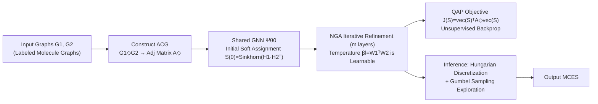

# Neural Graduated Assignment for Maximum Common Edge Subgraphs

**Conference**: ICLR 2026  
**OpenReview**: [https://openreview.net/forum?id=ZVlTIyRe35](https://openreview.net/forum?id=ZVlTIyRe35)  
**Code**: To be confirmed  
**Area**: Graph Learning / Combinatorial Optimization / Graph Matching  
**Keywords**: Maximum Common Edge Subgraph (MCES), Quadratic Assignment Problem (QAP), Graph Matching, Unsupervised Learning, Annealing Mechanism, Learnable Temperature  

## TL;DR
This paper reformulates the NP-complete Maximum Common Edge Subgraph (MCES) problem as a Quadratic Assignment Problem (QAP) on an Associated Common Graph. It introduces a "Neural Graduated Assignment" network with fully learnable high-dimensional temperature parameters to approximate the optimal solution in polynomial time without supervision, outperforming traditional search solvers in both speed and accuracy.

## Background & Motivation
**Background**: Maximum Common Edge Subgraph (MCES) is a core task in combinatorial optimization, widely used in chemistry (finding shared pharmacophores in drug discovery), biology, and cybersecurity (comparing traffic graphs to detect repeated attack patterns). It is integrated into mainstream chemoinformatics libraries like RDKit and Molassembler. Traditional solutions follow two routes—either transforming MCES into a Maximum Clique problem or using search-based Branch-and-Bound algorithms (RASCAL, McSplit).

**Limitations of Prior Work**: MCES itself is NP-complete. Transformation to Maximum Clique introduces extra computational overhead; Branch-and-Bound searches explode exponentially with graph scale. Search methods become computationally intractable for large graphs (the paper specifically selects molecules with over 30 atoms, whereas previous work often focused on small graphs within 15 nodes). In essence, "precision without scalability" is the ceiling for these methods.

**Key Challenge**: The goal is to ensure the extracted subgraph is a **valid common subgraph** (compatible node and edge labels) while efficiently approximating the optimal solution in polynomial time. However, the classical graph matching objective $\arg\min_P\|A_1-PA_2P^\top\|_F^2$ ignores label compatibility, and adding penalty terms cannot strictly guarantee the legitimacy of the solution.

**Goal**: To propose a simple, scalable, and unsupervised method (the loss function contains no ground truth MCES information) that approximates MCES in polynomial time and naturally transfers to graph similarity computation and graph retrieval tasks.

**Key Insight**: **Associated Common Graph (ACG) + Neural Graduated Assignment**. First, an "Associated Common Graph" (ACG) is constructed to encode legitimacy constraints directly into the graph structure, making MCES strictly equivalent to a QAP on the ACG. Then, the manually tuned scalar annealing temperature in traditional Graduated Assignment is replaced with **high-dimensional learnable parameterized temperatures**, allowing the model to end-to-end learn when to explore and when to converge.

## Method

### Overall Architecture
NGA follows a three-step process: (1) An Associated Common Graph $G_1\diamond G_2$ is constructed from input graphs $G_1, G_2$, transforming MCES into a QAP on its adjacency matrix $A_\diamond$; (2) A shared GNN computes an initial soft assignment matrix, followed by an $m$-layer Graduated Assignment network with learnable temperatures per layer for iterative refinement; (3) The QAP objective is used for unsupervised backpropagation during training, while inference employs Hungarian discretization + Gumbel sampling exploration to obtain the final hard assignment.

### Key Designs

**1. Associated Common Graph (ACG): Embedding legitimacy constraints into the structure so the QAP naturally counts common edges.** MCES is difficult because it must satisfy "structural correspondence" and "label compatibility" simultaneously. NGA avoids hard penalty terms by constructing an ACG $G_1\diamond G_2$: nodes are taken from the Cartesian product $V(G_1)\times V(G_2)$ keeping only compatible label pairs. Two nodes $(u_i,v_i)$ and $(u_j,v_j)$ are adjacent if and only if three conditions hold: $(u_i,u_j)\in E(G_1)$, $(v_i,v_j)\in E(G_2)$, and $\omega(u_i,u_j)=\omega(v_i,v_j)$ (consistent edge labels). Proposition 1 guarantees that any subgraph in the ACG where each $G_1/G_2$ node is selected at most once is a valid common subgraph. Finding the MCES is strictly equivalent to finding the maximum subgraph in the ACG. Using $A_\diamond$ as the affinity matrix, the clean QAP objective is $J(S)=\text{vec}(S)^\top A_\diamond\,\text{vec}(S)$, which counts the number of preserved common edges, ensuring both legitimacy and interpretability.

**2. Learnable Temperature Parameterization: Upgrading annealing schedules from "manual scalars" to "network-learned high-dimensional parameters."** Traditional Graduated Assignment relies on a preset temperature $\beta$ to sharpen the soft assignment, but fixed or manually scheduled $\beta$ requires exhaustive tuning and fails to adapt to different problem instances. NGA's core innovation is replacing scalar temperatures with a parameterized form $\beta_l=W_1^{(l)\top}W_2^{(l)}$, where $W_1^{(l)},W_2^{(l)}\in\mathbb{R}^{d\times1}$ are learnable weights for layer $l$. Each iteration propagates $\text{vec}(S^{(l)})\leftarrow A_\diamond\text{vec}(S^{(l-1)})$, sharpens via $S^{(l)}\leftarrow\exp\big((W_1^{(l)\top}W_2^{(l)})S^{(l)}\big)$, and normalizes back to a doubly stochastic matrix via Sinkhorn. Temperatures are optimized end-to-end, removing manual overhead and allowing dynamic adjustment of sharpening intensity.

**3. Negative Temperature Exploration-Exploitation: Using the sign of $\beta_l$ to automatically switch between "escaping local optima" and "converging."** The paper theoretically proves (Theorem 1) that near a local optimum $S^{(l)}$, the objective change $\Delta J=\frac{1}{2}(\sum_i\lambda_i-\sum_j\mu_j)+\beta_l\cdot\text{Var}(h)+O(|\beta_l|^2)$. When $\beta_l<0$, the variance term causes the objective to decrease, allowing the assignment to escape the current local optimum. This defines two phases: Exploration $\mathcal{E}=\{l\mid\beta_l<0\}$ and Exploitation $\mathcal{S}=\{l\mid\beta_l>0\}$. Allowing $\beta_l$ to be learnable and bipartite enables NGA to alternate between phases automatically. Proposition 2 further indicates that product parameterization $\beta_l=W_1^\top W_2$ adaptively adjusts learning rates and accelerates convergence, requiring only 2~4 layers compared to dozens in traditional GA.

**4. Gumbel Sampling Inference: Batched sampling from the assignment distribution for differential exploration.** The soft assignment $S$ is essentially a latent distribution over assignment matrices. While Hungarian selection picks the mode, better solutions may exist. NGA uses Gumbel-Sinkhorn during inference: $S^{(0)}=\text{Sinkhorn}(\hat S^{(0)}+g)$, where $g$ is sampled from a standard Gumbel distribution. This allows differentiable batch sampling of multiple assignment matrices, each discretized via Hungarian and evaluated by $A_{pred}=(\text{vec}(P)\text{vec}(P)^\top)\odot A_\diamond$ to find the one with the maximum preserved edges.

## Key Experimental Results

Datasets: AIDS, MCF-7 (TU Dataset), MOLHIV (OGB). All are molecular graphs, specifically focusing on "hard" instances with >30 atoms. 1000 graph pairs were sampled per dataset. Search/unsupervised methods were given a 60s budget per instance. Hardware: AMD EPYC 7542 CPU + single NVIDIA 3090.

### Main Results (MCES Accuracy % ↑, relative to exact solution)

| Method | AIDS | MOLHIV | MCF-7 |
|--------|------|--------|-------|
| RASCAL (Search, next-best baseline) | 90.67 | 88.74 | 90.26 |
| Mcsplit (Search) | 61.32 | 72.74 | 69.23 |
| GLSearch | 43.47 | 41.12 | 42.08 |
| NGM (Supervised) | 33.34 | 52.21 | 42.38 |
| GANN-GM (Unsupervised) | 49.76 | 72.18 | 63.47 |
| GA (Traditional GA) | 70.99 | 71.09 | 72.92 |
| Gurobi Solver | 74.52 | 78.67 | 80.76 |
| **NGA (Ours)** | **98.64** | **99.20** | **97.94** |

NGA approaches optimality (>97%) across all three datasets, outperforming the best search method RASCAL by 8~11 percentage points while being orders of magnitude faster on large graphs. Supervised methods (NGM) performed poorly, which the authors attribute to the multi-modal nature of MCES (multiple equivalent optimal solutions) making supervision signals difficult to learn.

### Graph Similarity & Retrieval

Graph Similarity (MSE $\times 10^{-3} \downarrow$): NGA achieved 1.13 / 0.66 / 0.99 on AIDS/MOLHIV/MCF-7, **one order of magnitude lower** than the next best methods (NeuroMatch is ~13.92/19.17/17.34). Graph Retrieval: Leads in all three metrics—MRR 0.844/0.806/0.803, MAP 0.974/0.951/0.966—outperforming XMCS and INFMCS which only implicitly infer MCES size.

### Ablation Study

| Setting | Phenomenon | Conclusion |
|---------|------------|------------|
| Iterations $m=0$ | Dramatic drop in accuracy | NGA's iterative process is vital |
| Iterations $m=2$ | Reaches competitive performance | Much faster than traditional GA |
| Hidden Dim $d=1$ | Degenerates to traditional GA performance | Temperature requires high-dim expression |
| Hidden Dim $d$ increases | Steady performance gain until saturation | Validates acceleration from Proposition 2 |

Final parameters set to $m=4$, $d=32$. Extra experiments on QAPLIB subsets show NGA is competitive for general QAP.

### Key Findings
- High-dimensional learnable temperature parameterization is the root cause of performance leaps: at $d=1$ it reverts to baseline GA, but increases in $d$ yield significant gains.
- Convergence with very few iterations (2~4 layers) provides NGA with a massive speed advantage over search methods on large graphs.
- Explicitly modeling the MCES solution (unlike XMCS/INFMCS which only estimate size) results in an order of magnitude lower error in similarity and retrieval tasks.

## Highlights & Insights
- **Elegant Modeling**: The ACG step embeds label and structural constraints into the graph topology. The QAP objective naturally counts valid common edges, bypassing the dilemma of using penalty terms that do not guarantee feasibility.
- **Learnable Temperature as Core**: Converting the most problematic hyperparameter $\beta$ into learned high-dimensional parameters removes manual tuning and provides adaptive learning rates and acceleration through product parameterization.
- **Strong Theoretical Foundation**: Theorem 1 and Proposition 2 provide quantitative characterizations of how negative temperatures escape local optima and how product parameterization accelerates convergence, mapping "exploration-exploitation" directly to the sign of $\beta_l$.
- **Unsupervised & Scalable**: Entirely training-free of ground truth MCES values, solving per-instance, and naturally scaling to graphs where traditional search methods fail.

## Limitations & Future Work
- Solving per-pair (train-then-infer per pair) lacks amortized inference across instances, leading to cumulative costs in massive retrieval databases.
- ACG node sets originate from $V(G_1)\times V(G_2)$; the memory overhead of the Cartesian product for dense large graphs may become a bottleneck (tested primarily on molecular graphs).
- Experiments focused on molecular graphs; generalizability to highly heterogeneous graphs like social networks or knowledge graphs remains to be fully verified.
- Theoretical analysis assumes mild conditions like gradients pushing $\beta_l$ in consistent directions; the robustness of real optimization trajectories needs more empirical validation.

## Related Work & Insights
- **MCS Solvers**: McSplit (B&B + labeling), GLSearch (GNN + DQN), and RASCAL (Max-Clique + Heuristics) represent the precise route. This paper takes an "unsupervised polynomial-time approximation" path.
- **Graph Similarity/Retrieval**: Approaches like SimGNN, GMN (Cross-graph attention), and INFMCS use embeddings or implicit similarity. This paper's explicit reconstruction of the MCES structure provides a precision advantage.
- **Graph Matching/QAP**: Inherits the tradition of Graduated Assignment and Differentiable Matching (Sinkhorn, Gumbel-Sinkhorn). The insight of "parameterizing annealing temperature" is applicable to a broader range of QAP and combinatorial optimization problems.

## Rating
- **Novelty**: ⭐⭐⭐⭐⭐ The ACG embedding constraint into topology + learnable high-dim temperature is a substantial reconstruction of classical GA, supported by solid theory.
- **Experimental Thoroughness**: ⭐⭐⭐⭐ Covers MCES, similarity, and retrieval with ablation and QAPLIB validation. Slightly limited by the focus on molecular graphs.
- **Writing Quality**: ⭐⭐⭐⭐ Clear logical chain from motivation to theory. Diagram and propositions are well-presented. High threshold for theoretical parts.
- **Value**: ⭐⭐⭐⭐⭐ Makes NP-complete MCES solvable on large graphs with near-optimal precision, directly benefiting drug discovery and chemoinformatics while offering insights for general assignment problems.

<!-- RELATED:START -->

## Related Papers

- [\[ICML 2026\] Are Common Substructures Transferable? Riemannian Graph Foundation Model with Neural Vector Bundles](../../ICML2026/graph_learning/are_common_substructures_transferable_riemannian_graph_foundation_model_with_neu.md)
- [\[AAAI 2026\] Kernelized Edge Attention: Addressing Semantic Attention Blurring in Temporal Graph Neural Networks](../../AAAI2026/graph_learning/kernelized_edge_attention_addressing_semantic_attention_blurring_in_temporal_gra.md)
- [\[ICLR 2026\] Escaping the Homophily Trap: A Threshold-free Graph Outlier Detection Framework via Clustering-guided Edge Reweighting](escaping_the_homophily_trap_a_threshold-free_graph_outlier_detection_framework_v.md)
- [\[ICML 2026\] RADE: Random Add-Drop Edge as a Regularizer](../../ICML2026/graph_learning/rade_random_add-drop_edge_as_a_regularizer.md)
- [\[ICLR 2026\] Gelato: Graph Edit Distance via Autoregressive Neural Combinatorial Optimization](gelato_graph_edit_distance_via_autoregressive_neural_combinatorial_optimization.md)

<!-- RELATED:END -->
