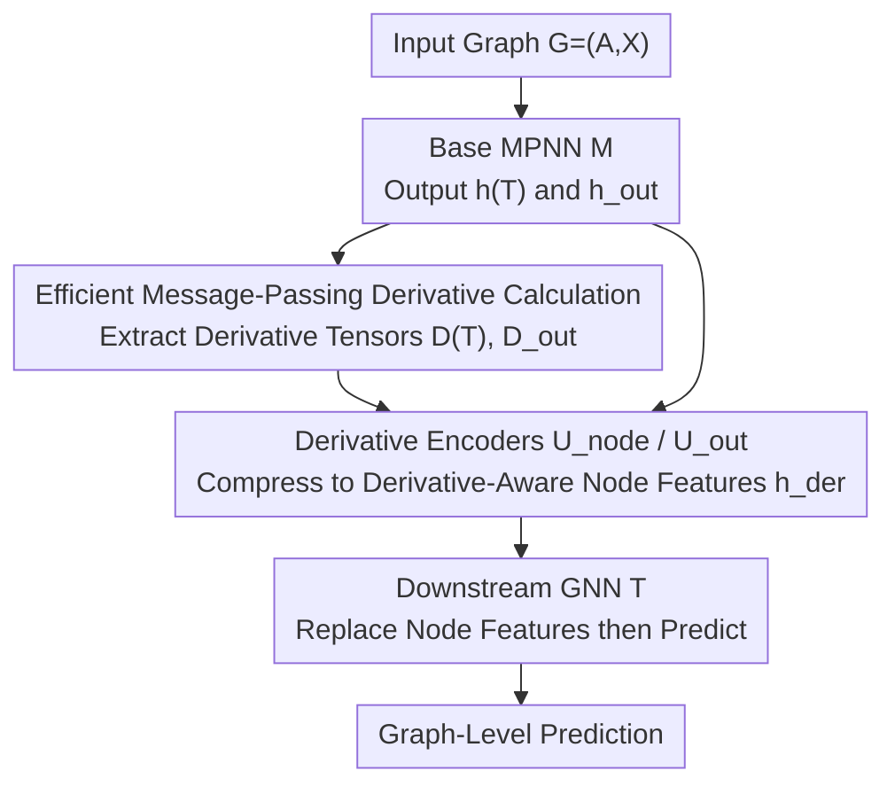

# On The Expressive Power of GNN Derivatives

**Conference**: ICLR 2026  
**OpenReview**: [https://openreview.net/forum?id=Tvat33IDmK](https://openreview.net/forum?id=Tvat33IDmK)  
**Code**: None  
**Area**: Graph Learning / GNN Expressivity Theory  
**Keywords**: GNN Expressivity, Node Derivatives, Weisfeiler-Lehman Hierarchy, Subgraph GNNs, Message Passing

## TL;DR
This paper discovers that feeding high-order derivatives of a base MPNN with respect to input node features as additional structural features into a downstream GNN strictly enhances expressivity. The proposed HOD-GNN is theoretically aligned with the WL hierarchy and shown to be depth-equivalent to subgraph GNNs and Random Walk Structural Encodings. By utilizing a differentiable message-passing-style derivative computation algorithm that exploits graph sparsity, the model consistently ranks in the top two across seven to eight graph benchmarks and scales to large graphs where traditional subgraph GNNs struggle.

## Background & Motivation

**Background**: Research on GNN expressivity and GNN derivative analysis have long existed as parallel tracks. One track focuses on "how to make GNNs stronger": since standard Message Passing Neural Networks (MPNNs) are upper-bounded by the 1-WL graph isomorphism test and fail to distinguish simple non-isomorphic graphs, numerous more expressive architectures (subgraph GNNs, high-order IGNs, etc.) have been developed and organized into the WL hierarchy. The second track studies GNN derivatives such as $\partial h_v^{(T)}/\partial X_u$ and $\partial^2 h_{\text{out}}/\partial X_v\partial X_u$, which are frequently used to analyze over-squashing, over-smoothing, and gradient-based explainability methods.

**Limitations of Prior Work**: Although derivatives are ubiquitous in analysis and clearly encode valuable structural information, they have never been utilized as a "means to enhance expressivity." Furthermore, existing high-expressivity architectures (subgraph GNNs, k-IGN) generally suffer from scalability bottlenecks—they either explicitly enumerate node subsets with $O(n^{k+1})$ spatial complexity or must rely on sampling for large graphs, which sacrifices expressivity and introduces stochastic optimization noise.

**Key Challenge**: A trade-off exists between expressivity and scalability. To increase power, one must explicitly construct high-order objects (subgraph sets, node-tuple tensors) at the cost of computational overhead that explodes with graph size. To reduce overhead, one is often forced back to MPNNs bounded by 1-WL.

**Goal**: To identify an expressivity enhancement mechanism that both breaks 1-WL and maintains efficiency by leveraging graph sparsity, while providing an exact characterization within the WL hierarchy.

**Key Insight**: The authors observe that "marking" nodes (assigning a unique identifier to a node before passing it through an MPNN) is a known technique for boosting expressivity. Marking essentially introduces a discrete perturbation $X+\epsilon e_v$ to node features. If the perturbation magnitude $\epsilon$ is made infinitesimal and a Taylor expansion is applied to the output, the expansion coefficients are precisely the various orders of derivatives. Thus, derivatives are naturally equivalent to the effects of "infinitesimal marking."

**Core Idea**: Instead of explicit discrete marking, use high-order node derivatives of a base MPNN as structure-aware node features for a downstream GNN. This gains expressivity equivalent to marking/subgraph GNNs without explicitly enumerating subgraphs.

## Method

### Overall Architecture
The core of HOD-GNN (High-Order Derivative GNN) is a four-step differentiable pipeline: first, run a base MPNN $M$ on the graph to obtain node representations $h^{(T)}$ and graph-level output $h_{\text{out}}$; simultaneously, compute the high-order derivative tensors of these quantities with respect to input node features; then, use two encoder networks $U_{\text{node}}$ and $U_{\text{out}}$ to compress the derivative tensors into "derivative-aware node features" and concatenate them with the original outputs of the base MPNN; finally, replace the graph's node features with these augmented features and pass them to a downstream GNN $T$ for the final prediction. The entire pipeline, including the derivative computation itself, is differentiable and can be trained end-to-end.

1-HOD-GNN involves derivatives with respect to a single node (e.g., $\partial^\alpha h_v^{(T)}/\partial X_u^\alpha$), while k-HOD-GNN generalizes to mixed partial derivatives with respect to $k$ different nodes. Expressivity increases with $k$ at the cost of higher computation. Here $k$ refers to the number of distinct nodes involved in the derivative, not the total order of the derivative.

### Key Designs

**1. Replacing Discrete Marking with Infinitesimal Derivatives: Theoretical Source of Expressivity Gains**

This step explains why derivatives make MPNNs stronger. The marking technique involves selecting a node $v$, modifying its features to $X+\epsilon e_v$, and passing it through an MPNN to get $h^*=M(A,X+\epsilon e_v)$, which can distinguish graphs 1-WL cannot. The authors point out that if the activation function is analytic, $M$ itself is analytic, and its output can be Taylor expanded with respect to $\epsilon$:

$$M(A,X+\epsilon e_v)\approx\sum_{i=0}^{m}\frac{\partial^i h_{\text{out}}}{\partial e_v^i}\cdot\epsilon^i$$

Essentially, by obtaining high-order derivatives of the base MPNN, one can approximate the "marked output" with arbitrary precision. Consequently, derivatives strictly extend the expressivity of MPNNs. An intuitive example: if $M(A,X)=A^3X$ (achievable by a 3-layer GCN with identity activations), the derivative of node $v$'s output with respect to its own feature is exactly $A^3_{v,v}$. Since $\sum_v A^3_{v,v}/6$ is the count of triangles in the graph—a substructure standard MPNNs cannot count—derivatives transform quantities useful in analysis directly into tools for expressivity.

**2. Derivative Tensors and Dual Encoders: Transforming Derivatives back to Node Features**

Derivatives must be organized into a format compatible with downstream GNNs. This paper defines two types of derivative tensors: the output-level $D_{\text{out}}[u,i,j,\alpha]=\partial^\alpha h_{\text{out},i}/\partial X_{u,j}^\alpha$, indexed by a single node $u$ and structured as a node feature matrix; and the node-level $D^{(t)}[v,u,i,j,\alpha]=\partial^\alpha h_{v,i}/\partial X_{u,j}^\alpha$, indexed by node pairs $(v,u)$ and structured like an adjacency matrix with pairwise features. The authors utilize two distinct encoders: $U_{\text{out}}$ is a DeepSets update that flattens $D_{\text{out}}[v,\dots]$ through an MLP; $U_{\text{node}}$ uses a 2-IGN (2nd-order Invariant Graph Network) to capture global interactions within the pairwise tensors. The final derivative-aware feature is the concatenation of three parts:

$$h^{\text{der}}_v=h_v^{(T)}\oplus U_{\text{out}}(D_{\text{out}})\oplus U_{\text{node}}(D^{(T)})$$

Interestingly, ablation studies show that setting $U_{\text{out}}=0$ has almost no impact on results, suggesting the pairwise node-level derivatives perform the heavy lifting.

**3. Message-Passing High-Order Derivative Algorithm: Differentiable and Sparse**

Naive numerical computation of high-order derivatives is neither differentiable nor scalable. This paper provides an analytical message-passing-like algorithm (using GIN as an example). Node updates in GIN are split into two phases: aggregation $\tilde h_v^{(t-1)}=(1+\epsilon)h_v^{(t-1)}+\sum_{u\in N(v)}h_u^{(t-1)}$ and a DeepSets-style update $h_v^{(t)}=\text{MLP}(\tilde h_v^{(t-1)})$. Since aggregation is a linear combination, the derivative of $\tilde h$ is the same linear combination of node derivatives: $D(\tilde h^{(t-1)})[v,\dots]=(1+\epsilon)D^{(t-1)}[v,\dots]+\sum_{u\in N(v)}D^{(t-1)}[u,\dots]$, allowing for sparse aggregation. Secondly, since the MLP acts node-wise, the Faà di Bruno formula (chain rule for high-order derivatives) is used to compute the derivative of $h^{(t)}$ from the derivative of $\tilde h$.

This algorithm offers two major advantages: first, it is fully analytical and differentiable with respect to the weights of $M$, enabling end-to-end training; second, its message-passing structure naturally exploits sparsity—the initial $D^{(0)}$ is extremely sparse (only non-zero where $v=u, \alpha=1$), and non-zero entries grow only with the number of node pairs that have exchanged messages. For shallow base MPNNs or sparse graphs, $D^{(t)}$ remains sparse, which is the root of HOD-GNN's scalability.

**4. k-HOD-GNN: Climbing the WL Hierarchy with Mixed Partial Derivatives**

Since 1-HOD-GNN has an expressivity upper bound, k-HOD-GNN introduces mixed partial derivatives $\partial^{\alpha_1+\cdots+\alpha_k}h_v/\partial X_{u_1}^{\alpha_1}\cdots\partial X_{u_k}^{\alpha_k}$, forming a k-indexed derivative tensor $D_k(h)\in\mathbb{R}^{n\times n^k\times d'\times m^k}$. The encoders are upgraded to $(k{+}1)$-IGN and $k$-IGN. This provides a tunable knob for the expressivity-complexity trade-off.

### Loss & Training
The entire model is trained end-to-end. A critical hyperparameter is the maximum derivative order $m$. Experiments show that increasing $m$ enhances expressivity until saturation, with $m\in\{2,3,4\}$ being sufficient in practice. Additionally, a modified weight initialization is used such that first-order derivatives are exactly equal to Random Walk Structural Encodings (RWSE), allowing HOD-GNN to act as a "learnable extension" of RWSE.

## Key Experimental Results

### Main Results
On ZINC and OGB molecular tasks, HOD-GNN is the only model to consistently rank within the top two across all tasks.

| Dataset | Metric | HOD-GNN | Representative Competitors |
|--------|------|---------|-----------|
| ZINC-12K | MAE ↓ | 0.0666±0.0035 | MOSE 0.062 / Subgraphormer 0.063 / GPS 0.070 |
| molbace | ROC-AUC ↑ | 82.10±1.45 | Subgraphormer 84.35 / HyMN 81.16 |
| moltox21 | ROC-AUC ↑ | 77.99±0.71 | GraphViT 78.51 / HyMN 77.82 |
| molhiv | ROC-AUC ↑ | 80.86±0.52 | HyMN 81.01 / SUN 80.03 |

On the Peptides large graph task (LRGB), while full subgraph GNNs often fail to run on standard hardware without sampling, HOD-GNN handles them directly and outperforms sampling-based versions:

| Model | Peptides-func AP ↑ | Peptides-struct MAE ↓ |
|------|-------------------|----------------------|
| HOD-GNN | 69.68±0.56 | 0.2450±0.0011 |
| HyMN (Sampling) | 68.57±0.55 | 0.2464±0.0013 |
| GraphViT | 69.19±0.85 | 0.2474±0.0016 |
| GCN+RWSE | 60.67±0.69 | 0.2574±0.0020 |

### Ablation Study

| Configuration / Experiment | Key Result | Description |
|------|---------|------|
| Triangle counting | Correctly counted | 1st order derivative with ReLU is strictly stronger than MPNN+RWSE. |
| BREC Regular Graphs (3-WL fails on 90 pairs) | 2-HOD-GNN distinguishes 34/90 | Ranks among the strongest models, verifying high-order advantages. |
| 1-HOD-GNN vs DS-GNN | Comparable performance | Consistent with the 1-HOD ≈ Subgraph GNN theory. |
| Derivative order $m$ scan | Monotonic increase then saturation | $m\in\{2,3,4\}$ is sufficient. |
| $U_{\text{out}}=0$ | Results remain largely unchanged | Pairwise node-level derivatives are the primary contributors. |

### Key Findings
- **Clear Theoretical Positioning**: Any $k$-OSAN subgraph GNN can be approximated with arbitrary precision by $k$-HOD-GNN, and $k$-HOD-GNN can be approximated by $(k+2)$-IGN. This exactly places HOD-GNN within the WL hierarchy.
- **Scalability via Sparsity**: For shallow base MPNNs ($d^T<n$), $k$-HOD-GNN has spatial complexity $O(n\cdot\min\{n^k,d^{kT}\})$ and time complexity $O(d\cdot n\cdot\min\{n^k,d^{k(T-1)}\})$, outperforming $k$-OSAN's $O(n^{k+1})$.
- **Expressivity without Overfitting**: On OGB, the training-test gap of HOD-GNN was smaller than both weaker (GCN/GIN) and stronger (DSS-GNN) baselines, signifying good generalization.

## Highlights & Insights
- **Translating Analysis Tools to Expressivity Tools**: Derivatives have traditionally been analytical quantities for studying over-squashing or explainability. This paper is the first to treat them as input features to boost expressivity—a beautiful cross-field conceptual transfer supported by the Taylor expansion/marking connection.
- **Derivatives as Infinitesimal Marking**: Discrete marking is a "finite perturbation," while derivatives are "expansion coefficients of an infinitesimal perturbation." This perspective transforms an engineering trick into a continuous, differentiable, and learnable object.
- **Reusable Message-Passing for High-Order Tensors**: Rewriting high-order derivative calculations through the Faà di Bruno formula and linear aggregation allows for sparse message-passing. This approach could be transferred to any graph-based scenario requiring high-order derivatives (e.g., second-order optimization, influence functions).

## Limitations & Future Work
- Actual efficiency depends highly on the implementation quality of sparse matrix operations.
- HOD-GNN performs well with shallow base MPNNs and small hidden dimensions, suggesting a deeper link between derivatives and over-squashing/over-smoothing that remains to be explored.
- Theoretical guarantees rely on analytic activations. While ReLU is used in practice and partially bridged by certain theorems, a complete characterization for the ReLU version is still needed. Computation for mixed derivatives ($k$) might still become unmanageable on dense large graphs if $d^T > n$.

## Related Work & Insights
- **vs Subgraph GNNs (OSAN / DS-GNN / Subgraphormer)**: These models explicitly enumerate node subsets to increase expressivity. HOD-GNN achieves equivalent expressivity ($k$-HOD ≈ $k$-OSAN) implicitly through derivatives, avoiding $O(n^{k+1})$ enumeration via sparse tensors and thus scaling to larger graphs.
- **vs Structural Encodings (RWSE / LapPE / GPSE)**: These append predefined positional/structural encodings. HOD-GNN proves that 1st-order derivatives can equal RWSE under specific initializations, making it a "learnable extension" that is strictly more powerful.
- **vs Marking GNNs**: While marking uses discrete perturbations to select nodes, HOD-GNN uses infinitesimal perturbations (derivatives) to approximate the effect in a continuous, differentiable manner.

## Rating
- Novelty: ⭐⭐⭐⭐⭐ (First to turn derivatives into expressivity tools with rigorous Taylor expansion links)
- Experimental Thoroughness: ⭐⭐⭐⭐ (Covers 7-8 real benchmarks plus synthetic checks; theoretical alignment is strong)
- Writing Quality: ⭐⭐⭐⭐ (Good balance of theory and intuition, though some details are compressed into appendices)
- Value: ⭐⭐⭐⭐⭐ (Provides a new, sparse-friendly solution for the expressivity-scalability trade-off and unifies several lines of research)

<!-- RELATED:START -->

## Related Papers

- [\[ICLR 2026\] GNN-as-Judge: Unleashing the Power of LLMs for Graph Learning with GNN Feedback](gnn-as-judge_unleashing_the_power_of_llms_for_graph_learning_with_gnn_feedback.md)
- [\[ICLR 2026\] On the Expressive Power of GNNs for Boolean Satisfiability](on_the_expressive_power_of_gnns_for_boolean_satisfiability.md)
- [\[ICLR 2026\] Exchangeability of GNN Representations with Applications to Graph Retrieval](exchangeability_of_gnn_representations_with_applications_to_graph_retrieval.md)
- [\[ICLR 2026\] AdS-GNN - a Conformally Equivariant Graph Neural Network](ads-gnn_-_a_conformally_equivariant_graph_neural_network.md)
- [\[ICLR 2026\] On the Universality and Complexity of GNN for Solving Second-order Cone Programs](on_the_universality_and_complexity_of_gnn_for_solving_second-order_cone_programs.md)

<!-- RELATED:END -->
