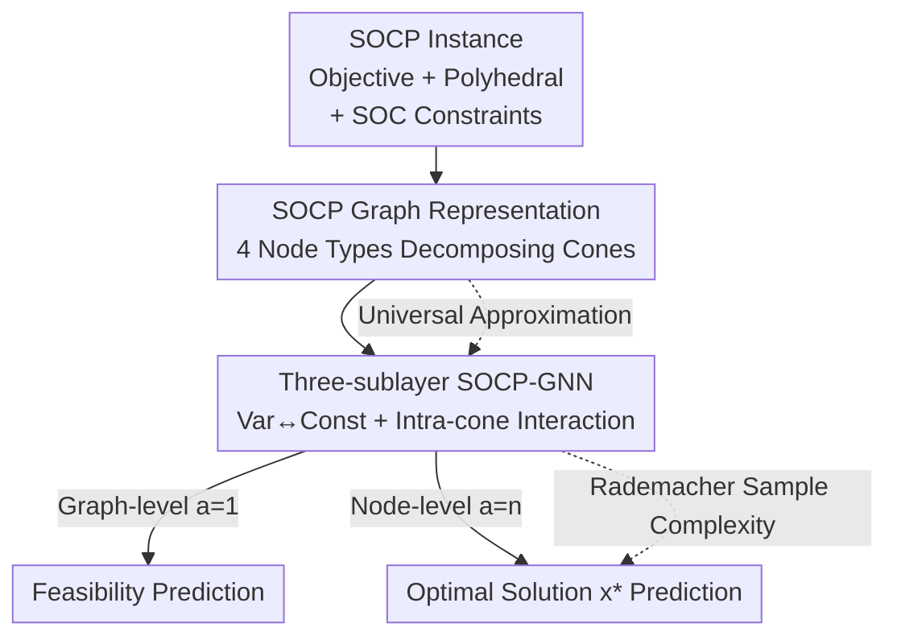

# On the Universality and Complexity of GNN for Solving Second-order Cone Programs

**Conference**: ICLR 2026  
**OpenReview**: [https://openreview.net/forum?id=wFttcDu6Fr](https://openreview.net/forum?id=wFttcDu6Fr)  
**Code**: To be confirmed  
**Area**: Graph Learning / Learning-to-Optimize  
**Keywords**: Graph Neural Networks, Second-order Cone Program, Universal Approximation, Sample Complexity, Weisfeiler-Lehman

## TL;DR
Ours designs a graph representation that decomposes nonlinear cone constraints into four types of nodes and a supporting three-sublayer message-passing GNN for Second-Order Cone Programming (SOCP). It proves universal approximation capability for SOCP feasibility and optimal solutions, and provides the first Rademacher-based sample complexity bound for WL-type L2O-GNNs. Experiments achieve higher prediction accuracy with significantly fewer parameters than fully connected networks (e.g., 0.35Mb vs. 110Mb on a 500-dimensional problem, ~300× compression).

## Background & Motivation
**Background**: Learning-to-Optimize (L2O) aims to use neural networks for fast solvers in real-time scenarios. Recently, modeling optimization problems as graphs and solving them with GNNs has proven effective—Linear Programming (LP) can be modeled as bipartite graphs of "variable nodes + constraint nodes," enabling efficient training on GPUs via parameter sharing with universal approximation guarantees. This Weisfeiler-Lehman (WL) framework was later extended to Quadratic Programming (QP) and Quadratically Constrained QP (QCQP).

**Limitations of Prior Work**: Theoretical guarantees have only reached convex quadratic constraints; more general convex problems—especially Second-Order Cone Programming (SOCP)—remain unexplored. SOCP constraints are of the form $\|A_i x + b_i\|_2 \le c_i^\top x + d_i$, which is a hybrid structure **mixing linear parts and nonlinear norms**. How to encode such constraints into a graph and how message passing should characterize the coupling between linear and norm terms are open challenges.

**Key Challenge**: A seemingly natural idea is to square both sides of the SOC constraint to transform it into a quadratic constraint, reusing QCQP work. However, the authors point out two fatal flaws: (i) the resulting coefficient matrix $A^\top A - cc^\top$ is not necessarily positive semi-definite, resulting in non-convex quadratic constraints where previous theories fail; (ii) this matrix is often dense, losing the original sparse/low-rank structure of $A$ and $c$, making graph representations and message passing inefficient.

**Goal**: Directly design a graph representation and GNN for SOCP that: (a) provides universal approximation guarantees for key properties like feasibility and optimal solutions; (b) naturally extends to $p$-order cones for any $p\ge 1$; (c) provides sample complexity analysis required for generalization.

**Key Insight**: Instead of squaring and destroying the structure, **preserve** the internal linear relationships of the cone constraints—the terms $A_i x$ and $c_i^\top x$ are individually linear, with the nonlinearity only occurring at the norm layer. Thus, decompose the left-hand side (components inside the norm) and the right-hand side (linear upper bound) into different nodes that interact linearly with variables, using extra edges to connect the two sides.

**Core Idea**: Use a "layered four-node graph representation + three-sublayer message passing" to **decompose nonlinear cone constraints into linear components** that GNNs can process efficiently, extending WL-GNN universal approximation and generalization theory to cone programming for the first time.

## Method

### Overall Architecture
The mechanism solves the following: given an SOCP instance (objective $\min_{l\le x\le r} e^\top x$, subject to polyhedral constraints $Fx\le g$ and $m$ second-order cone constraints $\|A_ix+b_i\|_2\le c_i^\top x+d_i$), predict its key properties—feasibility (graph-level scalar) or the optimal solution $x^*$ (node-level vector). The workflow is: encode the instance into an SOCP-Graph with four types of nodes $\to$ an embedding layer maps node features to latent space $\to$ stack $T$ message-passing layers (each with three sublayers) to allow information flow between variables and constraints $\to$ a readout layer aggregates results. Theoretically, the paper proves the universal approximation of this architecture and derives its sample complexity.

### Key Designs

**1. SOCP Layered Graph Representation: Decomposing Nonlinear Cones into Linear Components**

To address the pain point of "hybrid linear-norm structures," the authors avoid squaring and instead slice the cone constraint $\|A_ix+b_i\|_2\le c_i^\top x+d_i$ along its linear relationships into four types of nodes: variable nodes $V_1=\{v_j\}$ (features $(e_j,l_j,r_j)$), polyhedral constraint nodes $V_2=\{s_k\}$ (feature $g_k$), **sub-cone constraint nodes** $V_3=\{o_{il}\}$ (the $l$-th component inside the $i$-th norm, feature $b_{i,l}$), and **main-cone constraint nodes** $V_4=\{q_i\}$ (feature $d_i$, the linear upper bound). Edges use original coefficients: $v_j$–$s_k$ with weight $F_{kj}$, $v_j$–$o_{il}$ with $A_{i,lj}$, and $v_j$–$q_i$ with $c_{i,j}$. Nodes $o_{il}$ and $q_i$ are connected with weight 1 to bind the two sides of the same cone.

This decomposition ensures that variable interactions with $V_3$ and $V_4$ are linear (encoded via edge weights like LP). The only nonlinearity—the $\ell_2$ norm—is localized in the aggregation from $V_3$ to $V_4$. Compared to QCQP squaring, this preserves convexity and maintains the sparsity/low-rank structure of $A_i$ and $c_i$. Ours further notes that convex QCQP constraints can be rewritten as SOC constraints via $Q=LL^\top$ decomposition, resulting in smaller graphs when $Q$ is low-rank ($r \ll n$).

**2. Three-sublayer Message Passing: Coordinating the Two Sides of the Norm**

Standard MPNNs/GINs treat all neighbors equally, failing to distinguish between "Variable $\to$ Constraint" and "Intra-cone" interactions. This design splits each layer into **three sequential sublayers**:

- Sublayer 1 ($V_1\to V_2+V_3+V_4$): Constraint nodes collect messages from variables. Polyhedral nodes update to $h_{t+1,s}$, while cone nodes obtain intermediate states $\bar h_{t,n}$.
- Sublayer 2 ($V_3\leftrightarrow V_4$): Main-cone nodes $q$ aggregate sub-cone components $o$ to get $h_{t+1,q}$; sub-cone nodes $o$ then update using the new $q$ to get $h_{t+1,o}$. This captures the nonlinear coupling between components and the bound.
- Sublayer 3 ($V_2+V_3+V_4\to V_1$): Variable nodes $v$ aggregate messages from all updated constraints to form $h_{t+1,v}$.

Each sublayer uses learnable functions $f^t_l, g^t_l$. The memory footprint is nearly constant relative to problem scale since functions are applied per-feature.

**3. SOCP-WL Separability + Universal Approximation Theorem**

Ours adapts the classic WL test into an **SOCP-WL test** (Algorithm 1) and proves Theorem 1: if two SOCP instances $G, \hat G$ are indistinguishable by SOCP-WL, then for any target mapping $\Phi$ (feasibility or minimal $\ell_2$-norm optimal solution), $\Phi(G)=\Phi(\hat G)$ (up to permutation). Theorem 2 follows with universal approximation: for any Borel probability measure $P$, any $\Phi$, and any $\delta, \epsilon > 0$, there exists an SOCP-GNN $F$ such that $P\{\,\|F(G_{SOCP})-\Phi(G_{SOCP})\|>\delta\,\}<\epsilon$. This proof leverages the equivariance, convexity, and separability of the $\ell_2$ norm, which also extends to any $p$-order cone ($\ell_p$ norm).

**4. Rademacher-based Sample Complexity Bound: First WL-L2O Generalization Analysis**

To quantify generalization, Theorem 3 provides a bound under the assumption that the GNN is $L$-Lipschitz and parameters are bounded. For $m$ training samples and problem dimension $N$, the empirical risk minimizer $\hat h_S$ satisfies:

$$L_D(\hat h_S)-L_D(h^*)\le C_{task}\cdot B(m,N,L,r)+2p\sqrt{2\log(1/\delta)/m},$$

where the complexity term $B$ involves an integral over covering numbers related to $(4Lr_i/v)^N$. This is the first sample complexity result in the WL-L2O community, explaining why VC dimension (which is infinite for continuous SOCP parameters) is inapplicable.

### Loss & Training
Instances are solved via CVXPY/MOSEK for ground truth. Standard supervised learning is used. For optimal solutions, relative error $\|\hat x-x^*\|_2^2/\max(1,\|x^*\|_2^2)$ is evaluated. A projection method is used to explicitly control the GNN’s Lipschitz constant $L$ for theoretical verification.

## Key Experimental Results

### Main Results
Comparisons include FCNN (to test graph vs. non-graph) and vanilla MPNN/GIN (same graph, standard message passing).

| Scenario | Scale $(n,b,m)$ / Input Dim | Phenomenon |
|------|------|------|
| Synthetic SOCP (50/100/500D) | Up to 452,400 input dim | SOCP-GNN yields lowest relative error across all scales. |
| 500D Synthetic SOCP (Params) | 0.35Mb (Ours) vs 110Mb (FCNN) | Higher accuracy with ~**300× compression**. |
| SoC-OPF Power Grid | IEEE 118–500 bus | Lower error and fewer parameters; better performance on sparse real-world grids than random instances. |

Complexity Comparison (Convex QCQP, rank $r_i$):

| Method | Node Count | Message Passing Complexity |
|------|--------|----------------|
| Wu et al., 2024 | $O(n^2+m)$ | $O(n^3+mn^2)$ |
| Chen et al., 2024b | $O(mn)$ | $O(mn^2)$ |
| Ours (SOCP-GNN) | $O(n+\sum_i r_i)$ | $O(n\cdot\sum_i r_i)$ |

### Ablation Study

| Configuration | Key Phenomenon |
|------|---------|
| SOCP-GNN (Full) | Lowest error. |
| vs. FCNN | Significantly higher error, parameter explosion. |
| vs. MPNN/GIN (Same Graph) | Significantly worse than SOCP-GNN; confirms three-sublayer mechanism is key. |
| Hidden Size / Samples ↑ | Training and Val loss decrease synchronously (matches Theorem 3). |
| Lipschitz $L$ ↓ | Generalization gap narrows. |

### Key Findings
- **Three-sublayer message passing is the primary performance driver**: Without the heterogeneous "variable↔constraint + intra-cone" flow, performance drops significantly.
- **Extreme parameter efficiency**: 0.35Mb vs. 110Mb on 500D problems due to leveraging sparse graph structures.
- **Sparse real-world grids (SoC-OPF) perform better** than random synthetic instances in both error and inference time.
- **Empirical validation of Theorem 3**: Increasing samples or decreasing $L$ behaves as predicted by the generalization bound.

## Highlights & Insights
- The "Decompose-don't-square" design is clever: by localizing nonlinearity and preserving linear components in $V_3/V_4$, it maintains convexity and sparsity.
- The framework is unified: it covers LP/QP/QCQP and any $p$-order cone without structural changes, relying on the general properties of $\ell_p$ norms.
- It provides the first sample complexity bound for WL-L2O GNNs, filling a methodological gap where VC dimension fails.

## Limitations & Future Work
- The generalization bound has an exponential dependency $(\cdot)^N$ on problem dimension $N$, potentially leading to loose bounds for very high-dimensional problems.
- Lack of direct empirical comparison with proprietary QCQP-GNN implementations.
- Currently restricted to SOC relaxation for OPF; extending guarantees to non-convex AC-OPF is a future direction.
- Optimal solution prediction handles multi-solution cases via the minimal $\ell_2$-norm solution; the need for post-processing projection/feasibility restoration remains for practical deployment.

## Related Work & Insights
- **vs. Chen et al. (LP-GNN)**: Ours extends the bipartite graph to a four-node layered graph to handle nonlinearities.
- **vs. Chen et al. / Wu et al. (QCQP-GNN)**: Ours covers their scope by rewriting QCQP as SOCP, often resulting in smaller graphs and comparable complexity.
- **vs. Algorithm-Unrolling**: Unlike unrolling, which is limited by the underlying algorithm's capability, Ours' expressivity is guaranteed by the WL-test and universal approximation.

## Rating
- Novelty: ⭐⭐⭐⭐⭐ First SOCP-GNN with universal approximation and first sample complexity for WL-L2O.
- Experimental Thoroughness: ⭐⭐⭐⭐ Comprehensive scaling and power grid tests, though lacks direct SOTA L2O solver comparison.
- Writing Quality: ⭐⭐⭐⭐ Clear design motivation and theoretical-experimental alignment.
- Value: ⭐⭐⭐⭐⭐ Pushes the theoretical boundary of GNN-for-optimization to cone programming.

<!-- RELATED:START -->

## Related Papers

- [\[ICLR 2026\] GNN-as-Judge: Unleashing the Power of LLMs for Graph Learning with GNN Feedback](gnn-as-judge_unleashing_the_power_of_llms_for_graph_learning_with_gnn_feedback.md)
- [\[ICLR 2026\] On The Expressive Power of GNN Derivatives](on_the_expressive_power_of_gnn_derivatives.md)
- [\[ICLR 2026\] Exchangeability of GNN Representations with Applications to Graph Retrieval](exchangeability_of_gnn_representations_with_applications_to_graph_retrieval.md)
- [\[ICLR 2026\] GNN Explanations that do not Explain and How to find Them](gnn_explanations_that_do_not_explain_and_how_to_find_them.md)
- [\[AAAI 2026\] Human Cognition Inspired RAG with Knowledge Graph for Complex Problem Solving](../../AAAI2026/graph_learning/human_cognition_inspired_rag_with_knowledge_graph_for_complex_problem_solving.md)

<!-- RELATED:END -->
