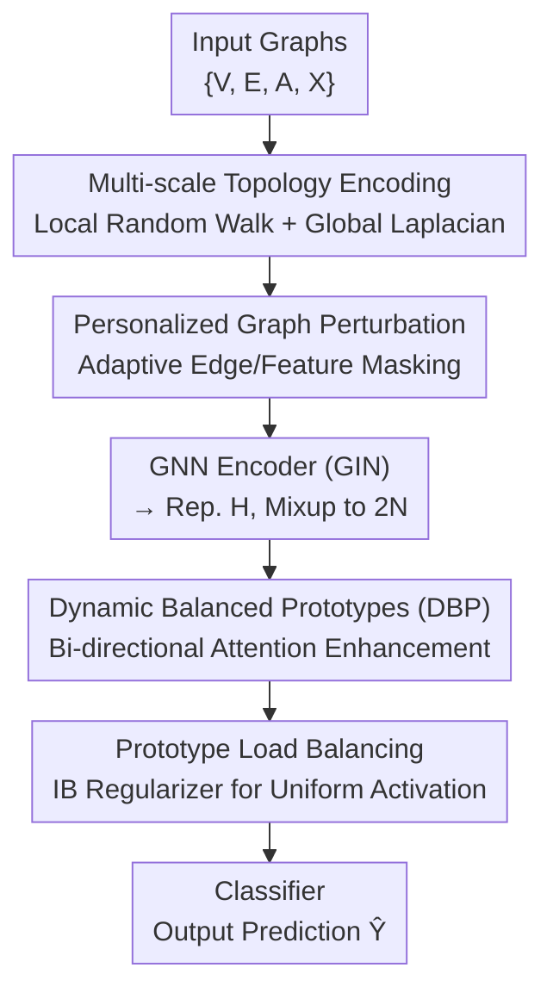

# One for Two: A Unified Framework for Imbalanced Graph Classification via Dynamic Balanced Prototype

**Conference**: ICLR 2026  
**OpenReview**: [https://openreview.net/forum?id=MraQM41SNS](https://openreview.net/forum?id=MraQM41SNS)  
**Code**: https://github.com (Available, GitHub link provided in the original paper)  
**Area**: Graph Learning / Graph Classification / Imbalanced Learning  
**Keywords**: Imbalanced Graph Classification, Class Imbalance, Topological Imbalance, Dynamic Balanced Prototype, Information Bottleneck

## TL;DR
UniImb employs a unified framework of "Dynamic Balanced Prototypes + Load Balancing Regularization" to simultaneously address **class imbalance** (too few samples for minority classes) and **topological imbalance** (small graphs being overwhelmed by large graphs) in graph classification. It achieves comprehensive leads across 19 datasets compared to 23 baselines.

## Background & Motivation

**Background**: Although Graph Neural Networks (GNNs) have shown strength in graph classification, most architectures assume balanced data by default. In reality, graph data is often severely imbalanced, primarily categorized into two types: ① **Class Imbalance**—a few classes occupy the majority of samples, causing GNN training to bias towards head classes; ② **Topological Imbalance**—a minority of large graphs (with many nodes) contribute the most nodes, causing GNN attention to be captured by large graphs while performance on small graphs collapses.

**Limitations of Prior Work**: Existing methods **address components separately**. Approaches for class imbalance (such as G2GNN or the graph-of-graphs framework in ImGKB, which treats each graph as a node in a meta-graph and adds edges based on similarity to "augment" tail classes) can enhance representations of rare classes but ignore internal structural heterogeneity. Approaches for topological imbalance (such as SOLT-GNN or TopoImb, which identify small graphs and increase their contribution via re-weighting/augmentation) cater to small graphs but ignore skewness in class distribution.

**Key Challenge**: In real-world data, these two types of imbalance **are entangled** (e.g., a small graph might simultaneously belong to a tail class). Single-sided methods fail in such complex scenarios. The root cause is that regardless of the imbalance type, "tail graphs" (minority class instances or small-scale graphs) have their influence suppressed by majority samples during training, preventing the learning of high-quality semantic representations.

**Goal**: Design a unified framework to **simultaneously balance both types of imbalance** using a single mechanism, ensuring tail graphs obtain influence comparable to majority graphs in representation learning.

**Key Insight**: The authors' key observation is that rather than separately "compensating" for class or topology, it is better to extract a set of **semantic prototypes shared across all graphs** and force the "contribution/activation" of each graph to these prototypes to be balanced. Since prototypes are shared, tail graphs can complete their representations with the help of these prototypes. By forcing the prototype activation distribution towards uniformity, majority samples cannot monopolize the prototypes, naturally leveling the influence of tail graphs.

**Core Idea**: Use a set of learnable **Dynamic Balanced Prototypes (DBP)** to carry shared semantics, and apply a **load-balancing regularization based on the Information Bottleneck** to push the prototype activation distribution towards uniformity, thereby mitigating both class and topological imbalance with a single approach.

## Method

### Overall Architecture
The input to UniImb is a batch of graph instances, and the output is graph-level classification predictions. The pipeline consists of three stages: first, **graph representation learning** (multi-scale topological encoding + personalized perturbation + GNN) encodes each graph into a vector and expands it to $2N$ samples via Feature Mixup; second, these enter the **Dynamic Balanced Prototypes (DBP)**, where prototype-graph bi-directional attention allows for mutual perception and enhancement; finally, **load-balancing optimization** constrains the prototype activation distribution toward uniformity to level the influence of tail graphs. The enhanced representations are then fed into a classifier for prediction.

### Key Designs

**1. Multi-scale Topology Encoding: Feeding Local and Global Structures to GNN**

Pure GNNs rely on layer-by-layer neighborhood aggregation and struggle to explicitly perceive global structural properties (subgraph frequency, connectivity), which are crucial for distinguishing graphs of different scales or categories. UniImb encodes two scales: **Local Encoding** uses random walks to capture the local structure of each node, defining the operator $M^{G_i}=D^{-1}A^{G_i}$ and taking only the landing probabilities of a node returning to itself to obtain the $z$-step encoding $LE^{G_i}_j=[(M^{G_i})_{j,j},(M^{G_i})^2_{j,j},\dots,(M^{G_i})^z_{j,j}]$ (low complexity and permutation invariant); **Global Encoding** takes the eigenvalues/eigenvectors of the Graph Laplacian $L^{G_i}=D^{G_i}-A^{G_i}$ and maps them via a permutation-invariant network into $GE^{G_i}=\phi([\ell(h_i,\lambda_i)+\ell(-h_i,\lambda_i)]^z_{i=1})$. Both are injected into GIN and updated separately. Removing topological encoding (w/o TopoEnc) in ablation studies leads to a significant performance drop, showing that structural information helps the model characterize graph-level features.

**2. Personalized Graph Perturbation: "Differential Treatment" for Tail and Majority Graphs**

Traditional edge dropping or feature masking applies a **uniform intensity** of perturbation to all graphs. However, in imbalanced scenarios, applying the same level of noise to already difficult-to-learn tail graphs exacerbates the issue. UniImb makes the perturbation intensity **graph-adaptive and learnable**. For edge dropping, the mean degree $d_{G_i}=2|E_{G_i}|/|V_{G_i}|$ is calculated first, followed by a one-layer MLP to learn the drop probability $a^{G_i}_e=\sigma(\text{MLP}(d_{G_i}))$. An edge mask is sampled from a Bernoulli distribution $m_e\sim B(a^{G_i}_e)$ to modify the adjacency matrix $\tilde A^{G_i}=A^{G_i}\odot M^{G_i}_e$. Feature masks $\beta^{G_i}_n$ are learned similarly. This allows small/minority graphs and large/frequent graphs to receive different perturbation intensities ("Weaken / Boost"), enhancing data diversity without indiscriminately harming tail graphs.

**3. Dynamic Balanced Prototypes (DBP): Bi-directional Enhancement via Shared Prototypes**

This is the core of the framework. Prototypes are defined as a set of learnable embeddings $S=[s_1,\dots,s_K]\in\mathbb{R}^{K\times d_h}$, where $K\ll N$, used to compactly carry semantics shared by all graphs. DBP involves two steps of bi-directional interaction: **Prototype Perception** allows prototypes to absorb information from graph data—aggregating based on attention coefficients between prototypes and graph representations, $\tilde H_S=\text{Softmax}(\text{TopK}_1(S\tilde H^\top/\sqrt{d_h}))\tilde H W_v$, meaning each prototype only extracts semantics from the $K_1$ most relevant graphs; **Prototype Balance** conversely enhances graph representations using prototypes—$\hat H=(\text{Sigmoid}(\text{TopK}_2(\tilde H S^\top/\sqrt{d_h})+\gamma))\tilde H_S$, where each graph selects the $K_2$ most relevant prototypes to supplement its own representation. A sigmoid with a learnable vector $\gamma$ generates discriminative similarity scores. Since prototypes are shared across graphs, tail graphs can complete their representations even with sparse samples, improving discriminability—removing DBP (w/o DBP) results in the largest performance drop in ablation studies, proving that explicit prototype modeling is vital.

**4. Prototype Load Balancing Optimization: Pushing Activation Towards Uniformity via Information Bottleneck**

Having prototypes is not enough—if majority samples monopolize prototype activation, prototypes will be biased by head data, leading to poor generalization. The authors utilize **Information Bottleneck (IB)** theory for constraints: given the objective $\min I(S;G)-\beta I(S;Y)$, where $I(S;Y)$ is optimized via supervised learning, the core becomes **minimizing the mutual information between prototype features and the input graph set** $I(S;G)$, thus reducing redundant dependence on imbalanced inputs. The authors derive that this is equivalent to making the prototype activation distribution $P$ approach a prior $U$: $\min I(S;G)\Rightarrow\min\text{KL}(P\|U)\approx\min\frac{1}{2}\sum_k(p_k-u_k)^2$. Experiments compared Zipf, Exponential, Poisson, and Uniform priors, with the **Uniform distribution** ($u_k=1/K$) performing best. Since TopK is non-differentiable, the authors introduce a modulation term $\eta$ into the attention generation $\hat H=(\text{Sigmoid}(\text{TopK}_2(\tilde H S^\top/\sqrt{d_h}+\eta))+\gamma)\tilde H_S$ and use a stop-gradient design for a differentiable constraint loss $L_M$. The update for $\eta$ is approximated as $\eta\leftarrow\eta-\varphi\,\text{sgn}(n_k-2N\cdot\text{TopK}_2\cdot u_k)$—if a prototype's activation exceeds the average level, it is penalized to reduce its subsequent priority, forcing load balance and ensuring tail graphs gain comparable influence. Removing this (w/o BalOpt) significantly reduces performance on class-imbalanced data.

### Loss & Training
Total Objective = Supervised classification loss (top $N$ rows of enhanced representation $\hat H$ fed into a two-layer MLP decoder for prediction $\hat Y$) + Load balancing regularizer $L_M$. Optimizer: Adam, Learning rate: 0.001, $\varphi=0.001$, GNN depth $L=5$, prototype count $K$ selected from $\{16,16,24,24,24,32\}$ across six datasets. Feature Mixup (ImMix) expands $N$ to $2N$ through random permutation of graph representations to increase feature diversity for tail graphs.

## Key Experimental Results

### Main Results

Class Imbalance (extreme degree, Macro-F1 / Micro-F1, Gain over best baseline):

| Dataset | Metric | UniImb | Best Baseline | Gain |
|--------|------|--------|----------|------|
| PROTEINS | Macro-F1 | 70.44 | 67.70 (G2GNN) | +4.05% |
| NCI1 | Micro-F1 | 80.68 | 74.91 | +7.70% |
| REDDIT-B | Macro-F1 | 76.24 | 68.39 | +11.48% |
| COLLAB | Macro-F1 | 75.73 | 64.57 | +17.28% |
| IMDB-MULTI | Macro-F1 | 33.45 | 23.62 | +41.62% |

Topological Imbalance (extreme, Macro-F1):

| Dataset | UniImb | Best Baseline | Gain |
|--------|--------|----------|------|
| D&D | 74.49 | 68.67 (ImbGNN) | +8.48% |
| REDDIT-B | 77.14 | 68.41 (TopoImb) | +10.90% |
| COLLAB | 73.51 | 65.65 | +11.97% |
| IMDB-MULTI | 40.45 | 33.55 (SOLT-GNN) | +20.57% |

### Ablation Study (Topological Imbalance, Macro-F1)

| Configuration | PROTEINS | D&D | NCI1 | COLLAB |
|------|----------|-----|------|--------|
| Ours (Full) | 71.3 | 74.5 | 65.0 | 73.5 |
| w/o ImMix | 69.7 | 73.3 | 63.6 | 70.3 |
| w/o TopoEnc | 67.4 | 71.9 | 60.7 | 69.4 |
| w/o Pertu | 66.2 | 60.8 | 63.8 | 67.4 |
| w/o DBP | 56.8 | 53.8 | 59.2 | 39.3 |
| w/o BalOpt | 69.8 | 73.9 | 63.2 | 67.0 |

### Key Findings
- **DBP provides the highest contribution**: Removing Dynamic Balanced Prototypes (w/o DBP) results in the sharpest drop among all variants (e.g., COLLAB drops from 73.5 to 39.3), proving shared prototypes are the core engine for handling imbalance.
- **Load balancing is more critical for class imbalance**: w/o BalOpt shows particularly significant drops on class-imbalanced data, confirming the role of the uniform activation prior in balancing tail influence.
- **Uniform prior is optimal**: Uniform consistently leads in comparisons between four priors (e.g., PROTEINS Macro-F1 70.44 vs. Zipf 67.80), aligning with the intuition of preventing any single prototype from monopolizing.
- **Plug-and-play**: Integrating UniImb into various backbones like GIN/GCN/GraphSAGE/GraphGPS/Exphormer/Graph-Mamba yields substantial gains (e.g., GIN on REDDIT-B Macro-F1 increases from 33.19 → 76.24). It also balances accuracy and efficiency on the large-scale AirGraph dataset (30,660 graphs).
- **Entangled scenarios**: In complex scenarios where both class and topological imbalance exist, topology-specific methods generally underperform compared to class-specific methods, while UniImb performs best overall.

## Highlights & Insights
- **Unified Perspective of "One for Two"**: By attributing both class and topological imbalance to "suppressed tail graph influence," the authors solve both using shared prototypes + uniform activation, avoiding the complexity of multi-track hybrid solutions.
- **Elegant Derivation Chain (IB → KL → Square Penalty)**: The abstraction of the Information Bottleneck $\min I(S;G)$ is simplified into a directly optimizable $\frac{1}{2}\sum(p_k-u_k)^2$, aligning theoretical motivation with engineering implementation.
- **Learnable personalized perturbation**: Turning "perturbation intensity" from a hyperparameter into a graph-adaptive learnable quantity is a transferable idea for any imbalanced task requiring sample-difficulty-based data augmentation.
- **New AirGraph Dataset**: A real-world air pollution graph dataset with 30,000+ graphs and a natural long tail (high pollution class accounts for only 6.86%), providing a large-scale benchmark for this field.

## Limitations & Future Work
- **High number of hyperparameters**: The number of prototypes $K$, $\text{TopK}_1/\text{TopK}_2$, and $\eta$ learning rates all require per-dataset tuning. The sensitivity curve for $K$ follows an "increase then decrease" pattern, requiring re-searching for new data.
- **Universality of the Uniform Prior**: While the uniform prior is validated as optimal on four datasets, whether it remains optimal for extreme long-tail or multi-modal distributions—or if learnable priors are needed—is not explored.
- **Differentiable approximation**: Load balancing relies on stop-gradient + $\eta$ modulation to bypass TopK non-differentiability. This is essentially an approximate optimization, and the gap between it and the true KL objective lacks quantitative analysis (⚠️ refer to the original paper for formula details).
- Future directions: Making the prior distribution learnable or making $K$ adaptive could further reduce the tuning burden.

## Related Work & Insights
- **vs. G2GNN / ImGKB (Class Imbalance)**: These use graph-of-graphs to link graphs as meta-nodes for data augmentation, addressing only classes while ignoring internal structural heterogeneity. UniImb uses shared prototypes for both class and topology and does not degenerate on multi-label data (COLLAB).
- **vs. SOLT-GNN / TopoImb / ImbGNN (Topological Imbalance)**: These identify small graphs for re-weighting/augmentation, ignoring class skewness. UniImb treats both as a "tail graph influence" problem, proving more robust in entangled scenarios.
- **vs. Graph Transformer (GraphGPS / Exphormer / Graph-Mamba)**: GTs rely on global attention for long-range dependencies but are nearly helpless against class label imbalance. UniImb can serve as a plug-and-play module atop GTs to provide significant improvements.

## Rating
- Novelty: ⭐⭐⭐⭐⭐ The use of shared prototypes + IB load balancing to unify two types of imbalance is a novel and self-consistent perspective.
- Experimental Thoroughness: ⭐⭐⭐⭐⭐ 19 datasets, 23 baselines, multiple backbones, and a large-scale new dataset (AirGraph) provide comprehensive coverage.
- Writing Quality: ⭐⭐⭐⭐ Clear method description and complete theoretical derivation, though some notations ($\eta$, $L_M$) are densely packed.
- Value: ⭐⭐⭐⭐⭐ Plug-and-play, a unified framework, and a new benchmark significantly advance imbalanced graph learning.

<!-- RELATED:START -->

## Related Papers

- [\[ACL 2026\] AutoPKG: An Automated Framework for Dynamic E-commerce Product-Attribute Knowledge Graph Construction](../../ACL2026/graph_learning/autopkg_an_automated_framework_for_dynamic_e-commerce_product-attribute_knowledg.md)
- [\[ICLR 2026\] Forest-Based Graph Learning for Semi-Supervised Node Classification](forest-based_graph_learning_for_semi-supervised_node_classification.md)
- [\[ICLR 2026\] Low-Rank Few-Shot Node Classification by Node-Level Graph Diffusion](low-rank_few-shot_node_classification_by_node-level_graph_diffusion.md)
- [\[ICML 2026\] ProMoS: Generalist Graph Anomaly Detection via Prototype-Based Distillation](../../ICML2026/graph_learning/generalist_graph_anomaly_detection_via_prototype-based_distillation.md)
- [\[ICLR 2026\] Learning Posterior Predictive Distributions for Node Classification from Synthetic Graph Priors](learning_posterior_predictive_distributions_for_node_classification_from_synthet.md)

<!-- RELATED:END -->
