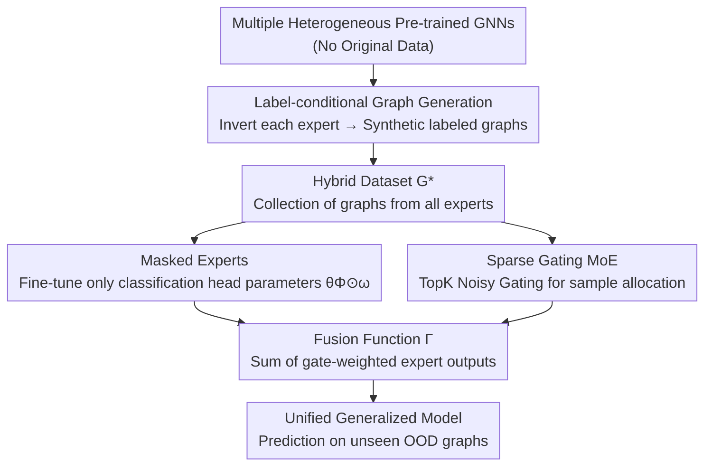

# Out-of-Distribution Graph Models Merging

**Conference**: ICLR 2026  
**OpenReview**: [https://openreview.net/forum?id=93Y7jSUSpk](https://openreview.net/forum?id=93Y7jSUSpk)  
**Code**: https://github.com/siriuslay/OGMM  
**Area**: Graph Learning / Model Merging / Domain Generalization  
**Keywords**: Graph Model Merging, Out-of-Distribution Generalization, Mixture of Experts, Graph Generation, Data-free Fine-tuning

## TL;DR
This paper proposes OGMM to investigate the novel problem of "Out-of-Distribution Graph Model Merging." Without access to any source or target domain data and assuming potentially heterogeneous GNN architectures, each pre-trained GNN first inverts a small batch of labeled synthetic graphs. Subsequently, a sparse MoE with masked experts fine-tunes and merges these models into a unified model capable of generalizing to unseen distributions.

## Background & Motivation
**Background**: The mainstream approach for Graph Model Generalization (GMG) is to **pool graph data from multiple domains** with distribution shifts and train a model from scratch. These methods rely on invariant features, causality, or risk extrapolation to bridge domain discrepancies and maintain robustness on unseen OOD graphs.

**Limitations of Prior Work**: In reality, it is more common that **multiple GNNs have already been independently trained** (referred to as Out-of-Distribution Graph Models) for similar tasks on different datasets. For example, in social networks, models trained on different user groups or with different architectures capture distinct behavioral patterns. As shown in Figure 2, each model performs well in its original domain (e.g., GCN achieves 70.53% on the PTC domain) but suffers significant performance degradation (dropping to around 50%) when applied to other domains. Moreover, different architectures have different strengths across domains. Unifying them into a single generalized model using traditional methods requires retraining from scratch, which is complex and wastes already acquired knowledge.

**Key Challenge**: Directly reusing these pre-trained models faces two primary difficulties: (1) Invariant knowledge is no longer explicitly present in the data but is **implicitly encoded in the model parameters**, making its extraction difficult; (2) These models may have **heterogeneous architectures and hyperparameters**, making it non-trivial to integrate the capabilities of heterogeneous experts into a unified representation.

**Goal**: To "merge" the knowledge of multiple pre-trained GNNs into a unified model that remains generalizable under distribution shifts, without accessing any original source/target domain data and without restricting the backbone architectures.

**Key Insight**: The authors introduce the **mixture distribution hypothesis**—the target domain distribution is a linear combination of various source domain distributions $G_T=\sum_i \alpha_i G_i$. Consequently, the fusion function can be expressed as a linear combination of experts $\Gamma=\sum_i \alpha_i f(\Theta_i)$. Using the $\mathcal{H}\Delta\mathcal{H}$-divergence, they derive an upper bound for the generalization error. This theoretical framework decomposes "merging" into two steps: "knowledge extraction" and then "weighted combination of experts."

**Core Idea**: Utilize "model inversion for graph generation + sparse MoE with masked experts" instead of "retraining." Domain knowledge is distilled from the parameters of each expert, and a lightweight gating mechanism dynamically allocates and weights these experts per sample, assembling a generalized model without requiring the original data.

## Method

### Overall Architecture
OGMM decomposes the fusion of heterogeneous pre-trained GNNs into two serial stages. **Stage 1 (Label-conditional Graph Generation)**: Each pre-trained GNN $f(\Theta_i)$ acts as a "supervisor." Starting from random noise, it inverts a small batch of labeled synthetic graphs by maximizing the original model's confidence, thereby materializing the domain knowledge hidden in the parameters into trainable data. The graphs generated by all experts are aggregated into a hybrid dataset $G^*$. **Stage 2 (Expert Fine-tuning and Merging)**: An MoE fusion module is trained on $G^*$. It consists of a sparse gating layer (corresponding to combination weights $\alpha$) and a set of **masked experts** (corresponding to fine-tuned weights $\omega$). The gating mechanism dynamically assigns samples to appropriate experts, while masks fine-tune only a small number of parameters strongly related to the downstream task. The final prediction is the gate-weighted sum of the masked expert outputs. The entire framework is architecture-agnostic and never accesses real source or target data.

Theoretically, the authors prove that under the mixture distribution hypothesis, the generalization error upper bound of the merged model $\Gamma$ in the target domain is equal to the sum of the cross-distribution validation errors of the sub-learners. Accordingly, the objective is split into three terms: "pre-training error of each model + fine-tuning error on the new domain + training error of the merged model on synthetic samples," which correspond to the specific implementations in the two stages mentioned above.

### Key Designs

**1. Label-conditional Graph Generation: "Inverting" hidden domain knowledge into trainable data**

The first stage addresses the lack of original data by extracting knowledge solely from parameters. For each pre-trained GNN $f(\Theta_i)$, a generator $P_i$ is assigned. Node features $X_i\in\mathbb{R}^{n_i\times d}$ are sampled from a standard normal distribution, and condition labels $\hat y_i$ are sampled from a uniform distribution as "pseudo-ground truth." A **discrete edge encoder** then constructs an adjacency matrix from the features. The specific difficulty with graphs is that the structure $A$ is typically a discrete variable, making direct gradient inversion difficult. The authors use a three-layer MLP with a sigmoid function to calculate edge weights $A^i_{jk}=\sigma(\mathrm{MLP}_\theta([X^i_j;X^i_k]))$, and use Gumbel-Softmax to approximate these weights as binary values in $[0,1]$ (tending toward 0/1 as temperature $\tau\to 0$), bypassing discrete gradient approximation. The generation loss includes the label-conditional posterior loss $C(\hat y_i,f(\Theta_i,X_i,A_i))$ plus two regularizations: **BN statistics matching** $R_{bn}$, which forces the mean/variance of the synthetic graph embeddings to align with the statistics stored in the pre-trained model's BN layers; and **confidence regularization** $R_{conf}$ (negative expectation of the synthetic graph's classification entropy), ensuring the synthetic graphs are discriminative. The total loss is $L_{gen}=\sum C(\hat y_i,f)+R_{bn}+R_{conf}$. Compared to Inverse-X which only learns node features, learning both features and structure better recovers domain-specific knowledge.

**2. Masked Experts: Fine-tuning only the classification head to locate downstream-relevant "neural pathways"**

Using pre-trained GNNs directly as experts can be ineffective due to original domain biases. Borrowing from mask tuning, the authors learn a mask matrix $\omega_i$ for the expert parameters $\theta^i_*$. The fine-tuned parameters $\hat\theta^i_*=\theta^i_*\odot\omega_i$ are obtained via Hadamard product. This effectively selects and re-weights parameters truly needed for the new task, forming a "downstream-relevant neural pathway." A key observation is that in shallow networks like 2-layer GNNs, **where the mask is applied matters**. The authors hypothesize that domain-specific knowledge is highly concentrated in the **classification head** (where high-dimensional representations most easily capture domain-exclusive information). Thus, fine-tuning only the classification head parameters is the most reasonable and efficient approach. Experiments (Figure 4) confirm that masking only the classification head (MaskCL) yields competitive performance while using only about 20% of the total GNN parameters on average. This keeps the merging lightweight without destroying the universal knowledge in the encoder.

**3. Sparse Gating MoE: Dynamic allocation and weighting of heterogeneous experts per sample**

To utilize the experts, a mechanism is needed to "dispatch" samples to the most appropriate experts and combine their outputs, which implements the mixture distribution hypothesis as a learnable function. The MoE output is expressed as $\hat H_i=\sigma(\sum_j \mathrm{Gate}(X_i)_j H_{i,j})$. The gating uses TopK sparse selection $\mathrm{Gate}(G_i)=\mathrm{softmax}(\mathrm{TopK}(Q(G_i),k))$, where the score $Q(G_i)=G_iW_g+\epsilon\cdot\mathrm{softplus}(G_iW_n)$. $W_g$ calculates the clean expert selection score, while $W_n$ injects controllable Gaussian noise $\epsilon\sim N(0,1)$ to **prevent expert collapse and ensure load balancing**. The fusion function $\Gamma_{\omega,W_g,W_n}(G_i)=\sum_j \mathrm{Gate}(G_i)_j f(\Theta_j,\omega_j,G_i)$ realizes the dynamic "sample-expert" allocation logic. Theoretically, the masked fine-tuned MoE approximates the generalization risk function, allowing it to cover unseen graphs on a wider generalization plane.

**4. Dual Regularization for Gating and Masking**

To constrain the optimization of the gating and masking components, two regularizations are added. For gating, an importance loss based on the coefficient of variation is used: $R_{gate}=CV(\sum_{G_i}\mathrm{Gate}(G_i))^2$. This measures the dispersion of sample-expert weights, encouraging uniform weighting and load balancing to prevent the gating from focusing on a single expert. For masking, $R_{mask}$ balances "learning new knowledge" with "minimizing changes to frozen parameters." The first term is the classification loss on synthetic graphs. The second term uses thresholds $\gamma_v,\gamma_p$ to control the mean and variance of the mask, limiting the magnitude of changes to original parameters to prevent "forgetting." The total loss in the merging stage is $L_{merge}=\sum C(\hat y_i,\Gamma_\Phi(G_i))+\lambda_{gate}R_{gate}+\lambda_{mask}R_{mask}$, where $\Phi=\{\omega,W_g,W_n\}$.

### Loss & Training
The two stages are optimized separately: in the first stage, $L_{gen}$ (label-conditional posterior loss + BN matching + confidence regularization) is minimized for each generator while freezing the pre-trained GNNs. In the second stage, $L_{merge}$ is minimized on the aggregated synthetic data $G^*$ to jointly learn the masks $\omega$ and gating weights $W_g, W_n$. In experiments, the merged GNNs are small 2-layer, 32-dimensional networks. The $k$ in TopK gating is a key hyperparameter.

## Key Experimental Results

### Main Results
Evaluation was conducted on four graph classification datasets: MUTAG, PTC, REDDIT-B, and NCI1. Each dataset was partitioned into domains based on edge-to-node ratios (A low density / B medium density / T high density test set) to simulate domain shifts. Performance was measured by Acc and Pre on the target domain. The merged models included GCN, GAT, and GIN architectures pre-trained on different source domains.

| Method | REDDIT-B Acc | PTC Acc | MUTAG Acc | NCI1 Acc |
|------|------|------|------|------|
| Avg-PTM (Multi-model Average) | 52.47 | 50.20 | 31.48 | 56.58 |
| Ens-Prob (Probability Ensemble) | 33.65 | 50.17 | 29.84 | 58.05 |
| Uni-Soup (Weight Averaging) | 43.26 | 50.20 | 37.40 | 48.73 |
| Greedy-Soup (Greedy Merging) | 47.35 | 50.17 | 31.46 | 38.64 |
| Inverse-X (Node Features Only) | 56.21 | 50.43 | 38.75 | 62.39 |
| Multi-GFKD (Multi-teacher Distillation) | 54.35 | 50.77 | 44.36 | 47.57 |
| **OGMM** | **76.98** | **51.21** | **45.62** | **66.84** |

OGMM consistently outperforms individual pre-trained models, ensemble methods, weight fusion (soup methods), and generative baselines across all four datasets. Significant gains are observed on larger datasets like REDDIT-B and NCI1 (e.g., REDDIT-B Acc is 20 points higher than the runner-up Inverse-X). Weight fusion methods (Uni-Soup/Greedy-Soup) performed the worst, confirming that for OOD problems, merging model outputs is more effective than directly averaging parameters.

### Ablation Study

| Configuration | REDDIT-B Acc | MUTAG Acc | NCI1 Acc | Description |
|------|------|------|------|------|
| OGMM (Source-Free) | 76.98 | 45.62 | 66.84 | Full model (no original data) |
| w/o MoE | 50.39 | 39.53 | 60.62 | Without gating fusion |
| w/o Mask | 31.98 | 28.28 | 51.11 | Without masked experts |
| w/o $L_{gen}$ | 41.15 | 45.31 | 52.69 | Without generation regularization |
| OGMM (Given Source) | 80.98 | 57.81 | 68.04 | Using real source data instead of synthetic graphs |

### Key Findings
- **Masks are critical**: Removing masks leads to a drastic drop in REDDIT-B Acc from 76.98 to 31.98, identifying the masked expert (fine-tuning only the classification head) as the core of adapting heterogeneous models to new domains.
- **Synthetic graphs approximate real data**: The performance with real source data (Given Source) is only slightly higher than with synthetic graphs (Source Free) (80.98 vs 76.98 on REDDIT-B), proving that inverted graphs effectively distill and represent domain knowledge.
- **Mask location matters**: MaskCL (masking only the classification head) significantly outperforms MaskNN (masking the encoder) across multiple datasets. The mask only utilizes about 20% of the parameters, validating the hypothesis that domain-specific knowledge is concentrated in the classification head.
- **Gating TopK sensitivity**: Analysis of $k=1\sim6$ shows its impact on Acc/Pre, identifying an appropriate range for sparsity.

## Highlights & Insights
- **Modeling "model merging" as "inversion for data generation followed by MoE weighting"**: By using BN statistics and confidence regularization for data-free inversion, implicit domain knowledge is converted into trainable synthetic graphs, circumventing the data access constraint.
- **Masking only the classification head**: Utilizing a mask for ~20% of parameters to locate "downstream-relevant neural pathways" is lightweight and avoids damaging general encoder representations. This insight regarding domain knowledge in shallow GNN classification heads is highly transferable.
- **Alignment between theory and implementation**: Starting from the mixture distribution hypothesis, the generalization error upper bound is decomposed into terms that map directly to the implementation stages, ensuring the MoE+Mask approach is an approximation of the generalization risk.
- **Architecture-agnostic and data-free**: The ability to merge heterogeneous backbones (GCN/GAT/GIN) without touching real data makes this setting more practical than traditional domain generalization.

## Limitations & Future Work
- Experiments focused on small 2-layer, 32-dimensional GNNs and small-to-medium datasets. Scalability to larger models and more complex tasks requires further validation.
- The mixture distribution hypothesis (target domain as a linear combination of source domains) is the theoretical cornerstone, but real-world distribution shifts might not be linear.
- Quality of synthetic graphs relies on BN layer statistics; the approach may be less effective for architectures without BN, and hyperparameters for generation (quantity, temperature $\tau$) need tuning.
- Numerous hyperparameters, such as TopK $k$ and mask thresholds $\gamma_v, \gamma_p$, increase tuning costs.

## Related Work & Insights
- **vs. Traditional Graph DG (IRM, Risk Extrapolation, etc.)**: These learn invariant features from **explicit data** and requires retraining from scratch. OGMM extracts knowledge from **model parameters**, reusing pre-trained heterogeneous models without original data.
- **vs. Model Soup (Uni-Soup / Greedy-Soup)**: Soup methods perform (weighted) average of parameters, requiring homogeneous models and often failing on OOD scenarios. OGMM merges **model outputs** with dynamic gating, handling heterogeneity and improving OOD robustness.
- **vs. GFKD / Inverse-X (Generative Distillation)**: Inverse-X only inverts node features and uses random structures. OGMM uses a discrete edge encoder to **learn both features and structure** and adds MoE fusion, achieving better domain knowledge recovery and performance.

## Rating
- Novelty: ⭐⭐⭐⭐⭐ First to propose "Out-of-Distribution Graph Model Merging" with a data-free, architecture-agnostic solution and theoretical bounds.
- Experimental Thoroughness: ⭐⭐⭐⭐ Four datasets, multiple baselines, and comprehensive ablations, though model/data scales are relatively small.
- Writing Quality: ⭐⭐⭐⭐ Clear correspondence between theory and method, though notation is dense.
- Value: ⭐⭐⭐⭐⭐ The focus on reusing heterogeneous models is practical, and the observation regarding the classification head is valuable.

<!-- RELATED:START -->

## Related Papers

- [\[ICLR 2026\] G-Merging: Graph Models Merging for Parameter-Efficient Multi-Task Knowledge Consolidation](g-merging_graph_models_merging_for_parameter-efficient_multi-task_knowledge_cons.md)
- [\[ICLR 2026\] Adaptive Mixture of Disentangled Experts for Dynamic Graph Out-of-Distribution Generalization](adaptive_mixture_of_disentangled_experts_for_dynamic_graph_out-of-distribution_g.md)
- [\[ICLR 2026\] Diverse and Sparse Mixture-of-Experts for Causal Subgraph–Based Out-of-Distribution Graph Learning](diverse_and_sparse_mixture-of-experts_for_causal_subgraphbased_out-of-distributi.md)
- [\[ICLR 2026\] Full-Graph vs. Mini-Batch Training: Comprehensive Analysis from a Batch Size and Fan-Out Size Perspective](full-graph_vs_mini-batch_training_comprehensive_analysis_from_a_batch_size_and_f.md)
- [\[ICLR 2026\] Bridging Input Feature Spaces Towards Graph Foundation Models](bridging_input_feature_spaces_towards_graph_foundation_models.md)

<!-- RELATED:END -->
