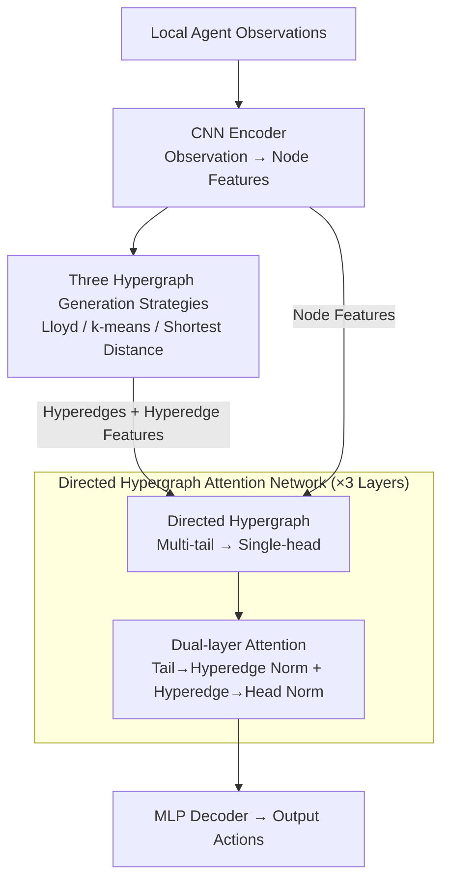

# Pairwise is Not Enough: Hypergraph Neural Networks for Multi-Agent Pathfinding

**Conference**: ICLR2026  
**arXiv**: [2602.06733](https://arxiv.org/abs/2602.06733)  
**Code**: [GitHub](https://github.com/proroklab/HMAGAT)  
**Area**: Graph Learning  
**Keywords**: MAPF, Hypergraph Neural Networks, Attention Mechanism, Imitation Learning, Group Interaction  

## TL;DR
The authors propose HMAGAT, which replaces the pairwise message passing of GNNs with a directed hypergraph attention network to model group interactions in multi-agent pathfinding. It outperforms SOTA models with 85M parameters using only 1M parameters and 1% of the training data.

## Background & Motivation

**Background**: Multi-Agent Pathfinding (MAPF) requires a team of agents to reach their goals collision-free. Optimal solving is NP-hard, leading to the prevalence of learning-based methods for online inference. The mainstream architectural backbone consists of "CNN encoding local observations → inter-agent message passing → MLP action decoding," where the message passing layers typically utilize GNNs or Transformers.

**Limitations of Prior Work**: The message passing in GNNs and Transformers is inherently **pairwise**—an edge connects only two agents. However, in high-density scenarios like intersections or narrow corridors, MAPF often requires **simultaneous** coordination among three or more agents to avoid deadlocks; pairwise interactions cannot express these indecomposable joint constraints. Furthermore, GNNs place all neighbors in the same softmax competition, leading to **attention dilution** where irrelevant agents drown out critical interactions in dense environments.

**Key Challenge**: MAPF is fundamentally a group planning problem—optimal and complete solutions require modeling the joint state space of all agents. Existing architectures possess structural priors limited to the pairwise level, making them naturally unable to represent higher-order group interactions.

**Key Insight**: Hyperedges in a hypergraph can connect an arbitrary number of nodes, making them naturally suited to encode group interactions. While existing hypergraph work has been validated in simple scenarios with ~10 agents (e.g., social grouping in trajectory prediction), whether they can scale to large-scale, highly coupled, and complex MAPF remains an open question.

**Core Idea**: Directly replace the pairwise message passing GNN in classic MAPF backbones with a **Directed Hypergraph Attention Network (HGNN)**. Use the structural prior of "multiple agents jointly influencing one agent's decision" to replace brute-force data/parameter scaling—and experimentally demonstrate that correct inductive bias is more critical than model scale.

## Method

### Overall Architecture

HMAGAT follows the classic three-stage backbone of MAPF learning methods: a CNN encoder compresses each agent's local observation into a feature vector, three message-passing layers allow information exchange between agents, and finally, an MLP decodes the actions. Its primary distinction from the previous generation MAGAT is the replacement of the three pairwise GNN layers with Directed Hypergraph Attention Networks (HGNNs). In each frame, a heuristic strategy groups current agents to construct hyperedges, and the HGNN performs two-level attention aggregation, embedding the "multiple agents influencing a specific agent's decision" directly into the network's structural prior.

### Key Designs

**1. Directed Hypergraphs: Modeling "Group Influence" with Multi-tail Single-head Structures**

GNN edges only connect two nodes, modeling pairwise relations like A influencing B. When three agents crowd an intersection simultaneously and require three-way coordination to avoid deadlock, pairwise edges cannot represent this joint constraint. HMAGAT utilizes directed hyperedges, where multiple tail nodes (influencers) point to a single head node (the influenced). This naturally encodes "a group of surrounding agents jointly deciding my next move" into a single hyperedge. This is the literal meaning of the title "Pairwise is Not Enough."

**2. Dual-layer Attention: Decoupled Normalization to Prevent Attention Dilusion**

Information aggregation proceeds in two steps. First, Tail-to-Hyperedge attention $\alpha_{ej}$: using the mean of head node features as the query and tail node features concatenated with hyperedge features $\mathbf{w}_{je}$ as key-value pairs, it aggregates information from tail nodes into a hyperedge representation. Second, Hyperedge-to-Head attention $\alpha_{ie}$: using the head node as the query and hyperedge representations as key-values to determine the contribution of different hyperedges. Crucially, two softmax layers normalize within their respective levels, decoupling competition inside a hyperedge from competition between hyperedges. In contrast, GNNs place all neighbors in one softmax; if $n$ neighbors exist and only $k$ are critical, the attention scales as $k/n$, decaying as density $n$ increases—the root of attention dilution.

**3. Three Hypergraph Generation Strategies: Grouping in Different Scales and Terrains**

Hyperedges are constructed dynamically in each frame using heuristic rules. The paper provides three complementary schemes: **Lloyd Hypergraphs** use Voronoi partitioning with "soft boundaries" for overlapping groups, offering high quality for medium scales but being computationally expensive ($O(|V|^3)$); **k-means Hypergraphs** use clustering with soft boundaries, reducing complexity to $O(k|V|)$ for large maps; **Shortest Distance Hypergraphs** group agents based on shortest path distance, which is more reliable in obstacle-dense maps where Euclidean distance is misleading. Each strategy attaches hyperedge features $\omega_{je}$ (relative coordinates and Manhattan distance, encoded via MLP $\phi$ into $\mathbf{w}_{je}$).

### Loss & Training

The core is Imitation Learning: demonstration trajectories are collected using the `lacam3` expert solver on 21K instances (approx. 178x fewer than the 3.75M used by MAPF-GPT), training with cross-entropy loss. DAgger is optionally used to correct policy drift. Two enhancement modules are included: a Post-training phase fine-tunes on medium-difficulty instances to improve solution quality (shorter paths), and an RL Temperature Sampling module trains a small model to dynamically adjust the softmax temperature $\tau \in [0.5, 1.0]$, ensuring more certain actions during congestion.

## Key Experimental Results

### Main Results

| Metric | HMAGAT (1M, 21K instances) | MAPF-GPT (85M, 3.75M instances) | MAGAT (GNN) |
|------|------------|----------------|-------------|
| Parameters | ~1M (1.2%) | 85M (100%) | ~1M |
| Training Data | 21K (~0.56%) | 3.75M (100%) | 21K |
| Dense Warehouse Success Rate | **75%+** | <11% | ~5% |
| ost003d Large Map | ✓ Scalable | ✗ OOM | ✓ |
| Small Map Avg SoC | **Optimal** | Fair | Poor |

## Ablation Study

| Component Ablation | Dense Warehouse Success Rate | Description |
|----------|---------------------|------|
| Full HMAGAT | **39.8%** | Complete Model |
| HGNN → GNN (MAGAT) | 2.3% | Hypergraph layers are core—performance collapses with pairwise interaction |
| w/o Post-training | ~30% | Post-training yields ~10% gain in high-density scenarios |
| w/o Temp Sampling | ~35% | Sampling reduces hesitant/uncertain actions |
| Lloyd → k-means | ~37% | k-means is slightly weaker but cheaper for large maps |

### Key Findings
- **Attention Dilution Analysis**: In GNNs, as neighborhood density increases, key interaction weights are diluted by irrelevant agents. The authors prove that for $k$ critical neighbors among $n$ total neighbors, GNN attention is $\approx k/n$. HGNN restricts attention to small hyperedges, insulating the weight from external noise.
- **Hand-crafted Scenarios**: In a three-agent intersection scenario, the authors demonstrate that GNNs fail to capture three-way coordination while HGNN succeeds.
- **Scalability**: While MAPF-GPT's Transformer suffers from OOM on large maps like `ost003d` (194×194), HMAGAT scales successfully due to its local hypergraph structure.

## Highlights & Insights
- **Inductive Bias > Scale**: The core conclusion is that 1% of parameters and data can outperform an 80M+ model if the structural prior (hypergraphs) correctly matches the problem.
- **Attention Dilution**: The formal analysis and experimental verification provide a clear explanation for GNN failure in high-density MAPF.
- **Practical Strategies**: Providing multiple hyperedge generation strategies (Lloyd vs. k-means) makes the approach flexible for different computational budgets.

## Limitations & Future Work
- Hypergraph generation relies on a preset communication radius $R^{\text{comm}}$ and color count, rather than adaptively learning the optimal structure.
- Evaluation is limited to grid environments; extensions to continuous space or 3D topologies are not explored.
- Imitation learning remains dependent on expert quality; sub-optimal experts lead to sub-optimal policies.
- Hypergraph construction introduces extra overhead, and scalability to >1000 agents requires further verification.

## Related Work & Insights
- **vs MAGAT**: Under the same CNN+MLP framework, replacing GNN with HGNN is the sole factor for success.
- **vs MAPF-GPT**: Demonstrates that architectural priors surpass brute-force scaling in structured tasks.
- **vs SCRIMP**: SCRIMP uses Transformers for communication, which remains pairwise/all-to-all and suffers from dilution in density.
- **Insight**: Hypergraph modeling of group interactions is generalizable to traffic management, swarm coordination, and protein-protein interaction networks.

## Rating
- Novelty: ⭐⭐⭐⭐ (First use of hypergraphs in large-scale MAPF)
- Experimental Thoroughness: ⭐⭐⭐⭐⭐ (Broad range of maps, scaling analysis, and hand-crafted proofs)
- Writing Quality: ⭐⭐⭐⭐ (Clear logic and effective visualizations)
- Value: ⭐⭐⭐⭐ (Significant implications for inductive bias vs. scaling laws)

### Final Evaluation
The most compelling aspect of this work is the 1M vs. 85M parameter comparison. It serves as a strong counter-argument to the "scaling is all you need" paradigm for structured scientific and engineering problems, proving that modeling group interactions as indecomposable units is essential for high-density coordination.

## Related Papers

- [\[ACL 2026\] EA-Agent: A Structured Multi-Step Reasoning Agent for Entity Alignment](../../ACL2026/graph_learning/ea-agent_a_structured_multi-step_reasoning_agent_for_entity_alignment.md)
- [\[ICLR 2026\] Differentiable Lifting for Topological Neural Networks](differentiable_lifting_for_topological_neural_networks.md)
- [\[ICLR 2026\] DHG-Bench: A Comprehensive Benchmark for Deep Hypergraph Learning](dhg-bench_a_comprehensive_benchmark_for_deep_hypergraph_learning.md)
- [\[AAAI 2026\] S-DAG: A Subject-Based Directed Acyclic Graph for Multi-Agent Heterogeneous Reasoning](../../AAAI2026/graph_learning/s-dag_a_subject-based_directed_acyclic_graph_for_multi-agent.md)
- [\[ICLR 2026\] Cooperative Sheaf Neural Networks](cooperative_sheaf_neural_networks.md)

<!-- RELATED:END -->

<!-- RELATED:START -->

## Related Papers

- [\[ACL 2026\] EA-Agent: A Structured Multi-Step Reasoning Agent for Entity Alignment](../../ACL2026/graph_learning/ea-agent_a_structured_multi-step_reasoning_agent_for_entity_alignment.md)
- [\[ICLR 2026\] Differentiable Lifting for Topological Neural Networks](differentiable_lifting_for_topological_neural_networks.md)
- [\[ICLR 2026\] DHG-Bench: A Comprehensive Benchmark for Deep Hypergraph Learning](dhg-bench_a_comprehensive_benchmark_for_deep_hypergraph_learning.md)
- [\[AAAI 2026\] S-DAG: A Subject-Based Directed Acyclic Graph for Multi-Agent Heterogeneous Reasoning](../../AAAI2026/graph_learning/s-dag_a_subject-based_directed_acyclic_graph_for_multi-agent.md)
- [\[ICLR 2026\] Cooperative Sheaf Neural Networks](cooperative_sheaf_neural_networks.md)

<!-- RELATED:END -->
