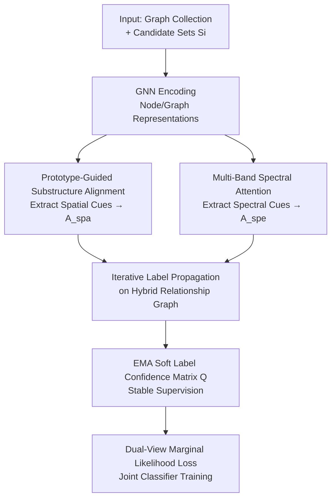

# PRISM: Partial-label Relational Inference with Spatial and Spectral Cues

**Conference**: ICLR 2026  
**OpenReview**: [https://openreview.net/forum?id=m2MeiYOJED](https://openreview.net/forum?id=m2MeiYOJED)  
**Code**: TBD  
**Area**: Graph Learning / Weakly Supervised Learning / Graph Classification  
**Keywords**: Partial-label learning, Graph Neural Networks, Spectral graphs, Label propagation, Relational inference

## TL;DR
PRISM addresses the Partial-label Graph Learning (PLGL) problem, where each graph is assigned a candidate label set containing the ground truth. By extracting spatial cues through prototype-guided substructure alignment and spectral cues via multi-band spectral attention, the model constructs a hybrid relationship graph. It then performs iterative label propagation under candidate constraints to effectively disambiguate labels, significantly outperforming existing weakly supervised graph classification methods across various noise levels.

## Background & Motivation
**Background**: Graph classification typically relies on GNNs (GCN, GIN, GraphSAGE, etc.) to recursively aggregate neighbors and apply global pooling for graph-level representations, achieving SOTA performance in molecular property prediction, bioinformatics, and social networks. However, these frameworks are "data-hungry," requiring precise labels to train discriminative classifiers.

**Limitations of Prior Work**: Obtaining ground-truth labels in real-world scenarios is often expensive or unfeasible. For instance, determining chemical properties may require costly DFT simulations. Automated labeling tools are often used as alternatives, but inconsistent results lead to label ambiguity. Such noisy labels severely degrade classifier training. Even self-supervised methods like GraphCL still depend on precise labels during the downstream classification stage, suffering significant performance drops under label ambiguity.

**Key Challenge**: This work focuses on a practical yet understudied setting—Partial-label Graph Learning (PLGL): each graph is associated with a candidate label set $S_i\subset Y$ that contains the ground truth $y_i^*$, but the exact label is unknown. Compared to visual partial-label learning, this is more challenging on graphs because: ① Ambiguous supervision introduces semantic uncertainty, making it hard to capture discriminative substructures; ② GNNs easily overfit noisy signals, especially when candidate sets contain semantically similar labels; ③ Graphs exhibit patterns across multiple structural resolutions (from local motifs to global topology) that global pooling fails to capture fully. Existing weakly supervised graph classification methods rely on pseudo-labels or contrastive learning but suffer from error accumulation due to overconfident predictions and a lack of explicit utilization of structural and spectral diversity.

**Core Idea**: The authors propose a "spatial + spectral" dual-perspective approach to construct a hybrid relationship graph. By performing iterative label propagation under candidate constraints, reliable label semantics are gradually distilled from noisy candidate sets, rather than forcing the model to make hard decisions on individual candidate labels.

## Method

### Overall Architecture
PRISM solves graph classification where only candidate label sets are available. It equips each graph with two complementary encoding paths: the **spatial encoder** extracts discriminative local cues by aligning prototype-guided substructures across graphs, and the **spectral encoder** extracts global structural cues by decomposing graph signals into multiple bands and using attention to preserve band-specific semantics. These paths induce two types of inter-graph relationships: one encoding prototype substructure similarity $A^{spa}$ and another encoding spectral affinity $A^{spe}$, forming a hybrid relationship graph. **Iterative label propagation** is then performed on this graph to fuse relational signals and refine soft labels under candidate mask constraints. A momentum-updated soft label confidence matrix $Q$ is used to suppress noise accumulation, serving as a soft supervision target to train the spatial and spectral classifiers.

### Key Designs

**1. Prototype-Guided Substructure Alignment: Local Discriminative Evidence Against Label Ambiguity**

Multiple labels in a candidate set may be semantically related; relying solely on global graph representations would conflate them. The authors observe that local substructures often carry the most discriminative evidence. PRISM maintains a momentum-updated prototype bank $\{p_c\}_{c\in Y}$, where each $p_c$ tracks the mean global representation of graphs whose candidate sets include label $c$, updated via $p_c^{(j)}\leftarrow m\cdot p_c^{(j-1)}+(1-m)\cdot\frac{1}{|B_c|}\sum_{i\in B_c}g_i$. Prototype-guided attention extracts $C$ substructure embeddings aligned with candidate classes for each graph: $r_i^{(c)}=\sum_{v\in V_i}\alpha_{vc}\,h_v^{(L)}$, where $\alpha_{vc}=\frac{\exp(h_v^{(L)\top}p_c)}{\sum_{v'}\exp(h_{v'}^{(L)\top}p_c)}$.

For graph pairs sharing at least one candidate label $P=\{(G_i,G_j)\mid S_i\cap S_j\ne\varnothing\}$, the prototype-aware substructure similarity is defined as:

$$s^{spa}_{ij}=\max_{c\in S_i\cap S_j}\cos\big(r_i^{(c)},r_j^{(c)}\big)\cdot\cos\Big(\tfrac{r_i^{(c)}+r_j^{(c)}}{2},\,p_c\Big).$$

This requires that substructures of two graphs for candidate class $c$ are similar to each other and close to the class prototype, enforcing both pairwise consistency and centricity. Only the top-$k_a$ neighbors are kept to form the sparse adjacency $A^{spa}$.

**2. Multi-Band Spectral Attention: Preserving Band-Specific Semantics**

While spatial modules capture locality, graph spectra provide a global view (low frequencies for smoothness, high frequencies for irregularities). PRISM uses multi-band spectral attention to explicitly model frequency bands. First, scalar eigenvalues are projected into a learnable signal space using harmonic expansion: $\rho(\lambda)=[\sin(k\lambda),\cos(k\lambda)]_{k=1}^K\cdot W_\rho$. For efficiency, only the $T$ smallest eigenvectors are used. Each eigenvector $u_p$ and its harmonic encoding are combined to generate band-specific node representations $X^{(p)}=u_p\otimes\rho(\lambda_p)$. Band-level embeddings are produced via $z^{(p)}=\text{READOUT}(f_{shared}(X^{(p)}))$.

Soft attention synthesizes $z=\sum_{p=1}^T\alpha^{(p)}z^{(p)}$ where $\alpha^{(p)}\propto\exp(a^\top\sigma(Wz^{(p)}))$. For inter-graph spectral reasoning, similarity is calculated band-wise: $s^{spe}_{ij}=\max_{p\in\{1,\dots,T\}}\cos(z_i^{(p)},z_j^{(p)})$, forming $A^{spe}$ by connecting top-$k_e$ neighbors for pairs with overlapping candidate sets. Theorem 1 guarantees that if two graphs share the same ground-truth label, the probability of $A^{spa}_{ij}$ and $A^{spe}_{ij}$ being 1 approaches 1 as the number of nodes increases.

**3. Iterative Relational Inference: Fusing Cues and Suppressing Noise**

With $A^{spa}$ and $A^{spe}$, PRISM performs iterative label propagation. Starting from $Y^{(0)}$, each round updates labels via $\tilde Y^{(e+1)}=\mu\cdot Y^{(e)}+(1-\mu)\cdot N\big(A^{spa}Y^{(e)}+A^{spe}Y^{(e)}\big)$, where $N(\cdot)$ denotes row-wise $\ell_1$ normalization. A projection $Y^{(e+1)}=N(\tilde Y^{(e+1)}\odot M)$ is applied using the candidate mask $M$ ($M_{ic}=1$ iff $c\in S_i$) to ensure labels stay within the candidate set.

To stabilize optimization, a soft label confidence matrix $Q$ is maintained via Exponential Moving Average (EMA): $Q_i\leftarrow N\big(\beta\cdot Q_i+(1-\beta)\cdot Y_i^{(E)}\big)$. This avoids hard dependence on overconfident single-round predictions. Theorem 2 proves that with sufficient node information and iterations, $Q$ almost surely converges to the ground truth $Y_i^*$.

### Loss & Training
MLP classifiers generate predictions $P^{spa}$ and $P^{spe}$ from spatial and spectral embeddings. The supervision loss for each view is the negative marginal log-likelihood over the candidate set:

$$L^{(o)}_{sup}=-\frac{1}{B}\sum_{i=1}^{B}\log\sum_{c\in S_i}P^{(o)}_{ic}Q_{ic},\quad o\in\{spa,spe\}.$$

The total objective is $L=L^{spa}_{sup}+L^{spe}_{sup}$. Training complexity is $O(|E|d)$, comparable to standard GNNs, as spectral eigendecomposition is a one-time preprocessing step.

## Key Experimental Results

### Main Results
On five benchmarks, PRISM consistently outperforms baselines across various noise levels $q$ (probability of false positive labels):

| Dataset (q) | Ours (PRISM) | Prev. SOTA (DEER) | Baseline (GraphACL) | Gain (vs DEER) |
|--------|------|------|------|------|
| ENZYMES (0.3) | **63.11** | 58.22 | 54.44 | +4.89 |
| ENZYMES (0.5) | **51.33** | 47.56 | 44.89 | +3.77 |
| Letter-High (0.5) | **78.32** | 72.29 | 57.68 | +6.03 |
| COIL-DEL (0.1) | **79.48** | 68.03 | 60.29 | +11.45 |
| COLORS-3 (0.5) | **80.57** | 66.81 | 63.57 | +13.76 |

PRISM's lead is more pronounced in high-noise scenarios (e.g., COLORS-3, COIL-DEL), demonstrating its robustness.

### Ablation Study
Evaluation on ENZYMES / Letter-High / CIFAR10 (results for q=0.3 / q=0.5):

| Configuration | ENZYMES (0.3/0.5) | CIFAR10 (0.3/0.5) | Description |
|------|------|------|------|
| Full Model | 63.11 / 51.33 | 58.29 / 55.10 | Complete model |
| w/o Sub | 61.78 / 49.56 | 56.65 / 53.30 | Remove substructure alignment |
| w/o Spa | 60.89 / 48.00 | 55.23 / 51.72 | Remove spatial view |
| w/o Spe | 61.55 / 48.89 | 55.72 / 52.65 | Remove spectral view |
| w/o Rel. Infer | 57.78 / 45.11 | 53.61 / 49.79 | Remove iterative inference |

### Key Findings
- **Iterative Relational Inference (Label Propagation) is the most critical**: Removing it caused the largest performance drop (e.g., -5.33 on ENZYMES q=0.3), proving that propagation on the hybrid graph is the main engine for disambiguation.
- **Spatial and Spectral Cues are complementary**: Removing either view leads to degradation. Spatial cues (w/o Spa) are often more vital, confirming that local substructures are key for discrimination, but spectral cues remain essential for global context.
- **Robustness increases with noise**: The performance gap compared to baselines widens as noise $q$ increases, validating the EMA soft label design and candidate constraints.

## Highlights & Insights
- **Frequency as an Explicit Dimension**: Multi-band spectral attention treats frequency bands as distinct features rather than combining them into a single vector. This "decompose-then-fuse" strategy is highly transferable to other multi-scale graph tasks.
- **Relationship Graphs over Hard Pseudo-labels**: Instead of potentially biased hard labels, PRISM uses inter-graph propagation + candidate projection + EMA. This architectural constraint prevents the model from deviating from the valid label space.
- **Theoretical Grounding**: Two theorems support the accuracy of relationship edges and the convergence of $Q$ to the ground truth, providing a solid theoretical basis for why the propagation mechanism works.

## Limitations & Future Work
- Spectral encoding relies on Laplacian eigendecomposition. While eigenvectors are precomputed, the preprocessing cost and scalability for extremely large or dynamic graphs require further investigation.
- The relationship graph is restricted to pairs with overlapping candidate sets. In cases with high label overlap and small label spaces, edges might become less discriminative.
- Experiments focused on medium-sized benchmarks; application to large-scale chemical datasets with real-world noise (e.g., inconsistent DFT tool outputs) remains to be demonstrated.

## Related Work & Insights
- **vs DEER (PLGL)**: PRISM improves upon DEER by explicitly introducing dual spatial-spectral views and iterative propagation, transforming disambiguation from single-graph classification to inter-graph relational inference.
- **vs PiCO (Visual PLL)**: Adapting PiCO (prototype contrastive learning) to graphs shows inferior results, suggesting that the non-Euclidean nature of graphs requires the specific spatial and spectral modeling proposed here.
- **vs GraphCL / GraphACL (Self-supervised)**: These methods rely on precise labels for downstream tasks; PRISM integrates disambiguation throughout the training process, making it more robust to label ambiguity.

## Rating
- Novelty: ⭐⭐⭐⭐ Combines spatial substructures and multi-band spectral cues within a relational propagation framework for PLGL.
- Experimental Thoroughness: ⭐⭐⭐⭐ Multiple benchmarks and noise levels with theoretical proofs, though missing real-world end-to-end validation.
- Writing Quality: ⭐⭐⭐⭐ Clear motivation, well-defined modules, and solid links between theory and experiments.
- Value: ⭐⭐⭐⭐ Addresses a practical, understudied problem with a robust solution capable of handling high noise levels.

<!-- RELATED:START -->

## Related Papers

- [\[ICLR 2026\] Relatron: Automating Relational Machine Learning over Relational Databases](relatron_automating_relational_machine_learning_over_relational_databases.md)
- [\[ICLR 2026\] Relational Graph Transformer](relational_graph_transformer.md)
- [\[ICML 2025\] Hyperbolic-PDE GNN: Spectral Graph Neural Networks in the Perspective of A System of Hyperbolic Partial Differential Equations](../../ICML2025/graph_learning/hyperbolic-pde_gnn_spectral_graph_neural_networks_in_the_perspective_of_a_system.md)
- [\[ICLR 2026\] Towards a Foundation Model for Crowdsourced Label Aggregation](towards_a_foundation_model_for_crowdsourced_label_aggregation.md)
- [\[ICLR 2026\] Training-Free Counterfactual Explanation for Temporal Graph Model Inference](training-free_counterfactual_explanation_for_temporal_graph_model_inference.md)

<!-- RELATED:END -->
