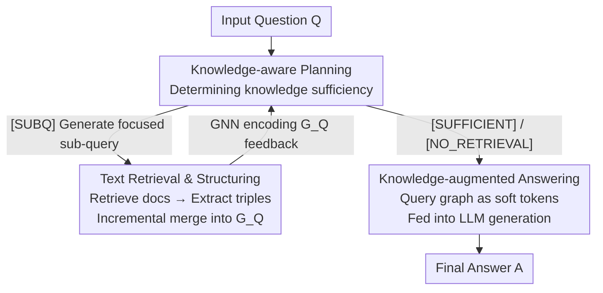

# RAS: Retrieval-And-Structuring for Knowledge-Intensive LLM Generation

**Conference**: ICLR 2026  
**arXiv**: [2502.10996](https://arxiv.org/abs/2502.10996)  
**Code**: Yes  
**Area**: Graph Learning  
**Keywords**: Retrieval-Augmented Generation, Knowledge Graph Construction, Iterative Retrieval, Graph-Structured Reasoning, LLM Generation

## TL;DR

Ours proposes the RAS framework, which dynamically constructs query-specific knowledge graphs at inference time. Through a three-stage process of iterative retrieval planning, text-to-triple transformation, and graph-augmented answering, RAS achieves structured reasoning. It delivers improvements of up to 7.0% and 8.7% for open-source and closed-source LLMs, respectively, across 7 knowledge-intensive benchmarks.

## Background & Motivation

While RAG provides external knowledge to LLMs, the retrieved text is unstructured, leading to the following issues:

**Fragile implicit reasoning chains**: LLMs must internally bridge logical gaps between different segments; failure to do so results in hallucinations.

**Dependency of existing KG-RAG on static global graphs**: Methods like GraphRAG require building a graph of the entire corpus. For instance, Wikipedia 2018 would require millions of LLM calls and tens of thousands of dollars.

**Global graph quality issues**: Merging evidence from multiple documents may introduce contradictory or ambiguous relationships (e.g., positive and negative associations for the same drug).

Interpretability studies (Lindsey et al., 2025) suggest that LLM errors often stem from failures in implicit reasoning chains, reinforcing the necessity for explicit structured intermediate knowledge.

**Core Idea**: Instead of pre-building a global KG, RAS constructs a lightweight, "on-demand" query-specific knowledge graph for each query during inference.

## Method

### Overall Architecture

RAS aims to address the pain point where RAG retrieves scattered paragraphs, forcing the LLM to connect cross-paragraph logic mentally, which often fails. The mechanism avoids implicit connections by structuring retrieved text into a "query-specific" small knowledge graph during inference, on which the model bases its answer.

The entire process is a three-stage iterative loop: first, **Knowledge-aware Planning** determines if current knowledge is sufficient and generates focused sub-queries if not; second, **Text Retrieval & Structuring** retrieves documents using sub-queries, extracts triples, and incrementally merges them into the current query graph $G_Q$; finally, when knowledge is deemed sufficient, it enters **Knowledge-augmented Answering** to generate responses based on the accumulated graph. Multiple rounds (up to 5 iterations) can occur between planning and answering, with the graph growing each round. Crucially, all three stages are driven by a single Graph LLM—an LLM backbone with a Graph Neural Network (GNN) encoder, fine-tuned via LoRA using **structure-aware multi-task learning** to unify planning and answering into one model.

### Key Designs

**1. Knowledge-aware Planning: Autonomous decision-making on retrieval**

This step directly addresses the fragility of implicit reasoning chains. Instead of forcing the LLM to resolve logic internally, it explicitly supplements missing knowledge step-by-step. Upon receiving a question, the model decides whether to follow [SUBQ] (requires retrieval) or [NO_RETRIEVAL] (answer using internal parameters). During iterations, the model makes decisions based on the current accumulated graph $G_i$ and the history of sub-queries $[q_0, g_0, ..., q_i, g_i]$. It either outputs [SUBQ] $q_{i+1}$ to refine the knowledge search or [SUFFICIENT] to transition to answering. The decision is given by:

$$p_{i+1} \leftarrow \mathcal{M}(\text{GNN}(G_i); \text{INST}_{\text{Plan}}; [q_0, g_0, ..., q_i, g_i]; Q)$$

**2. Text Retrieval & Structuring: Dynamic graph construction and merging**

This is the core differentiator from standard RAG. Instead of feeding raw text to the LLM, RAS structures it first. After obtaining a sub-query, a dense retriever (Contriever-MS MARCO) retrieves the top-k documents. A lightweight Text-to-Triples model $f_{t2t}$ (based on LLaMA-3.2-3B-Instruct, trained on WikiOfGraph) extracts $(s, r, o)$ triples. These form a local graph $g'_i = (V_i, E_i)$. Node and edge attributes are encoded via Sentence-BERT and incrementally merged into the query-specific graph $G_Q$:

$$G_Q \leftarrow G_Q \cup g'_i$$

Constructing "on-demand query-specific graphs" instead of global KGs (like GraphRAG) avoids prohibitive costs and eliminates noise from contradictory multi-document evidence.

**3. Knowledge-augmented Answering: Structured graphs as soft tokens**

When Planning determines knowledge is sufficient, the model generates the final answer based on the encoded query graph $G_Q$ and the sub-query chain:

$$A \leftarrow \mathcal{M}(\text{GNN}(G_Q); \text{INST}_{\text{Ans}}; [q_0, g_0, ..., q_i, g_i]; Q)$$

The GNN encodes the entire graph into a representation fed as soft tokens into the LLM sequence. This anchors the answer to explicit structured knowledge.

**4. Structure-aware Multi-task Learning: Unified LLM for planning and answering**

Planning and Answering tasks are not split between models; a single LLM is trained on both via standard next-token prediction, with random sampling between tasks. LoRA is used to fine-tune the backbone while simultaneously optimizing the GNN encoder parameters.

### Loss & Training

- **Training Data**: HotpotQA-SUBQ (208K samples) built from HotpotQA, including iterative sub-queries and [SUFFICIENT]/[NO_RETRIEVAL] labels.
- **Base Models**: LLaMA-2-7B or LLaMA-3-8B + Graph Transformer encoder.
- **Training Strategy**: LoRA fine-tuning + graph component training, using multi-task random sampling.
- **Triple Extractor**: LLaMA-3.2-3B trained on WikiOfGraph, deployed via vLLM.
- **Retrieval Corpus**: Wikipedia 2018 (faiss index), Wikipedia 2020 for PopQA.
- **Max Iterations**: 5.

## Key Experimental Results

### Main Results

**7 Benchmarks**: TriviaQA, 2WikiMultihopQA, PopQA, PubHealth, ARC-C, ASQA, and ELI5.

| Model | TQA(acc) | 2WQA(F1) | PopQA(acc) | Pub(acc) | ARC(acc) | ASQA(rg/mv) | ELI5(rg/mv) |
|------|----------|----------|------------|----------|----------|-------------|-------------|
| Self-RAG 7B | 66.4 | 25.1 | 54.9 | 72.4 | 67.3 | 35.7/74.3 | 17.9/35.6 |
| RPG 7B | 65.1 | 33.6 | 56.0 | 73.4 | 65.4 | 37.6/84.4 | 19.1/46.4 |
| **RAS 7B (Ours)** | **72.7** | **42.1** | **58.3** | **74.7** | **68.5** | **37.2/95.2** | **19.7/47.8** |
| Sonnet-3.5+RAG | 72.5 | 53.7 | 57.3 | 53.9 | 87.1 | 38.8/61.6 | 20.2/32.3 |
| **RAS Sonnet-3.5 (Ours)** | **77.6** | **57.7** | **62.3** | **71.3** | **93.9** | **39.1/70.5** | **23.3/37.7** |

RAS 7B shows a **Gain** of 9.7% in short-form QA and 7.9% in long-form generation over Prev. SOTA (Self-RAG/RPG).

### Ablation Study

| Variant | TQA | 2WQA | Pub | ASQA(rg/mv) |
|------|-----|------|-----|-------------|
| RAS 7B (Full) | 72.7 | 42.1 | 74.7 | 37.2/95.2 |
| w/o GraphEncode | 70.2 | 38.4 | 66.4 | 33.1/85.0 |
| w/o LoRA | 71.5 | 37.8 | 54.8 | 32.8/84.8 |
| w/o Text-to-Triple | 70.4 | 38.2 | 71.4 | 36.2/73.8 |
| w/o Multi-Task | 68.6 | 39.2 | 65.5 | 36.7/88.9 |
| w/o Retrieval (Inference) | 56.9 | 27.4 | 69.0 | 31.3/70.6 |
| w/o Planning (Inference) | 66.7 | 37.8 | 71.5 | 37.2/95.2 |

### Key Findings

1. **Graph structuring is critical**: Removing Text-to-Triple drops ASQA MAUVE from 95.2 to 73.8 (-22.4%); removing GraphEncode drops PubHealth by 11.2%.
2. **Iterative planning provides significant value**: Removing Planning reduces TQA by 8.8% and 2WQA by 9.0%.
3. **Role swapping**: The planning ability of RAS 7B is comparable to Sonnet-3.5, but the answering capability remains the main bottleneck.
4. **Linear growth of information**: Retaining 30-50% of triples yields obvious gains, while 100% does not yet reaching saturation.
5. **Efficiency**: LLaMA-3.2-3B serves as an efficient triple extractor (4885 tokens/s) vs Claude-3.5-Sonnet (68 tokens/s).
6. **Data efficiency**: Using only 5% of training data (10K samples) outperforms Prev. SOTA on TQA, 2WQA, and ELI5.

## Highlights & Insights

- **Query-specific KG as an alternative to global KG**: Avoids the astronomical costs and noise of full-corpus graph construction by building relevant subgraphs during inference.
- **Unified Retrieval-Structuring-Reasoning framework**: Planning, Structuring, and Answering are executed end-to-end via a single Graph LLM.
- **High MAUVE scores**: The MAUVE score of 95.2 on ASQA for RAS 7B indicates that generated long-form text is both accurate and naturally fluent.
- **Modular flexibility**: Planning and Answering can be decoupled, allowing stronger models for answering and lighter models for planning.

## Limitations & Future Work

1. Performance gap between open-source (7B/8B) and closed-source models remains large, particularly on ARC-C (68.5 vs 93.9).
2. The Triple extractor is a standalone model, increasing system complexity (end-to-end training could be exploration).
3. The 5-iteration limit may be insufficient for highly complex multi-hop reasoning.
4. Simplified GNNs are used; stronger Graph Transformers or structured attention could be explored.
5. Unstable performance on ELI5 suggests potential distribution shifts in training data.

## Related Work & Insights

- **vs GraphRAG / G-Retriever**: These rely on pre-built global KGs; RAS builds them dynamically on-demand.
- **vs Self-RAG / RPG**: While sharing iterative retrieval concepts, RAS adds the dimension of structuring retrieved content into graphs.
- **vs Chain-of-Thought**: RAS's sub-query chain acts as an explicit reasoning chain anchored by structured knowledge.
- Insight: Future work could combine RAS with Reinforcement Learning (e.g., Search-Agent) to let agents learn when to structure and when to answer directly.

## Rating

- Novelty: ★★★★☆ — Dynamic query-specific KG construction is a valuable new paradigm.
- Technical Depth: ★★★★☆ — Comprehensive multi-module integration and multi-task design.
- Experimental Thoroughness: ★★★★★ — 7 benchmarks, inclusive settings, and thorough ablations.
- Writing Quality: ★★★★☆ — Clear flowcharts and well-organized experimental analysis.

<!-- RELATED:START -->

## Related Papers

- [\[ACL 2025\] Knowledge Graph Retrieval-Augmented Generation for LLM-based Recommendation (K-RagRec)](../../ACL2025/graph_learning/kg_rag_recommendation.md)
- [\[ICLR 2026\] HGNet: Scalable Foundation Model for Automated Knowledge Graph Generation from Scientific Literature](hgnet_scalable_foundation_model_for_automated_knowledge_graph_generation_from_sc.md)
- [\[CVPR 2026\] M3KG-RAG: Multi-hop Multimodal Knowledge Graph-enhanced Retrieval-Augmented Generation](../../CVPR2026/graph_learning/m3kg_rag_multi_hop_multimodal_knowledge_graph_enhanced_retrieval_augmented_genera.md)
- [\[ACL 2026\] MegaRAG: Multimodal Knowledge Graph-Based Retrieval Augmented Generation](../../ACL2026/graph_learning/megarag_multimodal_knowledge_graph-based_retrieval_augmented_generation.md)
- [\[ICLR 2026\] Scaling Knowledge Graph Construction through Synthetic Data Generation and Distillation](scaling_knowledge_graph_construction_through_synthetic_data_generation_and_disti.md)

<!-- RELATED:END -->
