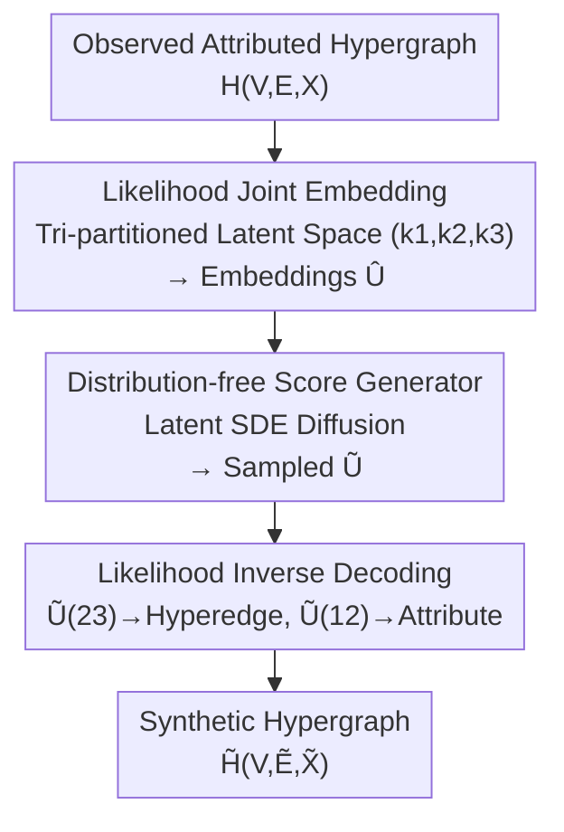

# ReLaSH: Reconstructing Joint Latent Spaces for Efficient Generation of Synthetic Hypergraphs with Hyperlink Attributes

**Conference**: ICLR 2026  
**OpenReview**: [https://openreview.net/forum?id=SG3kS2h44t](https://openreview.net/forum?id=SG3kS2h44t)  
**Code**: None  
**Area**: Graph Learning / Generative Models / Synthetic Data  
**Keywords**: Hypergraph Generation, Hyperedge Attributes, Joint Latent Space, Likelihood-based Embedding, Score-based Diffusion

## TL;DR
ReLaSH decomposes the generation of "attributed hypergraphs" into two steps: first, an **interpretable likelihood-based embedding model** compresses hyperedges and their attributes into a low-dimensional joint latent space; second, a **distribution-free score-based diffusion generator** reconstructs the data distribution within this low-dimensional space. This approach bypasses the curse of dimensionality associated with high-dimensional discrete structures and significantly outperforms general baselines such as VAE, GAN, and Diffusion on medical records, co-authorship, and recipe datasets.

## Background & Motivation
**Background**: Hypergraphs utilize "hyperedges" to characterize multi-way co-occurrence relationships among multiple entities, offering greater expressive power than pairwise edges in ordinary graphs. This is common in medicine, biology, and social sciences. A typical scenario is ICU medical records: co-occurring symptoms or disease codes for each patient are treated as a hyperedge, while other patient information (age, lab values, etc.) serves as the **attributes** of that hyperedge. Generating new synthetic hyperedges and attributes from observed co-occurrence hypergraphs effectively creates synthetic patients for privacy-preserving data sharing and patient simulation.

**Limitations of Prior Work**: Most mainstream generative models (VAE, GAN, Flow, Diffusion, Autoregressive) are designed for **continuous data** and cannot be directly applied to discrete structures like hypergraphs. The few generative methods for discrete data suffer from two issues: high computational/storage overhead that fails to scale to large node sets, and a **failure to account for specific hypergraph structural properties** (discreteness, hyperedge sparsity, mixed data types of hyperedges and attributes). Existing graph generation models target pairwise edges, while work on hyperedge representation learning or generation (Jo et al. 2021; Wu et al. 2025) **lacks hyperedge attributes**.

**Key Challenge**: Three conflicting requirements must be met: (1) respecting the discrete, sparse, and mixed-type structure of hypergraphs; (2) **jointly** modeling hyperedges and their attributes (due to their dependencies); (3) performing generation in high-dimensional discrete spaces without being overwhelmed by the **curse of dimensionality**, ideally with theoretical guarantees. Existing methods fail to address all three simultaneously.

**Goal**: Given an observed attributed hypergraph on a **fixed node set**, generate new hyperedges and their corresponding attributes (e.g., generating new symptom combinations + accompanying medical record fields on a fixed set of symptoms) using a method that is efficient, interpretable, and theoretically supported by consistency/generalization guarantees.

**Key Insight**: The authors observe that while high-dimensional hypergraph data occupies a massive raw space, its generative patterns can be captured by a **low-dimensional joint latent space**. By decoupling "understanding structure" and "reconstructing distribution," the former is handled by a likelihood-based, identifiable embedding model (compressing high-dimensional structures while explicitly characterizing hyperedge-attribute dependencies), while the latter is handled by a flexible generator operating in the low-dimensional latent space. This ensures that the final error is dominated by the low-dimensional latent space rather than the original high-dimensional problem.

**Core Idea**: Use a two-stage "likelihood-based joint embedding + latent distribution-free generation" to **reduce the dimensionality** of the attributed hypergraph generation problem into a generative problem of low-dimensional latent variable distributions.

## Method

### Overall Architecture
ReLaSH aims to solve the following: given an observed attributed hypergraph $H(V_n, E_m, X_m)$ ($n$ nodes, $m$ hyperedges, each with attributes $x_j$), generate a synthetic hypergraph $\tilde{H}([n], \tilde{E}_{\tilde m}, \tilde{X}_{\tilde m})$ with realistic structural and statistical properties. The pipeline consists of an "encoding—latent distribution reconstruction—decoding" three-stage process:

1.  **Joint Embedding**: Train a likelihood-based model to map each hyperedge and its attributes to a low-dimensional joint embedding $u \in \mathbb{R}^{k_1+k_2+k_3}$, obtaining the set of embeddings $\hat{U}_m$. A key feature is **partitioning the latent space into three blocks** to explicitly encode hyperedge-attribute dependencies in a shared block. 
2.  **Latent Space Reconstruction**: Train a distribution-free generator (a score-based/SDE diffusion model) on $\hat{U}_m$ to learn to sample new latent embeddings $\tilde{U}_{\tilde m}$ from noise. 
3.  **Decoding Generation**: Partition the sampled $\tilde{U}$ into $\tilde{U}^{(12)}$ (controlling attributes) and $\tilde{U}^{(23)}$ (controlling hyperedges), and feed them back into the trained likelihood model to stochastically decode new hyperedges and attributes.

### Key Designs

**1. Likelihood Joint Embedding: Explicitly Encoding Dependencies via a Tri-partitioned Latent Space**

General generators learning distributions directly on high-dimensional discrete and mixed data lack interpretability and succumb to the curse of dimensionality. ReLaSH first uses a **likelihood-based, identifiable** embedding model to compress the data. It partitions the joint embedding $u = (u^{(1)\top}, u^{(2)\top}, u^{(3)\top})^\top$ into three blocks with dimensions $k_1, k_2, k_3$: $u^{(1)}$ handles attributes only, $u^{(3)}$ handles hyperedges only, and the intermediate $u^{(2)}$ is a **shared block** that facilitates the dependency between hyperedges and attributes. Letting $u^{(12)}=(u^{(1)},u^{(2)})$ and $u^{(23)}=(u^{(2)},u^{(3)})$, the joint likelihood neatly factorizes into the product of hyperedge and attribute generative models:

$$P_{H(\{E_j\},\{X_j\})\mid u_j} = P_{H(\{E_j\})\mid u_j^{(23)}, Z_n, \alpha_n}\cdot P_{X_j\mid u_j^{(12)}, B, \gamma}.$$

Specifically, the hyperedge branch is a **degree-corrected logistic model**: the probability of node $i$ joining a hyperedge is $p_i(u^{(23)}) = \sigma(u^{(23)\top} z_i + \alpha_i)$, where $z_i$ is the node embedding and $\alpha_i$ is the node's "degree parameter" capturing popularity heterogeneity. The mean of all $\alpha_i$, $\bar\alpha_{m,n}$, directly controls hyperedge sparsity. The attribute branch is a linear model $x = \gamma + B u^{(12)} + \epsilon$, with sub-Gaussian error $\epsilon$ to remain compatible with continuous or binary attributes. This design is efficient, interpretable, and **incorporates discrete structures and mixed types directly into the likelihood**, unlike general models that force discrete data into continuous assumptions.

**2. Joint Loss under Identifiability Constraints: Ensuring Unique Embeddings and Consistent Estimation**

Likelihood alone is insufficient; the same joint distribution could correspond to infinite sets of $(P_U, Z, \alpha, B, \gamma)$. ReLaSH ensures a unique, generative latent space by minimizing a joint loss:

$$\ell(U, Z, B, \alpha, \gamma) = \ell_H + \lambda \ell_A,$$

where $\ell_H = -\sum_{j,i}[\mathbb{1}\{i\in e_j\}\theta^H_{ji} - \log(1+e^{\theta^H_{ji}})]$ ($\theta^H_{ji}=u_j^{(23)\top}z_i+\alpha_i$) is the negative log-likelihood for hyperedges and $\ell_A = \sum_j \|x_j - \gamma - B u_j^{(12)}\|_2^2$ is the squared reconstruction error for attributes, with $\lambda>0$ as a balance parameter. Under a set of **identifiability conditions** (Theorem 1, Conditions C1–C4: zero-mean embeddings, $\frac1n Z^\top Z$ and $\frac1p B_1^\top B_1$ as distinct positive diagonal matrices, and uncorrelated $U^{(1)}$ and $U^{(2)}$), any two sets of parameters inducing the same distributions of $\alpha+ZU^{(23)}$ and $\gamma+BU^{(12)}$ must be identical. The paper further proves (Theorem 3) that when $m\asymp n\asymp p$, the estimation error of $(Z, B, \alpha, \gamma)$ decays at a rate of $\log n / n$, becoming asymptotically negligible—this provides the theoretical foundation for shifting generative error to the low-dimensional latent space.

**3. Latent Distribution-free Score Generator: SDE Diffusion on Learned Latent Embeddings**

After obtaining embeddings $\hat{U}_m$, ReLaSH trains a distribution-free generator (which could be a normalizing flow or KDE, but is implemented here as a score-based SDE) in the **low-dimensional latent space**. It constructs a forward diffusion from $\hat{U}_m$ using $dU_t = -U_t\,dt + \sqrt{2}\,dW_t$ to gradually add noise until the embeddings become Gaussian. It then trains an MLP score network $s_\theta(u,t)$ via denoising score matching to approximate $\nabla\log p_t$, and samplers produce new embeddings via reverse-time SDE from $\mathcal{N}(0,I_k)$. The critical difference from standard score models is that the score network is trained on **unobserved, learned embeddings** $\hat{U}_m$ rather than raw observed data. Because the latent dimension $K=k_1+k_2+k_3$ is low, and score estimation sample complexity grows exponentially with dimension (curse of dimensionality), moving generation to the latent space **substantially improves efficiency**.

**4. Three-way KL Error Decomposition: Theoretical Avoidance of the Curse of Dimensionality**

The KL divergence between ReLaSH's synthetic distribution and the true distribution is proven to decompose into three parts (Theorem 2):

$$d_{KL}(P_{(E,X,U)}\,\|\,P_{(\tilde E,\tilde X,\tilde U)}) = \Delta_{(Z,B,\alpha,\gamma)\text{-est}} + \Delta_{P_U\text{-est}} + \Delta_{\text{latent-recon}}.$$

The first term is the estimation error for node/attribute parameters (proven negligible by Theorem 3), the second is the error in recovering the latent embedding distribution $P_U$, and the third is the latent space reconstruction error. Using the analysis from Chen et al. (2022), the third term $\Delta_{\text{latent-recon}} \lesssim (M_U+K)e^{-T} + T\varepsilon_0^2 + N^{-1}KT^2L^2$ depends on the low latent dimension $K$. Since the total error rate is dominated by $K$ rather than the high-dimensional ambient hypergraph dimension, this provides a mathematical explanation for how ReLaSH **bypasses the "curse of ambient dimensionality."**

### Loss & Training
Training proceeds in two stages: first, optimize the joint loss $\ell = \ell_H + \lambda\ell_A$ (under identifiability constraints) to obtain $\hat U_m, \hat Z_n, \hat\alpha_n, \hat B, \hat\gamma$, with weight $\lambda \asymp \exp(\bar\alpha_{m,n})$. Second, train the score network on $\hat U_m$ using denoising score matching $\ell(\theta)=\sum_l \lambda_l\frac1m\sum_{u_0}\mathbb{E}\|s_\theta(u_{lh},lh)-\nabla\log p_{lh}(u_{lh}\mid u_0)\|_2^2$. For generation, sample from the reverse SDE $\tilde m$ times. The triplet dimensions $(k_1,k_2,k_3)$ are key hyperparameters (e.g., ReLaSH-(7,0,2)); $k_2=0$ implies no explicit shared block.

## Key Experimental Results

Experiments utilize three real-world datasets: MIMIC-III (patient medical records), MADStat (co-authorship with TF-IDF features), and Epirecipes (recipe ingredients and cuisines). Metrics (lower is better): $\Delta_{Hv}$ (node covariance RMSE), $\Delta_{Xm}$ (attribute mean RMSE), $\Delta_{Xv}$ (attribute covariance RMSE), FED (Fréchet Embedding Distance), and a-FED (adjusted FED).

### Main Results

Patient Record Generation (Table 1; raw values):

| Method | $\Delta_{Hv}$↓ | $\Delta_{Xm}$↓ | $\Delta_{Xv}$↓ | FED↓ | a-FED↓ |
| :--- | :--- | :--- | :--- | :--- | :--- |
| ReLaSH-(7,0,2) | 3.260 | 2.989 | 1.435 | 0.532 | 1.084 |
| ReLaSHc-(7,0,2) | 27.794 | 2.989 | 1.435 | **0.013** | **0.193** |
| Gau-Diff | 4.268 | 3.497 | 1.719 | 39.731 | 4.387 |
| RealNVP | 3.958 | 33.240 | 2.526 | 27.685 | 2.843 |
| WGAN | 3.506 | 10.534 | 2.176 | 21.053 | 2.654 |
| VAE | 48.450 | 11.499 | 4.134 | 9.374 | 1.376 |

ReLaSH outperforms general baselines on FED/a-FED by one to three orders of magnitude. The high $\Delta_{Hv}$ of VAE (48.450) indicates it fails to learn the hypergraph structure. For co-authorship (Table 2) and recipes, ReLaSH leads in most metrics over methods like Gau-Diff, RealNVP, WGAN, and various tabular baselines (CTGAN, ForestDiffusion), many of which **failed to scale** to the large node sets in medical/authorship tasks.

### Ablation Study
The study primarily analyzes the impact of tripartite dimensions $(k_1,k_2,k_3)$ and compares ReLaSH with its variant ReLaSHc:

| Configuration | Key Metric | Description |
| :--- | :--- | :--- |
| ReLaSH-(2,7,8) | FED 1.060 / a-FED 0.791 | Co-authorship, large shared block $k_2=7$ |
| ReLaSHc-(2,7,8) | FED 0.947 / a-FED 0.706 | Variant with lower FED for same dimensions |
| ReLaSH-(8,8,8) | FED 1.454 | Full dimensionality; performance actually degraded |
| ReLaSH-(5,0,6) | FED 0.003 / a-FED 0.048 | Recipe task; extremely low metrics with $k_2=0$ |

### Key Findings
- **Tripartite dimensions $(k_1,k_2,k_3)$ are the primary control knobs**: Blindly increasing all dimensions (e.g., (8,8,8)) is not always beneficial; they must match the data. The shared block $k_2$ significantly affects joint hyperedge-attribute quality.
- **Superiority in FED/a-FED is consistent**: These distribution-level metrics demonstrate that samples are globally realistic. ReLaSH is consistently lower across all tasks, while RMSE metrics vary among methods.
- **Scalability is an implicit advantage**: SOTA tabular generators (CTAB-GAN, etc.) were unusable on large node sets, whereas ReLaSH scales naturally by performing generation in the low-dimensional latent space.

## Highlights & Insights
- **Decoupling structure understanding from distribution reconstruction**: Using a likelihood model for high-dimensional structures and diffusion for low-dimensional samples combines the flexibility of deep generation with the efficiency of statistical models.
- **Tri-partitioning turns "dependency" into an explicit knob**: The shared block $u^{(2)}$ dimension $k_2$ controls the coupling intensity between hyperedges and attributes, offering more control than end-to-end black-box models.
- **Bridging theory and practice**: The KL decomposition and Theorem 3 explain how error rates are dominated by the low latent dimension $K$. This "dimension-reduction-then-generation" paradigm is transferable to other structured data like attributed temporal networks or knowledge graphs.

## Limitations & Future Work
- **Strong Likelihood Assumptions**: Hyperedges use degree-corrected logistic models, and attributes use linear Gaussian/Bernoulli models. Expressive power is limited by these parameter families; highly non-linear attribute relations might not be captured well.
- **Fixed Node Set Assumption**: The method generates new hyperedges and attributes on a fixed $V_n$ rather than generating new nodes (distinguishing it from Gailhard et al. 2025).
- **Hyperparameter Tuning for $(k_1,k_2,k_3)$**: Dimensions significantly impact results non-monotonically, and there is no automatic selection mechanism. The coupling of $\lambda$ with sparsity $\bar\alpha_{m,n}$ also needs careful setting.

## Related Work & Insights
- **vs. General Diffusion/GAN/VAE**: These operate in high-dimensional (often continuous) space, ignoring discrete hypergraph structures and suffering from the curse of dimensionality. ReLaSH is orders of magnitude better in FED.
- **vs. Tabular Data Generation**: While handling mixed types, these ignore hypergraph structures and fail to scale to large node sets.
- **vs. Hyperedge Representation/Generation**: Prior work (Wu et al. 2025) lack attributes; ReLaSH jointly models them and provides consistency theory.
- **vs. Attributed Hypergraph Generation**: Chun et al. (2025) generate hyperedges on fixed node attributes but don't generate new attributes. Gailhard et al. (2025) generate topology and node attributes jointly with new nodes. ReLaSH occupies the niche for generating "new hyperedges + new hyperedge attributes" on fixed nodes.

## Rating
- Novelty: ⭐⭐⭐⭐⭐ First framework for joint hyperedge-attribute generation with theoretical guarantees.
- Experimental Thoroughness: ⭐⭐⭐⭐ Three domains + 9 baselines, though ablations are mostly dimension-based.
- Writing Quality: ⭐⭐⭐⭐ Clear framework and theoretical grounding, though notation-heavy.
- Value: ⭐⭐⭐⭐⭐ Direct value in privacy-preserving patient simulation; transferable paradigm.

<!-- RELATED:START -->

## Related Papers

- [\[ICLR 2026\] Scaling Knowledge Graph Construction through Synthetic Data Generation and Distillation](scaling_knowledge_graph_construction_through_synthetic_data_generation_and_disti.md)
- [\[ICLR 2026\] GraphUniverse: Synthetic Graph Generation for Evaluating Inductive Generalization](graphuniverse_synthetic_graph_generation_for_evaluating_inductive_generalization.md)
- [\[ICLR 2026\] Bridging Input Feature Spaces Towards Graph Foundation Models](bridging_input_feature_spaces_towards_graph_foundation_models.md)
- [\[ICLR 2026\] $\ell_1$ Latent Distance Based Continuous-Time Graph Representation](ell_1_latent_distance_based_continuous-time_graph_representation.md)
- [\[ICLR 2026\] Latent Geometry-Driven Network Automata for Complex Network Dismantling](latent_geometry-driven_network_automata_for_complex_network_dismantling.md)

<!-- RELATED:END -->
